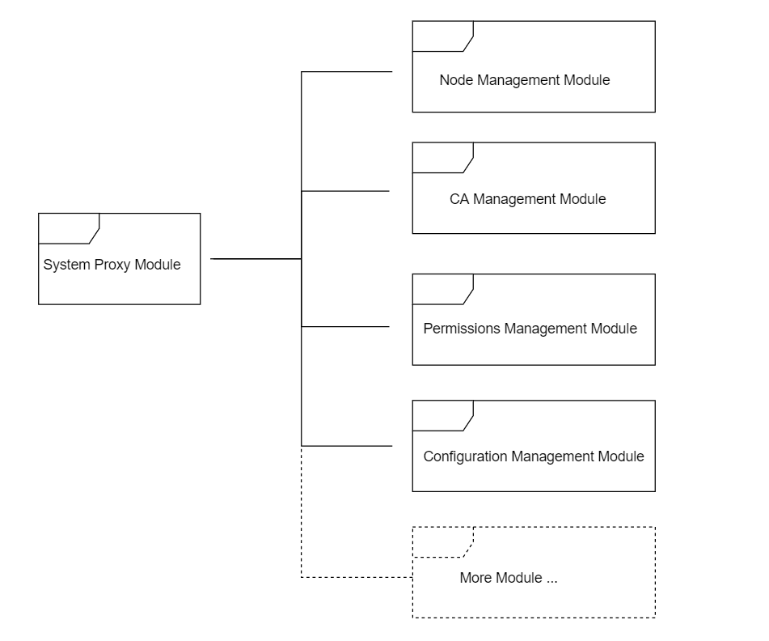

# System Contract Introduction
**Author: fisco-dev**  

<!-- TOC -->

- [FISCO BCOS System Contract Introduction](#fisco-bcos-system-contract-introduction)
    - [Design Overview](#design-overview)
    - [How it works](#how-it-works)
        - [System Proxy](#system-proxy)
        - [Node Management](#node-management)
        - [CA Management](#ca-management)
        - [Permissions Management](#permissions-management)
        - [Configuration Management](#configuration-management)
    - [Customizations](#customizations)
        - [Example 1 - Custom Business Contract](#example-1---custom-business-contract)
        - [Example 2 - Custom Permission Contract](#example-2---custom-permission-contract)

<!-- /TOC -->

## Design Overview

In order to meet the requirements of access control, identity authentication, configuration management and permissions management etc., FISCO BCOS will deploy a set of powerful, flexible, and custom-defined smart contracts during the network initialization, collectively referred to as system contracts.

The system contract is deployed by administrator during initialization. For redeploying any changes or upgrades while the network is running, it is necessary for the blockchain administrator to get an agreement of all the nodes within the network.

FISCO BCOS system contract is comprised of five modules: System Proxy, Node Management, CA Management, Permissions Management and Configuration Management. System contracts is extendable and can be called by both core system and DAPP. There could be one or more smart contracts in a module. The modules are as below:



## How it works

Code path: systemcontractv2/. Brief of each module is as below:

### System Proxy

SystemProxy.sol, the system proxy's implementation, provides a mapping between route and contract address, unified system contract interface. In SystemProxy.sol, routing info is held by a mapping field, named as '_routes'. The value of mapping is structured as below:

```python
struct SystemContract {
    address _addr;		#contract address
    bool _cache;		#cache flag
    uint _blocknumber;		#block height when the contract is active
}
```

Key functions:
```eval_rst
+-----------+---------------------------+--------------------------+---------------+
| function  | input parameters          | output parameters        | description   |
+===========+===========================+==========================+===============+
| getRoute  | string key#route name     | address#contract         | get route     |
|           |                           | address, bool#catch      | information   |
|           |                           | flag, uint # block       |               |
|           |                           | height                   |               |
+-----------+---------------------------+--------------------------+---------------+
| setRoute  | string key#route name,    | N/A                      | set route,    |
|           | address addr#contract     |                          | overwrite if  |
|           | address, bool cache#cache |                          | route name    |
|           | flag, unit blocknumber    |                          | exists        |
|           | #block height             |                          |               |
+-----------+---------------------------+--------------------------+---------------+
```


### Node Management

NodeAction.sol is the implementation contract of the node management module. It implements the function of registering, managing and maintaining the list information of all nodes in the network. Every time a node in the network joins or quits, it must controlled by the node management contract.
Three node types: Core, Full, and Light.

```solidity
enum NodeType{
        None,
        Core,
        Full,
        Light
    }
```

Structure for node information:

```python
struct NodeInfo{
        string id;
        string ip;
        uint port;
        NodeType category;
        string desc;
        string CAhash;
        string agencyinfo;
        uint idx;
        uint blocknumber;       #block height
    }
```

Key functions:

| function           | input parameters                                     | output parameters       | description                  |
| ------------ | :--------------------------------------- | ---------- | ------------------- |
| registerNode | string _id<br>string _ip<br>uint _port<br>NodeType _category<br>string _desc<br>string _CAhash<br>string _agencyinfo<br>uint _idx | bool #result | register node<br>Ignore if the node exists |
| cancelNode   | string _id                   | bool #result | cancel node<br>Ignore if the node not exists  |


### CA Management

CAAction.sol is the implementation contract of the CA management module. It provides nodes' certificate registration, management and maintenance. Node joins or quits the chain must controlled by CA management contract if certificate verification enabled.

Structure for certificate data:

```python
struct CaInfo{
        string  hash;		#certificate hash
        string pubkey;		#certificate public key
        string orgname;		#organization name
        uint notbefore;		#certificate effective date
        uint notafter;		#certificate expire date
        CaStatus status;	#certificate status
        string    whitelist;	#IP whitelist
        string    blacklist;	#IP blacklist
        uint    blocknumber;	#block height
      }
```

Key functions:

| function     | input parameters                                     | output parameters                                     | description                        |
| ------ | ---------------------------------------- | ---------------------------------------- | ------------------------- |
| update | string _hash<br>string _pubkey<br>string _orgname<br>uint _notbefore<br>uint _notafter<br>CaStatus _status<br>string _whitelist<br>string _blacklist | bool #result                               | update certificate<br>create certificate if certificate not exists |
| get    | string _hash                        | string#certificate hash<br>string#certificate public key<br>string#organization name<br>uint#certificate effective date<br>uint#certificate expire date<br>CaStatus#certificate status<br>uint##block height | get certificate information                    |


### Permissions Management

Permissions management's design principles: 1, One external account only belongs to one role. 2, One role only has one permission list. 3, Permission is identified by a combination of function and its contract address.

Permission module are comprised of 4 contracts: [TransactionFilterChain.sol](https://github.com/FISCO-BCOS/FISCO-BCOS/blob/master/systemcontract/TransactionFilterChain.sol), [TransactionFilterBase.sol](https://github.com/FISCO-BCOS/FISCO-BCOS/blob/master/systemcontract/TransactionFilterBase.sol), [AuthorityFilter.sol](https://github.com/FISCO-BCOS/FISCO-BCOS/blob/master/systemcontract/AuthorityFilter.sol), [Group.sol](https://github.com/FISCO-BCOS/FISCO-BCOS/blob/master/systemcontract/Group.sol).

TransactionFilterChain.sol, the implementation of Filter pattern, provides a unified function 'process' for permission checking. It holds an address list of Filter contract which extends from TransactionFilterBase. All permissions will be checked by the calling 'process' function of each Filter contract sequentially.

All Filters must implement TransactionFilterBase's 'process' interface, AuthorityFilter is inherited from TransactionFilterBase's role permission Filter implementation. Its process interface implements the checking logic for the permissions of the user role groups.

Group.sol handles the concept of Role. It internally maintains the mapping flag for all permission entries for this role.

Key functions:

| contract                   | function            | input parameters                                     | output parameters      | description      |
| --------------------- | ------------- | ---------------------------------------- | --------- | ------- |
| TransactionFilterBase | process       | address origin #external address<br>address from#from account address<br>address to#to account address<br>string func#contract address<br>string input#transaction input| bool#result | permission checking    |
| Group                 | setPermission | address to#to account address<br>string func#contract address<br>bool permission#permission flag | bool#result | set permission |


### Configuration Management

ConfigAction.sol is the implementation of configuration management module for entire network. It maintains configurable information for the entire network in the FISCO BCOS blockchain. The configuration information is kept consistent through out the entire network by transactions broadcast. In principle, only the blockchain administrator can issue transactions broadcast to perform network-wide configuration changes.

Key functions:

| function   | input parameters                              | output parameters                     | description    |
| ---- | --------------------------------- | ------------------------ | ----- |
| set  | string key #parameter<br>string value#config information value | N/A                        | set configuration |
| get  | string key #parameter                   | string #config information<br> uint#block height | get configuration |

key parameters:

| parameter                  | description                           | default value       | recommend value         |
| -------------------- | ---------------------------- | --------- | ----------- |
| maxBlockHeadGas      | Gas spend limitation for each block (Hex)                | 200000000 | 20000000000 |
| intervalBlockTime    | an interval btw block generation(ms) (Hex)               | 1000      | 1000        |
| maxBlockTranscations | configure the max transaction in a block(Hex)                 | 1000      | 1000        |
| maxNonceCheckBlock   | Trace back max previous block number to avoid nonce duplication.(Hex)         | 1000      | 1000        |
| maxBlockLimit        | max delay for transaction commit(Hex) | 1000      | 1000        |
| maxTranscationGas    | Gas spend limitation for each transaction(Hex)               | 20000000  | 20000000    |
| CAVerify             | CA verification flag                       | FALSE     | FALSE       |

## Customizations

### Example 1 - Custom Business Contract

To customize a business contract by modifying business configuration. Refer to the steps below:

1. Implement 'set' and 'get' based on business requirement.
2. Deploy business contract and get contract address.
3. Call the 'setRoute' method in SystemProxy to register contract address in the routing table.
4. Business smart contract is now ready to be called.

How to call the business contract:

1. Call the 'getRoute' method in SystemProxy to get the contract address.
2. Get configured information by calling the 'get' method with address in step 1.

### Example 2 - Custom Permission Contract

Permission checking can be extended by adding new Filter. Refer to the steps below:

1. Create a Filter permission contract by inheriting TransactionFilterBase. The custom permissions verification logic should be implemented into the 'process' interface as per the business requirements.
2. Deploy custom permission contract and get contract address.
3. Call the 'getRoute' method in SystemProxy to get contract address of TransactionFilterChain.
4. Register custom filter contract by calling 'addFilter' method in TransactionFilterChain.
5. The contract is now ready for calling.
