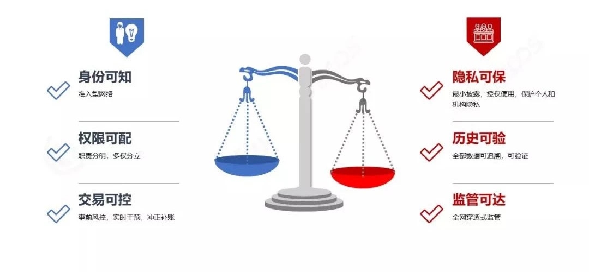
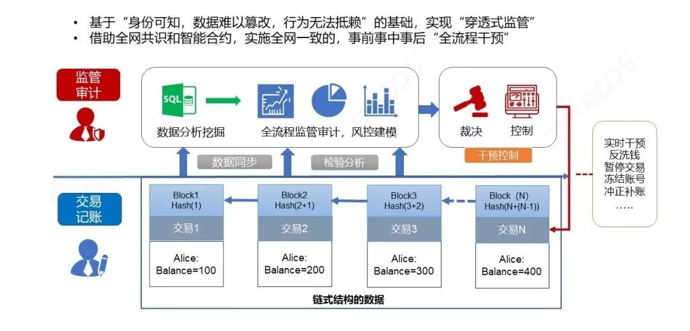

# 怎样让你的区块链更加安全可控

作者：张开翔｜FISCO BCOS 首席架构师

随着技术和产业的发展，区块链会被用到实体行业的广泛场景，以及金融业、政务、工业等关键领域。我们更需要重视技术和运作的安全可控，以保护信息安全、财务安全，乃至社会安全。

## 安全稳定的技术路径

对比任意驰骋的“越野车”，联盟链更像安全可靠的“商旅车”。

正所谓“道路千万条，交规第一条”，出行首先要选择对的路线，也要遵守交规；其次，安全的重要性毋庸置疑，车子硬件达到高安全标准，驾驶员审慎专业驾驶，才能保证乘客的人身和财务安全；最后，车子本身也得可靠和耐用，不能因故障频发而给旅途制造各种麻烦。

在这些基础上，再去追求为乘客创造舒适的环境、友好的体验，并以强劲的性能，高效率地将乘客送到目的地。

同理，联盟链的技术路径兼顾稳定和创新，优先保障“合规、安全、稳定”这三个指标，而后再追求易用友好、高性能，这两者也是很重要的加分项。

具体而言，**联盟链合规的第一要务是去代币**，尤其是金融业，绝不应参与虚拟代币的运作。

在安全方面，对网络、存储、业务等进行安全加固，保证链上多方共同执行，避免出现木桶的短板。

在稳定性方面，严格检测系统质量，遵循“两地多中心”等容灾容错要求，建立可快速反应的监控体系，都是必要的基础工作。

## 可信可控的几个要点

从系统功能看，区块链是多方参与、重视协作、用算法传递和加固“信任”的系统，针对可信和可控的要求有以下一些要点：

#### 身份可知

拒绝匿名，任何加入这个系统的人或者节点，都需要经过KYC（Know Your Client）环节，依托PKI体系(公开密钥基础建设，Public Key Infrastructure)等技术，向网络认证自己。

#### 权限可配

针对不同的角色，分配不同的系统权限，避免越权访问，或者出现“既当裁判又当运动员”的情况。

#### 交易可控

交易调用的是智能合约，智能合约是用代码写成的，目前“Code is law”依旧是个理想值，交易可控的要点是，事先检查合约逻辑，执行时避免异常和错误，对不符合预期的指令进行干预，在出错后要能冲正、补账、纠正。

#### 隐私可保

个人信息、财务情况、交易明细等都属于个人隐私。机构也有自己的商业隐私，如风控规则、重大交易细节等。在多方共享数据的同时，还需要保护隐私不会泄露。

#### 历史可验

区块链先天是一种“只增不删”的数据库。所有历史交易以及产生的数据都可以记录在区块链上，需要妥善管理链上海量数据，对导出到链外的数据，也要有方法和链上对照，确保数据是完整的、可验证的。

#### 监管可达

许多行业都有对应的监管部门，金融更是强监管行业。区块链系统要做到的是，为监管者提供相关功能接口、访问权限，并提供完整的、可校验的数据以供审计分析。

## 联盟链角色和治理

联盟链治理模式目前也是正在探讨的热点，总的来说，联盟链是由联盟一起建设、使用和管理的，下面将按这三个维度角色进行梳理归纳。

运营委员会可以由联盟里的部分或全部机构一起组成，其本身是“多中心化”的，并不是独家管理。

运营委员会共同对联盟链的各种事务进行讨论和决策，包括联盟链的准入审批、规则制定和执行、日常运营等。比如，目前有的联盟链会把“部署合约”的权限收敛到委员会，这样可以保障链上交易规则的有效性和合理性。

监管方则独立于运营委员会之外，可以由主管部门、权威机构、行业协会等角色承担，运营委员会制定的规则，本身应该符合监管要求。

在链上进行交易、参与共识记账、负责清结算等事务的角色，都归纳为链的“使用者”。他们遵循运营委员会制定的规则加入联盟链，用自己的私钥对区块和交易签名，基于链上智能合约和共识机制驱动，高效的完成协作。

开发者负责研究和开发联盟链的底层平台，根据业务需求构建应用系统和编写智能合约，这些内容经过运营委员会审核之后，再由运维团队发布上线。

运维团队还负责配置软硬件环境的参数，关注监控告警，进行版本升级，长期维护系统的稳定性和可持续性。

可见，“建设”和“管理”的角色，都不会直接参与到业务交易流程中，而“使用”角色基于健壮高效的平台进行协作，并接受运营委员会和监管方的管理监督。

同时，无论对哪一个角色，都会进行权限控制和操作审计，如果账号丢失、私钥泄露，也能通过链上治理的方式进行找回和重置。

这样的治理体系是职责清晰、各司其职、安全可控的，既能保证链上治理的合理性、有效性、安全性，也能保护参与者的权益，使得大家可以高效协作。

## 贯通全程的安全、可控、合规

**从业务流程上看，区块链上的业务参与方众多、流程复杂、资产的生命周期漫长，应该确保端到端的业务可控**，否则到了承兑结算时，才发现资产是无价值的，那就难以挽回了。

首先，来自实体世界的人、物、资产，要经过严格鉴定才能上链。

这个环节还是要依靠有公信力的权威机构把关，如中国公民的身份来自公安认证，房产的产权则需要国土局认证，以此类推。还可以依托物联网、基因技术、人工智能分析等技术，对数据进行交叉比对、深度分析，提升鉴别效率和准确度。

资产发行上链后，要检查这笔资产的权责是否明确，定价是否公允，资产的交易规则是否公开透明，这个步骤需要由多方共同完成并达成共识。

对刚上链的资产设置一个“预发布”的状态，链上多方检验后才能使资产“生效”，同时结合链下措施，锁定资产防“双花”，不失为一种好的实践。

然后，资产可以进入“点对点交易”的高效流转环节，交易过程可以采用多方签名、拜占庭容错等机制，避免少数人作恶。

同时，设置关键检测点，对交易进行实时监测，如发现可能的异常，如高频交易、异常出价、违反交易规则的行为等，则由权限的管理者调用管理接口及时制止和纠正。

当交易正常完成，即进入了清结算和承兑环节，在没有原生代币的联盟链上，需要稳妥的对接链下支付系统，以及物理世界的执行体系等，以保证承兑和执行。

即使前面的环节都顺利完成，因为各种复杂的因素，业务还是有小概率会出现错误或纠纷，那么监管审计和司法仲裁就可以发挥作用了，目前基于区块链实现业务的存证、司法仲裁也是很常见的方式。

可见，端到端地进行设计，并重视链上链下的结合，有助于完整、闭环地管理资产生命周期。

## 可监管，可干预

关于“区块链业务难以监管”的说法，其实说的是匿名和跨监管主体运作的公链。

部分公链参与者是匿名的，其网络遍布全世界，链上发行虚拟代币且没有稳妥的治理方式，常常只能靠硬分叉治理，使得难以定位链上行为人、难以套用对应的法律法规、也无法针对某一个节点实施监管。

而具备一系列可信可控特性的联盟链，因为身份可知，使得参与者在链上的行为具有确定性，诚实合规的行为可以在业务合作中获得回报，而恶意不轨的行为则无法否认抵赖。

区块链特有的链式数据结构具有很强的自校验性，数据难以篡改，可以全程追溯。

监管机构可以安装节点接入业务链，或用数据同步的方式获得区块链上的数据，得到完整无错漏的数据集合。

然后，将这些数据纳入大数据挖掘分析，可以实现端到端的、跨机构和交易全流程的监管审计。同时，进行风控建模，预判业务风险，以便识别和裁决恶意行为。

联盟链通过权限配置和业务智能合约的设计，可以实现细粒度的控制功能，如将合约的发布权限收拢到委员会或监管方。

合约在运行时置入监管规则检查，发现违规交易立刻终止或回滚，针对用户和节点制定黑名单，采取冻结违规账号、踢掉恶意节点、进行冲正补账等措施。

区块链具有全网事务一致性的特点，所有节点基于共识机制协同工作，监管措施可以一点接入，全网生效，这为全网协同的稳健运营、反洗钱等提供了行之有效的可操作性，可以达成“穿透式监管”的效果。

所以，为区块链加入可信可控特性的联盟链，和公链相比，可以呈现截然不同的可监管效果。

## 技术中立，风控优先

作为区块链和金融从业者，我们在研究技术之余，也应该关注政策的走向。

2017年七部委发文禁止“虚拟货币以及代币融资”以来，国际国内都相继出台一系列的规定，对“冒区块链之名行违规之实”的行为明确说不。

“技术中立”和“风控优先”可说是非常经典的总结，这两个词来自工信部给人大代表的答复函，摘录如下：“银保监会督促指导银行机构坚持‘技术中立’和‘风控优先’原则，在厘清金融业务本质特征的基础上，遵循同等的业务规则和风险管理要求，积极推动区块链等金融科技在银行业的应用，采取有效措施防控区块链技术风险。”

不同行业都有各自的本质规律和基本守则，如互联网积分，虽然看起来不是“钱”，但其实在业务上积分是有清晰的会计核算规则的，监管部门也对积分的运营提出了“三条底线”要求（如上图），并不会因为用了区块链，运作上就可以突破这三条底线。

再如，有关部门已经发布的“隐私保护标准”，以及欧洲的GDPR等条例，定义了清晰的隐私保护要求，技术运用和管理规范，让隐私保护有法可依。

无论采用什么技术，最终都要回到业务本质上。技术运用的初衷，应该是使业务更加健康和可持续发展，并严控和降低其中的风险，而不是带来新的风险，尤其是金融业，有句话说的很好：**“金融不只是经营资金，更多是在经营风险。”**

总结一下，在区块链技术和应用探索的过程中，我们一直遵循几个基本原则：

**技术过硬**：深耕关键核心技术，持续创新的同时追求安全可控。

**广泛开源**：开源社区本身有茂盛的生命力，而且还能通过开放源代码，获得社区协助，提升安全性。

**善良规范**：当我们把技术用于实体领域时，就有可能牵涉国计民生，影响人们身家性命，所以，有着善良的意图和规范合规运作，能使世界因为创新而变得更好一点。

------

#### FISCO BCOS开源实现参考：

《FISCO BCOS权限控制一览》：https://mp.weixin.qq.com/s?__biz=MzA3MTI5Njg4Mw==&mid=2247485317&idx=1&sn=4a7cf90cc727382af2099d11f67d8b0e&chksm=9f2ef599a8597c8f4116f5f3fa51570df9d71bfc4a4c11e1fe9878ad518337b3649bc4cd1270&token=1692289815&lang=zh_CN#rd

FISCO BCOS安全控制：https://fisco-bcos-documentation.readthedocs.io/zh_CN/latest/docs/design/security_control/index.html

#### 行业规范参考：

《商业银行数据中心监管指引》：https://baike.baidu.com/item/%E5%95%86%E4%B8%9A%E9%93%B6%E8%A1%8C%E6%95%B0%E6%8D%AE%E4%B8%AD%E5%BF%83%E7%9B%91%E7%AE%A1%E6%8C%87%E5%BC%95

《商业银行信息科技风险管理指引》：https://baike.baidu.com/item/%E5%95%86%E4%B8%9A%E9%93%B6%E8%A1%8C%E4%BF%A1%E6%81%AF%E7%A7%91%E6%8A%80%E9%A3%8E%E9%99%A9%E7%AE%A1%E7%90%86%E6%8C%87%E5%BC%95

《中华人民共和国密码法》：https://baike.baidu.com/item/%E4%B8%AD%E5%8D%8E%E4%BA%BA%E6%B0%91%E5%85%B1%E5%92%8C%E5%9B%BD%E5%AF%86%E7%A0%81%E6%B3%95/22860972?fromtitle=%E5%AF%86%E7%A0%81%E6%B3%95&fromid=24078179

《工信部对十三届全国人大二次会议第1394号建议的答复》：http://www.miit.gov.cn/n1146295/n1146592/n3917132/n4545264/c7503420/content.html

《工信部隐私保护规范》：http://www.cbdforum.cn/bcweb/index/bz/1-6.html

《WeDPR隐私保护白皮书》：https://mp.weixin.qq.com/s/fYCHWb2SwWu-9ySLibrI0w