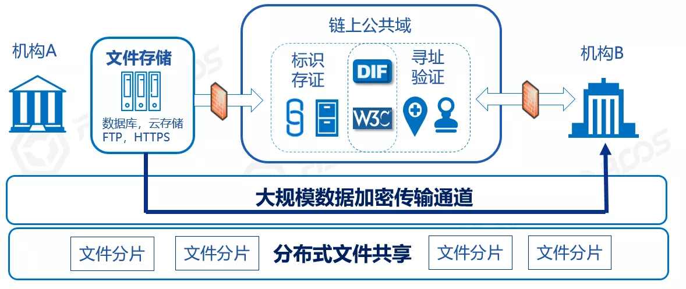
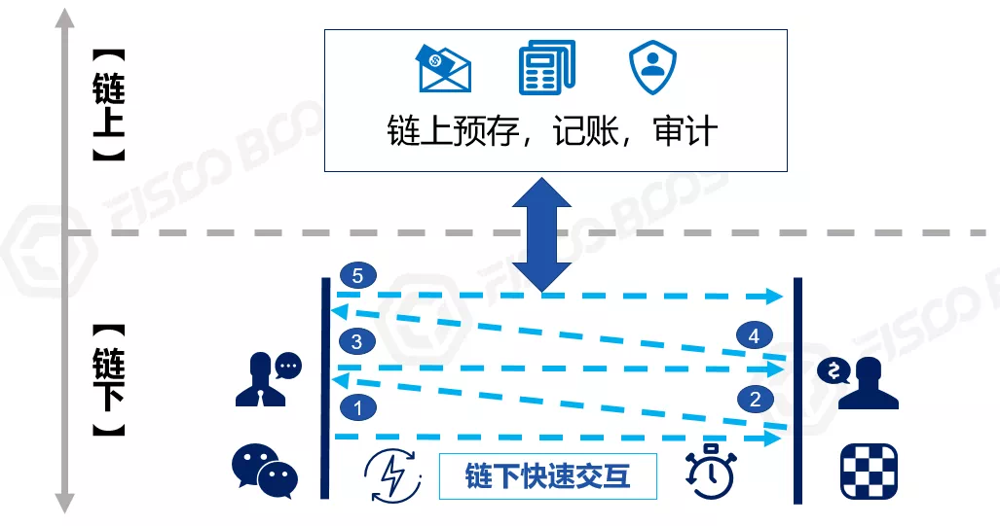
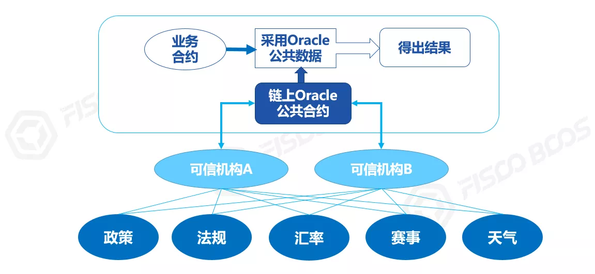

# 一文说清“链上”和“链下”

作者：张开翔｜FISCO BCOS 首席架构师

什么是“上链”？什么数据和逻辑应该“上链”？文件能不能上链？链上能不能批量查数据？“链下”又是什么？
“链上”、“链下”诸多问题，一文说清。

## 什么是“链上”和“链下”

区块“链”的链，包含“**数据链**”和“**节点链**”。数据链指用链式结构组织区块数据，构成数据校验和追溯的链条；“节点链”指多个节点通过网络连接在一起，互相共享信息，其中的共识节点则联合执行共识算法，产生并确认区块。

交易“上链”的简要过程如下：

1. 记账者们收录交易，按链式数据结构打包成“区块”。
2. 共识算法驱动大家验证新区块里的交易，确保计算出一致的结果。
3. 数据被广播到所有节点，稳妥存储下来，每个节点都会存储一个完整的数据副本。

交易一旦“上链”，则意味着得到完整执行，达成了“分布式事务性”。简单地说，就像一段话经过集体核准后在公告板上公示于众，一字不错不少，永久可见且无法涂改。
“上链”意味着“**共识**”和“**存储**”，两者缺一不可。交易不经过共识，则不能保证一致性和正确性，无法被链上所有参与者接受；共识后的数据不被多方存储，意味着数据有可能丢失或被单方篡改，更谈不上冗余可用。
除此之外，如果仅仅是调用接口查询一下，没有改变任何链上数据，也不需要进行共识确认，则不算“上链”。

或者，某个业务服务本身和区块链并不直接相关，或其业务流程无需参与共识，所生成的数据也不写入节点存储，那么这个业务服务称为“**链下服务**”，无论它是否和区块链节点共同部署在一台服务器，甚至和节点进程编译在一起。
当这个业务服务调用区块链的接口发送交易，且交易完成“共识”和“存储”后，才称为“上链”；如果这个交易没有按预期被打包处理，那么可以叫“**上链失败**”。

事实上，几乎所有的区块链系统，尤其是和实体经济、现实世界结合的区块链应用，都需要链上链下协同，用“混合架构“来实现，系统本身就包含丰富的技术生态。

*注1：交易（transaction）是区块链里的通用术语，泛指发往区块链，会改动链上数据和状态的一段指令和数据

*注2：本节描述的是简要的模型，在多层链、分片模型里，流程会更加复杂，事务划分更细，但“共识”和“存储”才叫上链的基本原则不变

## 交易之轻和“上链”之重

目前区块链底层平台逐步趋于成熟，性能和成本已经不是什么大问题，只是以下几个开销是因“分布式多方协作”而先天存在的：

- **共识开销**：主流共识算法里，PoW（工作量证明，也就是挖矿）消耗电力；PoS（权益证明）要抵押资产获得记账权；PBFT（联盟链常用的拜占庭容错算法）记账者要完成多次往返投票，流程步骤繁杂。
- **计算开销**：除了加解密、协议解析等计算之外，在支持智能合约的区块链上，为了验证合约的执行结果，所有节点都会无差别地执行合约代码，牵一发而动全身。
- **网络开销**：与节点数呈指数级比例，节点越多，网络传播次数越多，带宽和流量开销越大，如果数据包过大，就更雪上加霜。
- **存储开销**：和节点数成正比，所有的链上数据，都会写入所有节点的硬盘，在一个有100个节点的链上，就变成了100份副本，如果有1000个节点，那就是1000份。

也许有人会说：“这就是‘信任’的成本，值得的！”我同意。只是理想无法脱离现实，毕竟硬件资源总是有限的。
想象一下，如果每个交易都是一个复杂科学计算任务，那么每个节点CPU和内存会跑满；如果每个交易都包含一个大大的图片或视频，那么全网的带宽，以及各节点存储很快被塞爆；如果大家都敞开来滥用“链上”资源，“公地悲剧”就不可避免。
调用API发个交易是很容易的，而链上的开销就像房间里的大象，难以视而不见。作为开发者，需要正视“**交易之轻和链上之重**”，积极“上链”的同时减少不必要的开销，找到平衡之道。

*注1：常规联盟链节点参考配置：8核/16G内存/10m外网带宽/4T硬盘，不考虑“矿机”和其他特种配置。土豪随意，俗话说“钱能解决的问题都不是问题，问题是...”

*注2：本节暂未讨论“局部/分片共识”，也不探讨“平行扩容”的情况，默认假定全网参与共识和存储

## 让“链上”归链上，“链下”归链下

开销只是成本问题，而本质上，应该让区块链干自己最该干的事情。链上聚焦多方协作，尽快达成共识，营造或传递信任，将好钢用到刀刃上；那些非全局性的、无需多方共识的、数据量大的、计算繁杂的...通通放到链下实现，一个好汉三个帮。

如何进行切割？在业务层面，识别多方协作事务和数据共享中“最大公约数”，抓住要点痛点，四两拨千斤；在技术上，合理设计多层架构，扬长避短、因地制宜地运用多种技术，避免拿着锤子看什么都是钉子、一招打天下的思维。

为避免过于抽象，下面给出几个例子。

*注：每个例子其实都有大量的细节，考虑篇幅，这里做概要介绍，聚焦链上链下的区别和有机结合

## 文件能不能上链？

这是个非常高频的问题，经常被问到。这里的文件一般指图像、视频、PDF等，也可以泛指大体量的数据集，上链可信分享的目的，是使接受者可以验证文件的完整性、正确性。
常见的场景里，文件共享一般是局部的、点对点的，而不是广播给所有人，让区块链无差别地保存海量数据，会不堪重负。所以，合理的做法是计算文件的数字指纹（MD5或HASH），并与其他一些可选信息一起上链，如作者、持有人签名、访问地址等，单个上链信息并不多。
文件本身则保存在私有的文件服务器、云文件存储、或者IPFS系统里，这些专业方案更适合维护海量文件和大尺寸文件，容量更高、成本更低。**注意，如果文件的安全级别到了“一个字节都不能泄露给无关人等”的程度，那么应慎用IPFS这种分布式存储的方案，优选私有存储方式。**
需要分享文件给指定的朋友时，可以走专用传输通道点对点的发送文件，或者授权朋友到指定的URL下载，可以和区块链的P2P网络隔离，不占用区块链带宽。朋友获得文件后，计算文件的MD5、HASH，和链上对应的信息进行比对，验证数字签名，确保收到了正确且完整的文件。
这种方案，文件在链上“确权”、“锚定”和“寻址”，明文在链下传输并与链上互验，无论是成本、效率、还是隐私安全都取得了平衡。

## 怎么批量查询和分析数据？

对区块链上的数据进行分析是自然的需求，比如“某个账户参与哪些业务流程、完成了多少笔交易、成功率如何”，“某个记账节点在一段时间内参与了多少次区块记账、是否及时、有否作弊”，这些逻辑会牵涉到时间范围、区块高度、交易收发双方、合约地址、事件日志、状态数据等维度。
目前区块链底层平台一般是采用“Key-Value”的存储结构，其优势是读写效率极高，但难以支持复杂查询。
其次，复杂查询逻辑一般是在区块生成后进行，时效性略低，且并不需要进行多方共识，有一定的“离线”性。
最后，数据一旦“上链”，就不会改变，且只增不减，数据本身有明显特征（如区块高度、互相关联的HASH值、数字签名等）可以检验数据的完整性和正确性，在链上还是链下处理并无区别，任何拥有完整数据的节点都能支持独立的复杂查询。

于是，我们可以将数据完整地从链上导出，包括从创世块开始到最新的所有区块、所有交易流水和回执、所有交易产生的事件、状态数据等，通通写入链外的关系型数据库（如MySQL）或大数据平台，构建链上数据的“镜像”，然后可以采用这些引擎强大的索引模型、关联分析、建模训练、并行任务能力，灵活全面地对数据进行查询分析。
区块链浏览器、运营管理平台、监控平台、监管审计等系统，都会采用这种策略，链上出块，链下及时ETL入库，进行本地化地分析处理后，如需要和链上进行交互，再通过接口发送交易上链即可。

## 复杂逻辑和计算

和复杂查询略有不同，复杂逻辑指交易流程中关系复杂、流程繁杂的部分。
如上所述，链上的智能合约会在所有节点上运行，如果智能合约写得过于复杂，或者包含其实不需要全网共识的多余逻辑，全网就会承担不必要的开销。极端的例子是，合约里写了个超级大的数据遍历逻辑（甚至是死循环），那么全网所有节点都会陷入这个遍历中，吭哧吭哧跑半天，甚至被拖死。

除了用类似GAS机制来控制逻辑的长度外，在允许的GAS范围内，我们推荐智能合约的设计尽量精简，单个合约接口里包含的代码在百行以上就算是比较复杂的了，可以考虑是否将一部分拆解出去。
拆解的边界因不同业务而异，颇为考验对业务的熟悉程度。开发者要对业务进行庖丁解牛式地分层分模块解耦，仅将业务流程中牵涉多方协作、需要共识、共享和公示的部分放到链上，使得合约只包含“必须”“铁定”要在链上运行的逻辑，合约逻辑“小而美”。

一般来说，多方见证的线上协同、公共账本管理、一定要分享给全体的关键数据（或数据的HASH）都是可以放到链上的，但相关的一些前置或后续的检验、核算、对账等逻辑可以适当拆解到链下。
一些和密集计算有关的逻辑，宜尽量将其在链下实现，如复杂的加解密算法，可以设计成链下生成证明链上快速验证的逻辑；如果业务流程中牵涉对各种数据的遍历、排序和统计，则在链下建立索引，链上仅进行Key-Value的精准读写。
其实，现在但凡看到合约里有用到mapping或array，我都会强迫症地想想能不能把这部分放链下服务去，个人比较欣赏“**胖链下**”和“**瘦链上**”的设计取向。
强调一下，精简链上合约逻辑，并不全是因为合约引擎的效率问题，合约引擎已经越来越快了。核心原因还是在发挥区块链最大功效的同时，避免“公地悲剧”。开发者拿出计算和存储成本最小的合约，有着“**如无必要勿增实体**”的奥卡姆剃刀式美感，更是对链上所有参与者表达尊重和负责任的态度。

##  即时消息：快速协商和响应

受队列调度、共识算法、网络广播等因素约束，“上链”的过程多少都会有一点延时。采用工作量证明共识的链，时延在十几秒到10分钟，采用DPOS、PBFT的共识，时延可缩短到秒级，此外，如果遇到网络波动、交易拥挤等特殊情况，时延表现会有抖动。
总的来说，对照毫秒或百毫秒级响应的瞬时交互，“上链”会显得些许“迟钝”。比如去超市买瓶水，支付后肯定不能站在那里等十几秒到十分钟，链出块确认后才走吧（略尴尬）。

对类似场景，宜结合链上预存和链外支付，在链下的点对点通道实现高频、快速、低延时的交易，链下确保收妥和响应，最后将双方的账户余额、交易凭据汇总到链上，在链上完成妥善记账。著名的“闪电网络”就类似这种模式。

另外，有些商业场景会先进行多轮的订单撮合、竞价拍卖或讨价还价。一般来说，这些操作是发生在局部的交易对手方之间，未必需要全网共识，所以也可以通过链下通道完成，最后将双方的订单（包含双方磋商结果、数字签名等信息）发送到链上，完成交易事务即可。

举个下快棋的例子，棋手的每一步棋并不需要实时上链，双方只管啪啪地下，裁判和观众只管围观，在棋局结束时，比如总共下了一百手，那么将这一百手的记录汇总起来，连同输赢结果上链，以便记录战绩分配奖金。如果要复盘棋局详情（如视频），可以参考上文提及的链下文件存储模式，用专用的服务器或分布式存储实现。

针对类似需求，在FISCO BCOS底层平台中，提供了AMOP（链上信使协议），利用已经搭建起来的区块链网络，在全网范围实现点对点、实时、安全的通信。基于AMOP，可以支持即时消息、快速协商、事件通知、交换秘密、构建私有交易等，推荐。

*注：【AMOP】详情可参考：https://fisco-bcos-documentation.readthedocs.io/zh_CN/latest/docs/manual/certificate_list.html

## 链下信息如何可信上链？

先看一个典型问题：“**智能合约运行中要使用链外信息，怎么办？**”
比如，链上有个世界杯决赛竞猜游戏，但世界杯不可能在链上踢吧；或者需要参考今天的天气，天气显然不是链上原生信息，应该从气象局获取；在跨境业务中，可能用到法定汇率，而汇率一定是来自权威机构的，不能在链上凭空生成。
这时候就要用到“**预言机(Oracle)**”，由一个或多个链下可信机构将球赛、天气、汇率等信息写到链上的公共合约，其他合约统一使用这份经过共识确认的可信信息，不会出现歧义。考虑到安全和效率，预言机（Oracle）会有多种具体做法，实现起来相当有趣。

更进一步的灵魂拷问是：**“****如何保证上链的数据是真实的****？”**坦率地说，区块链并不能从根本上保证链下数据的可信性，只能保证信息一旦上链，就是全网一致且难以篡改的。而区块链跟实体经济结合时，势必要面对“如何可信上链”这个问题。
如资产相关应用，除了进行人员管理之外，还要“**四流合一**”，即“信息流、商流、物流、资金流”互相匹配和交叉印证，会使业务流程更加可信。这些“流”常常发生在链下现实世界，要把控它们，可能会用到物联网（传感器、摄像头等）、人工智能（模式识别、联邦学习等）、大数据分析、可信机构背书等多种技术和方式，这已经远远超出了区块链的范围。

所以，本节的命题其实是：**区块链如何和数字世界里的技术广泛结合，更好地发挥自身多方协作、营造信任的作用**。
随着数字世界的发展、尤其“**新基建**”的强力推动，我们相信广泛的数字化能在保护隐私的前提下，降低信息采集和校验的成本，采集的数据会越来越丰富。
如在使用、转移、回收实体物资时，及时采集监测，甚至是多方、多路、多维度立体化的采集监控，并上链进行共识、公示、锚定，链上链下交叉验证，这样就可以逐渐逼近“**物理世界可信上链**”的效果，逻辑会更严密，更具有公信力，数据和价值流通会更可靠，协作的摩擦更低。

##  "链上"还是“链下"治理？

“治理”即制定行业联盟和业务运作规则，确保规则的执行，处理异常事件，奖励和惩戒参与者等。
以理想化的标准，似乎应该实现链上治理，通过代码决策、制定和执行规则，出错时系统具有“自修复”的“超能力"。实际上，完备的链上治理过于复杂，实现起来很有挑战性，尤其在需要达成现实世界法律法规的执行力时，纯链上的治理往往力不从心。
再多想一步：如完全依赖代码，万一代码本身有BUG、或者要“改需求”呢？链下的决策者、开发者如何发现和介入？
所以，“Code is Law”还是个理想化的目标，链下治理不可或缺。

联盟链参与者们组成管理委员会，在现实世界里进行民主集中制的讨论和决策，共同制定规则，采用多签、工作流的方式一起发起治理动作，调用区块链接口上链。
在链上，包括区块链底层平台和智能合约在内，都会内置一系列的决策和控制点，如支持多方投票决策，具备从业务层穿透到底层的准入和权限控制能力，可修改业务和节点的参数，能应对异常情况的重置账户，对错账进行冲正调账等等。
治理动作和结果经过共识确认，在链上全网生效，公开透明，接受广泛监督，彰显其合理性和公正性。必要时还可以引入监管方和司法仲裁。
反过来，联盟链上的数据，具备身份可知、难以篡改、无法否认且可全程追溯等特点，可为链下治理决策提供完备的数据基础，也便于为链下实际执行提供可信的凭据。所以，链上和链下有机结合，有助于设计完备、可控、可持续的治理机制。

## 如何做到“上” “下”自如

或许有人会说：“这链上链下什么的太复杂了，我就想用区块链！”
我认为这个说法很对。说到底，用户就想要一条趁手的“链”。作为开发者，我们要打造灵活的、插件化的系统架构，实现各种能力，什么数据导出、文件存储和传输、密集计算、数据采集和异步上链、治理监管、一键部署......按需取舍后，打包起来开箱即用，实际上提供了“**基于区块链的一系列能力**”。
最终呈现的“链”，除了节点之外，还有区块链浏览器、管理台、监控和审计系统、业务模板、APP/小程序等一系列交互入口，用户只需动动鼠标，点点页面，调调接口，一站式体验到一个完整的区块链应用。用户会觉得：“这就是区块链”，无需再分“链上”和“链下”，浑然一体。

说到这里，推荐一个我认为非常棒的设计：分布式身份标识（DID）。
DID是一套涵盖了分布式身份管理、可信数据交换的规范。权威机构为用户完成KYC，颁发凭据。用户将身份标识的摘要公布到链上，而将自己隐私数据存在链下（这一点非常重要）。
使用时，用户采用“**明确授权**”和“**选择性披露**”的策略，仅需出示少量的信息或加密证明，与链上数据进行对照校验，即可证明用户凭据和数据可信性，达成了“数据多跑路，用户少跑腿”、保护了用户隐私的可喜效果。
这种设计很好地将链上链下结合起来，逻辑闭环自洽，并不因为数据存在链下，就削弱了链上的功效，反而使得链的授信模型更为重要。
DID规范定义了语义清晰、层次分明的数据结构，以及通用的交互协议。开源项目WeIdentity完整地实现了DID协议，并提供丰富的周边支撑工具和服务，值得参考。

*注：【WeIdentity】详情可见：[https://fintech.webank.com/weidentity](https://fintech.webank.com/weidentity)

## 结语

链漫漫其修远兮，吾将“上下”而求索。在未来，“可信的”区块链将越来越多地和人们日常生活、实体经济联动，步入寻常百姓家。作为从业者，保持开放的心态，积极而创新地将区块链与更多技术结合，无论运作于链上还是链下，只要能解决问题、创造价值，就是一条好链。