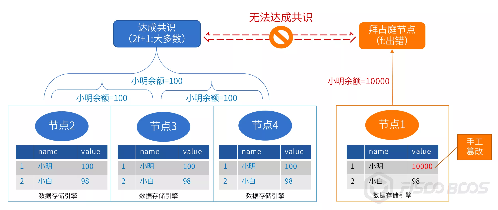

# 如何解释“我篡改了区块链”这个问题

作者：张开翔｜FISCO BCOS 首席架构师

区块链数据“**全局一致**”、“**难以篡改**”这两个特性已经广为人知，是区块链营造“信任”的基石。为了达到这两个效果，区块链的共识、同步、校验等技术细节足可大书特书，而本文要从“**我篡改了区块链数据**”讲起。

## “我篡改了区块链数据”

FISCO BCOS开源联盟链社区现在相当活跃，每天都会产生大量的讨论，大家也会饶有兴趣地研究和挑战区块链如何做到“难以篡改”。我们注意到，尤其在FISCO BCOS支持MySQL数据库作为数据存储引擎后，隔一阵子就有同学在群里问：“我手动修改了我节点连接的数据库里某个状态数据，**这是不是就是篡改了区块链数据呢**？”

直观地举个例，如链上有个智能合约，管理特定资产余额，在数据库合约表里，经过共识的Alice的余额本来是**100**，这时有人打开MySQL客户端，找到那个合约对应的Table，把Alice的余额update成**10000**。

这时他表示：“你看，我调用合约的查询接口，查出来Alice的余额确实是10000，这就不对了嘛，而且，链还在出块，**根本不防篡改嘛**！”。

## 初步分析和解答

为何这类问题最近多起来了？我们分析了下，猜想主要是由于MySQL数据库用户基础良好，体系比较成熟，给用户提供友好的命令行或图形化交互工具，FISCO BCOS提供了一种Table风格的合约开发模式，表结构设计得清晰直观，对于用户来说，一方面理解和管理起来更容易了，另一方面顺手update甚至delete一下都是小意思。

下图仅为示例数据，采用KVTable合约方式，创建了名为t_kv_node的合约表，系统自动加了“u_”前缀，可见，这个表结构和数据一目了然。

而之前只采用LevelDB或RocksDB作为存储引擎，这两个文件型数据库交互工具比较少，在用户面前的存在感不强，操作相对晦涩，主要通过API编程访问，数据用肉眼难以辨别的Hash key寻址，动手修改数据库的case就少了一些（但也不是不可能）。

所以，热点问题浮出水面，前提是用户可以更方便地修改底层数据了，而不是这个问题之前不存在。这时我们会建议用户试一下，针对Alice的余额，发起一个交易，比如给Alice充值，或者让Alice转账操作，这时，修改过数据的节点将无法参与共识。因为该节点上算出来的Alice的余额和其他节点结果不同，其他节点依旧按100的余额进行计算，而不是**10000**，显然结果是对不齐的。

复习下PBFT的容错模型：定义“f”为可容错节点数，网络中共识节点总数应等于或多于3f+1。即链上有4个共识节点时，可容错的f=1，共识节点总数为7个时，f=2，以此类推。

如果未修改过数据的节点数满足PBFT要求的2f+1的数量，链依旧可以出块。但被修改过的节点，一旦有交易涉及脏数据，就像踩到了雷一样，从此再无法与链共识、同步，相当于被抛弃了。这种节点可以称为“拜占庭节点”，即作恶或出错的节点，具备节点准入控制能力的联盟链甚至会将拜占庭节点隔离出去。

还有一种可能性是，手动修改了数据库里的数据，但节点内存里还刚好缓存了一份副本，并没有被修改，所以通过节点对这个数据的查询、交易还是正常的，甚至会用正确的结果把数据库里被篡改过的数据覆盖掉，不过这是概率性事件，取决于缓存的大小和当时包含的数据项。

*注：对于采用PoW或其他共识机制的链来说，容错模型有所不同，但在容错范围内的少数节点被篡改，也不会影响链的共识。

## “能否篡改整个联盟链”

有的同学可能会继续刨根问底：“**那我多修改几个节点的数据是不是就篡改了**？”，一般提出这个问题的同学是面向他自己部署的开发测试环境，所有节点都在他手上，所以可以随便改。

在真实的联盟链环境上，节点分别掌握在不同机构手里，要修改，首先得侵入他人的网络、获得服务器和数据库权限、发起修改再全身而退。事实上，在注重安全防护的商业化环境里，这是非常艰难、几乎不可能做到的事情。

从机构粒度来看，单个机构掌握的节点数，应该低于共识算法可容错的数量。比如，链上总共有7个共识节点，那么单个机构掌握的共识节点不应多于2个，这样可以避免机构内部强行修改自己掌握的节点数据，或一个机构的所有节点都意外出错、掉线（比如机房光纤都被挖断了），导致链无法出块。

## 真的没有办法防“本地篡改”吗?

考虑区块链数据本地验证的机制，比如区块之间的Hash关系、状态的Merkle树结构、共识节点的签名等，按数据的互验关系顺藤摸瓜进行检测，似乎有一定概率可以本地检测出数据异常。

但进一步想，对某个数据的查询，区块链的本地校验范围是有限的，一般不会超出单个区块或者一棵merkle树，所以如果篡改者比较熟悉区块链数据的结构和本地校验逻辑，也可以顺着数据校验关系，从状态值开始，把merkle树、区块Hash等关键数据全部改掉。

甚至更彻底地，从创世块开始，把所有的区块、系统配置（对于PoW，可以修改挖矿难度以加速出块）、PBFT的共识者列表等等，都按他的逻辑改一遍，这样这条本地数据链依旧是校验自洽的，只是无法和其他节点共识了。

这种改法，听起来需要不少力气活，但对于一个有决心、有能力的篡改者来说，改改本地数据这个事情其实并不难，难的只是去改别的机构数据而已。

到了这个份上，就相当于一个人铁了心要“骗自己”，那神仙都没有办法了。一旦把本地数据修改的权限交给了不适当的人，最坏情况下，整条链没有一个字节是对的。

但是，本地数据再错，也只会影响自己，影响不了别人，一旦和其他节点进行共识，就会被发现，甚至被惩戒，整个效果会有一点掩耳盗铃的意思。

## "为什么区块链不拦住我篡改数据？”

再进一步，那位同学又会问:“**为什么区块链不能立刻发现、并且阻止我篡改数据？也许我只是无意手误呢**”。坦率说，这有点对区块链期望过高了。区块链系统并非无所不能，也不会包办一切，区块链并不会阻止用户对自己的服务器、软件、数据库等施加操作，就像法律不能也不应去阻止你打碎家里的杯子一样。

本质上，区块链的一致性、难以篡改性是面向“**全局**”的，是由多方博弈和协作达成的，当链上交易牵涉错误数据时，共识机制可以检测并拒绝已被篡改的数据，保证链上剩余的大多数健康节点继续共识出块。而节点本地不参与共识的数据，共识机制鞭长莫及。

那么，区块链为什么不能主动检测和纠正错误，保证每个节点上的数据一致性？首先，链上的数据非常庞杂，用户直接登入数据库手动修改少量数据，区块链节点并不知道哪一条数据被修改了，无法触发检查。

如果区块链系统定期巡检所有数据，并将所有数据和其他节点进行比对，可想而知，这样做的话，网络、磁盘和计算开销会非常大。关键是，这并不解决问题，因为从数据被篡改后到检测出来的时间窗里，哪怕脏数据只存在了几十毫秒，但这时如果不幸有应用来查询数据，依旧会得到篡改后的结果。对要求苛刻的业务来说，事后检测未必是最佳选项，因为有可能已经造成了业务损失，届时能做的最多就是告警和冲正了。

当然，也可以结合数据库的操作监控、binlog等辅助机制，加速响应速度和检测效率。方法还是有的，如上所述，只是性价比较低，也不彻底解决问题，只有对数据修改极其敏感，且业务上接受延时发现和修订的特定场景，才会考虑将其作为补救措施。我们把这部分归类到运营管理工具里，根据场景需求来实现。

还有一种方法，可以部分解决查询问题：**f+1查询**。即查询数据时，无论是查区块数据，还是合约的状态数据，不妨多查几个节点，查询节点数多于 f 即可。如链上有个7个节点时，f=2，用户查询自己节点之外，继续发出网络请求去查询其他机构的2个节点，共查询3个节点，如果得到的数据都是一致的，则表示数据一定是正确的，反之，一定是这3个节点里出了问题。

但是，要执行f+1查询，前提是其他机构开了查询接口权限，让你连接上去查询。在很多安全防护严密的联盟链上，一般只打开节点之间P2P互联的网络端口，不会轻易给其他机构提供数据查询权限。再则，在网络上发起多次查询，其异步性、时效性、成功率和性能表现都会带来更多变数。

综上所述，对节点本地的数据，就像打地鼠，冒头的（发出交易参与共识，或进行f+1查询），区块链全局共识和容错机制能发现，没有冒头仅蹲在用户硬盘里的，只能用户自己负责了。

## 结语

区块链通过网络博弈、多方校验实现了全网的容错防作恶，而区块链同步给到各节点的本地数据，需要用户自行妥善管理保存。

从信任传递来看，首先用户得“信自己”，如果连自己都无法相信，说明系统和数据管理有漏洞，莫说是修改数据了，在本地系统的整个链路上，包括区块链软件、SDK、业务服务都有可能出错和篡改作假，这样的环境有何信任可言？

节点持有者必须非常审慎，首先不要手痒或手误去改数据，然后关键是要建立周全的制度，包括管理策略和技术防护，比如，主机访问控制、数据库登录和操作权限控制、操作审计、日志审计等，以避免本机构内有人越权访问监守自盗，或者被外部渗透。

万一数据出错，区块链比中心化系统好一点的就是，还有可能通过与其他节点互相校验检测出来，这时则应该进行告警、查证、补正和追责，以及在有条件和有必要的前提下，善用f+1查询方法，给查询操作加一点点保险。

另外，建议定期备份节点数据到安全的离线设备上，这样无论是出现意外还是人为的数据问题，依旧可以从冷数据里快速恢复，保证一定的RTO（复原时间目标）和RPO（恢复点目标）。

而区块链的健壮性在于，无论单个角色怎么折腾自己的节点和数据，对全局是没有影响的，只有修改者自己受损。任凭窝里翻天覆地，链上依旧云淡风轻，其“**全局一致**”、“**难以篡改**”的定律依旧成立，链仍然是信任的锚点，这就是区块链的魅力。