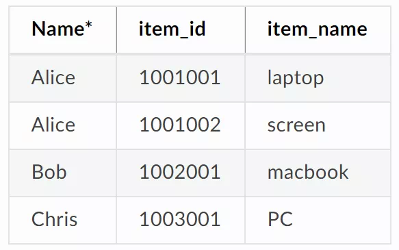

# FISCO BCOS 2.0原理解析篇2： 分布式存储架构设计

作者：莫楠｜FISCO BCOS 高级架构师

FISCO BCOS 2.0新增对分布式数据存储的支持，克服了本地化数据存储的诸多限制。

在FISCO BCOS 1.0中，节点采用MPT数据结构，通过LevelDB将数据存储于本地，这种模式受限于本地磁盘大小，当业务量增大时数据会急剧膨胀，要进行数据迁移也非常复杂，给数据存储带来较大的成本和维护难度。

为了突破性能的瓶颈，我们在FISCO BCOS 2.0中，对底层的存储进行了重新设计，实现了分布式存储，使用不同于MPT的方式来实现追溯，带来了性能上的提升。

先夸夸分布式存储方案的优点：

- 支持多种存储引擎，选用高可用的分布式存储系统，可以支持数据简便快速地扩容；
- 将计算和数据隔离，节点故障不会导致数据异常；
- 数据在远端存储，数据可以在更安全的隔离区存储，这在很多场景中非常有意义；
- 分布式存储不仅支持Key-Value形式，还支持SQL方式，使得业务开发更为简便；
- 世界状态的存储从原来的MPT存储结构转为分布式存储，避免了世界状态急剧膨胀导致性能下降的问题；
- 优化了数据存储的结构，更节约存储空间。

## 从MPT存储到分布式存储

### MPT存储

**MPT(Merkle Paricia Trie)**，来自以太坊，对外接口为Key-Value，使用前缀树来存储数据，是FISCO BCOS 1.0的存储模式。

MPT是前缀树结构，树中的每个叶子节点允许有最多16个子叶子节点，叶子节点有一个HASH字段，由该叶子的所有子叶子节点HASH运算得出。树根有唯一的HASH值，标识整棵树的HASH。

图片来自以太坊白皮书

以太坊的全局状态数据，保存在MPT树中，状态数据由账号组成。账号在MPT中是一个叶子节点，账号数据包括Nonce、Balance、CodeHash和StorageRoot。任意一个账号字段发生变化时，会导致该账号所在的叶子的HASH发生变化，从该叶子直到顶部的所有叶子的HASH都会变化，最后导致顶部的StateRoot变化。

由此可见，任何账户的任意字段变化，都会导致StateRoot的变化，StateRoot能唯一标识以太坊的全局状态。

图片来自以太坊白皮书

MPT可以实现轻客户端和数据追溯，通过StateRoot可以查询到区块的状态。MPT带来了大量HASH的计算，打散了底层数据存储的连续性。在性能方面，MPT State存在着天然的劣势。可以说，MPT State追求极致的可证明性和可追溯性，对性能和可扩展性做了一定的妥协。

### 分布式存储

FISCO BCOS 2.0在保持存储接口兼容性的同时，引入了高扩展性、高吞吐量、高可用、高性能的分布式存储。**分布式存储(Advanced Mass Database，AMDB)**：重新抽象了区块链的底层存储模型，实现了类SQL的抽象存储接口，支持多种后端数据库，包括KV数据库和关系型数据库。 引入了分布式存储后，数据读写请求不经过MPT，直接访问存储，结合缓存机制，存储性能相比基于MPT的存储有大幅提升。MPT数据结构仍然保留，仅做为可选方案。

分布式存储支持MySQL等关系型数据库，支持MySQL集群、分库分表等平行扩展方式，理论上存储容量无限。

## 分布式存储架构

#### State层（State）

抽象了智能合约的存储访问接口，由EVM调用，分为StorageState和MPTState。StorageState为分布式存储的适配层，MPTState为老的MPT适配层，FISCO BCOS默认使用StorageState。

#### 分布式存储层（Table）

抽象了分布式存储的类SQL接口，由State层和Precompiled调用。分布式存储层抽象了存储的增删改查接口，把区块链的核心数据分类存储到不同的表中。

#### 驱动层（Storage）

实现具体的数据库访问逻辑，包括LevelDB和MySQL。

### **分布式存储名词解释**

#### Table

存储表中的所有数据。Table中存储分布式存储主key到对应Entries的映射，可以基于分布式存储主key进行增删改查，支持条件筛选。

#### Entries

Entries中存放主Key相同的Entry，数组。分布式存储的主Key与Mysql中的主key不同，分布式存储主key用于标示Entry属于哪个key，相同key的Entry会存放在同一个Entries中。

#### Entry

对应于表中的一行，每行以列名作为key，对应的值作为value，构成KV结构。每个Entry拥有自己的分布式存储主key，不同Entry允许拥有相同的分布式存储主key。

#### Condition

Table中的“删改查”接口可传入条件，支持“等于”“大于”“小于”等过滤逻辑，接口根据条件对数据进行筛选后进行相应操作，返回结果数据。如果条件为空，则不做任何筛选。

##### 举例

以某公司员工领用物资登记表为例，解释上述名词

- 表中Name是分布式存储主key。
- 表中的每一行为一个Entry。一共有4个Entry，每个Entry有三个字段。
- Table中以Name为主key，存有3个Entries对象。第1个Entries中存有Alice的2条记录，第2个Entries中存有Bob的1条记录，第3个Entries中存有Chris的一条记录。
- 调用Table类的查询接口时，查接口需要指定分布式存储主key和条件，设置查询的分布式存储主key为Alice，条件为price > 40，会查询出Entry1。

### 分布式存储表分类

表中的所有entry，都会有_status_,_num_,_hash_内置字段。

#### 系统表

系统表默认存在，由存储驱动保证系统表的创建。

#### 用户表

用户CRUD合约所创建的表，以_user_<TableName>为表名，底层自动添加_user_前缀。

#### StorageState账户表

_contract_data_+Address+_作为表名。表中存储外部账户相关信息。表结构如下：

## 总结

FISCO BCOS发布至今，历经大量真实业务实践。分布式存储在持续改进的过程中，总结出适合于金融业务、高性能、高可用性和高可扩展的存储模型，架构愈发稳定成熟，未来分布式存储将继续作为区块链系统的基石，支持区块链系统的发展。

下篇文章，我会提供分布式存储的体验流程，敬请持续锁定FISCO BCOS开源社区。

### 系列精选

[FISCO BCOS 2.0发布](https://mp.weixin.qq.com/s?__biz=MzA3MTI5Njg4Mw==&mid=2247485340&idx=1&sn=310a442382c879aecaa0cb37c1bce289&chksm=9f2ef580a8597c96cada2526ad2df2e65c00c62a50bcebbd41d84c36aadfac2526f6a12aa2ec&token=705851025&lang=zh_CN#rd)：（附新特性解读）

#### 原理解析

[群组架构的设计](https://mp.weixin.qq.com/s?__biz=MzA3MTI5Njg4Mw==&mid=2247485338&idx=1&sn=9ce03340c699a8527960a0d0b26d4923&chksm=9f2ef586a8597c9003192718c1f60ed486570f6a334c9713cc7e99ede91c6f3ddcd7f438821f&token=705851025&lang=zh_CN#rd)：使企业间建立多方协作的商业关系像拉群聊天一样简便。

#### 使用教程

[群组架构实操演练](https://mp.weixin.qq.com/s?__biz=MzA3MTI5Njg4Mw==&mid=2247485337&idx=1&sn=622e88b631ae1bfe5789b2fe21576779&chksm=9f2ef585a8597c9311c972eb67174b3638f7b69d87d6eea243fc327bf515159fb53f216a5fec&token=705851025&lang=zh_CN#rd)：以搭建仲裁链为例，并演示如何向该链发送交易。

