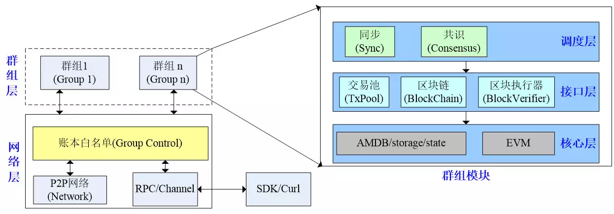
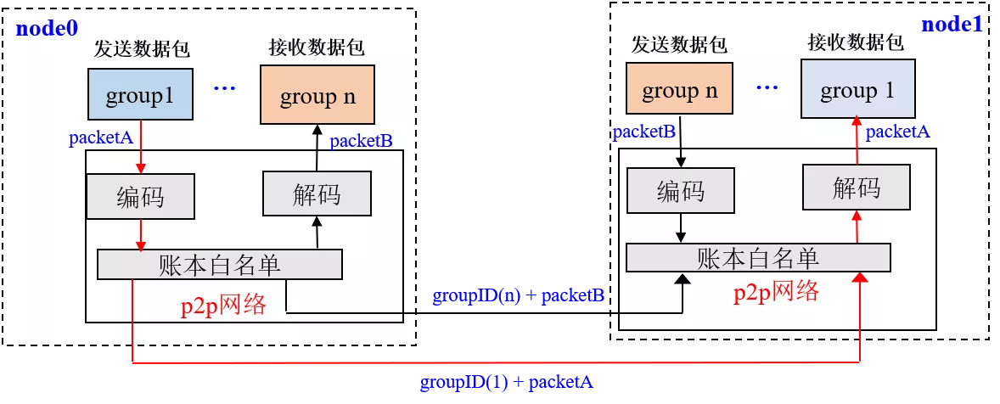
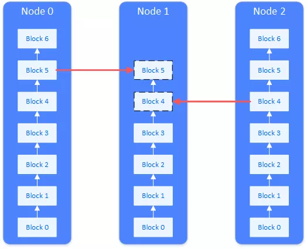

# FISCO BCOS 2.0原理解析篇1： 群组架构的设计

作者：陈宇杰｜FISCO BCOS 核心开发者

为了方便企业、开发者更深入理解FISCO BCOS 2.0诸多新特性，更快速地运用FISCO BCOS搭建联盟链应用，我们启动了FISCO BCOS 2.0系列剖析的计划。在后续的推送中，我们将陆续推出《FISCO BCOS 2.0原理解析》、《FISCO BCOS 2.0使用教程》、《FISCO BCOS 2.0源码分析》等文章系列，抽丝剥茧地将FISCO BCOS 2.0进行全面拆解。

本文是原理解析系列第一篇，介绍FISCO BCOS 2.0众多新特性中的主线——群组架构。主要包括群组架构的整体架构设计，群组架构包括哪些组件，各组件的主要功能以及组件间的交互。

## 设计目标

理解群组架构的设计目标，可以从人人都熟悉的群聊模式说起。

#### 灵活扩展：保证业务接入和扩展像拉群聊天一样方便

群的建立非常灵活，几个人就可以快速拉个主题群进行交流。同一个人可以参与到自己感兴趣的多个群里，并行地收发信息。现有的群也可以继续增加成员。

看回群组架构，采用群组架构的网络中，根据业务场景的不同，可存在多个不同的账本，区块链节点可以根据业务关系选择群组加入，参与到对应账本的数据共享和共识过程中。群组架构具有良好的扩展性，一个机构一旦参与到这样的联盟链里，有机会灵活快速地丰富业务场景和扩大业务规模，而系统的运维复杂度和管理成本也线性下降。

#### 隐私保护：各群组之间解除耦合独立运作

回想一下群聊场景：群聊用户都在你的通信录中，都是经过验证才添加的，且不在群里的用户看不到群聊信息。这与联盟链准入机制不谋而合，所有参与者的机构身份可知。

另一方面，群组架构中各群组独立执行共识流程，各组独立维护自己的交易事务和数据，不受其他群组影响。这样的好处是，可以使得各群组之间解除耦合独立运作，从而达成更好的隐私隔离。在跨群组之间的消息互通，则会带上验证信息，是可信和可追溯的。

## 架构设计

### 架构设计全景

▲ 图为群组架构设计全景

如上图所示，群组架构自底向下主要划分为网络层、群组层，网络层主要负责区块链节点间通信，群组层主要负责处理群组内交易，每个群组均运行着一个独立的账本。

### 网络层

群组架构中，所有群组共享P2P网络，群组层传递给网络层的数据包中含有群组ID信息，接收节点根据数据包中的群组ID，将收到的数据包传递给目标节点的相应群组。为了做到群组间通信数据隔离，群组架构引入了**账本白名单**机制，下图展示了群组架构下群组间收发消息的流程：

#### 账本白名单

每个群组均持有一个账本白名单，用于维护该群组的节点列表。为了保证账本白名单群组内一致性，仅可通过发交易共识的方式修改账本白名单。

#### 发包流程

以node0的第一组向node1的第一组发送消息packetA为例：

(1) group1将消息packetA传递到网络层；

(2) 网络层模块对packetA进行编码，在packetA包头加上本群组ID，记为{groupID(1) + packetA}；

(3) 网络层访问账本白名单，判断node0是否是group1的节点，若非group1节点，则拒绝数据包；若是group1节点，则将编码后的包发送给目标节点node1。

#### 收包流程

node1接收到node0 group1的数据包{groupID(1) + packetA}后：

(1) 网络层访问账本白名单，判断源节点node0是否是group1节点，若非group1节点，则拒绝数据包，否则将数据包传递给解码模块；

(2) 解码模块从数据包中解码出group ID=1和数据包packetA，将数据包packetA发送到group1。

通过账本白名单，可以有效地防止群组节点获取其他群组通信消息，保障了群组网络通信的隐私性。

### 群组层

群组层是群组架构的核心。为了实现群组间账本数据的隔离，每个群组持有单独的账本模块。群组层自下向上一次分为核心层、接口层和调度层：核心层提供底层存储和交易执行接口；接口层是访问核心层的接口；调度层包括同步和共识模块，负责处理交易、同步交易和区块。

#### 核心层

主要包括存储(AMDB/storage/state)和执行(EVM)两大模块。存储负责从底层数据库中存储或读取群组账本的区块数据、区块执行结果、区块信息以及系统表等。执行(EVM)模块主要负责执行交易。

#### 接口层

接口层包括交易池(TxPool)、区块链(BlockChain)和区块执行器(BlockVerifier)三个模块。

##### 模块1：交易池(TxPool)

交易池是客户端与调度层交互的接口，负责从客户端或者其他节点收到的新交易，共识模块会从中取出交易打包处理，同步模块从中取出新交易进行广播。

##### 模块2：区块链(BlockChain)

区块链模块是核心层与调度层交互的接口，是调度层访问底层存储和执行模块的唯一入口，调度层可通过该模块提交新区块和区块执行结果，查询历史区块等信息。区块链模块也是RPC模块与核心层的接口，RPC模块通过区块链模块可获取区块、块高以及交易执行结果等信息。

##### 模块3：区块执行器(BlockVerifier)

与调度层交互，负责执行从调度层传入的区块，并将区块执行结果返回给调度层。

#### 调度层

调度层包括共识模块(Consensus)和同步模块(Sync)。

##### 模块1：共识(Consensus)模块

共识模块主要负责执行客户端提交的交易，并对交易执行结果达成共识。

如下图，共识模块包括打包(Sealer)线程和共识(Engine)线程，Sealer线程负责从交易池获取未执行交易，并将交易打包成区块；Engine线程负责对区块执行结果进行共识，目前主要支持PBFT和Raft共识算法。

共识模块主要流程包括：

(1) 客户端提交的交易缓存到TxPool后，会唤醒共识节点的Sealer线程，Sealer线程从交易池中获取最新交易，并基于当前最高区块，打包产生一个新区块blockI；

(2) Sealer线程将打包产生的新区块blockI传递到Engine线程，用于共识；

(3) Engine线程收到新区块blockI后，启动共识流程，共识过程中，会调用区块执行器BlockVerifier执行区块blockI内的每笔交易，并对执行结果达成一致共识；

(4) 若共识成功，则调用BlockChain将新区块blockI以及区块执行结果等提交到底层数据库；

(5) 新区块blockI上链成功后，触发交易池删除以上链的所有交易，并将交易执行结果以回调的形式推送到客户端。

##### 模块2：同步(Sync)模块

考虑到共识过程中，需要尽可能保证每个群组节点拥有全量的交易，FISCO BCOS 2.0引入了同步模块来保证客户端的交易尽可能发送到每个共识节点。

同步模块主要包括交易同步和区块同步：

##### 交易同步

客户端通过RPC向指定群组交易池提交新交易时，会唤醒相应群组同步模块的交易同步线程，该线程将所有新收到的交易广播到其他群组节点，其他群组节点将最新交易插入到交易池，保证每个群组节点拥有全量的交易。

如下图，客户端将交易tx_j发送到group1, tx_i发送到group2后，交易同步线程会将tx_i广播到所有群组节点的group1，将tx_j广播到所有群组节点的group2。

#### 区块同步

考虑到区块链网络中机器性能不一致或者新节点加入都会导致部分节点区块高度落后于其他节点，同步模块提供了区块同步功能，该模块向其他节点发送自己节点的最新块高，其他节点发现块高落后于其他节点后，会主动下载最新区块。

以三节点区块链系统为例，区块同步流程如下图：

(1) Node0, Node1和Node2的区块同步线程定期广播最新区块高度信息；

(2) Node1收到Node0和Node2的最新区块高度后，发现自身块高3低于Node0和Node2最新快高6；

(3)本着负载均衡的原则， Node1向Node2请求第4个区块，向Node0请求区块5和区块6；

(4) Node0和Node2接收到Node1的区块请求后，分别将第{5,6}和第{4}个区块返回给Node1；

(5) Node1按照区块高度执行第4、5、6个区块，并将最新区块按次序提交到底层存储。

------

**下篇预告**：群组架构的使用教程

下一篇文章，我会以搭建群组区块链为例，向大家提供群组架构的实操课程，敬请持续锁定FISCO BCOS开源社区。
