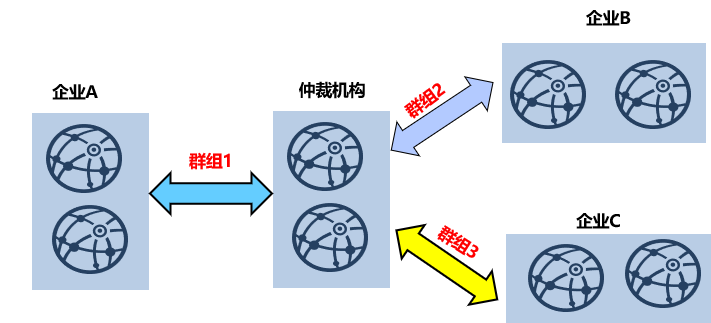
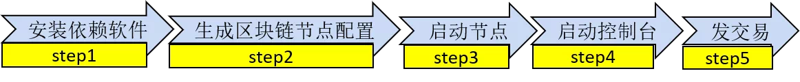
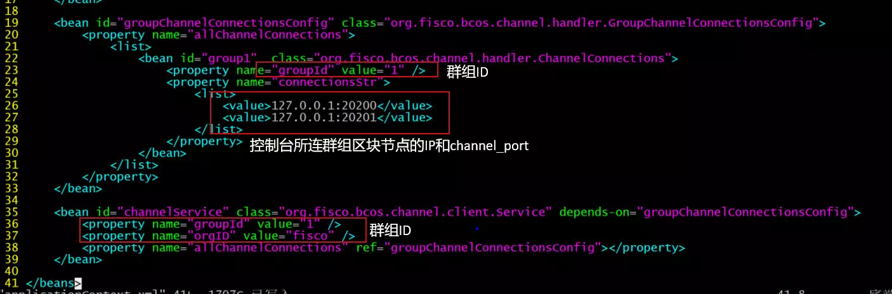
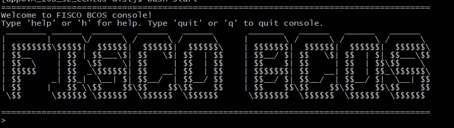

# FISCO BCOS 2.0使用教程篇1： 群组架构实操演练

作者：陈宇杰｜FISCO BCOS 核心开发者

如果说，上篇是带你潜入团队的大脑，看清群组架构诞生的由来和架构设计（还没看的伙伴可以点标题直接进入：[群组架构的设计](https://mp.weixin.qq.com/s?__biz=MzA3MTI5Njg4Mw==&mid=2247485338&idx=1&sn=9ce03340c699a8527960a0d0b26d4923&chksm=9f2ef586a8597c9003192718c1f60ed486570f6a334c9713cc7e99ede91c6f3ddcd7f438821f&token=705851025&lang=zh_CN#rd)。

那么下篇，即本文，视线则聚焦到团队的双手，看看群组架构如何在跳动的十指中轻快飞舞。

本文是高能实操攻略,全程硬核干货，我将**以搭建仲裁链为例**，并演示如何向该链发送交易。

**课程知识点**：

- 使用build_chain创建多群组区块链安装包
- 如何启动区块链节点、查看节点共识状态和出块状态
- 搭建控制台，向多个群组部署合约

## 仲裁链组织结构

下图是一个仲裁链示例：



企业A、企业B和企业C分别和仲裁机构合作，采用区块链搭建仲裁服务。在群组架构下，搭链方式为：**仲裁机构**配置两个节点，分别加入三个群组；**企业A**配置两个节点，加入群组1；**企业B**配置两个节点，加入群组2；**企业C**配置两个节点，加入群组3。

## 仲裁链组网详情

上节介绍了仲裁链组织结构，这里在一台机器的环境下模拟仲裁链组网环境。仿真的组网环境如下：

- **仲裁机构**：包括两个节点，节点IP均为127.0.0.1，同时属于群组1，群组2和群组3
- **企业A**：包括两个节点，节点IP均为127.0.0.1，仅属于群组1
- **企业B**：包括两个节点，节点IP均为127.0.0.1，仅属于群组2
- **企业C**：包括两个节点，节点IP均为127.0.0.1，仅属于群组3

**温馨提示** ：

实际应用场景中，不建议将多个节点部署在同一台机器，建议根据机器负载选择部署节点数目。本例中仲裁机构节点归属于所有群组，负载较高，建议单独部署于性能较好的机器。

## 仲裁链搭建关键流程

如下图所示，使用FISCO BCOS 2.0快速建链脚本搭建仲裁链(以及所有其他区块链系统)主要包括五个步骤：



- step1：安装依赖软件，主要是openssl和build_chain.sh脚本
- step2: 使用build_chain.sh生成区块链节点配置
- step3: 启动所有机构区块链节点
- step4: 启动控制台
- step5: 使用控制台发送交易

下面我将就这五个步骤详细叙述构建仲裁链的关键流程。

### 安装依赖软件

搭建FISCO BCOS 2.0区块链节点需要准备如下依赖软件：

- openssl：FISCO BCOS 2.0的网络协议依赖openssl
- build_chain.sh脚本：主要用于构建区块链节点配置，可从https://raw.githubusercontent.com/FISCO-BCOS/FISCO-BCOS/master/manual/build_chain.sh下载

```eval_rst
.. note::
    - 如果因为网络问题导致长时间无法下载build_chain.sh脚本，请尝试 `curl -#LO https://gitee.com/FISCO-BCOS/FISCO-BCOS/raw/master/tools/build_chain.sh && chmod u+x build_chain.sh`
```

### 生成区块链节点配置

FISCO BCOS 2.0提供的build_chain.sh可快速生成区块链节点配置，按照【仲裁链组网详情】介绍的节点组织结构，先生成区块链配置文件ip_list:

```
#ip_list文件内容格式：[ip]:[节点数] [机构名] [所属群组列表]
$ cat > ipconf << EOF
127.0.0.1:2 arbitrator 1,2,3
127.0.0.1:2 agencyA 1
127.0.0.1:2 agencyB 2
127.0.0.1:2 agencyC 3
EOF
```

调用build_chain.sh脚本构建仿真的本机仲裁链：

```
$ bash build_chain.sh -f ipconf -p 30300,20200,8545
```

区块链节点配置成功后，会看到[INFO] All completed.的输出。

### 启动节点

生成区块链节点后，需要启动所有节点，节点提供start_all.sh和stop_all.sh脚本启动和停止节点。

```
# 启动节点
$ bash start_all.sh

# 查看节点进程
$ ps aux | grep fisco-bcos
```

不发交易时，共识正常的节点会输出+++日志，使用tail -f node*/log/* | grep "++"查看各节点是否共识正常。

### 启动控制台

控制台是用户与FISCO BCOS 2.0区块链节点交互的重要工具，实现查询区块链状态、部署调用合约等功能，能够快速获取用户到所需要信息。

启动控制台前需获取并配置控制台：

- **获取控制台**：从https://github.com/FISCO-BCOS/console/releases/download/v1.0.0/console.tar.gz下载控制台

```eval_rst
.. note::
    - 如果因为网络问题导致长时间无法下载控制台脚本，请尝试从gitee下载：https://gitee.com/FISCO-BCOS/console/attach_files/420303/download/console.tar.gz
```

- **配置控制台：**主要拷贝证书、配置conf/applicationContext.xml所连接节点的IP和端口信息，控制台关键配置如下：



当然，控制台也支持连接多个群组，并提供了switch命令来切换群组，连接多个群组时，需要在groupChannelConnectionsConfig bean id中配置多个连接，分别连接到对应群组的区块链节点。

**注：**控制台依赖于Java 8以上版本，Ubuntu 16.04系统安装openjdk 8即可。CentOS请安装Oracle Java 8以上版本。

使用start.sh脚本启动控制台，控制台启动成功会输出如下界面：



### 向群组发交易

控制台提供了deploy HelloWorld指令向节点发交易，发完交易后，区块链节点块高会增加

```
# ... 向group1发交易...
$ [group:1]> deploy HelloWorld
0x8c17cf316c1063ab6c89df875e96c9f0f5b2f744
# 查看group1当前块高，块高增加为1表明出块正常，否则请检查group1是否共识正常
$ [group:1]> getBlockNumber 
1
# ... 向group2发交易...
# 切换到group2
$ [group:1]> switch 2
Switched to group 2
[group:2]deploy Helloworld
...
```

## 总结

本文介绍了搭建仲裁链的关键过程，FISCO BCOS 2.0的操作文档step by step介绍了如何部署多群组区块链，详细流程可以参考[https://fisco-bcos-documentation.readthedocs.io/zh_CN/release-2.0/docs/tutorial/group_use_cases.html](https://fisco-bcos-documentation.readthedocs.io/zh_CN/release-2.0/docs/tutorial/group_use_cases.html)