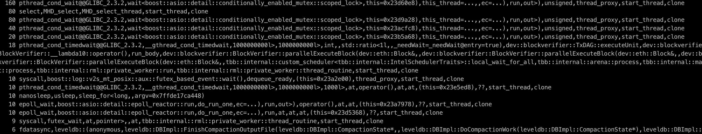
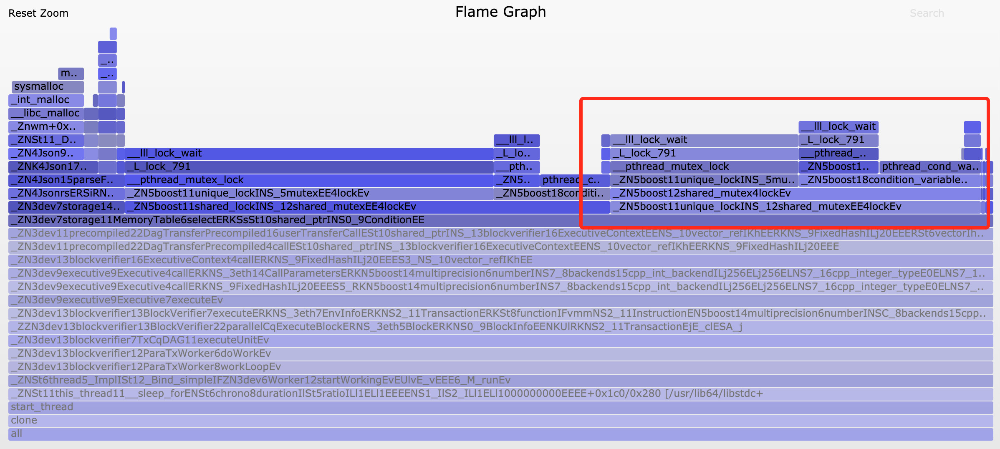

# FISCO BCOS性能优化——工具篇

作者：李陈希｜FISCO BCOS 核心开发者

We should forget about small efficiencies, say about 97% of the time: premature optimization is the root of all evil. Yet we should not pass up our opportunities in that critical 3%. ——Donald Knuth 

**『过早的优化是万恶之源』**

说出这句话的计算机科学先驱Donald Knuth并不是反对优化，而是强调要对系统中的关键位置进行优化。假设一个for循环耗时0.01秒，即使使用循环展开等各种奇技淫巧将其性能提升100倍，把耗时降到0.00001秒，对于用户而言，也基本无法感知到。对性能问题进行量化测试之前，在代码层面进行各种炫技式优化，可能不仅提升不了性能，反而会增加代码维护难度或引入更多错误。

**『没有任何证据支撑的优化是万恶之源』**

在对系统施展优化措施前，一定要对系统进行详尽的性能测试，从而找出真正的性能瓶颈。奋战在FISCO BCOS性能优化的前线上，我们对如何使用性能测试工具来精确定位性能热点这件事积累了些许经验心得。本文将我们在优化过程中使用到的工具进行了整理汇总，以飨读者。

------

## 1.Poor Man's Profiler

穷人的分析器，简称PMP。尽管名字有些让人摸不着头脑，但人家真的是一种正经的性能分析手段，甚至有自己的官方网站https://poormansprofiler.org/。PMP的原理是Stack Sampling，通过调用第三方调试器（比如gdb），反复获取进程中每个线程的堆栈信息，PMP便可以得到目标进程的热点分布。

**第一步**，获取一定数量的线程堆栈快照：

```
pid=$(pidof fisco-bcos)
num=10
for x in $(seq 1 $(num))
  do
    gdb -ex "set pagination 0" -ex "thread apply all bt" -batch -p $pid
    sleep 0.5
done 
```

**第二步**，从快照中取出函数调用栈信息，按照调用频率排序：

```
awk '
  BEGIN { s = ""; } 
  /^Thread/ { print s; s = ""; } 
  /^\#/ { if (s != "" ) { s = s "," $4} else { s = $4 } } 
  END { print s }' | \
sort | uniq -c | sort -r -n -k
```

最后得到输出，如下图所示：



从输出中可以观察到哪些线程的哪些函数被频繁采样，进而可按图索骥找出可能存在的瓶颈。上述寥寥数行shell脚本便是PMP全部精华之所在。极度简单易用是PMP的最大卖点，除了依赖一个随处可见的调试器外，PMP不需要安装任何组件，正如PMP作者在介绍中所言：『**尽管存在更高级的分析技术，但毫无例外它们安装起来都太麻烦了……Poor man doesn't have time. Poor man needs food.**。

PMP的缺点也比较明显：gdb的启动非常耗时，限制了PMP的采样频率不能太高，因此一些重要的函数调用事件可能会被遗漏，从而导致最后的profile结果不够精确。但是在某些特殊场合，PMP还是能发挥作用的，比如在一些中文技术博客中，就有开发人员提到使用PMP成功定位出了线上生产环境中的死锁问题，PMP作者也称这项技术在Facebook、Intel等大厂中有所应用。不管怎样，这种闪烁着程序员小智慧又带点小幽默的技术，值得一瞥。

## 2.perf

perf的全称是Performance Event，在2.6.31版本后的Linux内核中均有集成，是Linux自带的强力性能分析工具，使用现代处理器中的特殊硬件PMU（Performance Monitor Unit，性能监视单元）和内核性能计数器统计性能数据。perf的工作方式是对运行中的进程按一定频率进行中断采样，获取当前执行的函数名及调用栈。如果大部分的采样点都落在同一个函数上，则表明该函数执行的时间较长或该函数被频繁调用，可能存在性能问题。

使用perf需要首先对目标进程进行采样：

```
$ sudo perf record -F 1000 -p `pidof fisco-bcos` -g -- sleep 60
```

在上述命令中， 我们使用perf record指定记录性能的统计数据；使用-F指定采样的频率为1000Hz，即一秒钟采样1000次；使用-p指定要采样的进程ID（既fisco-bcos的进程ID），我们可以直接通过pidof命令得到；使用-g表示记录调用栈信息；使用sleep指定采样持续时间为60秒。待采样完成后，perf会将采集到的性能数据写入当前目录下的perf.data文件中。

```
$ perf report -n
```

上述命令会读取perf.data并统计每个调用栈的百分比，且按照从高到低的顺序排列，如下图所示：


信息已足够丰富，但可读性仍然不太友好。尽管示例中perf的用法较为简单，但实际上perf能做的远不止于此。配合其他工具，perf采样出的数据能够以更加直观清晰的方式展现在我们面前，这便是我们接下来要介绍的性能分析神器——火焰图。

## 3.火焰图

火焰图，即Flame Graph，藉由系统性能大牛 Brendan Gregg提出的动态追踪技术而发扬光大，主要用于将性能分析工具生成的数据进行可视化处理，方便开发人员一眼就能定位到性能问题所在。火焰图的使用较为简单，我们仅需将一系列工具从github上下载下来，置于本地任一目录即可：

```
wget https://github.com/brendangregg/FlameGraph/archive/master.zipunzip master.zip
```

### 3.1CPU火焰图

当我们发现FISCO BCOS性能较低时，直觉上会想弄清楚到底是哪一部分的代码拖慢了整体速度，CPU是我们的首要考察对象。

首先使用perf对FISCO BCOS进程进行性能采样：

```
sudo perf record  -F 10000 -p `pidof fisco-bcos` -g -- sleep 60
# 对采样数据文件进行解析生成堆栈信息
sudo perf script > cpu.unfold
```

生成了采样数据文件后，接下来调用火焰图工具生成火焰图：

```
# 对perf.unfold进行符号折叠
sudo ./stackcollapse-perf.pl cpu.unfold > cpu.folded
# 生成SVG格式的火焰图
sudo ./flamegraph.pl  cpu.folded > cpu.svg
```

最后输出一个SVG格式图片，用来展示CPU的调用栈，如下图所示：


**纵轴表示调用栈**。每一层都是一个函数，也是其上一层的父函数，最顶部就是采样时正在执行的函数，调用栈越深，火焰就越高。**横轴表示抽样数**。注意，并不是表示执行时间。若一个函数的宽度越宽，则表示它被抽到的次数越多，所有调用栈会在汇总后，按字母序列排列在横轴上。

火焰图使用了SVG格式，可交互性大大提高。在浏览器中打开时，火焰的每一层都会标注函数名，当鼠标悬浮其上，会显示完整的函数名、被抽样次数和占总抽样字数的百分比，如下：


点击某一层时，火焰图会水平放大，该层会占据所有宽度，并显示详细信息，点击左上角的『Reset Zoom』即可还原。下图展示了PBFT模块在执行区块时，各个函数的抽样数占比：


从图中可以看出，在执行区块时，主要开销在交易的解码中，这是由于传统的RLP编码在解码时，RLP编码中每个对象的长度不确定，且RLP编码只记录了对象的个数，没记录对象的字节长度，若要获取其中的一个编码对象，必须递归解码其前序的所有对象。

因此，RLP编码的解码过程是一个串行的过程，当区块中交易数量较大时，这一部分的开销将变得十分巨大。对此，我们提出了一种并行解码RLP编码的优化方案，具体实现细节可以参考上一篇文章[《FISCO BCOS中的并行化实践 》](https://mp.weixin.qq.com/s?__biz=MzA3MTI5Njg4Mw==&mid=2247485324&amp;idx=1&amp;sn=94cdd4e7944f1058ee01eadbb7b3ec98&source=41#wechat_redirect)。

有了火焰图，能够非常方便地查看CPU的大部分时间开销都消耗在何处，进而也能针对性进行优化了。

### 3.2 Off-CPU火焰图

在实现FISCO BCOS的并行执行交易功能时，我们发现有一个令人困惑的现象：有时即使交易量非常大，区块的负载已经打满，但是通过top命令观察到CPU的利用率仍然比较低，通常4核CPU的利用率不足200%。在排除了交易间存在依赖关系的可能后，推测CPU可能陷入了I/O或锁等待中，因此需要确定CPU到底在什么地方等待。

使用perf，我们可以轻松地了解系统中任何进程的睡眠过程，其原理是利用perf static tracer抓取进程的调度事件，并通过perf inject对这些事件进行合并，最终得到诱发进程睡眠的调用流程以及睡眠时间。

我们要通过perf分别记录sched:sched_stat_sleep、sched:sched_switch、sched:sched_process_exit三种事件，这三种事件分别表示进程主动放弃 CPU 而进入睡眠的等待事件、进程由于I/O和锁等待等原因被调度器切换而进入睡眠的等待事件、进程的退出事件。

```
perf record -e sched:sched_stat_sleep -e sched:sched_switch \
-e sched:sched_process_exit -p `pidof fisco-bcos` -g \
-o perf.data.raw sleep 60
perf inject -v -s -i perf.data.raw -o perf.data
# 生成Off-CPU火焰图
perf script -f comm,pid,tid,cpu,time,period,event,ip,sym,dso,trace | awk '
    NF > 4 { exec = $1; period_ms = int($5 / 1000000) }
    NF > 1 && NF <= 4 && period_ms > 0 { print $2 }
    NF < 2 && period_ms > 0 { printf "%s\n%d\n\n", exec, period_ms }' | \
./stackcollapse.pl | \
./flamegraph.pl --countname=ms --title="Off-CPU Time Flame Graph" --colors=io > offcpu.svg
```

在较新的Ubuntu或CentOS系统中，上述命令可能会失效，出于性能考虑，这些系统并不支持记录调度事件。好在我们可以选择另一种profile工具——OpenResty的SystemTap，来替代perf帮助我们收集进程调度器的性能数据。我们在CentOS下使用SystemTap时，只需要安装一些依赖kenerl debuginfo即可使用。

```
wget https://raw.githubusercontent.com/openresty/openresty-systemtap-toolkit/master/sample-bt-off-cpu
chmod +x sample-bt-off-cpu
​
./sample-bt-off-cpu -t 60 -p `pidof fisco-bcos` -u > out.stap
./stackcollapse-stap.pl out.stap > out.folded
./flamegraph.pl --colors=io out.folded > offcpu.svg
```

如果因为网络问题出现`sample-bt-off-cpu`脚本长时间下载失败，可尝试以下命令：

```bash
https://gitee.com/mirrors/openresty-systemtap-toolkit/raw/master/sample-bt-off-cpu
```

得到的Off-CPU火焰图如下图所示：



展开执行交易的核心函数后，位于火焰图中右侧的一堆lock_wait很快引起了我们的注意。分析过它们的调用栈后，我们发现这些lock_wait的根源，来自于我们在程序中有大量打印debug日志的行为。

在早期开发阶段，我们为了方便调试，添加了很多日志代码，后续也没有删除。虽然我们在测试过程中将日志等级设置得较高，但这些日志相关的代码仍会产生运行时开销，如访问日志等级状态来决定是否打印日志等。由于这些状态需要线程间互斥访问，因此导致线程由于竞争资源而陷入饥饿。

我们将这些日志代码删除后，执行交易时4核CPU的利用率瞬间升至300%+，考虑到线程间调度和同步的开销，这个利用率已属于正常范围。这次调试的经历也提醒了我们，在追求高性能的并行代码中输出日志一定要谨慎，避免由于不必要的日志而引入无谓的性能损失。

### **3.3** 内存火焰图

在FISCO BCOS早期测试阶段，我们采取的测试方式是反复执行同一区块，再计算执行一个区块平均耗时，我们发现，第一次执行区块的耗时会远远高于后续执行区块的耗时。从表象上看，这似乎是在第一次执行区块时，程序在某处分配了缓存，然而我们并不知道具体是在何处分配的缓存，因此我们着手研究了内存火焰图。

内存火焰图是一种非侵入式的旁路分析方法，相较于模拟运行进行内存分析的Valgrid和统计heap使用情况的TC Malloc，内存火焰图可以在获取目标进程的内存分配情况的同时不干扰程序的运行。

制作内存火焰图，首先需要向perf动态添加探针以监控标准库的malloc行为，并采样捕捉正在进行内存申请/释放的函数的调用堆栈：

```
perf record -e probe_libc:malloc -F 1000 -p `pidof fisco-bcos` -g -- sleep 60
```

然后绘制内存火焰图：

```
perf script > memory.perf
./stackcollapse-perf.pl memory.perf > memory.folded
./flamegraph.pl  --colors=mem memory.folded > memory.svg
```

得到的火焰图如下图所示：


我们起初猜想，这块未知的缓存可能位于LevelDB的数据库连接模块或JSON解码模块中，但通过比对第一次执行区块和后续执行区块的内存火焰图，我们发现各个模块中malloc采样数目的比例大致相同，因此很快便将这些猜想否定掉了。直到结合Off-CPU火焰图观察，我们才注意到第一次执行区块时调用sysmalloc的次数异常之高。联想到malloc会在首次被调用时进行内存预分配的特性，我们猜想第一次执行区块耗时较多可能就是由此造成的。

为验证猜想，我们将malloc的预分配空间上限调低：

```
export MALLOC_ARENA_MAX=1
```

然后再次进行测试并绘制Off-CPU火焰图，发现虽然性能有所降低，但是第一次执行区块的耗时和sysmalloc调用次数，基本无异于之后执行的区块。据此，我们基本可以断定这种有趣的现象是由于malloc的内存预分配行为导致。

当然，这种行为是操作系统为了提高程序整体性能而引入的，我们无需对其进行干涉，况且第一个区块的执行速度较慢，对用户体验几乎也不会造成负面影响，但是再小的性能问题也是问题，作为开发人员我们应当刨根问底，做到知其然且知其所以然。

虽然这次Memory火焰图并没有帮我们直接定位到问题的本质原因，但通过直观的数据比对，我们能够方便地排除错误的原因猜想，减少了大量的试错成本。面对复杂的内存问题，不仅需要有敏锐的嗅觉，更需要Memory火焰图这类好帮手。

## 4.DIY工具

尽管已经有如此多优秀的分析工具，帮助我们在性能优化前进的道路上披荆斩棘，但强大的功能有时也会赶不上性能问题的多变性，这种时候就需要我们结合自身的需求，自给自足地开发分析工具。

在进行FISCO BCOS的稳定性测试时，我们发现随着测试时间的增长，FISCO BCOS节点的性能呈现衰减趋势，我们需要得到所有模块的性能趋势变化图，以排查出导致性能衰减的元凶，但现有的性能分析工具基本无法快速、便捷地实现这一需求，因此我们选择另寻他路。

首先，我们在代码中插入大量的桩点，这些桩点用于测量我们感兴趣的代码段的执行耗时，并将其附加上特殊的标识符记录于日志中：

```
auto startTime = utcTime();
/*
...code to be measured...
*/
auto endTime = utcTime();
auto elapsedTime = endTime - startTime;
LOG(DEBUG) << MESSAGE("<identifier>timeCost: ") \
  << MESSAGE(to_string(elspasedTime));
```

当节点性能已经开始明显下降后，我们将其日志导出，使用自己编写的Python脚本将日志以区块为单位进行分割，随后读取每个区块在执行时产生的桩点日志，并解析出各个阶段的耗时，然后由脚本汇总到一张大的Excel表格中，最后再直接利用Excel自带的图表功能，绘制出所有模块的性能趋势变化图，如下图所示：


其中，横坐标为区块高度，纵坐标为执行耗时（ms），不同颜色曲线代表了不同模块的性能变化。

从图中可以看出，只有由红色曲线代表的区块落盘模块的执行耗时明显地随着数据库中数据量的增大而迅速增加，由此可以判断节点性能衰减问题的根源就出在区块落盘模块中。使用同样的方式，对区块落盘模块的各个函数进一步剖析，我们发现节点在向数据库提交新的区块数据时，调用的是LevelDB的update方法，并非insert方法。

两者的区别是，由于LevelDB以K-V的形式存储数据，update方法在写入数据前会进行select操作，因为待update的数据可能在数据库中已存在，需要先按Key查询出Value的数据结构才能进行修改，而查询的耗时与数据量成正比，insert方法则完全不需要这一步。由于我们写入的是全新的数据，因此查询这一步是不必要的，只需改变数据写入的方式，节点性能衰减的问题便迎刃而解。

相同的工具稍微变换一下用法，就能衍生出其他的用途，比如：将两批桩点性能数据放入同一张Excel表格中，便能够通过柱状图工具清晰地展现两次测试结果的性能变化。

下图展示的是我们在优化交易解码及验签流程时，优化前后性能柱状对比图：


从图中可以看出，交易解码和验签流程优化后的耗时的确比优化前有所降低。借由柱状对比图，我们能够轻松地检查优化手段是否行之有效，这一点在性能优化的过程中起到了重要的指导作用。

综上可见，DIY工具并不一定需要有多复杂，但一定可以最快地满足我们的定制化需求。