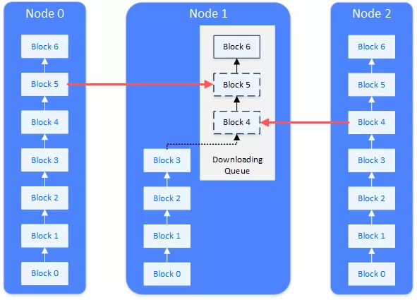

# 区块链的同步及其性能优化方法

作者：石翔｜FISCO BCOS 核心开发者

同步，是区块链中非常重要的流程，从功能上分为“交易同步”和“状态同步”。交易同步在交易提交时执行，优先保证交易能发往所有的节点，被打包处理。状态同步发生在某个节点发现自己区块高度落后于全网时，通过状态同步快速追回到全网最高的高度，这样作为共识节点可以参与到最新的共识过程中，而非共识节点能获取到最新的区块数据，以进行存储和验证。

## 交易同步

交易同步，是让区块链上的交易尽可能到达所有节点，为共识中将交易打包成区块提供基础。

一笔交易（tx1），从客户端上发往某个节点，节点在接收到交易后，会将交易放入自身的交易池（Tx Pool）中供共识去打包。与此同时，节点会将交易广播给其它的节点，其它节点收到交易后，也会将交易放到自身的交易池中。

交易在发送的过程中，会有丢失的情况，为了能让交易尽可能到达所有节点，收到广播交易的节点，会根据自身网络拓扑和网络流量策略，选择一到多个相邻节点，进行接力广播。

### 交易广播策略

如果每个节点都没有限制的转发/广播收到的交易，带宽将被占满，出现交易广播雪崩的问题。为了避免交易广播的雪崩，FISCO BCOS设计了较为精巧的交易广播策略，在尽可能保证交易可达性的前提下，尽量减少重复的交易广播。

- 对于SDK来的交易，广播给所有的节点
- 对于其它节点广播来的交易，随机选择25%的节点再次广播
- 一条交易在一个节点上，只广播一次，当收到了重复的交易，不会进行二次广播

通过上述策略，能够尽量让交易到达所有的节点，交易会尽快被打包、共识、确认，让交易能够更快得到执行的结果。

广播策略已经在复杂网络里尽量追求了网络最终到达率，但也会有极小的概率，出现某交易在一定时间窗内无法到达某节点的情况。当交易未到达某个节点，只会使得交易被确认的时间变长，不会影响交易的正确性，也不会漏处理交易，因为有广播机制，网络里还有更多的节点有机会继续处理这个交易。

## 区块同步

区块同步，能让区块链节点的数据状态保持在最新。

区块链状态的新旧，最重要的标识之一就是区块高度，而区块里包含了链上的历史交易，若一个节点的块高和全网最高块高对齐，则此节点有机会回溯历史交易，以获得区块链的最新状态，只有拥有最新状态的节点，才能参与到共识中去，进行下一个新区块的共识。

当一个全新的节点加入到区块链上，或一个已经断网的节点恢复了网络，此节点的区块高度落后于其它节点，其状态不是最新的。此时就需要进行区块同步。如上图，需要区块同步的节点（Node 1），会主动向其它节点请求下载区块。整个下载过程会将网络请求负载分散到多个节点上。

### 区块同步与下载队列

区块链节点在运行时，会定时向其它节点广播自身的最高块高。节点收到其它节点广播过来的块高后，会和自身的块高进行比较，若自身的块高落后于此块高，就会启动区块下载流程。区块的下载通过“请求/响应”的方式完成，进入下载流程的节点，会随机挑选满足要求的节点，发送需要下载的区块高度区间。收到下载请求的节点，会根据请求的内容，回应相应的区块。

收到回应区块的节点，在本地维护一个下载队列，用来对下载下来的区块进行缓冲和排序。下载队列是一个以块高为顺序的优先队列。下载下来的新区块，会不断插入到下载队列中，按高度排序。排序好的区块，会依次被节点执行和验证。验证通过后，更新本地的数据状态，让块高增加，直至更新到最新块，块高达到最高。

## 性能优化

对同步的性能优化，能有效提升系统效率。FISCO BCOS在这方面做了很多，下面选取了一些关键的优化点。

### 编码缓存

在交易广播中，需要将交易编码成二进制数据发送给其它节点，其它节点在收到交易二进制数据后，需要解码成程序可识别的数据结构。当交易量很大时，编解码成为交易广播的性能瓶颈。FISCO BCOS将交易的二进制编码进行缓存，当要发送交易时，直接从缓存中取出二进制发送，减少编解码的频率，增加交易广播的速率。

### 负载均衡

区块落后的节点会通过请求的方式从其它节点下载区块。其它节点在收到请求后，会将相应区间的区块发送给落后的节点。在区块落后很多的情况下，FISCO BCOS节点会将下载区间均匀切分，向不同的节点发起请求，把下载负载分散到不同的节点上，避免单一被请求节点因承载大量的数据访问请求而影响其运行性能。

### **回调剥离**

在FISCO BCOS节点中，有多个回调线程处理网络上收到的包。当网络流量很大时，处理网络包的线程处理不过来，会将网络包放到缓冲队列中。网络上的包主要为同步包和共识包，共识包优先级更高，直接影响出块速度。为了不影响共识包的处理，FISCO BCOS将同步包的处理逻辑从网络回调线程中剥离出来，交给另外的独立线程，和共识包的处理解耦和并行了。

### **验签去重**

同步模块在收到交易时，需要对交易进行验签。共识模块收到区块后，从区块中取出交易，也需要对交易进行验签。虽然是同一笔交易，却在同步和共识中都进行了验签。然而验签非常耗时，大大影响了交易执行的TPS。FISCO BCOS在交易执行时做了去重逻辑，无论是同步还是共识，在验签前先查询验签记录，若此交易已验签，则直接从记录中获取验签结果，保证同一笔交易只验签一次。同时，FISCO BCOS让同步尽可能地在共识前验签，让共识尽可能直接获取验签结果，减少验签在共识中的耗时。共识得到了加速，链的TPS性能表现相应得到提升。

## 总结

共识与同步是区块链中必不可少的环节。共识打头阵，同步打辅助。同步流程使得整个区块链网络所有节点都达到数据一致性，保证数据全网可验证。同时，在不影响共识的前提下，为共识提前准备好所需的数据，让共识跑得更快更稳定。

#### 相关阅读

- [卓别林演绎共识与同步流程优化](./articles/3_features/31_performance/consensus_and_sync_process_optimization.md)

- [同步模块文档](https://fisco-bcos-documentation.readthedocs.io/zh_CN/latest/docs/design/sync/sync.html)

#### 「群聊互动」

 **Q**  **大雪无痕**：负载均衡同步时如果同步到一个支链上的块，怎么办？另外，出现分叉时，支链保留多久后被丢弃？

 **A**  **石翔**：FISCO BCOS 用的共识算法是pbft，不会分叉哈。不会分叉的共识算法带来很多好处，没有了回滚，同步可以负载均衡了，mpt树可以去了，mpt改成了表结构的存储，表结构间没有数据冲突，就可以并行执行交易了，所以联盟链可以很快。