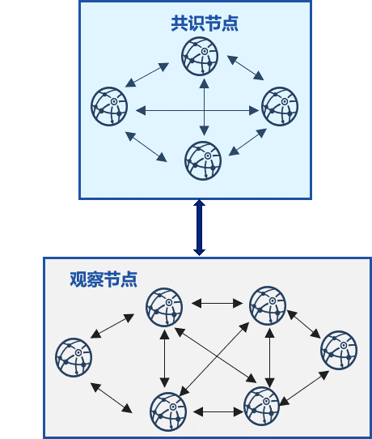
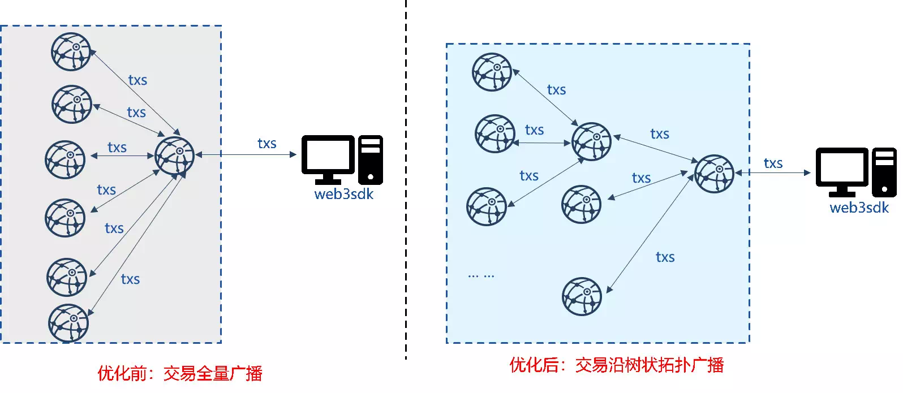
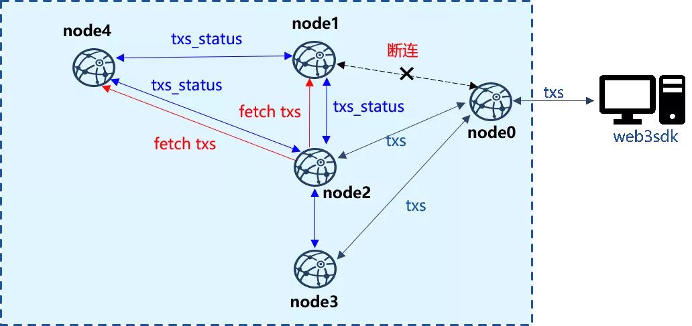
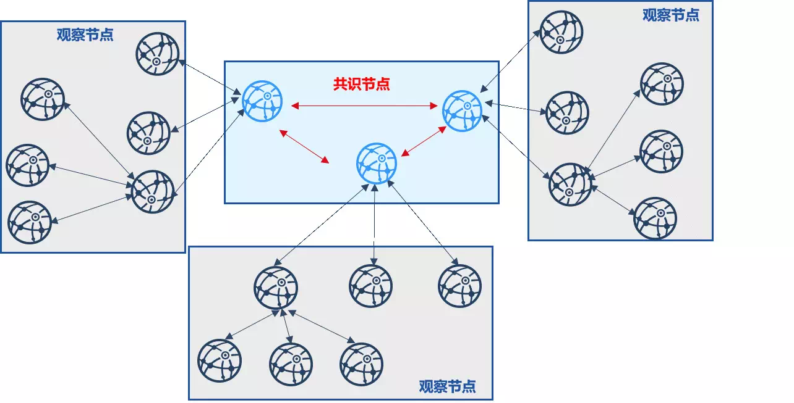

# FISCO BCOS同步模块的优化策略

作者：陈宇杰｜FISCO BCOS 核心开发者

**作者语**

在FISCO BCOS区块链系统中，同步模块身担重任。既是交易传输小能手，将客户端发送的交易输送给所有节点交易池，源源不断地为共识模块提供打包区块的“原材料”；又是“困难户拯救者”，将最新区块同步到块高落后的“困难户”节点，使其能正常参与共识。

当然，由于同步模块的职责大多与网络有关，因此它也是系统“带宽消耗大户”，会导致区块链部分节点带宽负载高。为此，FISCO BCOS开发者们也设计了一系列策略来优化这个“带宽消耗大户”，使其能更优雅地服务于系统。

本文将详细介绍FISCO BCOS同步模块的优化之路。

------

## 初识同步模块

交易同步和区块同步是FISCO BCOS区块链系统同步模块的主要职责，这两个职责都和网络相关。

如上图所示，交易同步负责将客户端发出的交易发送给所有其他节点，为共识模块提供用于打包区块的交易。为保证交易能到达所有节点，交易同步主要包括交易广播和交易转发两个部分：

- **交易广播**：客户端首先将交易发送给客户端直连节点，该节点将收到的交易广播给所有其他节点；
- **交易转发**：为保证网络断连情况下交易能到达所有节点，收到广播交易的节点，随机选取25%的节点转发收到的交易。

区块同步则负责拯救块高落后的"困难户"，将最新块高同步到块高落后的节点。节点区块高度低于其他节点时，会主动向区块高度更高的节点拉取新区块。

## 同步模块的不合理网络使用姿势

前面章节提到同步模块是“带宽消耗大户”，下面就来细说这个“带宽消耗大户”的不合理网络使用姿势。

### 交易同步时，客户端直连节点网络负载高

考虑到gossip协议消息传递速度慢，联盟链场景一般采用节点网络全互联的方式来提升网络效率。为保障客户端发出的交易能快速到达所有节点，客户端直连节点收到交易后，会将交易广播给所有节点。由于区块链节点外网带宽有限，随着节点规模增加，客户端直连节点必然因网络负载高而成为系统瓶颈。

### 交易转发时，网络利用效率低

为保障在部分节点网络断连的情况下，交易仍然能到达所有节点，同步模块引入了交易转发机制。节点收到交易后，会随机选取若干节点广播收到的交易。

网络全连的情况下，这样会导致部分节点频繁收到重复的数据包，且节点数目越多，因交易转发带来的冗余消息包就越多，无疑造成巨大的网络带宽浪费。

### 区块同步时，部分节点网络负载高，导致节点规模不可扩展

考虑到目前使用的BFT或CFT类共识算法的区块链复杂度较高、不具有无限可扩展性，大部分业务架构仅有部分节点作为共识节点，其他节点均作为观察节点(不参与共识，但拥有区块链全量数据)，如下图所示。

在这种架构中，大部分观察节点随机从拥有最新区块的共识节点下载区块。在包含n个共识节点、m个观察节点的区块链系统中，设每个区块大小为block_size，理想情况下(即负载均衡)，每共识一个区块，每个共识节点需要向m/n个观察节点发送区块，共识节点出带宽大约是(m/n)*block_size；设网络带宽是bandwidth，则每个共识节点最多可向(bandwidth/block_size)个节点同步区块，即区块链最大节点规模是(n*bandwidth/block_size)。在公网带宽bandwidth较小、区块较大的情况下，能容纳的节点数有限，因此随机的区块同步策略不具有可扩展性。

## 同步模块的优化策略

为提升系统带宽使用效率和系统的可扩展性，FISCO BCOS开发者们提出了一系列优化策略来“纠正”同步模块不合理的网络使用姿势，使其能更优雅、更高效地服务于FISCO BCOS区块链系统。

### 策略一：交易树状广播

为降低客户端直连节点交易广播带来的网络压力，FISCO BCOS秉着负载均衡的原则，设计了交易树状广播策略，将客户端直连节点的压力分摊给其下属子节点，下图展示了优化前后七节点区块链系统的交易广播拓扑：

- **优化前：**节点收到客户端交易后，全量广播给其他节点；
- **优化后：**节点收到客户端交易后，将其发送给子节点，子节点收到交易后，继续将交易转发给自身的子节点。

采用交易树状广播后，上图所示的客户端直连节点将部分网络负载分摊给子节点，带宽负载降低为原先的一半，达到了负载均衡的目标。并且，由于所有节点广播交易的出带宽仅与树状拓扑的宽度有关，交易树状广播策略具有可扩展性。此外，相较于基于gossip的交易广播机制，树状广播策略提升了交易广播速率的同时，降低了网络中冗余的消息包数量。

###  策略二：基于状态包的交易转发优化

为消除交易转发带来的带宽消耗，提升网络效率，FISCO BCOS提出了基于状态包的交易转发策略，优化后的交易转发模块不直接转发交易，仅转发交易状态。节点可根据收到的交易状态以及交易池内已有的交易获取缺失的交易，并直接向相应节点拉取缺失交易。

上图中，客户端直连node0，但node0与node1、node4断连，此时node0仅能将交易广播给node2和node3。node2和node3收到交易后，将最新交易的列表打包成状态包发送给其他节点。node1和node4收到状态包后，与本地交易池内的交易列表做对比，获取缺失的交易列表，并批量向拥有这些交易的node2或node3请求交易。在全连的网络环境中，所有节点交易状态基本一致，节点间交易请求较少，相较于直接转发交易的策略，大大降低了转发冗余交易引起的带宽浪费。

### 策略三：区块同步可扩展性优化

为降低多个观察节点向单个共识节点同步区块时，共识节点的网络出带宽对网络规模的影响，提升区块链系统区块同步的可扩展性，FISCO BCOS设计并实现了区块状态树状广播策略。

下图是由3个共识节点、18个观察节点构成的区块链系统沿三叉树进行区块同步的示意图：

该策略将观察节点分摊给每个共识节点，并以共识节点为顶点构造一颗三叉树。共识节点出块后，优先向其子观察节点发送最新区块状态，子观察节点同步最新区块后，优先向自己的子节点发送最新区块状态，以此类推。采用了区块状态树状广播策略后，每个节点优先将最新区块状态发送给子节点，子节点优先向父节点同步最新块，设区块大小为block_size，树的宽度为w，则用于区块同步的网络带宽均为(block_size * w)，与区块链系统的节点总数无关，具有可扩展性。

此外，考虑到树状拓扑中，节点断连可能导致区块无法到达部分节点，区块状态树状广播优化策略还采用了gossip协议定期同步区块状态，使得树状拓扑中的断连节点也能从其邻居节点处同步最新区块，保障树状区块状态广播的健壮性。

## 小结

同步模块是交易传输小能手，也是“困难户拯救者”，更是"带宽消耗大户"，这个"带宽消耗大户"无论是在执行同步交易的任务，还是在履行同步区块的职责，都存在浪费带宽、过度使用部分节点带宽的嫌疑。

FISCO BCOS开发者采用一系列优化策略规范了同步模块的带宽使用姿势，尽量减少同步模块冗余消息包的同时，将高负载节点的带宽压力分摊给下属子节点，提升了区块链系统的可扩展性，使得优化后的同步模块能更优雅、更高效、更健壮地服务于区块链系统。