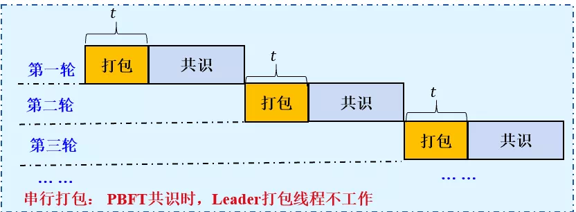
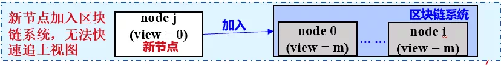

# FISCO BCOS共识优化之路

作者：陈宇杰｜FISCO BCOS 核心开发者

**作者语**

原来的PBFT共识算法在区块打包、交易验签、区块执行、空块处理等方面有持续优化空间，为了让PBFT算法更快更稳，FISCO BCOS做了一系列优化，包括：

- 打包和共识并发进行；
- 不重复验签交易；
- 引入DAG并行交易执行框架，可并行执行区块内交易；
- 空块快速触发视图切换，并切换Leader，不落盘空块，消除空块落盘存储开销的同时，有效防止了节点作恶；
- 解决了节点宕机后，无法快速追上其他节点视图的问题，保证了系统的可用性。

本文分别从性能、存储和可用性三个方面，向大家细说FISCO BCOS的共识优化方案。

## 性能优化

考虑到**Leader轮流串行打包交易**、**交易验签速度慢**以及**区块执行速度慢**，都是导致性能问题的主要因素，FISCO BCOS做了如下优化：

### 打包和共识并发执行

PBFT共识算法在每一轮共识，都包括**打包阶段**和**共识阶段**，Leader打包新区块时，所有共识节点都处于等待Prepae包的状态中，无法进入共识阶段；共识节点处于共识阶段时，Leader的打包线程不工作，但打包区块和共识是两个独立互斥的过程，可以并发执行。

设打包阶段的时间开销为t, 共识阶段时间开销为u，n轮共识的时间开销为n∗(t+u)；但若下一轮共识的Leader参与共识阶段的同时，也提前打包区块，并在下一轮共识时，广播已经打包好的区块，则可将共识时间开销缩短为n∗u+t，时间开销降低了(n-1)*t，可以有效提升PBFT共识算法性能。

### 避免交易重复验签

共识节点收到Leader发送的Prepare包后，会从中取出区块，并验证区块内每笔交易签名的有效性，但交易验签是很耗时的操作，会增加PBFT Prepare阶段的时间开销，降低性能。

考虑到交易插入到交易池的时候，会进行一次验签，如下图所示，FISCO BCOS系统做了防止交易重复验签的优化，下面结合整个交易流的处理流程，详细说明FISCO BCOS防止交易重复验签的处理流程：

1. RPC接收客户端发送的交易后，进行交易验签；
2. 交易验证通过后，被插入到交易池，同步模块广播交易；
3. 其他节点的同步模块收到其他节点的交易后，并进行验签交易，并将有效交易插入到交易池；
4. 共识模块收到Prepare包后，解出Prepare包内区块，判断区块内交易是否在交易池内，仅验证不包含在交易池内的交易签名。

经过上述优化后，将Prepare请求内包含10000笔交易的区块解码和验签时间，由2s降低为200ms，大大减少了Prepare阶段的时间开销。

### 区块并行执行

区块执行是PBFT共识算法的主要时间开销之一，没有做任何并行优化的情况下，PBFT共识算法几乎无法就一个包含上万笔交易的区块达成共识。

为了提升区块链系统TPS，FISCO BCOS系统开发了基于DAG的交易并行执行引擎，并引入了可并行的合约开发框架，支持并行执行交易，达到了上万的TPS。具体可参考这里：[《区块链性能腾飞：基于DAG的并行交易执行引擎》。](https://mp.weixin.qq.com/s?__biz=MzU5NTg0MjA4MA==&mid=2247484211&idx=1&sn=73591fef0a1a7cc683fd6577b362efca&chksm=fe6a867cc91d0f6aad155a2b7ecd2e077ff35af41e088533626ede34af24a57f3613e197af2d&mpshare=1&scene=21&srcid=0806kJGQCVXQewNJU9ZsRQ2w&sharer_sharetime=1565076787459&sharer_shareid=bc5c95f953e1901389b9c82c159fbb6b&rd2werd=1#wechat_redirect)

## 存储优化

为保障系统正常运行、确认Leader可用、防止Leader故意作恶，基于PBFT共识算法的区块链系统在没有交易时，会产生空块，并就空块达成共识。
虽然空块共识是必要的，但考虑到当前区块链系统的QPS不大，落盘空块会耗费存储空间、降低硬盘利用效率(可存储的交易数)。
FISCO BCOS基于PBFT共识算法，实现了高效的空块处理方法，保证空块参与PBFT共识流程的同时，不落盘空块，提升了磁盘利用效率。详细方案可参考这里：[《FISCO BCOS的PBFT空块处理》](https://mp.weixin.qq.com/s?__biz=MzU5NTg0MjA4MA==&mid=2247485288&idx=2&sn=35e32f22cda893e7f02fe58369000164&chksm=fe6a8227c91d0b31133d7302b25decb6f6bba08a8d70848fcaf6573e6983a8e69885d2ed7fa3&mpshare=1&scene=21&srcid=&sharer_sharetime=1565077005952&sharer_shareid=bc5c95f953e1901389b9c82c159fbb6b&rd2werd=1#wechat_redirect)。

## 可用性优化

刚启动的节点或者新节点加入区块链网络时，若不能立即和其他节点视图达成一致，会影响系统容错性。

- case1：4节点区块链系统，node0宕机，剩余三个节点容错节点数为0；node0重启若无法快速追上其他节点视图，系统可容错节点数仍然为0，且node0处于共识异常状态中。
- case2：2节点区块链系统正常运行，新加入节点node2，若node2无法快速追上其他节点视图，系统会由于1个节点异常(新加入节点)而处于共识异常状态中。

针对上面问题，FISCO BCOS PBFT共识算法引入了快速视图追赶机制，刚启动节点向所有其他共识节点发送视图切换包，其他节点收到包后，向其回复最新视图，从而使得刚启动节点可快速和其他共识节点达成一致视图，系统在加入了新节点后也不会共识异常。

如上图所示，核心流程如下：

- 刚启动节点向所有其他节点广播视图切换请求包ViewChange，请求包内的视图ViewChange.toView为1；
- 其他节点收到toView远小于当前节点视图的ViewChange请求后，回复包含当前视图(view)的ViewChange包；
- 刚启动节点收集满2*f+1个ViewChange包后，切换到和其他共识节点一致的视图。

## 总结

以上详述了FISCO BCOS在共识算法上的优化策略，FISCO BCOS使用系统的方法使得PBFT算法性能和存储效率更高，可用性更强。
当然，除了前面提到的问题外，PBFT算法在网络复杂度上也有持续优化空间，FISCO BCOS开发团队也在积极调研最新的共识算法及共识算法优化策略，并寻求大规模节点共识的解决方案，敬请期待。

