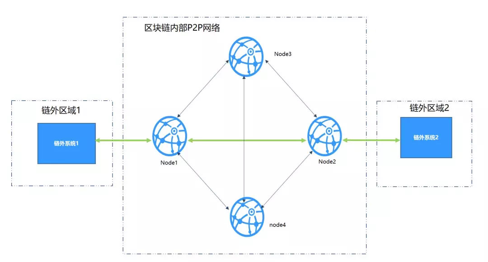
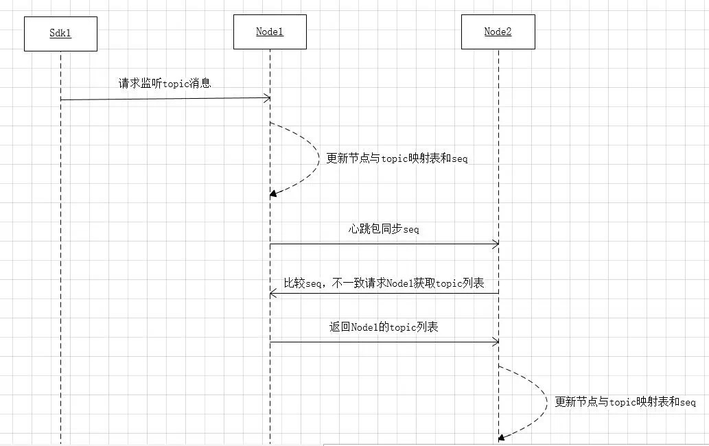
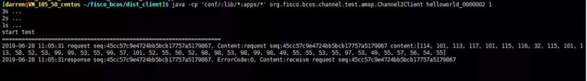
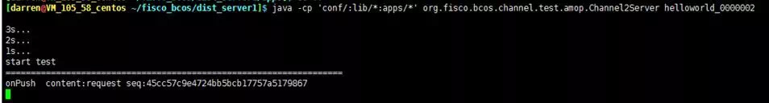

# FISCO BCOS的AMOP使用介绍

作者：尹强文｜FISCO BCOS 核心开发者

**AMOP简介**：链上信使协议AMOP（Advanced Messages Onchain Protocol）旨在为联盟链各个机构提供一个安全高效的消息传输信道，支持跨机构之间，点对点地实时消息通信，为链外系统之间的交互提供标准化接口，AMOP基于SSL通信加密，确保消息无法被窃听，消息收发均有异常重传、超时检测和路径规划机制，确保消息传输的可靠性。

## 逻辑架构

AMOP使用了FISCO BCOS的P2P底层通信，逻辑架构如下：



各区域概述如下：

- **链外区域**：机构内部的业务服务区，此区域内的业务子系统使用区块链SDK，连接到区块链节点。

- **区块链内部P2P网络区域**：此区域为逻辑区域，部署各机构的区块链节点，区块链节点也可部署在机构内部。

## **核心实现**

AMOP的消息收发基于**Sub-Pub订阅机制**，服务端首先设置一个Topic，客户端往该Topic发送消息，服务端即可收到。

AMOP支持同一个区块链网络中有多个Topic收发消息，支持任意数量的服务端和客户端，当有多个服务端关注同一个Topic时，该Topic的消息将随机下发到其中一个可用的服务端。

**AMOP包括两个流程**：

1. 服务端设置Topic，用以监听该Topic的消息；

2. 客户端往该Topic发送消息。

下面以一个例子来说明内部实现，如下图所示，有2个SDK分别为SDK1、SDK2，2个节点分别是Node1、Node2。SDK1连接Node1设置Topic T1，SDK2连接Node2发送Topic为T1的消息。

### 1. 服务端设置Topic，用以监听该Topic的消息的时序



**主要流程如下**：

1. SDK1发送监听某个Topic消息的请求，到其直连的节点Node1，Node1里维护了节点与Topic列表的映射关系，该映射关系用于消息路由，是一个map结构，key是NodeId，value是一个set，set存储的是该NodeId可以接收消息的Topic列表。
2. Node1新增一个Topic之后，节点会更新节点与Topic映射表。
3. Node1更新seq：seq主要用于保证各节点映射表一致，新增一个Topic之后，本节点的seq会加1，节点之间的心跳包会将这个值带上发送到其他节点，其他节点（Node2）接收到心跳包之后对比参数里的seq与本节点的seq，如果不一致会向源节点(Node1)请求节点与Topic列表的映射关系，将最新的映射关系更新到本节点并更新seq。这样就保证了全局映射关系的一致。

### 2. 客户端往该Topic发送消息时序


- SDK2向Node2上发送消息。
- Node2从节点与Topic列表的映射关系中查到该Topic可以发往的节点列表，从中随机选择一个节点Node1发送。
- Node1节点收到消息之后推送给SDK1。

## 配置文件配置

AMOP无需任何额外配置，以下为Web3Sdk的参考配置，详细请[参考文档](https://fisco-bcos-documentation.readthedocs.io/zh_CN/latest/docs/sdk/sdk.html)。


不同SDK的配置文件差异在于连接的节点地址不同，以文章开头处的逻辑架构图为例，假定Node1的监听地址是127.0.0.1:20200，Node2的监听地址是127.0.0.1:20201，那么SDK1配置为127.0.0.1:20200，SDK2配置127.0.0.1:20201。

## 测试

按上述说明配置好后，用户指定一个Topic，执行以下两个命令可以进行测试。 

### 启动amop服务端

```
java -cp 'conf/:apps/*:lib/*' org.fisco.bcos.channel.test.amop.Channel2Server [topic]
```

### 启动amop客户端

```
java -cp 'conf/:apps/*:lib/*' org.fisco.bcos.channel.test.amop.Channel2Client [topic] [消息条数]
```

客户端和服务器执行后得如下效果：





## 常见错误码及问题定位

- **99**：发送消息失败，AMOP经由所有链路的尝试后，消息未能发到服务端，建议使用发送时生成的‘seq’，检查链路上各个节点的处理情况。

- **100**：区块链节点之间经由所有链路的尝试后，消息未能发送到可以接收该消息的节点，和错误码‘99’一样，建议使用发送时生成的‘seq’，检查链路上各个节点的处理情况。

- **101**：区块链节点往Sdk推送消息，经由所有链路的尝试后，未能到达Sdk端，和错误码‘99’一样，建议使用发送时生成的‘seq’，检查链路上各个节点以及Sdk的处理情况。

- **102**：消息超时，建议检查服务端是否正确处理了消息，带宽是否足够。

## 未来计划

未来将继续丰富AMOP功能，支持二进制传输、消息多播协议以及Topic认证机制等，也欢迎大家使用AMOP，并提出优化建议。