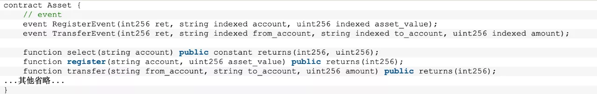
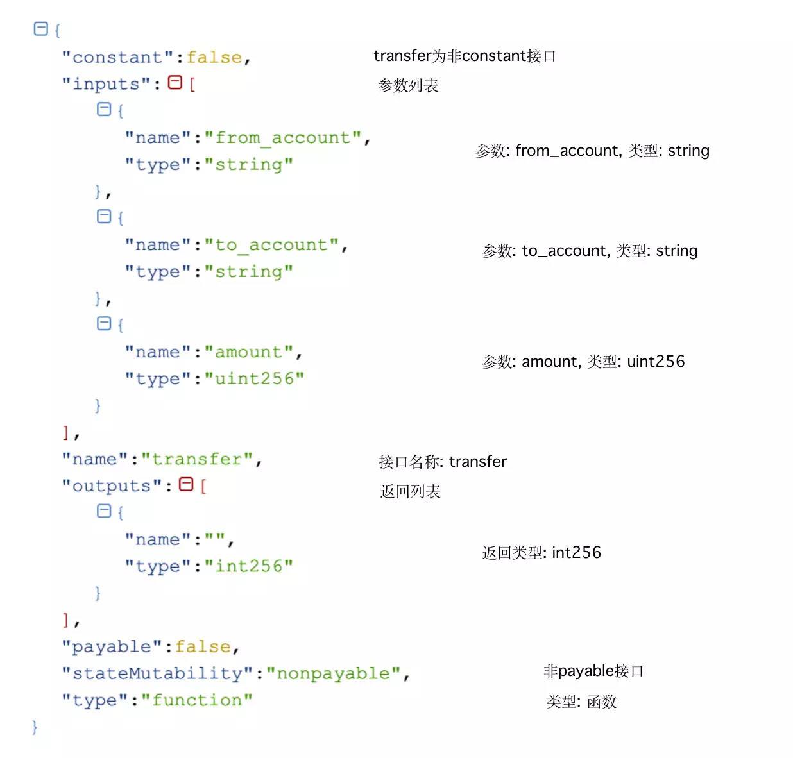

# 浅谈合约ABI

作者：王章｜FISCO BCOS 核心开发者

## 引子

当调用合约接口时，可以向区块链发送一笔交易，并获取交易的回执，交易回执保存交易的输入参数、输出、Event log、执行状态等信息。交易回执示例如下图所示：


[交易回执详情](https://fisco-bcos-documentation.readthedocs.io/zh_CN/latest/docs/api.html#gettransactionreceipt)如下。 在交易回执中，input、output字段可以分别表示交易的输入参数及EVM执行交易后的返回值，这些字段是接口的入参或者返回值根据合约的ABI编码生成的。

## 什么是合约ABI

“合约ABI是以太坊生态系统中与合约交互的标准方式，不论是外部客户端与合约的交互还是合约与合约之间的交互。”上述是以太坊官方文档给出的定义，更通俗的理解，包含两方面内容：

1. ABI是合约接口的说明。
2. ABI定义与合约进行交互数据编码规则。

下面我们将从这两方面对ABI进行说明。

### ABI接口说明

ABI是合约接口的说明，内容包括合约的接口列表、接口名称、参数名称、参数类型、返回类型等。这些信息以JSON格式保存，可以在solidity文件编译时由合约编译器生成，[详情请参考](https://fisco-bcos-documentation.readthedocs.io/zh_CN/latest/docs/console/console.html#id12)。

这里以Asset.sol合约为例:



#### Asset Contract ABI：

```
[
  {
    "constant": true,
    "inputs": [
      {
        "name": "account",
        "type": "string"
      }
    ],
    "name": "select",
    "outputs": [
      {
        "name": "",
        "type": "int256"
      },
      {
        "name": "",
        "type": "uint256"
      }
    ],
    "payable": false,
    "stateMutability": "view",
    "type": "function"
  },
  {
    "constant": false,
    "inputs": [
      {
        "name": "from_account",
        "type": "string"
      },
      {
        "name": "to_account",
        "type": "string"
      },
      {
        "name": "amount",
        "type": "uint256"
      }
    ],
    "name": "transfer",
    "outputs": [
      {
        "name": "",
        "type": "int256"
      }
    ],
    "payable": false,
    "stateMutability": "nonpayable",
    "type": "function"
  },
  {
    "constant": false,
    "inputs": [
      {
        "name": "account",
        "type": "string"
      },
      {
        "name": "asset_value",
        "type": "uint256"
      }
    ],
    "name": "register",
    "outputs": [
      {
        "name": "",
        "type": "int256"
      }
    ],
    "payable": false,
    "stateMutability": "nonpayable",
    "type": "function"
  },
  {
    "inputs": [

    ],
    "payable": false,
    "stateMutability": "nonpayable",
    "type": "constructor"
  },
  {
    "anonymous": false,
    "inputs": [
      {
        "indexed": false,
        "name": "ret",
        "type": "int256"
      },
      {
        "indexed": true,
        "name": "account",
        "type": "string"
      },
      {
        "indexed": true,
        "name": "asset_value",
        "type": "uint256"
      }
    ],
    "name": "RegisterEvent",
    "type": "event"
  },
  {
    "anonymous": false,
    "inputs": [
      {
        "indexed": false,
        "name": "ret",
        "type": "int256"
      },
      {
        "indexed": true,
        "name": "from_account",
        "type": "string"
      },
      {
        "indexed": true,
        "name": "to_account",
        "type": "string"
      },
      {
        "indexed": true,
        "name": "amount",
        "type": "uint256"
      }
    ],
    "name": "TransferEvent",
    "type": "event"
  }
]
```

可以看到ABI是一个JSON的对象数组，包含接口与Event的信息。Asset合约的transfer接口以及其ABI如下：

#### 接口：

`function transfer(string from_account, string to_account, uint256 amount) public returns(int256)`

#### 接口ABI:



### ABI编码

假定用户需要调用Asset合约的transfer接口，已知条件如下。

#### Asset合约地址：

`0x1386bf8e0138e821994140503ee214a9019eb0ec`

#### transfer接口定义：

`function transfer(string from_account, string to_account, uint256 amount) public returns(int256);` 

#### 用户参数：

`String fromAccount = "Alice";`

`String toAccount = "Bob"`

`BigInteger amount = 10000;`

用户如何将这些参数传递给最终执行交易的EVM，使EVM能够知道用户调用的接口为transfer接口，并且EVM能够正确读取用户输入的参数？EVM的返回值用户又该如何使用？

这是ABI的另一个作用，定义了数据的编码格式。

这里以引子中交易回执的input字段为例来分析交易的输入编码：

`"input": "0x9b80b050000000000000000000000000000000000000000000000000000000000000006000000000000000000000000000000000000000000000000000000000000000a000000000000000000000000000000000000000000000000000000000000027100000000000000000000000000000000000000000000000000000000000000005416c6963650000000000000000000000000000000000000000000000000000000000000000000000000000000000000000000000000000000000000000000003426f620000000000000000000000000000000000000000000000000000000000"`

input数据可以分为函数选择器和参数编码两部分。

### 1. 函数选择器（Function Selector）

用来指定调用的函数，函数签名Keccak哈希的前四个字节，EVM根据函数选择器来判断用户调用的是合约的哪个接口。

在transfer接口调用中：

`bytes4(sha3(“transfer(string,string,uint256)”)) = 0x9b80b050` 

### 2. 参数编码

参数的编码(解码同样适用)需要结合ABI描述信息的内容，根据ABI描述信息中接口的类型列表对参数进行编码。

#### transfer类型列表：


#### 参数列表：

`String fromAccount = "Alice";`

`String toAccount = "Bob"`

`BigInteger amount = 10000;`

#### 编码流程： 

`enc(string("Alice"),string("Bob"),uint256(10000)) = "000000000000000000000000000000000000000000000000000000000000006000000000000000000000000000000000000000000000000000000000000000a000000000000000000000000000000000000000000000000000000000000027100000000000000000000000000000000000000000000000000000000000000005416c6963650000000000000000000000000000000000000000000000000000000000000000000000000000000000000000000000000000000000000000000003426f620000000000000000000000000000000000000000000000000000000000"`

将Function selector与参数编码两部分合并，最终得到input。 

## 合约ABI的优势与局限

### 为什么需要合约ABI

从ABI的定义就可以看出，ABI是与合约交互的标准形式，相当于定义访问合约接口协议规范，统一了合约与合约、不同平台的客户端与合约之间的交互形式。

### 合约ABI的局限

下面来谈谈合约ABI编码的一些局限：

- ABI编码本身的规则很复杂，这增加了用户实现的难度，不过除了个别ABI库的作者外，普通用户并不需要自己实现。
- ABI的编码会对所有的数据编码强制32字节对齐，最终这些编码数据都需要随交易进行持久化，浪费了很多的存储空间。
- 升级困难：ABI添加新的类型支持甚至是新的规则时，所有平台的实现都需要升级，这些新的特性在有的平台上不一定容易支持。比如：ABIEncoderV2到目前为止，各个库的支持仍然不是很完善。

# 总结

本文介绍了合约ABI的概念，ABI的JSON描述信息以及ABI编解码，并且最后分析了ABI编解码的优势与局限，让用户对合约ABI有一个初步的了解认识。大家如果有更深入的需求，可以查看[ABI的官方文档](https://solidity.readthedocs.io/en/develop/abi-spec.html)。

------

#### 参考资料

- [Asset.sol源码](https://github.com/FISCO-BCOS/LargeFiles/raw/master/tools/asset-app.tar.gz )
- [合约ABI JSON格式](https://solidity.readthedocs.io/en/latest/abi-spec.html#json)
- [Function Selector](https://solidity.readthedocs.io/en/develop/abi-spec.html#function-selector)
- [ABI编码](https://solidity.readthedocs.io/en/develop/abi-spec.html#argument-encoding)

