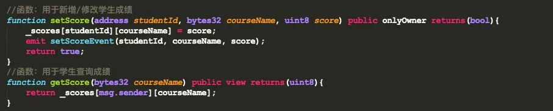
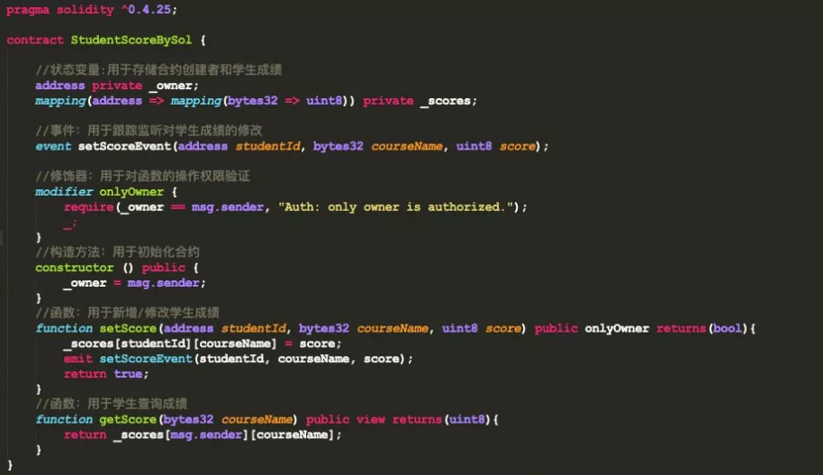
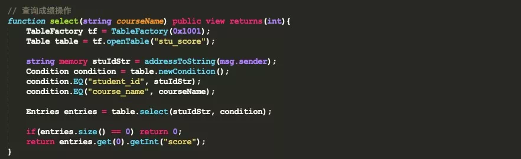
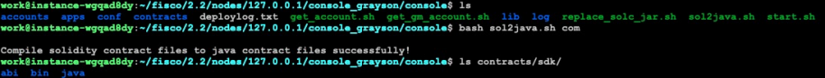

# FISCO BCOS智能合约开发快速入门

作者：张龙｜FISCO BCOS 核心开发者

目前，FISCO BCOS平台支持Solidity和Precompiled两种类型的智能合约，同时，提供交互式控制台工具（Console）,方便开发者与链进行交互，部署、调用智能合约。
为了让大家快速上手智能合约，FISCO BCOS推出了智能合约系列教程，本文将带大家快速入门，运用FISCO BCOS开发部署一个简单的智能合约。

## 智能合约简介

众所周知，智能合约的出现，使区块链不仅能处理简单的转账功能，还能实现复杂的业务逻辑，极大地推动了区块链技术发展，加速应用落地。

目前，在众多区块链平台中，大多数集成了以太坊虚拟机，并使用Solidity作为智能合约开发语言。作为一门面向合约的高级编程语言，Solidity借鉴了C++、Python和JavaScript等语言的设计，使用静态类型，不仅支持基础/复杂数据类型操作、逻辑操作，同时提供高级语言的相关特性，比如继承、重载、库和用户自定义类型等。

作为最大最活跃的国产开源联盟链社区，FISCO BCOS无缝支持Solidity合约，并提供从开发、编译、部署到调用的全链路工具和完整解决方案，使智能合约和区块链应用开发变得简单。
除此之外，基于大量探索和实践，FISCO BCOS不仅支持Solidity合约，还支持Precompiled合约，并在用户层提供CRUD合约接口。面向库表开发的CRUD合约不仅更符合用户开发习惯，进一步降低合约开发难度，提升性能，使区块链应用满足高并发场景的诉求。

## 智能合约分类

FISCO BCOS平台支持两种类型的智能合约：Solidity合约和Precompiled合约。

### Solidity合约

Solidity合约运行在EVM上，EVM为以太坊虚拟机，采用哈佛架构，指令、数据和栈完全分离。
在智能合约运行期间，首先创建一个沙盒环境（EVM实例），沙盒环境与外部环境完全隔离，无法访问网络、文件系统其它进程，智能合约在EVM内只允许进行有限的操作。交易执行时，EVM通过获取合约的opcode，将opcode转化为对应的EVM指令，并按照指令进行执行。

从应用落地的数量来看，Solidity合约使用最为广泛，几乎所有区块链平台都支持，但Solidity也有很多缺点。如下：

- 合约在EVM中串行执行，性能较差；
- 跨合约调用会新建EVM，内存开销较大；
- 合约变量和数据存在MPT数中，不便于合约升级；
- 逻辑和数据耦合，不便于存储扩容。

### Precompiled合约

Precompiled合约即预编译合约。预编译合约通过Precompiled引擎执行，采用C++编写合约逻辑，合约编译集成进FISCO BCOS底层节点。
调用合约不进EVM，可并行执行，突破EVM性能瓶颈；提供标准开发框架，只需继承基类，实现call接口即可；适合于逻辑相对确定、追求高并发的场景；数据存在表中，与合约分离，可升级合约逻辑。

当然，预编译合约的使用有一定的门槛。如下：

- 对于数据的存储，需要创建FISCO BCOS特有的表结构；
- 编写合约时需继承Precompiled类，然后实现Call接口函数；
- 完成合约开发后，需在底层为预编译合约注册地址；
- 编写完成合约后，需要重新编译FISCO BCOS源码。

为了屏蔽预编译合约在开发和使用中的门槛，FISCO BCOS基于预编译合约和分布式存储设计了CRUD合约接口。用户在编写Solidity合约时，只需要引入抽象合约接口文件Table.sol，便可使用CRUD功能，用户不需要关心底层的具体实现。

## 智能合约开发

本节将基于全球英文认证考试成绩管理作为场景，基于FISCO BCOS平台对智能合约进行开发。全球认证考试包括GRE、TOEFL、IELTS等。为了简化合约逻辑，所有成绩统一由考试管理中心发布和管理，学生可以根据自己的账号（地址）查询自己的考试成绩。

### Solidity合约开发

在 Solidity 中，合约类似于面向对象编程语言中的类。Solidity合约有自身的代码结构，由几个部分组成，如下所示。

- 状态变量：状态变量是永久存储在合约中的值
- 构造函数：用于部署并初始化合约
- 事件：事件是能方便地调用以太坊虚拟机日志功能的接口
- 修饰器：函数修饰器可以用来改变函数的行为，比如自动检查，类似Spring的AOP
- 函数：函数是合约中代码的可执行单元

#### 创建合约

首先创建一个名为StudentScoreBySol的合约，用于管理学生的成绩。如下代码所示，开头需要引入合约版本。

#### 定义状态变量

状态变量用于存储和管理学生的考试成绩。
在当前场景中定义两个变量，其中_owner为合约的创建者，即考试管理中心；_scores用于存储学生成绩，为一个嵌套mapping类型，第一个mapping的key(address)为学生的账户（私钥对应的地址），value也为一个mapping类型，对应为每一科的成绩，在第二个mapping中key（bytes32）为科目名称，如GRE、TOEFL等，value(uint8)为成绩。如下所示。

#### 定义事件

定义一个事件setScoreEvent，用于跟踪对学生成绩的新增/修改操作，可以在业务层面对事件进行监听。事件的定义是可选的，如果没有定义也没关系，在业务层面可以根据方法的返回值去判断交易是否成功，但无法做到更精细的问题定位。

#### 定义修饰器

智能合约中的修饰器（Modifier）类似面向对象编程中的AOP，满足条件才会执行后续操作。如下所示，修饰器要求必须是合约的Owner才能进行后续操作，其中Owner为考试管理中心。

#### 定义构造方法

构造方法用于实例化合约，在当前构造方法中，指定Owner为合约的部署者。

#### 编写函数

当前合约中，定义两个函数，setScore函数用于新增/修改/删除（score置为0）学生成绩，并使用了onlyOwner修饰器，只有Owner(考试管理中心）才能操作，并通过setScoreEvent事件跟踪每次操作内容。getScore方法用于成绩查询，其中view修饰符表示不会修改状态变量。

Solidity合约完整代码如下所示。基于Solidity语言的合约开发，看似简单，但需要对Solidity编程语言深入学习，才能编写出高可用的合约，具备一定学习成本。
通过FISCO BCOS开源社区推出的智能合约专题，开发者可了解更多运用Solidity编写智能合约的方法与技巧，关注“FISCO BCOS开源社区”公众号可获取专题。
更多细节可参考Solidity官方文档：https://solidity-cn.readthedocs.io/zh/develop/

### CRUD合约开发

CRUD合约是CRUD功能的核心，用户可以直接在合约中引用CRUD接口文件Table.sol，并在Solidity合约中调用CRUD接口。CRUD合约的开发完全遵从数据库的操作习惯，更容易理解和上手。

CRUD合约更多开发细节可参考：https://fisco-bcos-documentation.readthedocs.io/zh_CN/latest/docs/manual/smart_contract.html#crud

#### 创建合约

CRUD创建的合约和Solidity创建的没有太大区别，唯一区别在于需要引入CRUD接口文件Table.sol，如下所示。修饰器和构造方法的作用与Solidity合约相同。

#### 事件定义

在Solidity合约中可以通过setScore完成成绩的新增/修改/删除，但在CRUD合约中，需要借助CRUD接口文件的不同接口，通过不同函数实现，所以需要针对不同的函数定义不同时间，如下所示。

- createEvent：用于跟踪创建表操作；
- insertEvent：用于跟踪插入成绩操作；
- updateEvent：用于跟踪更新成绩操作；
- removeEvent：用于跟踪删除成绩操作。

#### 创建表函数

CRUD合约实现业务功能，首先需要像数据库操作一样，创建一张表，用于存放数据。
FISCO BCOS底层提供了TableFactory合约，该合约的地址固定为0x1001，可以通过TableFactory对象提供的方法对表进行创建(createTable)和打开(openTable)，如下所示。
createTable接口返回值为0时，说明创建成功。需要注意的是，为了让创建的表可被多个合约共享访问，表名必须是群组内全局可见且唯一的，无法在同一条链上的同一个群组中，创建多个名称相同的表。

#### 新增成绩函数

对表进行操作时，首先需要通过TableFactory打开对应的表，获得表对象，然后通过表对象的insert方法进行数据插入。在插入数据前，首先需要构建一个Entry对象实例，代码如下所示。

需要注意的是，Table接口合约的insert、remove、update和select函数返回值类似数据库，均为受影响的记录行数，且接口中key的类型为string。
而在当前场景中，学生的studentId为address类型，所以需要在函数内部将address类型转化为string类型，代码如下。

#### 更新成绩函数

更新成绩操作步骤包括：通过TableFactory对象打开表，然后，像数据库一样构造筛选条件。
在CRUD合约接口中，提供了Condition对象，该对象提供了诸如大于、等于、小于等一系列条件方法。构造完成条件对象后，可以调用table对象的udpdate接口，完成更新操作，代码如下。

#### 删除成绩操作

删除操作和更新操作类似，需要调用table.remove接口完成，不再赘述，代码如下。

#### 查询成绩操作

查询成绩操作很简单，需要调用table.select接口完成，代码如下。

至此基于CRUD的合约开发完成。

从当前场景的代码行数来看，CRUD合约比较复杂，Solidity合约相对简单。但这只是一个幻觉，实际情况可能并非如此。而且CRUD合约的开发更符合开发者习惯，没有多余的学习成本，更容易理解和上手。

## 合约部署及调用

开发完智能合约后，需要对合约进行编译和部署，然后才能调用。FISCO BCOS平台提供了交互式控制台工具（Console）,可以非常方便地与链进行交互。下面将以上述智能合约为例，采用控制台工具进行部署和调用。
控制台安装及使用可参考：https://fisco-bcos-documentation.readthedocs.io/zh_CN/latest/docs/console/console.html

### 准备工作

在对合约进行部署和调用前需要做三件事情。首先复制编写好的合约到控制台目录console/contracts/solidity下。如下图所示。

其次对合约进行编译，可以采用控制台目录下的sol2java.sh脚本对合约进行编译，编译结束后会在console/contracts/sdk目录下生成如下文件夹，如下图所示。

其中abi中存放合约的ABI，bin存放合约的二级制编码文件(BINARY)，JAVA文件夹中为对应的JAVA合约，便于通过SDK和链进行交互。
需要注意的是对CRUD合约编译时。需要将CRUD接口合约Table.sol一并放入console/contracts/solidity目录下，不然会报错。
最后，对合约进行部署时，依赖外部账户，所以首先需要生成账户。在控制台中提供了账户生成工具get_account.sh，运行该脚本会在console/accounts目录下生成账户。

我们利用账户生成工具生成两个账户。一个为考试管理中心的账户，用于部署和新增/修改/删除学生成绩；一个为学生账户，用于查看考试成绩。如下所示。

###  Solidity合约部署和调用

首先采用考试管理中心账户启动控制台，如下图所示，即表示控制台启动成功。

然后通过deploy命令对合约进行部署，合约部署成功之后会返回合约地址，如下图所示。

合约部署完成之后，可以通过控制台的call命令调用合约函数。如下图所示，新增学生的GRE成绩为70（修改和删除均可通过调用setScore方法进行操作），函数返回值为true，则表示交易成功。call命令的具体用法可以通过call -h 查看。

采用学生账户启动控制台，通过getScore函数查看成绩，如下图所示，返回值为70，说明没有问题。也可以使用学生账户调用setScore方法，会报错，打印没有权限，不再赘述。

### CRUD合约部署和调用

CRUD合约的部署和调用和Solidity合约没有区别，这里同样采用控制台进行。

首先采用考试管理中心账户启动控制台，并对StudentScoreByCRUD合约进行部署。如下图所示。

合约部署完成之后，调用create函数创建stu_score表，如下所示，返回结果为0，说明创建成功。

创建好表之后，就可以调用相关接口对学生成绩进行操作了，首先调用insert函数新增学生成绩。如下所示，返回结果为1，说明插入成绩成功。

成绩插入成功之后，关闭当前控制台，用学生账户登录控制台，并调用select函数查询成绩，如下图所示，返回70，说明查询成功。剩余函数测试可自行完成，不再赘述。

## 结束语

本文重点介绍了FISCO BCOS平台的智能合约开发。在FISCO BCOS平台中，既可以采用原生Solidity语言开发智能合约，也可以使用预编译合约模式开发合约。Solidity合约性能差、学习成本高；预编译合约，采用预编译引擎，支持并行计算，性能更高，同时支持存储扩容等。 
但由于预编译合约使用存在一定的门槛，基于此，FISCO BCOS平台开发了CRUD合约接口，用户不需要关心底层的实现逻辑，只需要引入Table.sol合约接口文件，通过调用相关接口即可完成合约的开发。