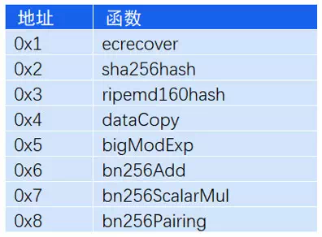
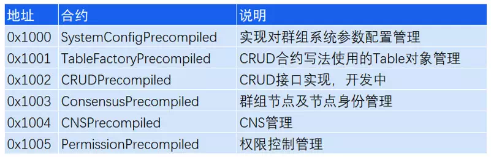

# FISCO BCOS 2.0原理解析：预编译合约架构设计

作者：白兴强｜FISCO BCOS 核心开发者

FISCO BCOS 2.0提出了一套预编译合约框架，允许用户使用C++来写智能合约。由于不进入EVM执行，预编译合约可以获得更高的性能，适用于合约逻辑简单但调用频繁，或者合约逻辑固定而计算量大的场景。

本文介绍预编译合约的起源和实现，主要包括以下几个方面：

- Solidity合约的使用及遇到的难题；
- FISCO BCOS 2.0新增预编译合约，其架构设计和执行流程流程；
- 在部分特定场景中，为什么预编译合约比Solidity更优秀；
- 预编译合约在FISCO BCOS 2.0版本中的使用。

## Solidity合约的使用与不足

在FISCO BCOS平台中使用Solidity合约，一般需经过以下五个步骤。在开发完Solidity合约之后，必须要将编译后的合约部署到底层平台，根据平台返回的地址才能够调用合约的接口。

Solidity合约的优点是完全与以太坊兼容，开发资源丰富且比较通用，但是Solidity合约也存在虚拟机执行性能低、代价高和开发复杂的问题。尤其是对于联盟链治理的场景，一些参数需要链上所有节点保持一致，非常适合使用合约管理，但如果使用Solidity实现，会导部署步骤非！常！复！杂！

FISCO-BCOS 1.3版本使用Solidity实现了一套系统合约，使用一个代理合约管理其他系统合约。其部署过程如下图所示：

部署完系统合约后，需要将系统合约地址配置在代理合约中，然后将代理合约地址配置在节点配置文件并重启，才能调用这一套系统治理的合约，并且之后的节点扩容也需要基于创世节点的配置操作，才能保持一致。

## FISCO BCOS 2.0 新增预编译合约

FISCO BCOS 2.0受以太坊内置合约启发，实现了一套预编译合约框架。未来，我们还会尝试将现有的典型业务场景抽象，开发成预编译合约模板，作为底层提供的基础能力，帮助用户更快的更方便的在业务中使用FISCO BCOS。

### 预编译合约的好处

**可访问分布式存储接口**：基于这套框架，用户可以访问本地DB存储状态，实现自己需要的任何逻辑。

**更好的性能表现**：由于实现是C++代码，会编译在底层中，不需要进入EVM执行，可以有更好的性能。

**无需学习Solidity语言即可上手**：基于FISCO BCOS预编译合约框架，开发者可以使用C++开发自己的预编译合约，快速实现需要的业务逻辑，而不需要学习Solidity语言。

**并行模型大幅提升处理能力**：我们在2.0版本中基于预编译合约和DAG实现了合约的并行执行，用户只需要指定接口冲突域，底层会自动根据冲突域构建交易依赖关系图，根据依赖关系尽可能并行执行交易，从而使得交易处理能力大幅提升。

### 预编译合约与以太坊内置合约的对比

上述说到，FISCO BCOS 预编译合约受以太坊内置合约启发，但实现原理却是大不相同的。

以太坊通过内置合约来避免EVM中复杂计算的代价，以太坊当前使用内置合约实现了8个函数（如下表所示）。可以看到，以太坊内置合约占用了0x1-0x8这8个地址，每个内置合约实际上就是一个本地函数的调用，只能用于状态无关的计算使用。

用户在Solidity中使用内置合约，需要借助call这个操作，依次输入下列参数

call(gasLimit, to, value, inputOffset, inputSize, outputOffset, outputSize)

包括内置合约地址、输入参数偏移、输入参数大小、输出参数偏移和输出参数大小，对用户而言，这不是一件简单的事情。

而FISCO BCOS的预编译合约框架，支持复杂的参数类型，支持通过AMDB读取和存储数据。每个预编译合约地址固定，合约内可以实现多个接口，所实现接口的调用方式与原生Solidity完全相同。

**下图是比较直观的对比**：

**注：**√ 代表支持，× 代表不支持

## FISCO BCOS预编译合约架构

通过这一小节，你可以清楚了解预编译合约模块在FISCO BCOS中的位置，以及预编译合约的执行流程。

如下图所示，预编译合约会被区块执行引擎所调用，区块验证器通过区块执行引擎来执行区块，执行引擎执行区块时，会根据被调用合约的地址，来判断使用EVM还是预编译合约引擎。

当被调用的合约地址是EVM合约时，执行引擎会创建并执行EVM来执行交易；当被调用合约地址是已注册的预编译合约地址时，执行引擎通过调用地址对应的预编译合约接口来执行交易。

**预编译合约执行流程如下图所示**：

执行引擎首先根据预编译合约地址拿到合约对象，然后通过调用合约对象的call接口来获取执行结果。call接口中的操作主要包括：

1. 根据调用参数解析出被调用的接口
2. 根据ABI编码解析传入的参数
3. 执行被调用的合约接口
4. 将执行结果ABI编码并返回

所以，开发者如果要开发预编译合约，只需要实现其预编译合约的call接口和在执行引擎中注册所实现合约的地址即可。

## 预编译合约在FISCO BCOS 2.0中的应用

### 系统合约

FISCO BCOS 2.0 基于预编译合约实现了一套系统合约，使用系统合约来管理需要共识的链配置，包括对群组内节点的加入、删除、节点身份的转换、CNS服务的管理、链权限的管理、CRUD合约的使用等。

**FISCO BCOS当前系统合约及地址如下表**：

### CRUD合约支持

FISCO BCOS 2.0基于预编译合约实现了AMDB存储对应的预编译合约，使得用户能够在Solidity中访问AMDB存储，也就是FISCO BCOS 2.0的CRUD合约写法。通过这种方式，用户可以将合约数据存储在底层的AMDB存储中，使得合约逻辑与数据分离，一方面提高合约处理性能，一方面使得升级合约逻辑更加方便。