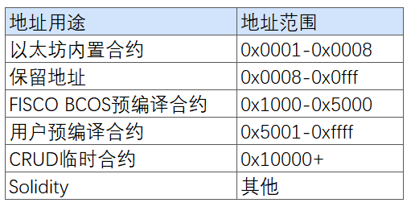
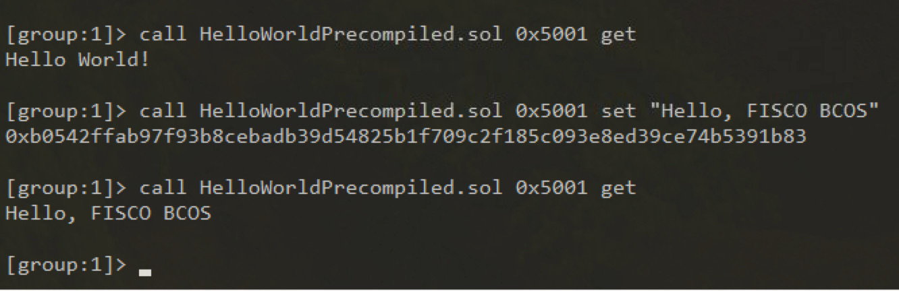
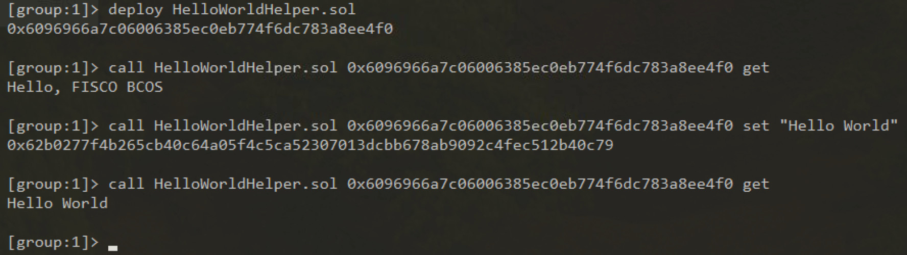

# 预编译合约极速开发指南（附完整步骤+实操模板）

作者：白兴强｜FISCO BCOS 核心开发者

上篇文章，我们亮出了[FISCO BCOS预编译合约的架构设计](https://mp.weixin.qq.com/s?__biz=MzA3MTI5Njg4Mw==&mid=2247485333&idx=1&sn=5561ae72507526380381856c307ffe61&chksm=9f2ef589a8597c9f6ed68bd2eb7f46fb8083f302dfdd47ae5ef75dd9d5f114631d21dfbedc9c&token=422221390&lang=zh_CN#rd)，该框架具备地址固定、无需部署、本地执行性能更高等诸多优点。因预编译合约的使用方式与普通Solidity合约使用方式完全相同，该框架能做到在不改变客户端开发者体验的情况下，获得极高的运行速度，这对逻辑相对确定、追求高速度和并发能力的场景来说，可谓是屠龙刀一样的存在。

今天，我将以HelloWorld合约为例，为大家介绍如何使用预编译合约版本的HelloWorld。注意，本章内容需要你具备一定的C++开发经验，且详细阅读了[《FISCO BCOS 2.0原理解析：](http://mp.weixin.qq.com/s?__biz=MzU5NTg0MjA4MA==&mid=2247483970&idx=1&sn=eb2049961515acafe8a2d29e8b0e28e9&chksm=fe6a870dc91d0e1b016fe96e97d519ff1e65bd7d79143f94467ff15e0cdf79ccb44293e52a7b&scene=21#wechat_redirect)[ 分布式存储架构设计》](https://mp.weixin.qq.com/s?__biz=MzA3MTI5Njg4Mw==&mid=2247485336&idx=1&sn=ea3a7119634c1c27daa4ec2b9a9f278b&chksm=9f2ef584a8597c9288f8c5000c7def47c3c5b9dc64f25221985cd9e3743b9364a93933e51833&token=422221390&lang=zh_CN#rd)。下图所示5个步骤是开发预编译合约的必经之路，我将按步骤实现HelloWorld预编译合约，然后分别使用控制台、Solidity合约两种方式来调用HelloWorld预编译合约。


## HelloWorld预编译合约开发


先来看一下我们想要实现的HelloWorld合约的Solidity版本。Solidity版本的HelloWorld，有一个成员name用于存储数据，两个接口get(),set(string)分别用于读取和设置该成员变量。

```
pragma solidity ^0.4.24;

contract HelloWorld{
    string name;
    constructor() public {
       name = "Hello, World!";
    }
    function get() public constant returns(string){
        return name;
    }
    function set(string n) public{
      name = n;
    }
}
```

### step1 定义HelloWorld接口

Solidity的接口调用都会被封装为一笔交易，其中，调用只读接口的交易不会被打包进区块，而写接口交易会被打包进区块中。由于底层需要根据交易数据中的ABI编码来判断调用的接口并解析参数，所以需要先把接口定义出来。预编译合约的ABI接口规则与Solidity完全相同，定义预编译合约接口时，通常需要定义一个有相同接口的Solidity合约，这个合约称为预编译合约的**接口合约**。接口合约在调用预编译合约时需要使用。

```
pragma solidity ^0.4.24;

contract HelloWorldPrecompiled{
    function get() public constant returns(string);
    function set(string n);
}
```

### step2 设计存储结构

预编译合约涉及存储操作时，需要确定存储的表信息(表名与表结构，存储数据在FISCO BCOS中会统一抽象为表结构)。这在之前的文章[分布式存储架构设计](https://mp.weixin.qq.com/s?__biz=MzA3MTI5Njg4Mw==&mid=2247485336&idx=1&sn=ea3a7119634c1c27daa4ec2b9a9f278b&chksm=9f2ef584a8597c9288f8c5000c7def47c3c5b9dc64f25221985cd9e3743b9364a93933e51833&token=422221390&lang=zh_CN#rd)有介绍。如果合约中不涉及变量存储，可以忽略该步骤。对于HelloWorld，我们设计如下的表。该表只存储一对键值对，key字段为hello_key，value字段为hello_value 存储对应的字符串值，可以通过set(string)接口修改，通过get()接口获取。


### step3 实现合约逻辑

实现新增合约的调用逻辑，需要新实现一个C++类，该类需要继承Precompiled类， 重载call函数， 在call函数中实现各个接口的调用行为。

```
virtual bytes call(std::shared_ptr<ExecutiveContext> _context, 
    bytesConstRef _param, Address const& _origin) = 0;
```

call函数有三个参数，_ context保存交易执行的上下文，_ param是调用合约的参数信息，本次调用对应合约接口以及接口的参数可以从_ param解析获取，_origin是交易发送者，用于权限控制。 接下来，我们在源码**FISCO-BCOS/libprecompiled/extension**目录下实现HelloWorldPrecompiled类，重载call函数，实现get()/set(string)两个接口。 

##### 接口注册：

```
// 定义类中所有的接口
const char* const HELLO_WORLD_METHOD_GET = "get()";
const char* const HELLO_WORLD_METHOD_SET = "set(string)";

// 在构造函数进行接口注册
HelloWorldPrecompiled::HelloWorldPrecompiled()
{// name2Selector是基类Precompiled类中成员，保存接口调用的映射关系
    name2Selector[HELLO_WORLD_METHOD_GET] = getFuncSelector(HELLO_WORLD_METHOD_GET);
    name2Selector[HELLO_WORLD_METHOD_SET] = getFuncSelector(HELLO_WORLD_METHOD_SET);
}
```

##### 创建表：

```
// 定义表名
const std::string HELLO_WORLD_TABLE_NAME = "_ext_hello_world_";
// 主键字段
const std::string HELLOWORLD_KEY_FIELD = "key";
// 其他字段字段，多个字段使用逗号分割，比如 "field0,field1,field2"
const std::string HELLOWORLD_VALUE_FIELD = "value";
```

##### 在call函数中添加打开表的逻辑：

```
// call函数中，表存在时打开，否则首先创建表
Table::Ptr table = openTable(_context, HELLO_WORLD_TABLE_NAME);
if (!table)
{// 表不存在，首先创建
    table = createTable(_context, HELLO_WORLD_TABLE_NAME, HELLOWORLD_KEY_FIELD,
        HELLOWORLD_VALUE_FIELD, _origin);
    if (!table)
    {// 创建表失败，返回错误码
    }
}
```

##### 区分调用接口：

```

uint32_t func = getParamFunc(_param);
if (func == name2Selector[HELLO_WORLD_METHOD_GET])
{// get() 接口调用逻辑 
}
else if (func == name2Selector[HELLO_WORLD_METHOD_SET])
{// set(string) 接口调用逻辑 
}
else
{// 未知接口，调用错误，返回错误码
}
```

##### 参数解析与返回：

调用合约时的参数包含在call函数的_param参数中，是按照Solidity ABI格式进行编码，使用dev::eth::ContractABI工具类可以进行参数的解析，同样接口返回时返回值也需要按照该编码格编码。

dev::eth::ContractABI类中我们需要使用abiIn/abiOut两个接口，前者用户参数的序列化，后者可以从序列化的数据中解析参数。

##### HelloWorldPrecompiled实现：

考虑手机上的阅读体验，我们分块介绍call接口内部实现并省略部分错误处理逻辑，详细代码实现可以参考FISCO BCOS 2.0文档使用手册->智能合约开发->[预编译合约开发](https://fisco-bcos-documentation.readthedocs.io/zh_CN/latest/docs/manual/smart_contract.html#id2)。

```
bytes HelloWorldPrecompiled::call(dev::blockverifier::ExecutiveContext::Ptr _context,
    bytesConstRef _param, Address const& _origin)
{
    // 解析函数接口
    uint32_t func = getParamFunc(_param);
    // 解析函数参数
    bytesConstRef data = getParamData(_param);
    bytes out;
    dev::eth::ContractABI abi;

    // 打开_ext_hello_world_表，省略
........
```

get()接口实现

```
// 区分调用接口，各个接口的具体调用逻辑
    if (func == name2Selector[HELLO_WORLD_METHOD_GET])
    {  // get() 接口调用
        // 默认返回值
        std::string retValue = "Hello World!";
        auto entries = table->select(HELLOWORLD_KEY_FIELD_NAME, table->newCondition());
        if (0u != entries->size())
        { 
            auto entry = entries->get(0);
            retValue = entry->getField(HELLOWORLD_VALUE_FIELD);
        }
        out = abi.abiIn("", retValue);
    }
```

set接口实现

```
else if (func == name2Selector[HELLO_WORLD_METHOD_SET])
    {  // set(string) 接口调用 略，请参考前文链接
        std::string strValue;
        abi.abiOut(data, strValue);
        auto entries = table->select(HELLOWORLD_KEY_FIELD_NAME, table->newCondition());
        auto entry = table->newEntry();
        entry->setField(HELLOWORLD_KEY_FIELD, HELLOWORLD_KEY_FIELD_NAME);
        entry->setField(HELLOWORLD_VALUE_FIELD, strValue);

        int count = 0;
        if (0u != entries->size())
        {  // update
            count = table->update(HELLOWORLD_KEY_FIELD_NAME, entry, table->newCondition(), 
                                  std::make_shared<AccessOptions>(_origin));
        }
        else
        {  // insert
            count = table->insert(HELLOWORLD_KEY_FIELD_NAME, entry, 
                                  std::make_shared<AccessOptions>(_origin));
        }
        if (count == storage::CODE_NO_AUTHORIZED)
        { // 没有表操作权限
        }
        // 返回错误码
        out = abi.abiIn("", u256(count));
    }
    else
    {  // 参数错误，未知的接口调用
        out = abi.abiIn("", u256(CODE_UNKNOW_FUNCTION_CALL));
    }
    return out;
}
```

### step4 分配并注册合约地址

FSICO BCOS 2.0执行交易时，根据合约地址区分是不是预编译合约，所以开发完预编译合约后，需要在底层注册为预编译合约注册地址。2.0版本地址空间划分如下：



用户分配地址空间为0x5001-0xffff,用户需要为新添加的预编译合约分配一个未使用的地址，**预编译合约地址必须唯一， 不可冲突**。

开发者需要修改FISCO-BCOS/cmake/templates/UserPrecompiled.h.in文件，在registerUserPrecompiled函数中注册HelloWorldPrecompiled合约的地址(**要求v2.0.0-rc2以上版本**)，如下注册HelloWorldPrecompiled合约：

```
void ExecutiveContextFactory::registerUserPrecompiled(ExecutiveContext::Ptr context)
{
    // 用户预编译合约地址范围 [0x5001,0xffff]
    context->setAddress2Precompiled(Address(0x5001), std::make_shared<precompiled::HelloWorldPrecompiled>());
}
```

### step5 编译源码

参考FISCO BCOS 2.0使用手册->获取可执行程序->[源码编译](https://fisco-bcos-documentation.readthedocs.io/zh_CN/latest/docs/manual/get_executable.html)。需要注意的是，实现的HelloWorldPrecompiled.cpp和HelloWorldPrecompiled.h需要放置于FISCO-BCOS/libprecompiled/extension目录下。

## HelloWorld预编译合约调用

### 使用控制台调用HelloWorld预编译合约

在控制台solidity/contracts创建HelloWorldPrecompiled.sol文件，文件内容是HelloWorld预编译合约的接口声明，如下

```
pragma solidity ^0.4.24;
contract HelloWorldPrecompiled{
    function get() public constant returns(string);
    function set(string n);
}
```

使用编译出的二进制搭建节点后，部署控制台v1.0.2以上版本，然后执行下面语句即可调用



### 在Solidity中调用HelloWorld预编译合约

我们尝试在Solidity合约中创建预编译合约对象并调用其接口。在控制台solidity/contracts创建HelloWorldHelper.sol文件，文件内容如下

```
pragma solidity ^0.4.24;
import "./HelloWorldPrecompiled.sol";

contract HelloWorldHelper {
    HelloWorldPrecompiled hello;
    function HelloWorldHelper() {
        // 调用HelloWorld预编译合约
        hello = HelloWorldPrecompiled(0x5001); 
    }
    function get() public constant returns(string) {
        return hello.get();
    }
    function set(string m) {
        hello.set(m);
    }
}
```

部署HelloWorldHelper合约，然后调用HelloWorldHelper合约的接口，结果如下



到这里，就可以恭喜你顺滑地完成了HelloWorld预编译合约的开发，其他预编译合约的开发流程道理相通。

