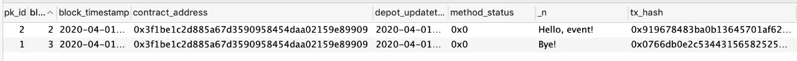

# 智能合约测试的技巧与实践

作者：毛嘉宇｜FISCO BCOS 核心开发者

## 前言

区块链的发展伴随着信息安全的话题。在Solidity不长的发展历程中，发生过不止一次骇人听闻、影响深远的安全攻击事件，给一些机构和组织造成不可挽回的损失。『祸乱生于疏忽，测试先于交付』，如果这些缺陷和漏洞在测试环节被发现，就能有效避免损失。测试是智能合约开发与交付过程中至关重要的一环。其能有效检验实际结果是否符合设计预期，有助识别错误、查缺补漏。同时，高质量、可复用的测试，还有助于提升整体开发效率。前文介绍了Solidity的前世今生、语法特性、设计模式、编程攻略和底层原理。作为系列终篇，本文将重点介绍和分享Solidity的测试场景、方法和实践。

## 前置准备

进入测试前，需要完成以下步骤：链的搭建、控制台安装、智能合约开发、智能合约编译与部署、利用Java等SDK开发一个应用。

详细准备工作可参考《[FISCO BCOS零基础入门，五步轻松构建应用](http://mp.weixin.qq.com/s?__biz=MzA3MTI5Njg4Mw==&mid=2247485305&idx=1&sn=5a8dc012880aac6f5cd3dacd7db9f1d9&chksm=9f2ef565a8597c73b87fd248c41d1a5b9b0e6a6c6c527baf873498e351e3cb532b77eda9377a&scene=21#wechat_redirect)》和FISCO BCOS官方文档，此处不再赘述。[FISCO BCOS官方文档](https://fisco-bcos-documentation.readthedocs.io/zh_CN/latest/docs/installation.html)地址。


## 测试环境

FISCO BCOS提供控制台、WeBASE-Front和SDK代码测试，这三种环境适用于不同测试场景：

- 控制台：提供命令行交互界面，通过在控制台创建合约和输入调用、查询指令，来进行简单调试。适用于非常简单的合约。
- WeBASE-Front：提供可视化交互界面以及简易的IDE环境。适用于业务逻辑并不复杂的合约，更推荐开发人员进行一些调试。
- SDK：例如集成Java sdk，创建一个Java项目，并编写应用和测试代码。适用于对智能合约质量要求较高、要求测试案例可复用、业务逻辑复杂或要求持续集成的场景。

### 控制台测试

FISCO BCOS 2.0及以上版本提供了方便易用的命令行终端、『开箱即用』的区块链利器，详情可参考《[FISCO BCOS 控制台详解，飞一般的区块链体验](http://mp.weixin.qq.com/s?__biz=MzA3MTI5Njg4Mw==&mid=2247485275&idx=1&sn=95e1cb1a961041d5800b76b4a407d24e&chksm=9f2ef547a8597c51a8940548dd1e30f22eb883dd1864371e832bc50188c153989050244f31e5&scene=21#wechat_redirect)》。接下来将通过一个合约示例来讲解如何运用控制台进行测试。首先，我们写一个HelloWorld合约：

```
pragma solidity ^0.4.25;

contract HelloWorld{
    string public name;
    constructor() public{
       name = "Hello, World!";
    }
  
    function set(string n) public{
      name = n;
    }
}
```

然后，将这个合约命名为HelloWorld.sol，并保存到控制台所在的contracts/solidity/路径下。随后，执行./start.sh 启动控制台并部署合约：

```
=============================================================================================
Welcome to FISCO BCOS console(1.0.8)!
Type 'help' or 'h' for help. Type 'quit' or 'q' to quit console.
 ________ ______  ______   ______   ______       _______   ______   ______   ______
|        |      \/      \ /      \ /      \     |       \ /      \ /      \ /      \
| $$$$$$$$\$$$$$|  $$$$$$|  $$$$$$|  $$$$$$\    | $$$$$$$|  $$$$$$|  $$$$$$|  $$$$$$\
| $$__     | $$ | $$___\$| $$   \$| $$  | $$    | $$__/ $| $$   \$| $$  | $| $$___\$$
| $$  \    | $$  \$$    \| $$     | $$  | $$    | $$    $| $$     | $$  | $$\$$    \
| $$$$$    | $$  _\$$$$$$| $$   __| $$  | $$    | $$$$$$$| $$   __| $$  | $$_\$$$$$$\
| $$      _| $$_|  \__| $| $$__/  | $$__/ $$    | $$__/ $| $$__/  | $$__/ $|  \__| $$
| $$     |   $$ \\$$    $$\$$    $$\$$    $$    | $$    $$\$$    $$\$$    $$\$$    $$
 \$$      \$$$$$$ \$$$$$$  \$$$$$$  \$$$$$$      \$$$$$$$  \$$$$$$  \$$$$$$  \$$$$$$

=============================================================================================
[group:1]> deploy HelloWorld
contract address: 0x34e95689e05255d160fb96437a11ba97bb31809f

[group:1]>
```

合约被成功部署后就可以开始测试了。我们先打印这个合约中name的值，然后修改为新的值，最后重新查询name中的值。

```
[group:1]> call HelloWorld 0x34e95689e05255d160fb96437a11ba97bb31809f name
Hello, World!

[group:1]> call HelloWorld 0x34e95689e05255d160fb96437a11ba97bb31809f set "Hello, test!"
transaction hash: 0x72c8a95b651fb5d12c44b69624d5213d58af1509f00920757fce94d019b5eae8

[group:1]> call HelloWorld 0x34e95689e05255d160fb96437a11ba97bb31809f name
Hello, test!

[group:1]>
```

上述例子演示了如何使用控制台部署与调试合约。控制台设计简洁优雅，使用体验如丝般顺滑。不过，在处理一些复杂场景，例如需要切换外部账户，或通过可视化界面进行操作时，WeBASE-Front当仁不让地扛起大旗。

### WeBASE-Front测试

WeBASE-Front为开发者提供了运行核心信息的可视化操作、Solidity开发的IDE环境以及私钥管理功能，让大家更便捷地开启区块链之旅。关于WeBASE-Front的介绍可参考《[WeBASE节点前置组件功能解析](http://mp.weixin.qq.com/s?__biz=MzA3MTI5Njg4Mw==&mid=2247485288&idx=1&sn=d4a69c02496591e9bbf3fa4de150aa5b&chksm=9f2ef574a8597c6210f742514a71537e49bd8f56017d53b48b441ac7c40f65bb7b66b6049aeb&scene=21#wechat_redirect)》与《[安装部署说明](https://webasedoc.readthedocs.io/zh_CN/latest/docs/WeBASE-Install/developer.html#)》。

接下来，我们演示一个需要切换外部账户的测试案例，以下是合约代码：

```

pragma solidity ^0.4.25;

contract BasicAuth {
    address public _owner;

    constructor() public {
        _owner = msg.sender;
    }

    function setOwner(address owner)
        public
        onlyOwner
{
        _owner = owner;
    }

    modifier onlyOwner() { 
        require(msg.sender == _owner, "BasicAuth: only owner is authorized.");
        _; 
    }
}
```

在这个示例中，合约owner被自动赋值为合约部署者。修饰器onlyOwner决定了setOwner函数只能由_owner用户来发起。在合约管理-合约IDE中，创建test文件夹，并复制合约代码：


然后，点击私钥管理-新增用户，创建user1和user2两个用户。


这时，选择部署合约，会弹出用户地址窗口选项，选择user1。


合约部署成功后，会展示合约地址、合约名、abi、合约binary等系列信息：


点击合约调用，弹出调用窗口，『方法』下拉框里包含了所有可调用的函数列表，选择_owner函数，点击确认，就可返回该合约的_owner变量值。


现在，我们来测试setOwner()函数。如上所述，本合约的_owner是user1，通过切换用户user2来调用这个函数，预期结果是调用失败。我们选择setOwner方法，选择私钥地址为user2：


正如预期，这个函数的调用失败了：


以上执行结果打印出了整个交易的TransactionReceipt，点击还原可转换为原始output值。『所见即所得』，WeBASE-Front让区块链变得更简单易用。使用WeBASE-Front测试最大短板在于测试案例无法复用。倘若合约非常复杂，那所有测试案例都得靠人工一遍遍输入，操作原始低效。 

### SDK测试

在系统测试中，需要遵循经典的AIR实践原则：

- Automatic：测试应该被全自动执行，这也是实现持续集成的前提。
- Independent：测试案例彼此保持独立，不存在相互依赖和调用。
- Repeatable：测试案例必须可被复用。可以跨越软硬件环境，被重复执行。

要满足以上甚至更多测试实践原则，使用控制台或WeBASE-Front的方式就显得有些力不从心，而集成SDK并编写测试代码的方式更值得推荐。这种方式虽然前期花费时间较长、成本较高；但测试后期能大大降低重复的工作量，显著提升整体测试效率。这也符合IT公司现行的软件测试实践规范。一般这部分代码由公司开发测试人员或质量保证（QA）工程师编写。但在很多公司中，这部分代码由开发人员编写。良好的测试代码，能提升代码质量，降低代码重构难度，提高开发效率。

FISCO BCOS提供了多语言SDK，如Java、Python、Node.js等，其中最为成熟与常用的是Java SDK。《[在IDE中使用JavaSDK](https://fisco-bcos-documentation.readthedocs.io/zh_CN/latest/docs/sdk/java_sdk/quick_start.html)》详细介绍了在IDE中创建新工程以及将已经提供的示例项目导入IDE。在Java开发实践中，Springboot使用更为深入人心，FISCO BCOS也提供了相应使用案例，相关配置文档可以参考：《Spring Boot项目配置》，通过spring-boot-starter开发者可快速下载示例工程，并导入偏好的IDE中。

配置工程链基本环境后，下面将以上述spring-boot-starter工程为例，介绍具体测试步骤和要点。

1. 编写合约：HelloWorld合约。
2. 编译智能合约，将其转为Java文件，从上述WeBASE-Front中，也能编译并导出Java文件。
3. 将编译生成的Java文件导入工程中，如HelloWorld.java。
4. 基于上述文件，调用合约功能和接口，编写相关测试案例，例如：ContractTest。
5. 基于Spring提供的gradle插件，我们可以通过"./gradlew test"命令来运行所有测试案例。
6. 如果需要持续集成，可以在配置和初始化FISCO BCOS后，将步骤5命令加入自动化脚本中。

接下来，我们将具体分析核心测试代码ContractTest：

```
@Test
public void deployAndCallHelloWorld() throws Exception {
    // deploy contract
    HelloWorld helloWorld = HelloWorld.deploy(client, credential);
    Assert.assertNotNull(helloWorld);
    // call set function
    helloWorld.set("Hello, World!");
    // call get function
    String result = helloWorld.get();
    Assert.assertTrue("Hello, World!".equals(result));
 }
```

- 第4行中，HelloWorld合约被部署。为符合独立性原则，建议在每个测试案例中部署独立的合约，以避免测试案例执行顺序对正常测试造成干扰。需要模拟合约依赖性的情况除外。
- 第9行和第11行，分别调用了set和get。为符合可重复性原则，该测试案例必须设计成幂等，即在任意的软硬件环境下，测试案例预期结果都是一致的。
- 第7行和第12行，使用了Junit框架提供的断言方法，用来判断智能合约执行结果是否符合预期。

值得一提的是，在Java SDK中，任意交易上链后，会获得一个回执TransactionReceipt对象，该对象中包含了返回状态和错误信息（如果交易成功，则message为null），可通过这个状态判断交易是否正常，例如：

```
TransactionReceipt tr = helloWorld.set("Hello, World!");
Assert.assertEquals(tr.getMessage(), "0x0", tr.getStatus());
```

以上基于Springboot提供的测试特性，实现了合约测试，如果需要了解更多细节，请[参考Spring的相关文档](https://docs.spring.io/spring-boot/docs/2.2.6.RELEASE/reference/html/spring-boot-features.html#boot-features-testing)。

## 测试类型

如传统软件，智能合约的测试同样可分为功能测试、非功能测试、安全性测试和回归测试，下面将对这些测试作逐一介绍。

### 功能测试

功能测试包括但不限于单元测试、集成测试、冒烟测试、用户验收测试。除用户验收测试外，其他测试都可通过开发或测试人员编写代码实现。智能合约测试重要目的之一是检测合约代码正确性，在预定输入值前提下，检查输出值是否符合预期。

上文我们介绍了控制台、WeBASE-Front和SDK三种测试环境。在一些逻辑复杂的智能合约中，测试难点之一在于构造测试案例。在这种场景下，使用智能合约可以更好地模拟和构造测试数据，直接使用Solidity编写智能合约更为原生、友好。

最后，测试并不游离于智能合约开发之外，而是其中重要的一环，测试也需遵循依赖关系原则，即开发者在进行开发时需要考虑智能合约的『可测试性』。例如，假设测试代码完全使用SDK编写，那智能合约的修改就可能导致测试代码需要做出对应变更，这会对测试效果造成影响，提升测试成本。基于软件设计『不可依赖多变部分』的原则，可测试性同样不能依赖于多变部分。

为了解决上述问题，我们在智能合约层引入测试代码。这些代码仅被设计为测试组件，不会发布到线上环境，以此将测试案例改动影响解耦并封装到智能合约层。测试合约作为独立组件，支持开发和测试环节。

测试组件中首先可以抽象和定义一些测试的工具合约，例如：

```
pragma solidity 0.4.25;

library LibAssert {
    event LogTest(bool indexed result, string message);

     function equal(uint8 a, uint8 b, string message) internal returns (bool result) {
        result = (a == b);
        log(result, message);
    }

    function notEqual(uint8 a, uint8 b, string message) internal returns (bool result) {
        result = (a != b);
        log(result, message);
    }

    function log(bool result, string message) internal {
        if(result)
            emit LogTest(true, "");
        else
            emit LogTest(false, message);
    }
}
```

这是一个最简单的测试合约库，提供了equal和notEqual的方法来判断uint8变量，开发者可基于此工具扩展自己的测试工具合约。

其次，依托于工具合约，我们可以编写独立的测试合约案例。

下面将以上述Uint8MathTest为例，演示如何使用此工具合约，首先，我们定义一个TestDemo合约：

```
pragma solidity ^0.4.25;
import "./Uint8MathTest.sol";
import "./LibAssert.sol";
contract TestDemo {
  using LibAssert for uint8;
  function testAdd() external returns (bool result) {
    uint8 a = 1;
    uint8 b = 1;
    Uint8MathTest math = new Uint8MathTest();
    uint8 c = math.add(a,b);
    uint8 expectedValue = 2;
    result = expectedValue.equal(c, "Not equal");
  }
}
```

然后，在控制台中运行这个测试案例：

```
[group:1]> deploy TestDemo
contract address: 0xd931b41c70d2ff7b54eb9b2453072f9b1a4dc05c

[group:1]> call TestDemo 0xd931b41c70d2ff7b54eb9b2453072f9b1a4dc05c testAdd
transaction hash: 0xe569e5d8eae1b949a0ffe27a60f0b4c8bd839f108648f9b18879833c11e94ee4
---------------------------------------------------------------------------------------------
Output
function: testAdd()
return type: (bool)
return value: (true)
---------------------------------------------------------------------------------------------
Event logs
---------------------------------------------------------------------------------------------
```

除了依赖自定义的智能合约测试代码，也可以用智能合约本身来编写测试案例。在SDK层，我们只需实现TestDemo中的测试函数代码。即使未来测试逻辑改动，也无需改动SDK代码，从而保证了测试代码的健壮性。合约测试代码组件需贯彻智能合约在整体设计中所遵循的设计原则。

### 非功能测试

非功能测试主要包括性能测试、容量测试、可用性测试等。由于智能合约运行于FISCO BCOS的底层节点，容量测试和可用性测试更多与底层节点相关，因此，对用户而言，非功能测试的重点就在性能测试上。

虽然，我们可以使用系列通用性能测试工具对智能合约进行测试，但是，实际压测过程中会存在一些痛点，例如：

- 针对具体合约场景测试，存在大量且重复的测试代码，费时费力；
- 性能指标缺乏统一度量，无法横向对比；
- 展示结果不够直观。

为了解决以上痛点，FISCO BCOS适配了区块链测试专业工具Caliper，让用户可以优雅地进行性能测试。更多细节和内容请参考：《[性能测试工具Caliper在FISCO BCOS平台中的实践](https://mp.weixin.qq.com/s?__biz=MzA3MTI5Njg4Mw==&mid=2247485260&idx=1&sn=118e20d331f2dc51e033e12402868cc5&scene=21#wechat_redirect)》。

### 安全性测试

智能合约上线前需要进行严格的安全性测试。安全性测试的方式包括：公开智能合约并发布悬赏、聘请专门的智能合约安全机构对合约进行检测和评估、使用智能合约专用的工具进行审计等。大家可以视自身合约的重要性及逻辑复杂程度选择对应的安全性测试级别。对于个人开发者或非重大业务的智能合约，选择免费的智能合约工具检测即可。下面以VS Code为例，演示如何使用智能合约安全插件对合约进行安全性检测。打开VS Code，在其插件库中搜索Beosin-VaaS: ETH，选择安装。随后，打开智能合约文件，右键选择Beosin-VaaS:ETH选项，在弹出的窗口中选择当前合约代码版本。安装完成后，会自动弹出如下界面：


点击start即可对所选合约进行安全检测。以下是对HelloWorld合约的检测结果：

```
start compile!
compile over!
start deploy!
deploy over!
start execute function name: set(string)
execute function name : set(string) end!
No problem was found in the contract
---end---
```

当我们对Uint8MathTest合约进行检测时，会发现报错：

```
####### Compile Problem #######
file: /Users/maojiayu/Downloads/Uint8MathTest.sol
title: Compile Problem
description:  Function state mutability can be restricted to pure
code:   function add(uint8 a, uint8 b) public returns (uint8 c) {
warningType: Info
line: 5
```

通过报错信息，我们可以发现该函数既没读取也没使用区块链上的状态，符合pure修饰符的使用条件，建议使用『pure』关键字来修饰。安全性测试是合约测试过程中不可或缺的一环，需高度重视。在严格的工程实践中，合约上生产前必须由相关的测试负责人出具安全性检测报告。此外，开发人员可以收集和总结Solidity安全编程规则和漏洞风险提示，并动态更新维护。在交付测试前，开发人员可组织代码审查和走查，依据总结，集中、逐项进行风险排查。安全性测试是检测和评价智能合约是否安全的必备环节，但不能将合约安全性完全寄望于测试。更重要的是，在设计、开发和测试的各个阶段，都需要用户时刻保持安全意识，建立和培养安全编码习惯。合约发布上线后，也不能放松警惕，时刻关注业界最新的安全警告，并定期、动态对所有代码进行检测和扫描。

### 回归测试

回归测试通常包括执行持续集成的自动化测试案例以及合约上线前的人工测试。上述SDK以及智能合约测试案例可有效覆盖测试案例所执行的路径和范围。自动化的回归测试有助于快速检测并发现问题，节省大量重复人力，保证合约经历系列修改和测试后，不偏离主干功能。同样，开发者可使用Jenkins、Travis等工具进行构建和测试。除了执行个别自动化测试无法执行的案例外，人工测试更多地是确认之前修改的代码是否符合预期，智能合约的运行是否符合当初设计。此外，在合约最终发布前，人工测试还起到审核检查作用，故而一定要认真对待。

## 测试要点

无论何种类型的系统测试，均需特别注意以下测试要点。

- 注意边界值的测试，例如数字溢出、特殊取值、循环边界值等。
- 注意检查智能合约的实现是否符合预期，其运行逻辑和流程是否与设计一致。
- 除了正常流程外，还需要模拟和测试在各种异常环境，甚至是极端环境下，智能合约运作是否正常，能否达到预期的处理结果。
- 围绕智能合约不变的业务逻辑，忽略变化值，进行对应测试。

### 边界值

边界值测试是一种常见的软件测试方法。据统计，绝大多数的bug发生在输入或输出范围的边界上，而非其内部。我们来演示一个典型的数值溢出测试案例。如下简单的合约，实现了两个uint8数值加法，并返回了结果：

```
pragma solidity 0.4.25;

contract Uint8MathTest {
    function add(uint8 a, uint8 b) public returns (uint8 c) {
        c = a + b;
    }  
}
```

这时，我们需要设计一个边界值的测试案例。已知uint8的取值范围在[0,28)即[0,256)之间，以此设计一个溢出的测试案例：（a=255, b=1），测试结果如下：

```
[group:1]> deploy Uint8MathTest
contract address: 0xd8a765995c58eb8da103bdcc2c033c0acb81e373

[group:1]> call Uint8MathTest 0xd8a765995c58eb8da103bdcc2c033c0acb81e373 add 255 1
transaction hash: 0x0583185839bc52870ac57cdfd00c0c18840c2674d718b4cc3cb7bc1ef4c173e0
---------------------------------------------------------------------------------------------
Output
function: add(uint8,uint8)
return type: (uint8)
return value: (0)
---------------------------------------------------------------------------------------------
```

可以看到最后结果变为0，而不是预期的256，显然，这是因为结果发生了溢出。当然，在使用边界值测试方法取值时，并非只取有效边界值，还应包含无效边界值。边界值测试可帮助查出更多错误和缺陷。

### 是否符合预期

在建筑公司交付房屋后，开发商会依据设计标准检验房屋建造是否合格。同样，除了检查合约执行结果是否正确外，在测试中还需检查合约交互、操作、数据流向、性能表现等各方面实现是否符合设计。举个例子，在金融业场景中，我们会使用Solidity开发具体链上业务逻辑。其中，不可避免与金额打交道，就需要测试对应资产规模是否符合设计标准。

在需求和设计阶段，我们会预估运行在链上的资产规模并作设计要求，例如要求某个供应链金融区块链业务系统能在千亿资产规模下正常运行。假设在智能合约中，定义金额的字段是uint32，可以计算其最大能表示的值为232即不到43亿。虽然在智能合约发布上线后大多数时间内，该问题不会造成任何影响；但是，一旦业务快速增长，当资产规模超过43亿后，就会出现严重故障。这类问题非常隐蔽，因此，需要更加全面、仔细的测试来提早发现和定位。

### 异常流程

在实际业务场景中，即便经过系列测试保证智能合约运行符合绝大多数场景需求，也可能因为疏忽或遗漏，导致在特定异常流程下，出现问题，在智能合约发布后造成了重大影响。故而，开发者需要特别重视在测试范围和内容中对异常流程的搜寻和覆盖，尽可能测试覆盖到所有的异常流程。

### 变与不变

使用Solidity测试与其他语言的显著不同还在于合约中的很多交易和值无法复现。正如『人的一生无法两次踏入同一条河流』，随着私钥、证书、环境等改变，其交易Hash值、区块Hash、合约地址等也会随之不同，这也给测试带来一些客观困难。另一方面，Solidity对于一致性有着严苛要求，例如对EVM执行指令语义的一致性、对外部随机变量的『排斥』等。掌握合约测试的关键在于抓住其中不变的方面。

## 测试技巧

作为区块链上专用编程语言，相比其他高级语言，Solidity有非常多限制。例如，缺乏成熟的测试工具支持，无法在运行时进行debug以及查看EVM虚拟机内的状态与数据。同时，Solidity缺乏独立的数据抽象层，导致无法像传统应用那样直接通过连接数据库来查看合约内详细的变量状态，只能通过在合约内增加查询调用来『曲线救国』。 当然，我们也可以采取一些技巧，尽可能规避以上问题。

### 如何展示合约更多内部变量？

编写Solidity代码与其他高级语言最大差别是无法进行debug。这个问题解决办法之一是打印和展示更多内部变量。

#### 问题场景：

还是上述的HelloWorld合约，现在我们无法在set函数执行时获取原有的name值，只能通过name()函数来查询。有没有办法在set函数执行时，记录和打印出name原来的值呢？

#### 解决方案：

定义一个event，在set函数内部进行调用。例如：

```
pragma solidity ^0.4.25;

contract HelloWorld{
    string public name;
    event LogSet(string oldValue, string newValue, address sender);
    constructor() public{
       name = "Hello, World!";
    }
  
    function set(string n) public{
      emit LogSet(n, name, msg.sender);
      name = n;
    }
}
```

然后，在控制台中执行，可以看到刚才定义的LogSet事件被打印出来了。我们在事件中还定义打印了msg.sender的地址，如下图所示，对应地址也被打印出来。


Event相当于提供了log日志的简单机制，当出现无法解决且需要展示合约内部状态的情况，Event提供了合适的方法和机制。

### 如何获得链上全量数据模型？

#### 问题场景：

都说Solidity是图灵完备的语言，EVM是设计简洁的状态机，如果想要获取状态机内部每个状态和交易的『世界状态』蛛丝马迹，有什么好的解决方案？

#### 解决方案：

Solidity缺乏独立的可对外访问的数据层，无法直接获取每笔交易或每个状态的详情。不过，我们可以通过WeBASE数据导出组件来导出所有链上数据。WeBankBlockchain-Data-Export可以导出区块链上的基础数据，如当前块高、交易总量等。如果正确配置了FISCO BCOS上运行的所有合约，Data-Export可以导出区块链上合约的业务数据，包括event、构造函数、合约地址、执行函数的信息等。数据导出组件Data-Export的目的在于降低获取区块链数据的开发门槛，提升研发效率。研发人员几乎无需编写任何代码，只进行简单配置，就可以把数据导出到Mysql数据库。

还是以上面的HelloWorld为例，参考安装文档：Data-Export快速部署。安装过程略过不表，导出以后会自动在数据库中生成如下的表：


数据库表的功能如下：

- account_info: 记录了所有在链上部署的合约信息，包括了合约名、合约地址、块高、上链时间等。
- blcok_detail_info: 记录了每个区块的信息，包括区块hash、交易数量、块高、上链时间等。
- block_task_pool：数据导出的任务表，记录了任务详情和状态信息。
- block_tx_detail_info：记录了每笔交易的信息，包括了交易的合约名称、函数名称、交易发送者地址、交易接收者地址、交易hash等。
- hello_world_log_set_event：数据导出会自动生成每个event的数据库表，命名规则为合约名+事件名。上面例子中定义的event所自动生成的表，包括了event中定义的所有变量和交易信息等。
- hello_world_set_method：数据导出会自动生成不同transaction的数据库表，命名规则为合约名+函数名。上面例子中定义的set函数表，包含了函数的入参、返回码和交易hash等。

hello_world_log_set_event显示了所有HelloWorld合约中，LogSetEvent事件记录的信息。


hello_world_set_method显示了历史调用的所有函数信息。



有了上述的数据库导出状态与信息，使用区块链瞬间变得容易，测试也更加得心应手、如虎添翼。数据库会如实地导出和记录区块链上所有操作，让一切链上数据都尽在掌握中！

## 总结

优质的测试环节能够提升智能合约编写的质量，杜绝因为合约编写漏洞而造成的重大损失，还能使合约开发曲线趋缓，有助于提升智能合约开发效率。『翻过高山，正遇江海。行过雪原，恰逢花期。』只有经历了艰苦、严谨、细心、反复的测试周期，才能迎接智能合约发布的曙光。至此，智能合约系列也行至尾声。本教程从智能合约的概念引入，介绍了Solidity的基本语言特性、设计模式、编程攻略，再到深入到EVM核心、Solidity测试。短短几篇小文难以穷尽Solidity编程所有细节，期待社区的开发者，一起参与和分享更多知识和经验，共同建设更好的FISCO BCOS社区。

------

#### 参考资料

- [Spring Boot项目配置参考](https://fisco-bcos-documentation.readthedocs.io/zh_CN/latest/docs/sdk/java_sdk.html#spring-boot)
- [spring-boot-starter](https://github.com/FISCO-BCOS/spring-boot-starter)
- [合约转为Java文件指引](https://fisco-bcos-documentation.readthedocs.io/zh_CN/latest/docs/sdk/java_sdk/quick_start.html#id4)
- [HelloWorld合约](https://github.com/FISCO-BCOS/spring-boot-starter/blob/master/src/test/resources/contract/HelloWorld.sol)
- [WeBankBlockchain-Data-Export快速部署](https://data-doc.readthedocs.io/zh_CN/dev/docs/WeBankBlockchain-Data-Export/install_Service.html)

