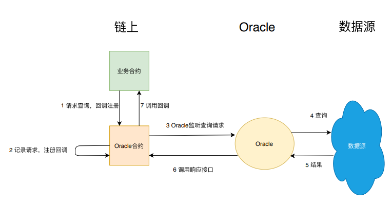

# 智能合约编写之 Solidity的设计模式

作者：储雨知｜FISCO BCOS 核心开发者

## 前言 

随着区块链技术发展，越来越多的企业与个人开始将区块链与自身业务相结合。区块链所具有的独特优势，例如，数据公开透明、不可篡改，可以为业务带来便利。但与此同时，也存在一些隐患。数据的公开透明，意味着任何人都可以读取；不可篡改，意味着信息一旦上链就无法删除，甚至合约代码都无法被更改。除此之外，合约的公开性、回调机制，每一个特点都可被利用，作为攻击手法，稍有不慎，轻则合约形同虚设，重则要面临企业机密泄露的风险。所以，在业务合约上链前，需要预先对合约的安全性、可维护性等方面作充分考虑。幸运的是，通过近些年Solidity语言的大量实践，开发者们不断提炼和总结，已经形成了一些"设计模式"，来指导应对日常开发常见的问题。

## 智能合约设计模式概述

2019年，IEEE收录了维也纳大学一篇题为《Design Patterns For Smart Contracts In the Ethereum Ecosystem》的论文。这篇论文分析了那些火热的Solidity开源项目，结合以往的研究成果，整理出了18种设计模式。这些设计模式涵盖了安全性、可维护性、生命周期管理、鉴权等多个方面。

| 类型               | 模式                                                         |
| ------------------ | ------------------------------------------------------------ |
| Security           | 1. Checks-Effects-Interaction<br/>2. Emergency Stop<br/>3. Speed Bump<br/>4. Rate Limit<br/>5. Mutex<br/>6. Balance Limit |
| Maintenance         | 7. Data Segregation<br/>8. Satellite<br/>9. Contract Register<br/>10. Contract Relay |
| Lifecycle          | 11. Mortal<br/>12. Automatic Deprecation                     |
| Authorization      | 13. Ownership<br/>14. Access Restriction                     |
| Action And Control | 15. Pull Payment<br/>16. Commit And Reveal<br/>17. State Machine<br/>18. Oracle |

接下来，本文将从这18种设计模式中选择最为通用常见的进行介绍，这些设计模式在实际开发经历中得到了大量检验。

## 安全性(Security)

智能合约编写，首要考虑的就是安全性问题。在区块链世界中，恶意代码数不胜数。如果你的合约包含了跨合约调用，就要特别当心，要确认外部调用是否可信，尤其当其逻辑不为你所掌控的时候。如果缺乏防人之心，那些“居心叵测”的外部代码就可能将你的合约破坏殆尽。比如，外部调用可通过恶意回调，使代码被反复执行，从而破坏合约状态，这种攻击手法就是著名的Reentrance Attack（重入攻击）。这里，先引入一个重入攻击的小实验，以便让读者了解为什么外部调用可能导致合约被破坏，同时帮助更好地理解即将介绍的两种提升合约安全性的设计模式。

关于重入攻击，这里举个精简的例子。AddService合约是一个简单的计数器，每个外部合约可以调用AddService合约的addByOne来将字段_count加一，同时通过require来强制要求每个外部合约最多只能调用一次该函数。这样，_count字段就精确的反应出AddService被多少合约调用过。在addByOne函数的末尾，AddService会调用外部合约的回调函数notify。AddService的代码如下：

```
contract AddService{

    uint private _count;
    mapping(address=>bool) private _adders;

    function addByOne() public {
        //强制要求每个地址只能调用一次
        require(_adders[msg.sender] == false, "You have added already");
        //计数
        _count++;
        //调用账户的回调函数
        AdderInterface adder = AdderInterface(msg.sender);
        adder.notify();
        //将地址加入已调用集合
        _adders[msg.sender] = true;   
    }
}

contract AdderInterface{
    function notify() public;  
}
```

如果AddService如此部署，恶意攻击者可以轻易控制AddService中的_count数目，使该计数器完全失效。攻击者只需要部署一个合约BadAdder，就可通过它来调用AddService，就可以达到攻击效果。BadAdder合约如下：

```

contract BadAdder is AdderInterface{

    AddService private _addService = //...;
    uint private _calls;

    //回调
    function notify() public{
        if(_calls > 5){
            return;
        }
        _calls++;
        //Attention !!!!!!
        _addService.addByOne();
    }

    function doAdd() public{
        _addService.addByOne();    
    }
}
```

BadAdder在回调函数notify中，反过来继续调用AddService，由于AddService糟糕的代码设计，require条件检测语句被轻松绕过，攻击者可以直击_count字段，使其被任意地重复添加。攻击过程的时序图如下：


在这个例子中，AddService难以获知调用者的回调逻辑，但依然轻信了这个外部调用，而攻击者利用了AddService糟糕的代码编排，导致悲剧的发生。本例子中去除了实际的业务意义，攻击后果仅仅是_count值失真。真正的重入攻击，可对业务造成严重后果。比如在统计投票数目是，投票数会被改得面目全非。打铁还需自身硬，如果想屏蔽这类攻击，合约需要遵循良好的编码模式，下面将介绍两个可有效解除此类攻击的设计模式。

### Checks-Effects-Interaction - 保证状态完整，再做外部调用

该模式是编码风格约束，可有效避免重放攻击。通常情况下，一个函数可能包含三个部分：

- Checks：参数验证
- Effects：修改合约状态
- Interaction：外部交互

这个模式要求合约按照Checks-Effects-Interaction的顺序来组织代码。它的好处在于进行外部调用之前，Checks-Effects已完成合约自身状态所有相关工作，使得状态完整、逻辑自洽，这样外部调用就无法利用不完整的状态进行攻击了。回顾前文的AddService合约，并没有遵循这个规则，在自身状态没有更新完的情况下去调用了外部代码，外部代码自然可以横插一刀，让_adders[msg.sender]=true永久不被调用，从而使require语句失效。我们以checks-effects-interaction的角度审阅原来的代码：

```
    //Checks
    require(_adders[msg.sender] == false, "You have added already");
    //Effects    
    _count++;
    //Interaction    
    AdderInterface adder = AdderInterface(msg.sender);
    adder.notify();
    //Effects
    _adders[msg.sender] = true;
```

只要稍微调整顺序，满足Checks-Effects-Interaction模式，悲剧就得以避免：

```
    //Checks
    require(_adders[msg.sender] == false, "You have added already");
    //Effects    
    _count++;
    _adders[msg.sender] = true;
    //Interaction    
    AdderInterface adder = AdderInterface(msg.sender);
    adder.notify();
```

由于_adders映射已经修改完毕，当恶意攻击者想递归地调用addByOne，require这道防线就会起到作用，将恶意调用拦截在外。虽然该模式并非解决重入攻击的唯一方式，但依然推荐开发者遵循。

### Mutex - 禁止递归

Mutex模式也是解决重入攻击的有效方式。它通过提供一个简单的修饰符来防止函数被递归调用：

```
contract Mutex {
    bool locked;
    modifier noReentrancy() {
        //防止递归
        require(!locked, "Reentrancy detected");
        locked = true;
        _;
        locked = false;
    }

    //调用该函数将会抛出Reentrancy detected错误
    function some() public noReentrancy{
        some();
    }
}
```

在这个例子中，调用some函数前会先运行noReentrancy修饰符，将locked变量赋值为true。如果此时又递归地调用了some，修饰符的逻辑会再次激活，由于此时的locked属性已为true，修饰符的第一行代码会抛出错误。

## **可维护性（Maintenance）**

在区块链中，合约一旦部署，就无法更改。当合约出现了bug，通常要面对以下问题：

1. 合约上已有的业务数据怎么处理？
2. 怎么尽可能减少升级影响范围，让其余功能不受影响？
3. 依赖它的其他合约该怎么办？

回顾面向对象编程，其核心思想是将变化的事物和不变的事物相分离，以阻隔变化在系统中的传播。所以，设计良好的代码通常都组织得高度模块化、高内聚低耦合。利用这个经典的思想可解决上面的问题。

### Data segregation - 数据与逻辑相分离

了解该设计模式之前，先看看下面这个合约代码：

```
contract Computer{

    uint private _data;

    function setData(uint data) public {
        _data = data;
    }

    function compute() public view returns(uint){
        return _data * 10;
    }
}
```

此合约包含两个能力，一个是存储数据(setData函数)，另一个是运用数据进行计算(compute函数）。如果合约部署一段时间后，发现compute写错了，比如不应是乘以10，而要乘以20，就会引出前文如何升级合约的问题。这时，可以部署一个新合约，并尝试将已有数据迁移到新的合约上，但这是一个很重的操作，一方面要编写迁移工具的代码，另一方面原先的数据完全作废，空占着宝贵的节点存储资源。

所以，预先在编程时进行模块化十分必要。如果我们将"数据"看成不变的事物，将"逻辑"看成可能改变的事物，就可以完美避开上述问题。Data Segregation（意为数据分离）模式很好地实现了这一想法。该模式要求一个业务合约和一个数据合约：数据合约只管数据存取，这部分是稳定的；而业务合约则通过数据合约来完成逻辑操作。

结合前面的例子，我们将数据读写操作专门转移到一个合约DataRepository中：

```
contract DataRepository{

    uint private _data;

    function setData(uint data) public {
        _data = data;
    }

    function getData() public view returns(uint){
        return _data;
    }
}
```

计算功能被单独放入一个业务合约中：

```
contract Computer{
    DataRepository private _dataRepository;
    constructor(address addr){
        _dataRepository =DataRepository(addr);
    }

    //业务代码
    function compute() public view returns(uint){
        return _dataRepository.getData() * 10;
    }    
}
```

这样，只要数据合约是稳定的，业务合约的升级就很轻量化了。比如，当我要把Computer换成ComputerV2时，原先的数据依然可以被复用。

### Satellite - 分解合约功能

一个复杂的合约通常由许多功能构成，如果这些功能全部耦合在一个合约中，当某一个功能需要更新时，就不得不去部署整个合约，正常的功能都会受到波及。Satellite模式运用单一职责原则解决上述问题，提倡将合约子功能放到子合约里，每个子合约（也称为卫星合约）只对应一个功能。当某个子功能需要修改，只要创建新的子合约，并将其地址更新到主合约里即可，其余功能不受影响。

举个简单的例子，下面这个合约的setVariable功能是将输入数据进行计算（compute函数），并将计算结果存入合约状态_variable：

```
contract Base {
    uint public _variable;

    function setVariable(uint data) public {
        _variable = compute(data);
    }

    //计算
    function compute(uint a) internal returns(uint){
        return a * 10;        
    }
}
```

如果部署后，发现compute函数写错，希望乘以的系数是20，就要重新部署整个合约。但如果一开始按照Satellite模式操作，则只需部署相应的子合约。

首先，我们先将compute函数剥离到一个单独的卫星合约中去：

```
contract Satellite {
    function compute(uint a) public returns(uint){
        return a * 10;        
    }
}
```

然后，主合约依赖该子合约完成setVariable：

```
contract Base {
    uint public _variable;

    function setVariable(uint data) public {
        _variable = _satellite.compute(data);
    }

     Satellite _satellite;
    //更新子合约（卫星合约）
    function updateSatellite(address addr) public {
        _satellite = Satellite(addr);
    }
}
```

这样，当我们需要修改compute函数时，只需部署这样一个新合约，并将它的地址传入到Base.updateSatellite即可：

```
contract Satellite2{
    function compute(uint a) public returns(uint){
        return a * 20;        
    }    
}
```

### Contract Registry - 跟踪最新合约

在Satellite模式中，如果一个主合约依赖子合约，在子合约升级时，主合约需要更新对子合约的地址引用，这通过updateXXX来完成，例如前文的updateSatellite函数。这类接口属于维护性接口，与实际业务无关，过多暴露此类接口会影响主合约美观，让调用者的体验大打折扣。Contract Registry设计模式优雅地解决了这个问题。在该设计模式下，会有一个专门的合约Registry跟踪子合约的每次升级情况，主合约可通过查询此Registyr合约取得最新的子合约地址。卫星合约重新部署后，新地址通过Registry.update函数来更新。

```
contract Registry{

    address _current;
    address[] _previous;

    //子合约升级了，就通过update函数更新地址
    function update(address newAddress) public{
        if(newAddress != _current){
            _previous.push(_current);
            _current = newAddress;
        }
    } 

    function getCurrent() public view returns(address){
        return _current;
    }
}
```

主合约依赖于Registry获取最新的卫星合约地址。

```
contract Base {
    uint public _variable;

    function setVariable(uint data) public {
        Satellite satellite = Satellite(_registry.getCurrent());
        _variable = satellite.compute(data);
    }

    Registry private _registry = //...;
}
```

###  **Contract Relay - 代理调用最新合约**

该设计模式所解决问题与Contract Registry一样，即主合约无需暴露维护性接口就可调用最新子合约。该模式下，存在一个代理合约，和子合约享有相同接口，负责将主合约的调用请求传递给真正的子合约。卫星合约重新部署后，新地址通过SatelliteProxy.update函数来更新。

```
contract SatelliteProxy{
    address _current;
    function compute(uint a) public returns(uint){
        Satellite satellite = Satellite(_current);   
        return satellite.compute(a);
    } 
    
    //子合约升级了，就通过update函数更新地址
    function update(address newAddress) public{
        if(newAddress != _current){
            _current = newAddress;
        }
    }   
}


contract Satellite {
    function compute(uint a) public returns(uint){
        return a * 10;        
    }
}
```

主合约依赖于SatelliteProxy：

```
contract Base {
    uint public _variable;

    function setVariable(uint data) public {
        _variable = _proxy.compute(data);
    }
    SatelliteProxy private _proxy = //...;
}
```


## 生命周期（Lifecycle）

在默认情况下，一个合约的生命周期近乎无限——除非赖以生存的区块链被消灭。但很多时候，用户希望缩短合约的生命周期。这一节将介绍两个简单模式提前终结合约生命。

### Mortal - 允许合约自毁

字节码中有一个selfdestruct指令，用于销毁合约。所以只需要暴露出自毁接口即可：

```
contract Mortal{

    //自毁
    function destroy() public{
        selfdestruct(msg.sender);
    } 
}
```

### Automatic Deprecation - 允许合约自动停止服务

如果你希望一个合约在指定期限后停止服务，而不需要人工介入，可以使用Automatic Deprecation模式。

```
contract AutoDeprecated{

    uint private _deadline;

    function setDeadline(uint time) public {
        _deadline = time;
    }

    modifier notExpired(){
        require(now <= _deadline);
        _;
    }

    function service() public notExpired{ 
        //some code    
    } 
}
```

当用户调用service，notExpired修饰符会先进行日期检测，这样，一旦过了特定时间，调用就会因过期而被拦截在notExpired层。

## 权限（Authorization）

前文中有许多管理性接口，这些接口如果任何人都可调用，会造成严重后果，例如上文中的自毁函数，假设任何人都能访问，其严重性不言而喻。所以，一套保证只有特定账户能够访问的权限控制设计模式显得尤为重要。

### Ownership

对于权限的管控，可以采用Ownership模式。该模式保证了只有合约的拥有者才能调用某些函数。首先需要有一个Owned合约：

```
contract Owned{

    address public _owner;

    constructor() {
        _owner = msg.sender;
    }    

    modifier onlyOwner(){
        require(_owner == msg.sender);
        _;
    }
}
```

如果一个业务合约，希望某个函数只由拥有者调用，该怎么办呢？如下：

```
contract Biz is Owned{
    function manage() public onlyOwner{
    }
}
```

这样，当调用manage函数时，onlyOwner修饰符就会先运行并检测调用者是否与合约拥有者一致，从而将无授权的调用拦截在外。

## 行为控制（Action And Control）

这类模式一般针对具体场景使用，这节将主要介绍基于隐私的编码模式和与链外数据交互的设计模式。

### Commit - Reveal - 延迟秘密泄露

链上数据都是公开透明的，一旦某些隐私数据上链，任何人都可看到，并且再也无法撤回。Commit And Reveal模式允许用户将要保护的数据转换为不可识别数据，比如一串哈希值，直到某个时刻再揭示哈希值的含义，展露真正的原值。以投票场景举例，假设需要在所有参与者都完成投票后再揭示投票内容，以防这期间参与者受票数影响。我们可以看看，在这个场景下所用到的具体代码：

```
contract CommitReveal {

    struct Commit {
        string choice; 
        string secret; 
        uint status;
    }

    mapping(address => mapping(bytes32 => Commit)) public userCommits;
    event LogCommit(bytes32, address);
    event LogReveal(bytes32, address, string, string);

    function commit(bytes32 commit) public {
        Commit storage userCommit = userCommits[msg.sender][commit];
        require(userCommit.status == 0);
        userCommit.status = 1; // committed
        emit LogCommit(commit, msg.sender);
    }

    function reveal(string choice, string secret, bytes32 commit) public {
        Commit storage userCommit = userCommits[msg.sender][commit];
        require(userCommit.status == 1);
        require(commit == keccak256(choice, secret));
        userCommit.choice = choice;
        userCommit.secret = secret;
        userCommit.status = 2;
        emit LogReveal(commit, msg.sender, choice, secret);
    }
}
```

### Oracle - 读取链外数据

目前，链上的智能合约生态相对封闭，无法获取链外数据，影响了智能合约的应用范围。链外数据可极大扩展智能合约的使用范围，比如在保险业中，如果智能合约可读取到现实发生的意外事件，就可自动执行理赔。获取外部数据会通过名为Oracle的链外数据层来执行。当业务方的合约尝试获取外部数据时，会先将查询请求存入到某个Oracle专用合约内；Oracle会监听该合约，读取到这个查询请求后，执行查询，并调用业务合约响应接口使合约获取结果。



下面定义了一个Oracle合约：

```
contract Oracle {
    address oracleSource = 0x123; // known source

    struct Request {
        bytes data;
        function(bytes memory) external callback;
}

    Request[] requests;
    event NewRequest(uint);
    modifier onlyByOracle() {
        require(msg.sender == oracleSource); _;
    }

    function query(bytes data, function(bytes memory) external callback) public {
        requests.push(Request(data, callback));
        emit NewRequest(requests.length - 1);
    }

    //回调函数，由Oracle调用
    function reply(uint requestID, bytes response) public onlyByOracle() {
        requests[requestID].callback(response);
    }
}
```

业务方合约与Oracle合约进行交互：

```
contract BizContract {
    Oracle _oracle;

    constructor(address oracle){
        _oracle = Oracle(oracle);
    }

    modifier onlyByOracle() {
        require(msg.sender == address(_oracle)); 
        _;
    }

    function updateExchangeRate() {
        _oracle.query("USD", this.oracleResponse);
    }

    //回调函数，用于读取响应
    function oracleResponse(bytes response) onlyByOracle {
    // use the data
    }
}
```

## 总结

本文的介绍涵盖了安全性、可维护性等多种设计模式，其中，有些偏原则性，如Security和Maintenance设计模式；有些是偏实践，例如Authrization，Action And Control。这些设计模式，尤其实践类，并不能涵盖所有场景。随着对实际业务的深入探索，会遇到越来越多的特定场景与问题，开发者可对这些模式提炼、升华，以沉淀出针对某类问题的设计模式。上述设计模式是程序员的有力武器，掌握它们可应对许多已知场景，但更应掌握提炼设计模式的方法，这样才能从容应对未知领域，这个过程离不开对业务的深入探索，对软件工程原则的深入理解。