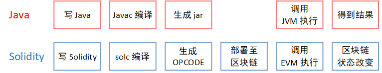
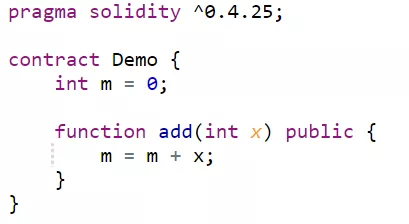

# 深入浅出Solidity

作者：石翔｜FISCO BCOS 核心开发者

在只有比特币的年代，区块链能够实现简单的价值产生和转移，但却未出现更多的商业模式。以太坊给区块链带来了维度的提升，基于区块链的应用渐趋丰富，区块链的各种商业模式加速涌现。这其中很重要的原因，是以太坊给区块链带来了一套图灵完备的编程语言。

区块链的主要功能，是实现了多方的共识。在比特币中，需要共识的操作是固定的，是非图灵完备的。其共识的仅仅是价值所有者的改变。但以太坊上，开发者可以自己编写需要共识的逻辑，以太坊通过智能合约语言Solidity，实现了共识逻辑的自定义。 

## Solidity 介绍

Solidity语言和Java存在着些许相似之处。在众多编程语言中，Java是发展较为成熟的。Java代码在Java虚拟机（JVM）执行。JVM屏蔽掉了操作系统的差异，使得Java成为一个跨平台的语言。一套Java代码可在Windows、Linux、Mac上通用，而不需要关心操作系统的差异。

Solidity与Java类似。代码写好后，都需要通过编译器将代码转换成二进制，在Java中，编译器是Javac，而对于Solidity，是solc。生成后的二进制代码，会放到虚拟机里执行。Java代码在Java虚拟机（JVM）中执行，在Solidity中，是一个区块链上的虚拟机EVM。

Solidity与Java的不同之处在于，Solidity是服务于区块链的语言，代码在区块链上执行。EVM是区块链上的一个执行器。每个区块链节点都有一个EVM。Solidity在EVM中被执行后，EVM对区块链的数据进行了改变。这些数据的改变交由共识算法去共识。同时，Solidity的操作仅限于EVM内部，不能访问外部不确定系统或数据，如系统时钟，网络文件系统等。

Solidity的设计目的，是给区块链提供一套统一的逻辑，让相同的代码跑在区块链的每个节点上，借助共识算法，让区块链的数据以统一的方式进行改变，达到全局一致的结果。

## Solidity 实现细节

以此处的Demo合约为例，合约中有一个全局变量m，并有一个函数add()，实现给全局变量m增加x数值的功能。

通过合约编译器solc，可将此合约编译成二进制。二进制的每个字（8 bit），表示一个EVM的操作码（OPCODE）。Demo合约编译出的二进制及其相应的OPCODE如下，实现了完整的Demo合约的功能，包括对合约的装载、合约接口的调用和异常处理的逻辑。其中，标红部分是add()方法的实现。

将add()函数的OPCODE的**标红部分**摘取出来，可看到其具体的实现思想与汇编代码相同，是一种基于堆栈式的操作。其中的SLOAD将区块链上指定位置的数据读入堆栈顶部，ADD实现将堆栈顶端的两个数据相加，SSTORE再将相加后放在堆栈顶部的结果写入区块链下一个区块的数据中，为下个区块的共识做准备。

在合约二进制被部署到区块链上后，通过发送交易调用合约里的方法。节点根据交易将合约代码装载入EVM中，并根据交易的传参执行合约上相应的函数add()。

EVM执行合约代码，从区块链上读入当前区块的数据，进行相加操作，并将结果写入下一个区块（等待共识的区块）对应的状态数据中。 

此后，共识算法将待执行的区块共识落盘，区块高度增加，区块链上的数据完成更新。

上述步骤可见，Solidity的实现与当今已有的做法有着很多相似之处。编译，用的是传统的套路，将代码转换成虚拟机可执行的二进制；执行，也是与传统方式相同，借助堆栈作为缓冲区执行二进制代码。

## Solidity 局限与改进

Solidity由于是第一个大规模应用的智能合约语言，存在着一些有待改进的地方。

**Solidity不够灵活。**Solidity语言受到自身堆栈深度的限制，函数传参和局部参数的个数总和不能超过16个。要实现一些比较复杂的函数难免有些鸡肋。Solidity是一种强类型的语言，但其类型转换较为麻烦。将整型转换成字符串时需要转换成二进制再拼接。在字符串的操作上，缺少一些方便的函数。

**Solidity的性能较差。**在执行上，OPCODE的执行是一种用程序模拟的汇编执行器，而不是直接使用CPU的资源。在存储上，Solidity的底层存储单位是32字节（256 bits），对硬盘的读写要求较高，浪费了大量的存储资源。

**针对上述两点，FISCO BCOS提供了一种用C++写合约方式：预编译合约。开发者可以用C++编写智能合约逻辑，并将其内置在节点中。**

预编译合约的调用方法与Solidity合约相同，通过合约地址即可直接调用。FISCO BCOS提供了参数解析，将调用的参数解析成C++可识别的格式。

预编译合约突破了Solidity语言的限制，借助强大的C++语言，可以灵活的实现各种逻辑，灵活性大大提高。同时，C++的性能优势也得到了很好的利用，通过预编译合约编写的逻辑，相比于Solidity语言来说，性能得到提升。

