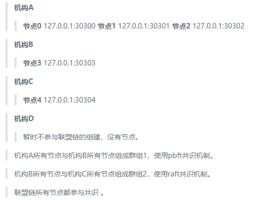

# FISCO BCOS国密版部署示例

作者：刘海锋｜FISCO BCOS开源社区贡献者

随着区块链的底层技术被不断关注，越来越多的项目开始使用区块链来固化数据。近期因为工作需要，对比了多家国内的区块链产品，实际部署了几个区块链系统后，最终选择了FISCO BCOS。在实际部署的过程中，我总结出了这一套可供实际项目使用的部署流程，供区块链爱好者参考。

## 设计覆盖实际项目使用情况的一套场景

在决定使用FISCO BCOS时，为了尽可能覆盖到实际项目使用的情况，我设计了一套场景，里面包含了大多数实际情况，并且遇坑填坑，最终按照设计的场景部署成功了。以下是我设计的场景：

1、假设多家机构组成联盟，每家机构都派出代表进驻联盟委员会(在本次测试组网部署中，假设有ABCD四家机构)。

2、联盟决定使用国密版FISCO BCOS组建联盟链。

3、联盟委员会确定联盟链组网模式(主要确认节点数量、节点分布、群组构成情况和信息交换方式等)。

本次测试，使用同一服务器的不同端口模拟不同节点，使用拷贝指令模拟信息交换方式(实际部署可通过U盘、邮件、网络消息传输等联盟成员信任的方式传递)，组网模式假设如下：



4、联盟委员会提供联盟链的链证书(自建或向CA公司申请，本次测试使用FISCO BCOS提供的企业级部署工具自建)。

5、联盟的每家机构向联盟委员会申请对应机构的机构证书(本次测试使用FISCO BCOS提供的企业级部署工具自建)。

6、联盟每个机构，根据联盟委员会确定的联盟链组网模式，使用FISCO BCOS提供的企业级部署工具，生成机构下属的节点部署程序，并按组网模式修改对应节点部署程序的配置文件。

7、联盟所有机构部署并启动下属节点程序，组成联盟链。

8、组网变动：

- 机构A认为自己下属节点太多，消耗资源，准备从群组1移除节点2变为游离节点，不参与共识。同时为了提高业务处理效率，将节点1设置为观察节点，不参与共识。

- 机构D想加入群组2，并添加机构D下属节点：


- 机构D和机构B想用节点3和节点5组成新群组：群组3。

9、机构A和机构D向联盟委员会提出组网变动申请。

10、联盟委员会同意机构A和机构D的组网变动申请。

11、机构A开始组网变动操作：

- 群组1的机构A或B根据联盟委员会同意的机构A组网变动申请，使用控制台或SDK发送节点2退出和节点1转换为观察节点的指令，完成机构A的组网变动请求。

12、机构D开始组网变动操作：

- 第5步中，机构D已向联盟委员会申请机构D的机构证书，现在，机构D使用FISCO BCOS提供的企业级部署工具，生成机构D下属的节点部署程序，根据新的组网模式，修改节点部署程序的配置文件，启动节点，准备加入联盟链。

- 机构D向群组2的机构B或C发送节点5入网请求，等待机构B或C使用控制台或SDK发送节点5加入群组2共识的指令。

- 机构B或C根据联盟委员会同意的机构D组网变动申请，使用控制台或sdk发送节点5加入群组2共识的指令。

- 机构D和机构B根据联盟委员会同意的群组3组网变动申请，组建群组3。

13、结束。

## 部署联盟链准备工作

FISCO BCOS为实际项目中部署和使用联盟链提供了企业级部署工具，里面包含了部署联盟链所需的各种操作。联盟委员会可以使用企业级部署工具自建生成链证书并为联盟成员机构颁发自建的机构证书，联盟成员机构可以使用企业级部署工具生成群组的创世区块和机构下属的节点部署程序。

本次测试模拟联盟链的实际搭建过程，测试部署目录(Linux)为：/usr/local/rc3-test-BCOS/，以下简称为目录rc3-test-BCOS。

- 环境要求：python 2.7+/3.6+，openssl 1.0.2k+。

- 获取企业级部署工具：git clone https://github.com/FISCO-BCOS/generator.git，得到企业级部署工具根目录generator。

```eval_rst
.. note::
    - 如果因为网络问题导致长时间无法下载企业级部署工具，请尝试 `git clone https://gitee.com/FISCO-BCOS/generator.git`
```

- 将generator上传(或直接clone)为/usr/local/rc3-test-BCOS/generator/，以下简称为目录generator。

- 保证generator的操作权限：chmod -R 777 /usr/local/rc3-test-BCOS/generator/

- 安装企业级部署工具(一定要保证安装正确)：

```
	cd generator
  ./scripts/install.sh
  
  #查看版本：
  ./generator -v
  > INFO | v1.0.0-rc3
```

- 下载国密版FISCO BCOS：

```
	cd generator
  ./generator --download_fisco ./meta -g
```

-g参数表示国密，去掉-g则下载的是普通版FISCO BCOS，执行完该命令，国密版FISCO BCOS会下载到generator/meta/下。

- 查看国密FISCO BCOS版本：

```
cd generator
./meta/fisco-bcos -v
```

```
> FISCO-BCOS Version : 2.0.0-rc3 gm
> Build Time              : 20190613 15:24:38
> Build Type              : Linux/clang/RelWithDebInfo
> Git Branch              : master
> Git Commit Hash      : a43952c544aa8252f7ac965e310148c099510410
```

可以看到，本次测试部署使用的是` v1.0.0-rc3`版本的企业级部署工具，`2.0.0-rc3 gm`版本的FISCO BCOS(似乎与rc2版本的部署流程相同)。

## 证书说明

FISCO BCOS国密版的链证书和机构证书需要两套，分别为国密证书和普通版证书。

- 证书链：

```
> 链证书——机构证书----节点证书
>
> 链证书——机构证书----sdk证书
```

- 证书支持自建、CA公司申请，企业级部署工具底层使用`openssl`工具自建生成，如果要用CA公司申请的证书，可直接把证书文件的名称改为规定的名称即可。
- 链证书普通版`ca.crt`，对应的私钥`ca.key`。链证书国密版`gmca.crt`，对应的私钥`gmca.key`。
- 机构证书普通版`agency.crt`，对应的私钥`agency.key`，机构证书国密版`gmagency.crt`，对应的私钥`gmagency.key`。
- 说明：链证书私钥需要联盟委员会保管，机构证书的私钥由各机构自行保管，证书及私钥的意义这里不做延伸。
- 使用FISCO BCOS企业级部署工具时，所有需要证书的操作都需要将链证书和机构证书(.crt文件)放置在`generator/meta/`下。

## 部署联盟链详细步骤（附每一步代码）

经过尝试，我按以下操作顺序执行，成功部署了一个符合上面场景描述的联盟链。由于步骤十分详细，而且含有大量代码，所以单独放在此处链接里：[《手把手教你实操部署FISCO BCOS联盟链》](https://blog.csdn.net/FISCO_BCOS/article/details/95496272)（温馨提示：此文附每一步代码演示，复制链接到PC端打开体验为佳。）

## 关键步骤总结

1. 联盟委员会及相关成员确定组网模式；
2. 相关的各种证书的颁发；
3. 准备FISCO BCOS企业级部署工具；
4. 根据组网模式，各机构收集所要组建群组的下属节点的p2p连接信息；
5. 各群组生成并分发创世区块(文件)；
6. 各机构生成机构下属加点的节点部署程序；
7. 各机构根据组网模式，修改下属节点部署程序中的配置文件，启动联盟链。

## 写在最后

至此，这套可供实际项目使用的部署流程就搭建完成了。我在刚开始部署时，会觉得整个系统的部署很复杂，多次部署之后，觉得流程挺合理挺清楚的，因为在实际场景中不是一个人在操作，是整个联盟各机构一起在协同，按联盟链该有的组织形式去部署其实很快，多次部署中我也总结了一些经验：

- 首先是多看官方技术文档，梳理出了大致流程。
- 其次就是解决证书的问题，这个问题对我来说如鲠在喉，在实际业务中，证书必须是具有法律效力，由CA公司颁发的。我认为证书的生成，可以考虑从企业级部署工具中分离出来，作为搭建测试链的一个工具。当然，在实际业务中，如果不重视数据的法律效应，也可以只把证书当做一个加密的公私钥对看待。
- FISCO BCOS目前处于快速迭代开发的阶段，推出的一些功能都很好，比如区块链浏览器。
- 适配支持FISCO BCOS底层平台的区块链中间件平台WeBASE，功能全面，上手快速，节约大量时间都很好。

整体而言FISCO BCOS体验很不错，期待看到FISCO BCOS更多的突破。