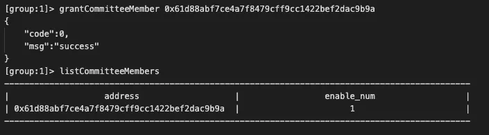
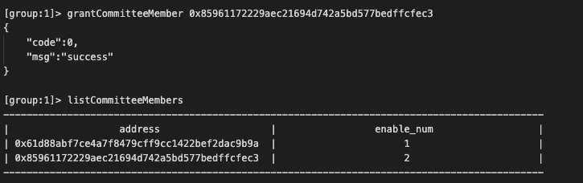
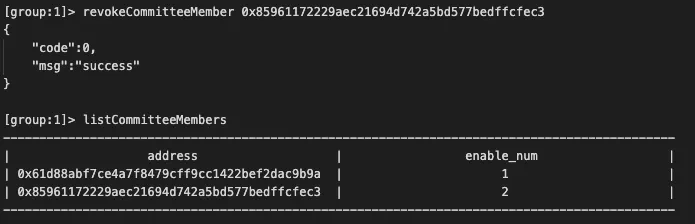
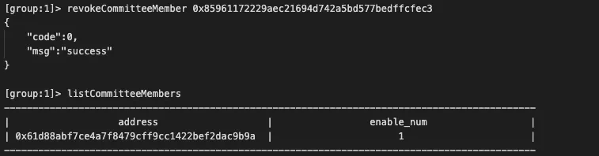
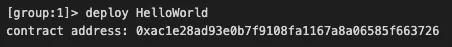
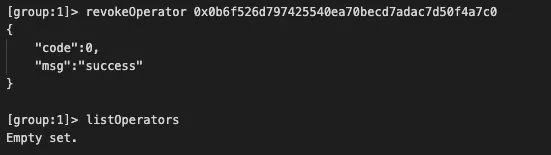

# FISCO BCOS 角色权限模型的实现

作者：白兴强｜FISCO BCOS 核心开发者

## 引言

FISCO BCOS的权限控制是通过控制账号对系统中表的写权限来实现的。这种权限控制模型非常灵活且强大，用户几乎可以控制任意一项权限，例如，通过控制权限表的写权限管理分配权限；通过控制系统合约所对应表的写权限管理链配置、节点身份管理、合约部署、用户表创建等；通过控制合约表的写权限管理合约写接口的调用。

然而，绝对完美是不存在的。强大灵活的权限控制也带来较高的学习成本：用户需要理解每个权限项控制的内容以及如何设置，了解链管理员和系统管理员的区别……大量的概念和操作，对用户要求极高。

为了降低使用难度，提升用户体验，FISCO BCOS v2.5对此功能进行了优化，新增了基于角色的权限控制。把不同的权限统归到不同角色，用户根据账号所属角色即可判断其所拥有的权限。同时v2.5基于角色引入了链上治理投票模型，使治理操作更加方便。

## 什么是角色权限模型？

使用角色权限模型后，用户只需记住角色，而角色对应的权限不言自明，例如，治理委员会委员拥有链治理相关权限，这极大降低用户理解难度与学习成本。


### 角色对应的权限

区块链上的参与者，可根据角色分为治理方、运维方、监管方和业务方。为避免既当裁判又当运动员，治理方、运维方应权责分离，角色互斥。

- 治理方：角色称为治理委员会委员，简称委员，负责区块链治理。
- 运维方：负责区块链运维，该角色由委员添加。
- 业务方：业务方账号由运维添加到某个合约，可以调用该合约的写接口。
- 监管方：监管方监管链的运行，能够获取链运行中权限变更记录以及需要审计的数据。

各角色所对应权限具体如下表所示。


### 角色权限实现的细节

本小节将简单介绍委员、运维和业务角色的权限实现细节以及背后原理，以便更好理解与使用角色权限功能。

链初始无委员账号，当存在至少一个委员账号时，委员拥有的权限开始受到控制。联盟链实际应用中多个参与方的技术实力可能并不相同，从实际应用场景出发，我们引入了链上治理投票模型，所有治理操作需要有效投票数/委员数>生效阈值才能生效，用户通过新增的链治理预编译合约可以实现委员的增删、权重修改、投票生效阈值修改等操作。

投票模型有几处值得注意：

- 每次投票操作，如果是委员投票，则记录操作内容和投票委员，不重复计票
- 每次投票操作，计票结束后，计算有效投票数/委员数，如果大于此操作的生效阈值，则对应操作生效
- 投票设置过期时间，根据块高，blockLimit的10倍，固定不可改

运维角色的新增与撤销必须由委员角色操作。链初始无运维账号，当存在至少一个运维账号时，运维拥有的权限开始受到控制。业务账号可以调用链上查询接口与运维指定合约的写接口。

### 兼容性说明

目前，角色权限模型基于对系统中各类表的写权限控制。我们做了最大努力与之前版本使用体验保持一致，但为了权限控制的完整严谨，对FISCO BCOS v2.5新建链，控制台grantPermissionManager指令不再有效，原PermissionManager的权限归属于委员角色。对于v2.5之前的链，该指令仍然有效。

## 如何使用角色权限？

本节将以“委员增删”和“运维增删”为例进行简要的实操演示，文档含括了更丰富的角色权限相关操作，欢迎移步[查看](https://fisco-bcos-documentation.readthedocs.io/zh_CN/latest/docs/manual/permission_control.html)。

### 增删委员

使用控制台v1.0.10以上版本中自带的get_account.sh脚本，生成3个如下账号，接下来的操作以这3个账号为例演示。配置好控制台后，使用控制台的-pem选项分别加载3个私钥启动3个控制台。

```
# 账号10x61d88abf7ce4a7f8479cff9cc1422bef2dac9b9a.pem# 账号20x85961172229aec21694d742a5bd577bedffcfec3.pem# 账号30x0b6f526d797425540ea70becd7adac7d50f4a7c0.pem
```

#### 添加账号1为委员

增加委员需要链治理委员会投票，有效票大于阈值才可生效。此处由于只有账号1是委员，所以账号1投票即可生效。



#### 使用账号1添加账号2为委员

此处由于只有账号1是委员，所以使用账号1投票后，满足阈值判断立刻生效。



#### 撤销账号2的委员权限

此时系统中有账号1和账号2两个委员，默认投票生效阈值50%，所以需要两个委员都投票撤销账号2的委员权限，有效票/总票数=2/2=1>0.5才满足条件。 

账号1投票撤销账号2的委员权限，如下图：



账号2操作投票撤销账号2的委员权限，如下图：



### 增删运维

委员可以添加与撤销运维角色，运维角色的权限包括部署合约、创建表、冻结解冻所部署的合约、使用CNS服务等。

#### 使用账号1添加账号3为运维


#### 使用账号3部署HelloWorld

账号3是运维角色，可以部署合约，具体操作如下图：



#### 使用账号1部署HelloWorld

账号1是委员，不具有部署合约的权限，部署合约失败，如下图：


#### 使用账号1撤销账号3的运维权限

账号1是委员可以撤销运维，如下图：



## 总结

作为联盟链的重要特性，权限控制需要做到灵活且强大，但如何在此基础上达成良好的用户体验，需要不断地改进优化。FISCO BCOS v2.5前的权限控制实现了灵活且强大的功能，但同时，社区也收到不少反馈，认为权限控制的使用理解门槛过高。通过角色权限，我们希望能在保持原有功能的同时，降低学习门槛、提升大家的使用体验。整合优化权限控制的工作仍在进行，希望未来能实现从底层到应用全覆盖的权限控制解决方案。欢迎大家共同探讨交流，积极反馈使用体验与改进建议。