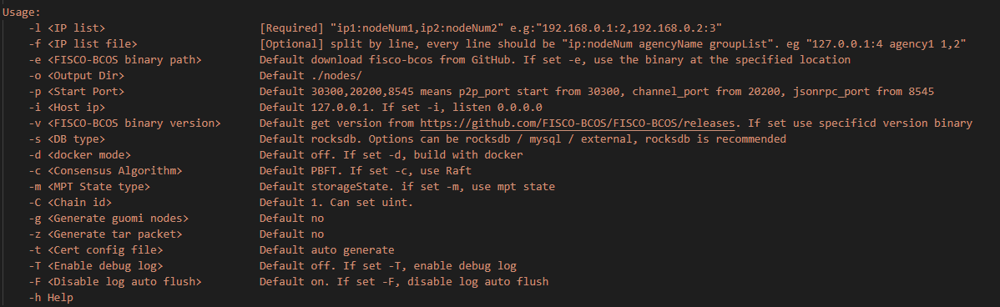
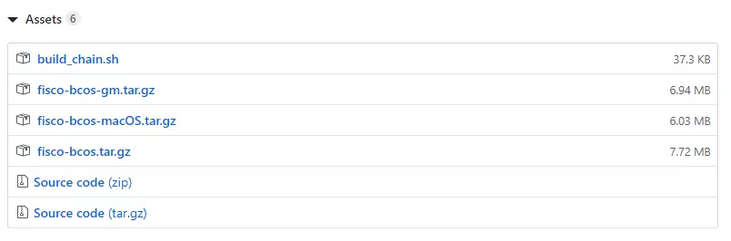

# FISCO BCOS快速建链实现之路

作者：白兴强｜FISCO BCOS 核心开发者

跟很多开发者一样，团队刚开始搭链时，也经历过迷之困惑的阶段：安装哪个版本，怎么编译这么久还容易出错？配几个节点，都用什么IP端口？证书从哪里来，放到哪里去？怎么验证我的链确实搭起来了？...

相信从FISCO BCOS1.X版本上手的工程师们，内心都有一座小火山，面对超长的文档、超多的操作步骤……每次版本部署，耗费大量时间，工程师头上都快能摊熟一枚鸡蛋。而数据表明，一个软件如果15分钟还使用不起来，用户就会流失。
为了浇灭大家心中的小火山，一起愉快地玩耍区块链，FISCO BCOS的易用性优化势在必行。团队的第一个目标是让开发者**在5分钟内搭起开发测试链**，这就需要一个《哈利•波特》里召唤术一样的命令，我们把它称为**build_chain**。
本文将聊聊build_chain脚本的诞生记，以及当前脚本能够提供的帮助。

## build_chain脚本的诞生

首先是去掉编译步骤，源码编译不但需要安装下载依赖，还需要配置开发环境，即便这两步一切顺利，编译过程中还可能因为内存不足而失败，更何况下载依赖经常受到网速影响导致下载失败。于是我们提供了预编译的二进制发布包，让用户跳过冗长的编译阶段。
马上我们又发现了新的问题，即使针对不同平台都提供二进制发布包，用户的环境是千变万化的，预编译程序所依赖的动态库的安装又成了问题。
于是我们想到了提供静态编译的二进制发布包，兼容多种Linux64位操作系统，不依赖任何其他库，省时又省力。为了实现静态编译，我们不惜重新实现部分功能，以去掉对不提供.a的外部库的依赖。
接下来我们尝试减少部署步骤，减轻对用户的压力。

配置项太多太灵活，我们优化配置，所有配置都提供合适的默认值，删除不需要灵活定制的配置项。
json格式的配置文件阅读不够直观，手工修改容易因为格式问题导致错误，我们替换为更清晰的ini文件。
系统合约手动部署太麻烦，我们借助预编译合约实现内置系统合约来管理链上配置。
手工搭建和工具脚本搭建的节点目录结构不统一，我们整理文档，统一工具创建的目录结构，提供辅助脚本。

经过上述这些优化，我们认为可以有更轻量级的部署方式，可以尝试通过一个脚本来完成部署过程中的所有事情。
相比于大而全的部署工具，脚本更轻更快；而相比于手工部署的繁琐，脚本能够更简单。这样，build_chain脚本就诞生了。

## build_chain脚本提供的帮助

这个脚本能够完成环境检查、参数解析、FISCO BCOS二进制发布包下载、公私钥证书生成、配置文件生成和工具脚本生成等功能，支持MacOS、Linux 64bit、docker模式和国密版本搭建。
然而实际使用后，我们发现在家里的网络条件下，脚本下载二进制发布包需要很长时间，导致5分钟内无法完成搭起一条FISCO BCOS的链。
为了能达成5分钟建链的目标，我们又新增了CDN支持，在哪怕网络条件不是很好的情况下，也可以顺畅地在5分钟内完成建链。心中的小火山熄灭了。

具体而言，build_chain脚本能够提供的帮助包括以下几个：

### 环境检查

build_chain脚本需要使用OpenSSL来生成节点所需要使用到的相关证书文件，而FISCO BCOS 2.0要求使用OpenSSL 1.0.2以上版本。只有找到符合要求的程序版本，脚本才能继续执行。
需要注意的是，MacOS自带的是LibreSSL，所以需要用户使用brew install OpenSSL安装OpenSSL。

### 解析参数

build_chain脚本支持很多自定义参数，例如-p指定节点使用的端口范围、-f搭建指定配置的网络、-g搭建国密版本、-v指定FISCO BCOS程序版本号、-o指定输出路径等，[可参考详情](https://fisco-bcos-documentation.readthedocs.io/zh_CN/latest/docs/manual/build_chain.html#id4)

### 获取FISCO BCOS可执行程序

FISCO BCOS提供标准版和国密版本的预编译可执行程序，可以在大部分x64的Linux机器上运行。另外，为方便开发人员调试，同时提供了MacOS版本的可执行程序。

- build_chain脚本会根据操作系统和是否国密下载对应的可执行程序。
- 当从GitHub下载可执行程序较慢时，会自动切换到CDN下载。如下图可以看到fisco-bcos.tar.gz只有7.72M。
- 当不使用-v选项指定版本时，脚本会自动拉去GitHub上FISCO BCOS发布的最新版本，使用-v选项时，则下载指定版本的可执行程序。

对除官方明确的Ubuntu 16.04+和CentOS 7.2+以外的平台，上生产时建议使用源码编译获得的可执行程序，然后通过-b选项和-f选项搭建区块链网络。

###  生成私钥证书

FISCO BCOS支持证书链，默认使用三级证书链结构，使用自签CA证书作为链的根证书，使用CA签发的机构证书用于区分机构，然后使用机构私钥签发节点所使用的证书。
节点的conf目录下会有ca.crt、node.key、node.crt三个文件，节点使用这三个文件建立双向SSL链接，使用node.key在共识过程中为区块签名。
如果是国密版本，则脚本会下载TaSSL工具，生成国密版本的证书文件。

###  生成配置文件和工具脚本

build_chain脚本中内置了FISCO BCOS节点所需要使用的配置文件模板，根据用户指定的参数修改，生成节点所使用的配置文件([可查看配置文件的介绍](https://fisco-bcos-documentation.readthedocs.io/zh_CN/latest/docs/manual/configuration.html))。

同时，为方便用户启动和停止节点，节点目录下还会生成start.sh和stop.sh（[可查看节点目录结构说明](https://fisco-bcos-documentation.readthedocs.io/zh_CN/latest/docs/manual/build_chain.html#id5)）。

## 总结

下面来总结一下，FISCO BCOS团队提升部署速度、实现快速建链的几个要诀：

- 1．提供静态编译的二进制发布包，兼容多种操作系统，让用户跳过冗长的编译阶段。
- 2．简化配置，极大限度采用能保证最大成功率的默认参数，最小化用户需要关注的信息，用户只需关注少量网络配置。
- 3．标准化目录结构，无论是用一键搭链、企业级搭链、手工搭链...生成的目标都是一样的，降低了差异化带来的复杂度。
- 4．巧用脚本，build chain脚本可自动串起从准备环境到启动所有链节点一系列常规操作步骤，自动处理各种可能的小异常，让整个过程显得行云流水。
- 5．优化依赖库地址、网络速度等，极大减少用户的等待消耗，谈笑间，链已经搭好。

对于想通过手工搭建进一步学习的同学和生产环境使用，建议使用我们提供的企业级部署工具generator。
在性能和易用性方面，做再多努力都是值得的，我们会继续努力优化，非常欢迎各位社区的参与者提优化建议和bug。

------

#### 参考链接

**企业级部署工具generator**：https://fisco-bcos-documentation.readthedocs.io/zh_CN/latest/docs/enterprise_tools/index.html

