# 记一次JavaSDK性能从8000提升至30000的过程

作者：李辉忠｜FISCO BCOS 高级架构师

## 缘起

FISCO BCOS在中国信通院可信区块链测评中达到2万+ TPS的交易处理能力，在同类产品中处于领先水平。此次测试标的是底层平台，目的是压测得出底层平台的性能上限，主要评估目标是底层平台的交易处理能力。

交易构造是由客户端（集成了SDK）完成，客户端通常可以非常容易实现平行扩展。SDK要完成交易构造的过程，实现交易组包、编码、签名、发送等一系列操作，这些过程本身是无状态的，客户端可以通过多线程的方式进行扩展，一个客户端性能达到瓶颈，可以增加更多客户端进行扩展。

虽然“堆机器”的平行扩展方式可以解决发送端的性能问题，但是机器本身就是珍贵的资源，进一步优化算法效率，提高资源利用率，将大有裨益。于是，我们打算先测试一下JavaSDK目前的性能，主要评测生成交易的性能。生成交易包括交易组包、参数编码、交易编码、交易签名等过程，其中，交易签名是最重要的环节，测试数据如下：

- 8核机器，测试本地生成50W笔交易的耗时
- 完全并行：每秒生成**8498笔**交易，平均每笔交易耗时0.12毫秒
- 完全串行：每秒生成1504笔交易，平均每笔交易耗时0.66毫秒

对比C++实现交易签名，这个性能实属不高。根据以往经验判断，这里大有优化空间啊！于是团队开始了一次JavaSDK的性能优化之路。

## 过程

关于性能优化，社区做过多次分享，可以补充阅读下列文章：

- [FISCO BCOS共识优化之路](http://mp.weixin.qq.com/s?__biz=MzA3MTI5Njg4Mw==&mid=2247485295&idx=2&sn=46cff7fcdf2e807325532941fcbc98fe&chksm=9f2ef573a8597c65d159c17298ecec02097aafeedfd0192154d9d530c9a0d0a79a22c33894a0&scene=21#wechat_redirect)
- [区块链的同步及其性能优化方法](http://mp.weixin.qq.com/s?__biz=MzA3MTI5Njg4Mw==&mid=2247485283&idx=1&sn=c2028923dc7ec7d8bfa808febc57e596&chksm=9f2ef57fa8597c6911f629b324e466f7058e4ae5da06aab8484c1d7db3203496ffebd9562ecb&scene=21#wechat_redirect)
- [FISCO BCOS中交易池及其优化策略](http://mp.weixin.qq.com/s?__biz=MzA3MTI5Njg4Mw==&mid=2247485255&idx=1&sn=3947f289f75813c13a2f58fb00d2018e&chksm=9f2ef55ba8597c4de0a3e427f03af7b7b327a54cf440a36d38b62f520591f81463e6aca772fd&scene=21#wechat_redirect)
- [FISCO BCOS性能优化——工具篇](http://mp.weixin.qq.com/s?__biz=MzA3MTI5Njg4Mw==&mid=2247485323&idx=1&sn=d63421fa2353d0e9a1506f01516f3416&chksm=9f2ef597a8597c8134f17053236863c501fb6e4f7480cca1a37926e7cfc309f8faacadf1786a&scene=21#wechat_redirect)
- [FISCO BCOS的速度与激情：](http://mp.weixin.qq.com/s?__biz=MzA3MTI5Njg4Mw==&mid=2247485329&idx=1&sn=4bb6c31ff10ae1ae03cd0dbeaf023a4c&chksm=9f2ef58da8597c9bcda115382624012c240ce56a5f84450d9808281b8736bd2e9b8833eab5f2&scene=21#wechat_redirect)[性能优化方案最全解密](http://mp.weixin.qq.com/s?__biz=MzA3MTI5Njg4Mw==&mid=2247485329&idx=1&sn=4bb6c31ff10ae1ae03cd0dbeaf023a4c&chksm=9f2ef58da8597c9bcda115382624012c240ce56a5f84450d9808281b8736bd2e9b8833eab5f2&scene=21#wechat_redirect)
- [让木桶没有短板，FISCO BCOS全面推进并行化改造](http://mp.weixin.qq.com/s?__biz=MzA3MTI5Njg4Mw==&mid=2247485324&idx=1&sn=94cdd4e7944f1058ee01eadbb7b3ec98&chksm=9f2ef590a8597c86af366b6d3d69407d3be0d3d7e50455d2b229c1d69b1fdc6748999601cd05&scene=21#wechat_redirect)

这些性能优化的过程中，感触最深的有两句话：『过早的优化是万恶之源』『没有任何证据支撑的优化是万恶之源』

优化要靠数据说话，而获取数据需要靠有效的分析工具，所以此次JavaSDK的性能优化，首要任务就是确定采用什么性能分析工具。

### 工具：发现java自带的分析工具挺管用


采用HPROF跑了一次，得到下面这样的数据报告：

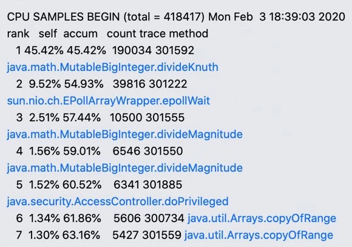


数据显示，热点在很底层的库函数。这个结论并不符合预期，说明 SDK本身代码不是热点，性能优化比较难入手。

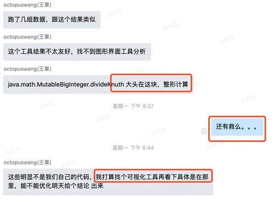

幸运的是，很快好消息就来了：采用java自带的另一个工具jvisualvm，较好地可视化输出性能分析数据，同时也很直观地显示出JavaSDK本身存在热点。

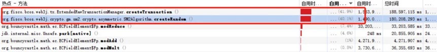


### 分析：找到一个“伪热点”

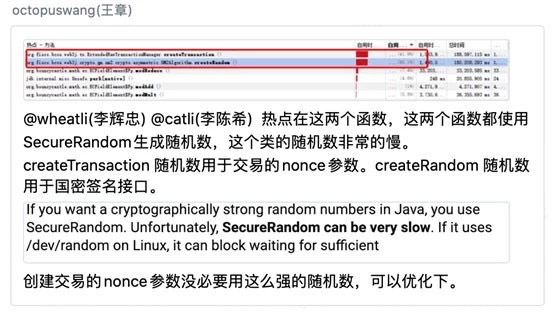

通过jvisualvm工具分析出来，最大的热点是在生成随机数，这让我等有些吃惊。


上面分析的是国密版本，对于非国密如何呢？跑了一遍，热点依旧可见在createTransaction，那就试试uuid吧。

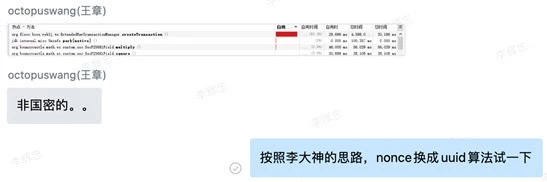

但是，打脸，来得是那叫一个快，UUID的实现也是基于SecureRandom。

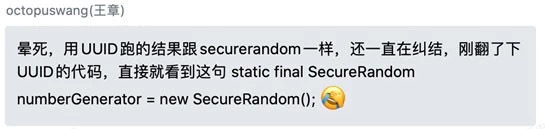

群聊出现好长时间的静默……那就研究一下SecureRandom吧，看看为什么它会这么慢，也了解Java随机数的一些相关背景知识。终于，下面这个知识点让我们重拾兴奋。（[https://zhuanlan.zhihu.com/p/72697237](https://zhuanlan.zhihu.com/p/72697237)）


我那句“采用ThreadLocalRandom替换SecureRandom计算Nonce”还未敲字出去，新一轮打脸已经开始了。


这个方向的讨论为本次性能优化之旅豁开了另一扇思考之门~

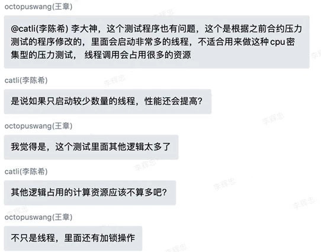


讨论很有道理，再仔细看数据，从数据层面也印证了这个想法。

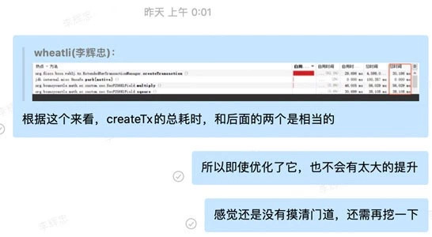


实验测试证明这是一个正确的方向，线程数降下来，这个热点就消失了。随机数那里出现热点是因为压测并发线程数开启太多，太多线程抢占资源导致随机数获取较慢。

### 再分析：找到令人震惊的热点

经过第一轮分析，算是找到一个“伪热点”，但性能提升依旧收效甚微。革命尚未成功，同志还需努力！降低线程数再跑一次性能分析，得到性能数据如下：


乍一看，热点分布又是很底层的基础库操作，焦虑又弥漫心头…伴着凌晨的静谧，群聊再一次陷入了无言的沉默……直到，我又抛出一个疑问。

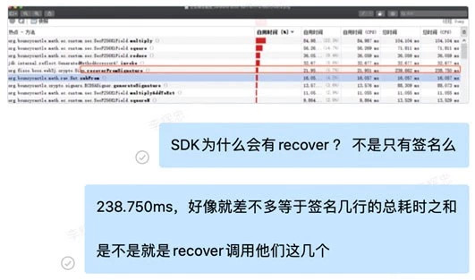

章鱼哥（王章）秒回，团队的激情苏醒了~为他这个回复速度，也为这个回复结果！

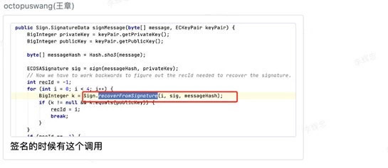

签名算法的实现，居然是先签名然后再做验签，而验签就是为了获得一个叫recoveryID的值（关于ECDSA的recovery原理，将在另一篇详细展开）。这里讲述一下我们为什么会兴奋。recoveryID设置的目的是为了给未来使用者可以从签名快速恢复出公钥，如果没有这个recoveryID，恢复公钥就需要遍历4种可能性，然而，这里的实现方式在生成签名的时候是通过遍历查找来计算出recoveryID。这种做法完全没有减小实际开销，只是采用“乾坤大挪移”把开销转移到签名环节了而已。实际上，recoveryID是有更快的计算方式可得到的，下一节可见。【这部分代码继承自web3j，之前没有深入考究其实现方式，当前web3j还仍然是这种实现】。出于老码农的本能，发现症状就想要第一时间先搞清楚问题影响边界在哪里，于是就有了这样的分析和尝试：

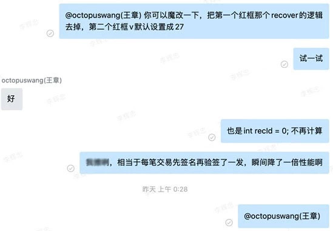

同样老司机的章鱼哥快速给出了可喜的结论：

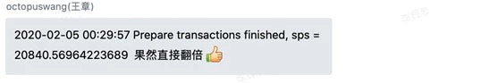

到这里，心里有底了！至少把recoverFromSignature干掉是能够翻倍提升性能的，至于怎么干掉，额…再说呗。出于好奇，想再看看此时的性能数据会怎样（幸亏好奇了一下）。

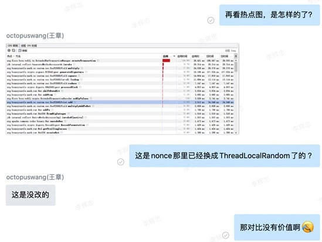

重新调整姿势（换成采用ThreadLocalRandom生成nonce，以及线程并发数降低为10的版本），再来一发，再次获得惊喜的数据。

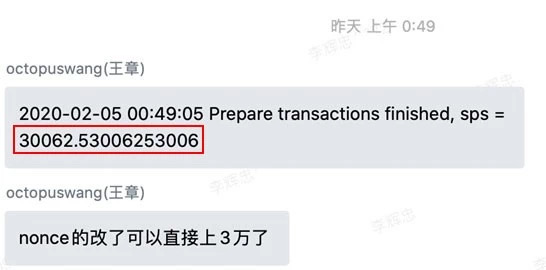


这种情况下，性能分布也比较均匀了，没有明显的热点。


凌晨一点，总算收获满意的成果，心情是棒棒的…一秒之后，脑回路蹦出来个问题“国密的会怎样呢？明天再说吧（国密的优化会在另一篇再详细讲）。


### 填坑：recoveryID的计算方法

由于对Java密码学算法库（bc-java）不够熟悉，此处也遇到不少坑，最终通过继承密码算法库，将更多所需参数暴露返回给上层，总算实现了Java版本的recoveryID计算。

```
// Now we have to work backwards to figure out the recId needed to recover the signature.
        ECPoint ecPoint = sig.p;
        BigInteger affineXCoordValue = ecPoint.normalize().getAffineXCoord().toBigInteger();
        BigInteger affineYCoordValue = ecPoint.normalize().getAffineYCoord().toBigInteger();

        int recId = affineYCoordValue.and(BigInteger.ONE).intValue();
        recId |= (affineXCoordValue.compareTo(sig.r) != 0 ? 2 : 0);
        if (sig.s.compareTo(halfCurveN) > 0) {
            sig.s = Sign.CURVE.getN().subtract(sig.s);
            recId = recId ^ 1;
        }
```

关于ECDSA算法的recover机制和recoveryID生成原理，将在后续的推送中详细展开，敬请期待。

## 后话

每一次做性能优化，都是一次很爽的体验，少不了熬夜，但永不缺激情。对代码进行抽丝剥茧，经历反复多次的发现瓶颈、无情打脸、重拾信心过程，最后到达柳暗花明。 再次用那两句话结尾：过早的优化是万恶之源，没有任何数据支撑的优化是万恶之源。共勉！