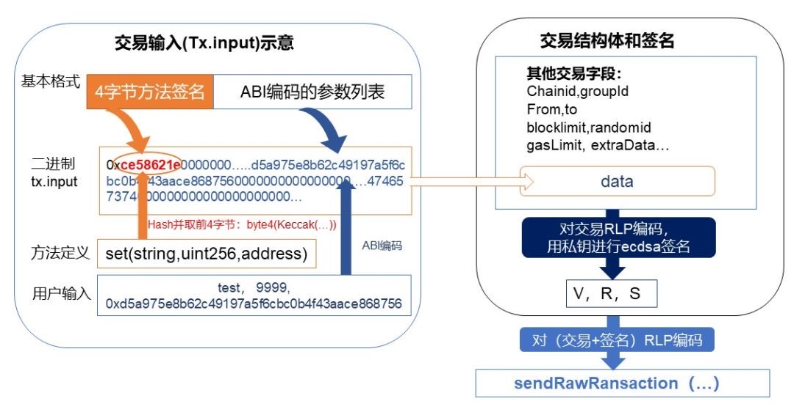

# 麻雀虽小五脏俱全 | 从Python-SDK谈谈FISCO BCOS多语言SDK

作者：张开翔｜FISCO BCOS 首席架构师

FISCO BCOS 2.0从发布起就自带官方控制台，经过社区持续使用打磨，已经足够强大、完善、友好。

社区还有用各种开发语言开发的区块链应用，为满足开发者方便管理区块链节点的需求，目前Python-SDK和Nodejs-SDK已经上架，go语言版本已经在路上。

----

本文以笔者最熟悉的Python-SDK为例，分享一些SDK开发的点滴，涵盖应用开发流程、协议编解码、网络通信和安全事项等。

FISCO BCOS自带快速搭建特性，五分钟一键搭链后，开发者只需连上区块链节点，写合约、发交易。

控制台和SDK的定位，是帮助用户快速访问区块链，开发测试智能合约，实现业务逻辑。根据“**奥卡姆剃刀**”原则，设计哲学应尽量轻、模块化、浅层次，不引入多余的功能，不给用户和二次开发者造成额外负担。

客户端控制台和SDK就像一辆操控好、配置精的快车，供开发者和用户驾驭，轻松惬意，尽情驰骋于区块链应用之路。

## 控制台体验

首先结合从准备环境到调用合约的全流程，体验下控制台，命令行交互界面风格如下：


#### 1. 准备环境

在开始之前，请先**通读使用手册和开发文档（非常重要！链接在文末）**，根据文档介绍，step by step初始化环境，安装依赖库，目前Python-SDK支持linux/mac/windows操作系统。

为了连上区块链节点，需要修改本地配置文件，填写区块链节点的对应网络端口，如果选择Channel协议，则需要配置相应的客户端证书。

#### 2. 在线体验

配置好网络后，可以运行console的get系列命令。试下手感，与FISCO BCOS亲密接触。确认链在正常工作，常用的指令有getNodeVersion、getBlockNumber、getPeers、getSyncStatus等，可以用console的usage或help命令了解所有支持的指令。

#### 3. 创建账户

创建一个新的帐户，即代表自己身份的公私钥对，发送交易时会采用私钥签名。创建的帐户用keystore格式保存在本地文件系统里，用户可以设定密码保护这个文件，注意记住创建帐户时使用的密码。

控制台提供的帐户相关命令是**newaccount, showaccount**（参数为账户名和密码）。如果要使用刚创建的新帐户为交易签名，记得把它配置到client_config.py文件的相应位置。

另外，如果账户信息需要高等级保护，则可以进行二次开发。将其放入加密机、TEE等安全区，以及开发秘钥分片、助记词等方案。

#### 4.编写合约

编写一个智能合约，或者参照SDK里自带的智能合约例子修改定制，实现自己的业务逻辑。本文重点关注solidity智能合约，FISCO BCOS还有一种“预编译合约”，采用C++开发，需要和FISCO BCOS底层代码联合编译。

#### 5. 编译部署

对合约进行编译，获得合约的ABI接口文件和BIN二进制代码文件。Python-SDK里有bcos_solc.py文件可帮助开发者简化编译器配置和调用，同时，只要正确配置了合约路径和编译器路径信息，直接运行控制台的部署或调用合约接口指令，也会尝试自动去编译合约，操作体验相当行云流水。

独立部署合约的话，可使用控制台的deploy指令，部署指令成功后会得到新的合约地址。参考命令是./console.py deploy SimpleInfo save，其中SimpleInfo是合约名（不需要带后缀），最后的"**save**"为可选，如果指定了"**save**"，则将合约新地址记录到本地文件里，以便后续使用。

#### 6. 调用合约：

用call或sendtx命令，指定合约名、合约地址、方法名、对应的参数，调用链上合约。

参考命令./console.py sendtx SimpleInfo last setbalance 100，即选择SimpleInfo合约，指向其最近部署成功的地址（用"**last**"指代，可以省掉复制粘贴合约地址的繁琐操作），调用setbalance接口，传入参数100。

交易在链上共识完成后，控制台会自动打印交易回执里的方法返回码、交易Event log信息列表等，供用户查看，如果错误，则打印异常信息。

如果一切正常，到此即可基本走通区块链应用之路。

值得一提的是，FISCO BCOS几个语言版本的控制台，都支持按Tab键提示指令和自动完成，帮助使用者流畅无错地操作，提升用户体验。

再进一步，如果希望有丰富多彩的、可视化交互式页面体验，不妨使用WeBASE中间件平台。

## 深入了解（Dive Deeper）

整个SDK的模块组合如下，可谓是麻雀虽小五脏俱全。


### 功能接口

支撑控制台等交互模块的，是已经封装完备、开箱即用的功能接口API，包括：

#### 1. get系列

诸多的“get”开头的接口，用于获取链上的各种信息，包括区块、交易、回执、状态、系统信息等等。虽然几十个get接口，但其实现逻辑基本一致，都是指定命令字和参数列表，请求和处理回应，实现起来也很快。

#### 2. call

对应合约的常量方法。所谓常量方法，是指合约里对应代码不修改状态，该请求不会全网广播，仅在指定节点上运行。

#### 3. sendRawTransaction

构建一个交易，用账户私钥签名，发送到链上，这种交易会被广播，进行共识处理，生成的状态数据会被全网确认。部署新合约这个操作，实际上也是一种交易，只是不需要指定目标合约地址。

相关的是**sendRawTransactionGetReceipt**，名字很长，在**sendRawTransaction**基础上增加了获取回执的流程**，**用于简化从发交易到获取回执的闭环流程。

#### 4.更多

针对FISCO BCOS的全局系统配置、节点管理、CNS、权限等系统级功能的API，其原理是读写链上的系统合约，详细指令列表见文末。
开发者可以参考控制台和client/bcosclient.py等代码，进行二次开发，实现更多更酷炫的功能。另外，SDK里内置了一系列的开发库和小工具，帮助管理帐户、输出日志、统一异常处理、简单的性能和耗时统计等。

## 合约开发相关

围绕着合约开发，Python-SDK实现了合约编译部署、合约地址本地化管理、ABI接口文件的管理，支持代码自动生成（参考codegen.py），一个命令行即可生成供业务端直接使用的代码，如

python codegen.py contracts/SimpleInfo.abi。

solidity合约编译后的ABI文件是个好东西。ABI 全称是 **Application Binary Interface**（应用程序二进制接口），里面详细描述了合约的接口信息，包括方法名、参数列表和类型、方法类型（常量方法，还是交易方法），以及Event log格式定义等等。

对ABI的管理，参见client/datatype_parser.py，加载和解析ABI文件（默认为JSON格式），根据方法名、方法4字节签名、方法类型等维度，灵活查询方法列表和方法定义，并针对方法定义、输入数据等进行编码解码，解析交易返回值、Event logs等。

有ABI定义在手，对合约的操控简直是可以随心所欲，开发者读懂了ABI描述，基本就能全面理解一个合约的输入输出，和合约毫无障碍地对话，这种“**面向远程接口编程**”的思想，很类似WSDL、IDL、ACE、ProtoBuffer和gRPC等经典软件设计。

事实上，整个SDK中最繁琐的是ABI编解码部分，为了兼容EVM，FISCO BCOS在交易处理时沿用了ABI编码，以及兼容RLP协议。

ABI、RLP制定了严格的规范，对基础数据类型、数组和变长数据、函数方法、参数列表等都有特定的编解码方式，否则组件之间无法通信，数据无法解析，虚拟机“不认识”所输入的交易，则不能执行合约。

如果自行手写这里的编解码，即使是熟手也得花不少时间，还要能保证测试通过、保持版本兼容，所幸github上已经有eth-abi、eth-utils、rlp等一系列开源项目（多为MIT宽松许可协议），可以引入这些项目且根据具体的需要进行修订（保留原作者声明和版权开源许可），能节约不少工作量，向这些项目作者们致谢，开源就是爽！

## 交易数据结构相关

在搞定了基础编解码之外，还需要实现 FISCO BCOS交易结构，重点注意支持并行处理交易增加的randomid、blocklimit字段，为支持群组特性增加的fiscoChainId和groupId字段，在交易的receipt里增加的交易output等。

其中，交易的blocklimit定义为“交易生命周期，该交易最晚被处理的块高”，SDK需要定期到链上查询当前块高，以确定当前交易的生命周期（比如，此交易允许在后续一百个区块内被处理）。

对于开发者来说，清晰理解交易的输入（tx.input）、交易回执（tx.receipt）、交易输出(tx.output)是非常重要的。



交易调用合约里的某一个方法时，首先将方法名字和参数类型列表组合，如**'set(string,uint256,address)'**，对这一段文本进行Keccak-256 (SHA-3)计算，并截取前4个字节做为“方法签名”（signature），然后对传入的参数，根据类型定义依次进行ABI编码，并和"方法签名"拼接一串二进制数据，做为交易的输入数据。

和交易结构体的其他字段（from、to、groupid、randomid等）一起再进行RLP编码，并用帐户私钥进行签名，得到一段二进制请求数据，由sendRawTransaction发往节点，节点收到后，立刻返回交易Hash给到客户端。

交易在链上被网络共识确认，处理完成后，通过getTransactionReceipt接口（传入之前获得的交易Hash），可以获得交易处理的详细结果。


在交易回执中，以下几个字段尤为关键：

#### 1. contractAddress

仅在部署合约交易时有效，表示新合约的地址。

#### 2. output

对应方法的return值，可用于判断业务逻辑的最终处理结果（取决于合约的写法）。

#### 3. Logs

如果在合约代码里，写了一些Event log， 则receipt的logs字段里可以解码出详细的信息。Event log可用于帮助客户端监听、跟踪交易的处理结果，甚至可以帮助开发者调试合约执行过程，相当于在合约里打调试日志。当然，在合约正式发布时，应清除调试的Event log，只保留必要的log，避免冗余信息存到链上。

Python-SDK客户端里内置了解析“方法签名”（根据4字节的signature，找到对应的方法定义）、交易input/output、receipt.logs等字段的方法。

在使用控制台命令行时，只要是查询交易和回执的指令，在命令行后面附带合约名（前提是使用者知道这个交易调用的是什么合约），也可以自动解析出相关的数据来，例如：./console.py getTransactionReceipt 0x79b98dbb56d2eea289f756e212d5b6e5c08960beaa8ea8331740fdcfaa8dcab1 SimpleInfo，最后这个“SimpleInfo”为可选合约名，不需要带后缀，要求在contracts/目录下有SimpleInfo.sol文件。

这个贴心小设计，可以帮助开发者直观探秘区块链交易的脉络，对各种信息一目了然，不会迷失在天书一样的十六进制字符海洋里。

## 网络协议

最后聊聊FISCO BCOS的两种网络协议：JSON RPC和Channel长连接。


JSON RPC连接没有证书验证和通信加密，建议在本身安全可信的环境里使用，比如本机或内网，一般用于运维管理和统计分析场合。

JSON RPC的格式相当简单通用，各种语言库都内置了JSON编解码以及HTTP请求协议实现，一般不需要自行开发，甚至可以采用curl、telnet等工具进行收发，如：

```
// Request
curl -X POST --data '{"jsonrpc":"2.0","method":"getBlockNumber","params":[1],"id":1}' http://127.0.0.1:8545 |jq
// Result
{    "id": 1,    "jsonrpc": "2.0",    "result": "0x1"    }
```

Channel协议是FISCO BCOS独有的协议，Channel协议的特点是安全高效，支持双向实时通信，可用于远程调用乃至公网的通信。

如果使用Channel长连接方式，则需要从区块链节点上获取SDK证书，放置到SDK项目的对应路径下，证书详见文末。

这个协议的数据包格式示意图如下，是一种TLV(Tag/Length/Value)风格的扩展实现：


**格式说明：**

1. 所有整形数编码都是网络序，大端（Big endian）；
2. Length实际上包含了从第一个字段到最后一个字段（data）的整个数据包的长度；
3. 包头（Length+Type+Seq+Result）为定长，为（4+2+32+4) = 42字节；
4. 数据体的实际长度根据具体内容而变，字节数为Length-42字节。

**Channel长连接通信和数据收发的要点如下：**

- 1. 采用TLSv1.2安全传输，SDK和节点之间需要加载证书，用证书握手、验证后才能建立长连接。

- 2. 长连接用心跳包维护，需要定期发起心跳包。

- 3. 数据按包为单位，编码成流数据传输，那么在收发数据时，需要持续从socket流里获取数据，按照数据包的格式，判断长度是否合法，数据是否收全，是否能正确的解析，对“部分收取”的数据，要保留在接受缓冲区里，待收取完成后再进行解析，不能丢弃，否则可能导致解析错误。


- 4. Channel协议支持双向通信，SDK可以主动请求节点，节点也可能往SDK推送消息，如区块链系统通知、数据更新通知、AMOP跨机构消息等。

- 5.  设计异步的、队列化、回调式消息处理机制，根据消息的序列号、指令类型、状态码等维度，正确处理消息。Python-SDK用了多线程以及Promise库，以尽量高速优雅地处理各种消息。

对socke流数据编程有一定经验的开发者，理解这个协议和实现它并不会很难。对Channel协议实现，数据包解析参见client/channelpack.py，通信和数据收发参见client/channelhandler.py。

## 总结

Python-SDK的开发始于今年6月中旬，写出第一个可用版本只花了一个星期，然后雕琢用户交互细节，以及进行代码优化、文档完善，并进行多轮测试保证质量，团队其他同学实现Nodejs版本SDK的用时也差不多。
总的来说，在有一些基础代码参考的前提下，开发一个FISCO BCOS 特定语言版本SDK，还是挺敏捷写意的事情，一点儿也不难，Just for fun。
在各语言版本SDK开发和迭代过程中，FISCO BCOS团队和社区开发者一直保持沟通交流，纳入优质pull request，在体验中持续优化。

欢迎社区开发者根据自身使用场景的实际情况，继续完善现有SDK，或贡献更多语言类型的FISCO BCOS SDK，帮助更多开发者顺畅地走在区块链之路上。
最后，感谢杰哥、安总、小白、wheat等同学，以及多位社区开发者对Python-SDK的重要贡献。

------

#### 参考资料

- [FISCO BCOS官方控制台](https://github.com/FISCO-BCOS/console)
- [Python-SDK](https://github.com/FISCO-BCOS/python-sdk)
- [Nodejs-SDK](https://github.com/FISCO-BCOS/nodejs-sdk)
- [FISCO BCOS安装](https://fisco-bcos-documentation.readthedocs.io/zh_CN/latest/docs/installation.html#fisco-bcos)
- [合约开发教程](https://fisco-bcos-documentation.readthedocs.io/zh_CN/latest/docs/manual/smart_contract.html)
- [WeBASE](https://fintech.webank.com/webase)
- [ABI](https://solidity.readthedocs.io/en/latest/abi-spec.html)
- [RLP](https://github.com/ethereum/wiki/wiki/RLP)
- [交易数据结构](https://fisco-bcos-documentation.readthedocs.io/zh_CN/latest/docs/design/protocol_description.html)
- [RPC原理](https://fisco-bcos-documentation.readthedocs.io/zh_CN/latest/docs/design/rpc.html)
- [Channel协议定义](https://fisco-bcos-documentation.readthedocs.io/zh_CN/latest/docs/design/protocol_description.html#channelmessage-v1)
- [SDK证书](https://fisco-bcos-documentation.readthedocs.io/zh_CN/latest/docs/manual/certificates.html)
- [AMOP跨机构](https://fisco-bcos-documentation.readthedocs.io/zh_CN/latest/docs/manual/amop_protocol.html)

