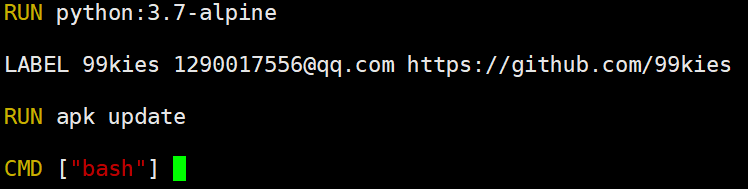
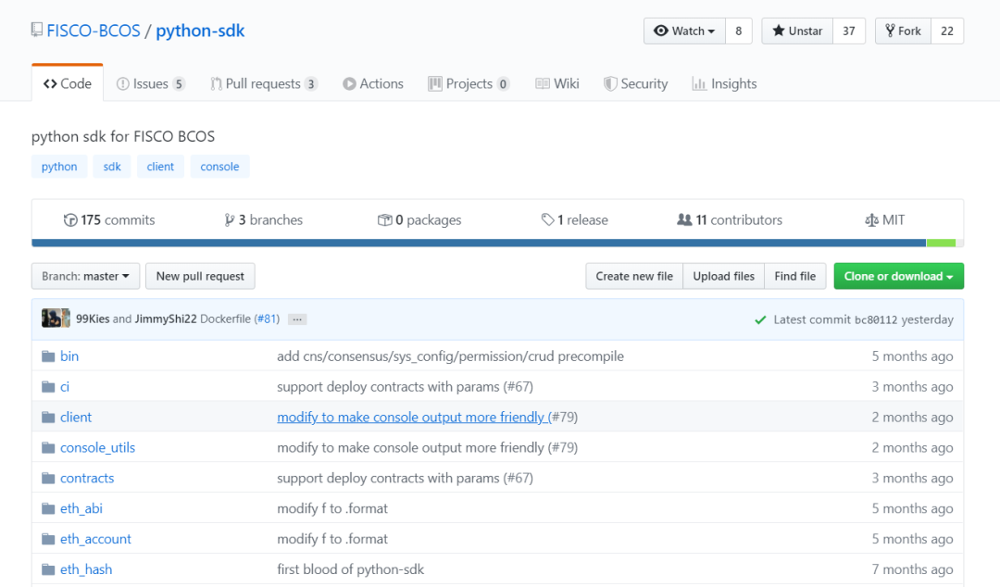

# FISCO BCOS即拆即用的“Python区块链盒子”

作者：汤会枫｜FISCO BCOS开源社区贡献者

作者为Python开发者，将FISCO BCOS Python SDK封装成镜像，以提升配置环境的速度，提高易用性。

## 前言

作为一个 Python 开发者，我一直想通过 Python 去了解区块链。机缘巧合下，在 2019 年一次开源年会上，我接触并加入了 FISCO BCOS 开源社区，此后，一直用课余时间琢磨 FISCO BCOS 的 Python-SDK。

在配置环境的时候，我耗费了一些时间，因此也萌生了将整个框架封装成一个 docker 镜像的想法，我为它取名“Python 区块链盒子”，就像 Minecraft 的“工作台”一样， 可以提升配置环境的速度，提高易用性。有了这样的想法，我便开始利用课余的时间着手去编写 Dockerfile。




我把搭建好的 docker 镜像分享给周围的同学体验，“即拆即用”的特性反响很好，大家不会因为环境配置难而退怯，能像Minecraft里的Steve一样，放下“工作台”就可以制造出一堆有用的工具出来。

## 什么是“Python 区块链盒子”？

在回答这个问题之前，先来了解一下 Python-SDK。这是由 FISCO BCOS 开源，帮助开发者运用 Python 语言开发区块链应用的组件。既然是通过 Python 语言开发，我相信它将有持续不断的生命力。




Python 的阅读难度相对比较低，特别方便学生、初学者通过 Python-SDK 去了解、学习区块链。可尝试按以下环境要求安装搭建。

- Python 环境：python 3.6.3, 3.7.x
- FISCO BCOS 节点：请参考 [FISCO BCOS 安装搭建](https://fisco-bcos-documentation.readthedocs.io/zh_CN/latest/docs/installation.html)

关于 Python-SDK，可点击参考 FISCO BCOS 团队推出的开发教程。

- [《麻雀虽小五脏俱全 | 从 Python-SDK 谈谈 FISCO BCOS 多语言 SDK》](http://mp.weixin.qq.com/s?__biz=MzA3MTI5Njg4Mw==&mid=2247485291&idx=1&sn=c359380a89621d1a64856183568825ee&chksm=9f2ef577a8597c61e5dd5e458d489926138a42808a06517f4d6515d4666dc11a08646ccebea2&scene=21#wechat_redirect)
- [《Python-SDK 的前世今生》](http://mp.weixin.qq.com/s?__biz=MzA3MTI5Njg4Mw==&mid=2247485256&idx=1&sn=f1e70be6c53ea7e690392ce1ac8b5f5e&chksm=9f2ef554a8597c4278c630f60923a683b9e47499319e31aab41ccfd98715a9db2300e7d782e3&scene=21#wechat_redirect)

“Python 区块链盒子”相当于将配置好的 Python-SDK 和部署好的区块链打包成一个包裹，类似于将一个大房子整理成一辆房车。通过这种方式，用户无需关注环境配置问题，可减少部署时间——不用一分钟就能获得镜像，方便开发者快速上手使用，便于自动化运维。你也可以尝试将这个服务和 JenKins 结合，进一步优化运维过程。“Python 区块链盒子”可以当成 Python 区块链开发的工作台，一个现拆现用的工具箱，而且可以保证开发环境的整洁，最重要的是它很轻，就像 Minecraft 里的工作台。

只要你有一台计算机，就可以随时随地打开这个工具箱。安装工具箱的过程也变成了享受：只需一行代码就能上手直接研究开发，不必过多关注环境配置的繁杂，能节省大量时间，解放双手。

## 获得并运行“Python 区块链盒子”

可以通过以下部署来获得这个“盒子”。

```
docker run -it -p 20200:20200 --name python_sdk fiscoorg/playground:python_sdk
```

进入容器后，首先需要启动节点，启动节点后就可以“食用”了。在这个过程中，请注意不要使用 sh。

```
bash /root/fisco/nodes/127.0.0.1/start_all.sh
```

随后，在/python_sdk 中进行调试，调试过程中的小贴士：console.py 添加了 tab 自动补全。

```

# 查看 SDK 使用方法
./console.py usage

# 获取节点版本
./console.py getNodeVersion
```

```
bash-5.0# ./console.py getNodeVersion

INFO >> user input : ['getNodeVersion']
INFO >> getNodeVersion >> { "Build Time": "20190923 13:22:09", "Build Type": "Linux/clang/Release", "Chain Id": "1", "FISCO-BCOS Version": "2.1.0", "Git Branch": "HEAD", "Git Commit Hash": "cb68124d4fbf3df563a57dfff5f0c6eedc1419cc", "Supported Version": "2.1.0" }
```

完成这些之后就成功了，前前后后，相当于在几秒内就搭建了一个开源的区块链框架。你可以把自己的合约放到/python-sdk/contracts 中，更多可以参考 [Python-SDK 的使用方法](https://github.com/FISCO-BCOS/python-sdk)。这个即拆即用的“区块链盒子”对于要使用 Python 来开发区块链应用或者学习区块链的开发者很有帮助。开发者可以通过调用/python-sdk/client 中的函数使用 ./console.py 命令行并与盒子中正在运行的区块链进行交互。

下面将会以 Python-Flask 开发作为例子，实现调用 HelloWorld 合约的功能。

- step1 进入容器

```
docker run -it -p 20200:20200 -p 80:80 --name flask_web fiscoorg/playground:python_sdk
```

- step2 启动节点

```
bash /root/fisco/nodes/127.0.0.1/start_all.sh
```

- step3 部署 HelloWorld 合约

/python-sdk/contract 下存放了 HelloWorld.sol，可以直接使用这个合约进行测试。首先，查看 HelloWorld.sol 合约的内容。

```
pragma solidity ^0.4.24;

contract HelloWorld{
   string name;

   constructor() public{
      name = "Hello, World!";
  }

   function get() constant public returns(string){
       return name;
  }

   function set(string n) public{
       name = n;
  }
}
```

可以通过 get 接口返回字符串 name 的值，通过 set 更新 name 的值。有 Solidity 编程基础的开发者还可以自己定制合约内容。然后，就可以部署 HelloWorld 合约。

```
$ ./console.py deploy HelloWorld save

INFO >> user input : ['deploy', 'HelloWorld', 'save']

backup [contracts/HelloWorld.abi] to [contracts/HelloWorld.abi.20190807102912]
backup [contracts/HelloWorld.bin] to [contracts/HelloWorld.bin.20190807102912]
INFO >> compile with solc compiler
deploy result  for [HelloWorld] is:
{
   "blockHash": "0x3912605dde5f7358fee40a85a8b97ba6493848eae7766a8c317beecafb2e279d",
   "blockNumber": "0x1",
   "contractAddress": "0x2d1c577e41809453c50e7e5c3f57d06f3cdd90ce",
   "from": "0x95198b93705e394a916579e048c8a32ddfb900f7",
   "gasUsed": "0x44ab3",
   "input": "0x6080604052...省略若干行...c6f2c20576f726c642100000000000000000000000000",
   "logs": [],
   "logsBloom": "0x000...省略若干行...0000",
   "output": "0x",
   "status": "0x0",
   "to": "0x0000000000000000000000000000000000000000",
   "transactionHash": "0xb291e9ca38b53c897340256b851764fa68a86f2a53cb14b2ecdcc332e850bb91",
   "transactionIndex": "0x0"
}
on block : 1,address: 0x2d1c577e41809453c50e7e5c3f57d06f3cdd90ce
address save to file: bin/contract.ini
```

完成后可得到 HelloWord 合约部署的地址，通过这个地址调用函数接口。

- step4 在/python-sdk 文件夹下编辑 app.py

```
$ vi app.py

# -*- coding:utf-8 -*-
from client.common import transaction_common
from flask import Flask, request 
from jinja2 import escape

app = Flask(__name__)

tx_client = transaction_common.TransactionCommon("0x2d1c577e41809453c50e7e5c3f57d06f3cdd90ce","contracts","HelloWorld")
# tx_client = transaction_common.Transaction_Common("地址","合约路径","合约名称")

@app.route('/')
def index():
   '''
  调用 get 接口，获得 HelloWorld 的字符串
  '''
   new_str = request.args.get('new_str')
   # 通过 new_str 的值更新 HelloWorld 的字符串
   if new_str:
       tx_client.send_transaction_getReceipt("set",(new_str,))
       # 若 new_str 不为空则更新字符串
   return escape(str(tx_client.call_and_decode("get")))

if __name__ == '__main__':            
   app.run(host="0.0.0.0", port=80)
```

- step5 安装 app.py 依赖/运行程序

```
pip install flaskpython app.py
```

这样就通过 Python-Flask 框架实现了调用 HelloWorld 合约，通过调用 get 接口查看字符串，调用 set 接口更新字符串。FISCO BCOS 的 Python-SDK 十分适合像我这样的学生党或者初学者去研究和了解区块链技术。十分期待更多开发者参与其中，用它搭建出更多有趣好玩的开源项目。Dockerfile 地址请参考文末，最近我也会对其做一些更新，提升其操作易用性，最新操作手册和消息将在GitHub上发布，欢迎大家关注。点击参考[更多Python Demo](https://fisco-bcos-documentation.readthedocs.io/zh_CN/latest/docs/sdk/python_sdk/demo.html)。

## 3. 提交 pr 体验

关于如何在 FISCO BCOS 中提交 pr 可点击参考开源社区整理的内容，这里不多做说明。详情请见[《揭秘 FISCO BCOS 开源项目开发协作》](http://mp.weixin.qq.com/s?__biz=MzA3MTI5Njg4Mw==&mid=2247485380&idx=1&sn=1f32ddad49b542206d24739f3de98b95&chksm=9f2ef5d8a8597cce973c9321543174de0e9a0bfebf1750cef4f6ae1641f4d189ea22d616cf98&scene=21#wechat_redirect)

我想分享一下个人提交 pr 的体验，整个过程既新奇又有趣。萌生“区块链盒子”的 idea 之后，我很快就编写了第一个 Dockerfile，随即就提交了 pr。很快社区的小哥哥石翔就回复了我，刚开始我以为是国外友人，就一直用" Poor English "和他交流。他十分欢迎我的pr，还不断给我点赞和支持，他不但解决了许多在配置过程中的问题，还时不时分享一些小故事鼓励我。在合并我的pr过程中，十分感谢团队的热情帮助，及时向我提出review意见，并细心给我介绍需要添加的内容功能，这让我充分感受到 FISCO BCOS 社区和睦共处、互帮互助的氛围。

目前，“Python 区块链盒子”还有一些有待优化的地方，例如，每次启动一个容器都需要手动操作，启动节点的条件是-->机器暴露所需端口，默认是 20200, 8045, 30300。后期可能会考虑对默认启动节点的功能进行优化，添加数据卷，以及优化容器大小，使 fiscoorg/playground:python_sdk 更精致。如果你有不错的优化想法，欢迎提交 pr，来一次有趣新奇的 pr 体验

------

#### 参考链接

- [Dockerfile](https://github.com/FISCO-BCOS/python-sdk/blob/master/Dockerfile)

