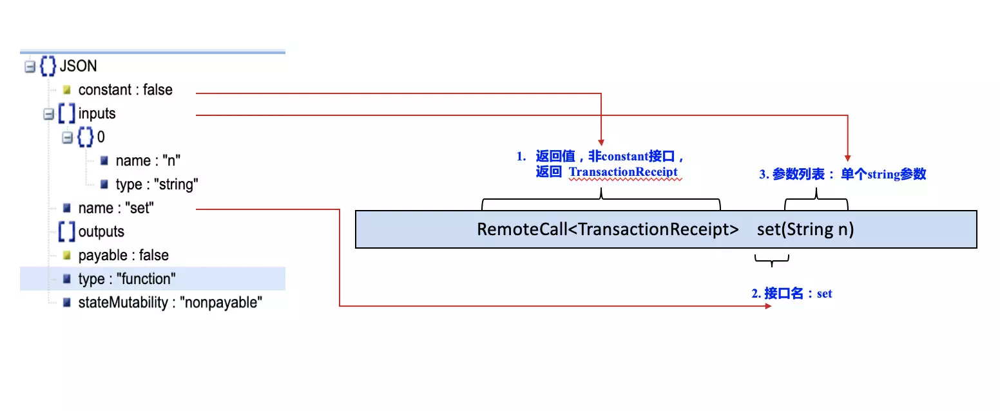
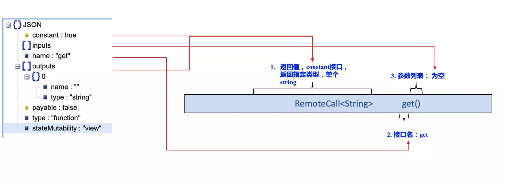
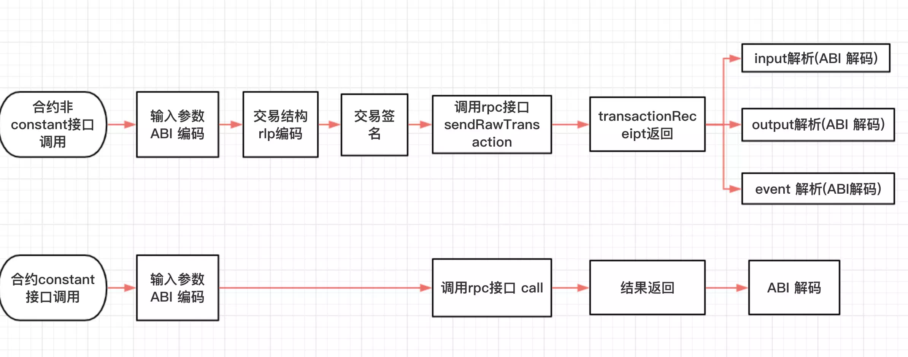

# 杂谈Java合约代码

作者：王章｜FISCO BCOS 核心开发者

FISCO BCOS提供了多种语言的SDK，包括Go、NodeJS、Python和Java。Java SDK不同于其他语言SDK，调用合约时，用户需要使用合约编译工具将Solidity合约源码生成对应的Java代码。这个由合约编译工具生成的与Solidity合约同名的Java代码，我们俗称Java合约代码，本文将介绍如何生成以及使用这份代码。

## 如何生成Java合约代码

合约编译工具可将Solidity源码生成对应的Java代码，具体使用方式可参考[以下链接](https://fisco-bcos-documentation.readthedocs.io/zh_CN/latest/docs/console/console.html#id10)。在说明合约编译工具如何生成Java合约代码之前，先介绍合约ABI的概念。ABI的定义为：

```
The Contract Application Binary Interface (ABI) is the standard way to interact with contracts in the Ethereum ecosystem, both from outside the blockchain and for contract-to-contract interaction.
```

ABI是以太坊生态系统中与合约交互的标准方式，包括了外部客户端与合约的交互、合约与合约之间的交互。更通俗的理解，ABI是合约接口的具体描述，包含合约的接口列表、接口名称、参数名称、参数类型、返回类型等等。这种描述通常为JSON格式，见[ABI格式详情](https://solidity.readthedocs.io/en/develop/abi-spec.html#json)。在EVM生态中，Solidity编译器可以生成合约ABI信息。合约编译工具生成Java代码时，编译Solidity合约生成ABI信息，并解析ABI文件，根据ABI文件的描述内容，确定合约包含的接口列表、各个接口的输入参数名称/类型列表、返回类型等信息。根据这些信息，合约编译工具为生成的Java合约合约类生成接口。具体可参考以下例子。

```
// 示例合约  HelloWorld.sol
pragma Solidity ^0.4.25;

contract HelloWorld {
    string name;
    function HelloWorld(){
       name = "Hello, World!";
    }
    
    function get()constant returns(string){
        return name;
    }
    function set(string n){
        name = n;
    }
}
```

HelloWorld合约ABI：

```
[{"constant":false,"inputs":[{"name":"n","type":"string"}],"name":"set","outputs":[],"payable":false,"type":"function","stateMutability":"nonpayable"},{"constant":true,"inputs":[],"name":"get","outputs":[{"name":"","type":"string"}],"payable":false,"type":"function","stateMutability":"view"},{"inputs":[],"type":"constructor","payable":true,"stateMutability":"payable"}]
```

上述代码包含三个接口的描述信息：set、get、constructor(默认构造函数，无参数不处理)。关于set与get接口的生成可参考如下图示。

### set接口




### get接口



最终生成的HelloWorld.java类：

```
// HelloWorld.java 
// 注意：这里省略了无关内容，只保留了核心接口
public class HelloWorld {
    public RemoteCall<TransactionReceipt> set(String n);
    public RemoteCall<String> get();
}
```

**HelloWorld.java类中set、get分别是对HelloWorld合约get、set调用的封装。**从上述介绍中可以看出，合约编译工具通过编译获取合约ABI信息，通过解析ABI内容获取合约接口描述信息，为Java类生成对应接口。

## 面向Java对象

了解了如何生成Java合约代码，接下来将会说明如何通过生成的接口实现对合约的调用。这里仍然以HelloWorld合约说明如何调用接口:

```
HelloWorld helloWorld;    // 初始化HelloWorld对象，省略
TransactionReceipt receipt = helloWorld.set("HelloWorld").send();    // 调用set接口
```

Java SDK这种调用合约的姿势可以总结为：面向Java对象操作合约。在这种方式下，用户只需使用合约编译工具生成Java合约类，对合约的所有操作基于构造的Java合约对象，不需要再关注合约ABI，发送接受细节、交易打包编码、结果返回的解码等屏蔽的细节。具体调用合约方式请参考[Java SDK教程](https://fisco-bcos-documentation.readthedocs.io/zh_CN/latest/docs/sdk/java_sdk.html)。值得一提的是，在特定场景下，面向对象的Java调用方式显然无法满足需求，比如：无法预先生成Java合约代码，或者，交易签名与交易构造服务需要分离。在这些场景下，使用类似nodejs/python sdk的姿势会更灵活。但最灵活的还是，用户自己关心交易编解码、打包、签名、发送、收回包、解码的整体流程。




## 总结

Java SDK的使用，帮助用户屏蔽编码、签名、发送、接收、解码等流程的细节，通过前期合约ABI转换生成Java合约代码，可以做到一次转义多处使用。但是也有用户希望能够掌握交易发送的全过程，或者是在特定场景下要实现交易发送各个流程的解耦。这种情况下，NodeJS、Python、Go版本的客户端对这些细节的支持更为完善，Java SDK也会逐步开放各个模块的接口，敬请期待。