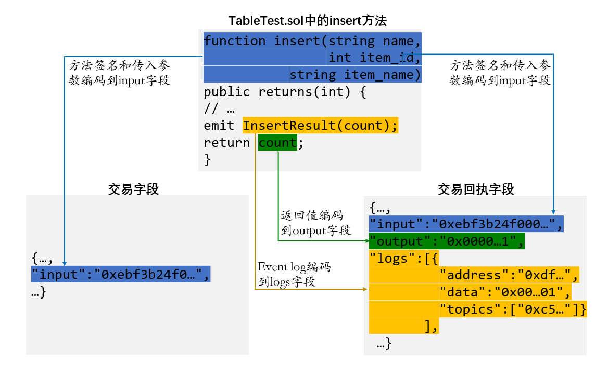

# FISCO BCOS 交易解析工具指南

作者：廖飞强｜FISCO BCOS 核心开发者

> 本文将介绍 FISCO BCOS的交易解析工具，帮助开发者简单快捷地解析交易和交易回执中的input、output、 logs字段，助力区块链应用开发。

社区用户经常询问：FISCO BCOS的智能合约支持发送交易后，直接获取返回值吗？交易和交易回执中的input、output和logs字段存的是什么，挺好奇，可解吗？怎么解？

现在，让FISCO BCOS交易解析工具来揭开这神秘的面纱！

## What: 解析什么？

解析工具解析的是交易和交易回执中的三个重要字段，分别是input、output和logs。这个三个字段分别代表什么，与智能合约有什么关系？下面请出一张图进行分析。



图中为了突出重点，只显示TableTest.sol合约中涉及到交易解析字段的关键代码（TableTest.sol合约是控制台提供的示例合约，用于创建示例表t_test，并提供增删改查方法。完整合约代码可以到控制台目录contracts/solidity/下查阅，或直接通过文档查阅，请参考：https://fisco-bcos-documentation.readthedocs.io/zh_CN/latest/docs/manual/smart_contract.html#crud）。

交易和交易回执字段，同样只突出要解析的input、output和logs字段，其他字段省略。其中交易信息包含input字段，交易回执信息包含input、output和logs字段**（注：**FISCO BCOS 2.0.0及以上版本返回的交易回执包含input字段**）。

从图中可以看到，蓝色部分是insert方法的签名，方法签名部分和调用该方法传入的参数，将编码到交易和交易回执的input字段（十六进制字符串）。

绿色部分是方法的返回值，这部分将编码到交易回执的output字段（十六进制字符串）。这里可以解答用户的一个疑问，**即FISCO BCOS的智能合约支持发送交易后获取返回值，该返回值将会编码保存在交易回执的output字段，并且利用交易解析工具可以解析返回值**。

橙色部分是方法调用的event，可以记录event log信息，这部分将编码到交易回执的logs字段（其中address为调用的合约地址，data是event log数据的十六进制编码，topic是event签名的十六进制编码）。

由此可知，合约方法的输入，输出以及event log均编码到了交易和交易回执对应的input、output和logs字段。要知道一个交易或交易回执是调用了合约的哪个方法，输入、输出和event log分别是什么数据，只要解析这个三个字段即可，这正是交易解析工具要解决的问题！

## How: 如何使用？

交易解析是web3sdk 2.0.4及以上版本提供的功能。其使用非常简单，三步曲如下：

### step 1: 引入web3sdk 2.0.5依赖

**Gradle 项目**:

compile ('org.fisco-bcos:web3sdk:2.0.5')

**Maven 项目**:

<dependency>

  <groupId>org.fisco-bcos</groupId>

  <artifactId>web3sdk</artifactId>

  <version>2.0.5</version>

</dependency>

### step 2: 创建交易解析对象TransactionDecoder

使用TransactionDecoderFactory工厂类创建交易解析对象TransactionDecoder，提供两种方式：

1. TransactionDecoder buildTransactionDecoder(String abi, String bin)，传入的参数分别是合约的abi和bin字符串（bin字符串暂不使用，可以直接传入空字符串）。
2. TransactionDecoder buildTransactionDecoder(String contractName)，传入合约名称。需要在应用的根目录下创建solidity目录，将交易相关的合约放在solidity目录，通过指定合约名获取交易解析对象。

**注意**：创建交易解析对象前，请确定解析该交易对应的合约（即该交易是由调用该合约产生的），可以直接提供solidity合约或者用户自行编译，然后传入合约的abi，两种方式均可创建交易解析对象。

### step 3: 调用交易解析对象进行解析任务

TransactionDecoder对input，output和logs的解析结果均分别提供返回java对象和json字符串（java对象的json字符串形式）的方法。详细设计文档请参考：https://fisco-bcos-documentation.readthedocs.io/zh_CN/latest/docs/sdk/sdk.html#id11。

java对象方便服务端处理数据，json字符串方便客户端处理数据。

交易解析对象的方法列表如下：

| 解析input  | InputAndOutputResult decodeInputReturnObject(String input)   |
| ---------- | ------------------------------------------------------------ |
|            | String decodeInputReturnJson(String input)                   |
| 解析output | InputAndOutputResult decodeOutputReturnObject(String input, String output) |
|            | String decodeOutputReturnJson(String input, String output)   |
| 解析logs   | Map<String, List<List<EventResultEntity>>> decodeEventReturnObject(List<Log> logList) |
|            | String decodeEventReturnJson(List<Log> logList)              |

其中InputAndOutputResult类，ResultEntity类和EventResultEntity类的结构如下:

```
public class InputAndOutputResult {
   private String function;             // 方法签名
   private String methodID;             // 方法签名编码的字符串，用于方法选择器
   private List<ResultEntity> result;   // 数据列表
 }
public class ResultEntity {
   private String name;   // 字段名称
   private String type;   // 字段类型
   private Object data;   // 字段值
 }
public class EventResultEntity extends ResultEntity {
   private boolean indexed;  // indexed标志位，true表示event字段使用了indexed关键字修饰
 }
```

根据交易对象，可以获取其input字段；根据交易回执对象，可以获取其input、output和logs字段。调用交易解析对象对应的方法即可解析相关字段。

**注意**：如果解析FISCO BCOS 2.0.0之前的版本(即rc1、rc2、rc3版本)返回的交易回执中的output字段，因为解析output字段的方法需要传入input字段，但交易回执中缺少input字段，则可以根据交易回执中的hash字段，查询一次web3j对象的getTransactionByHash方法获取交易对象，然后从交易对象获取input字段，即可解析output字段。

解析示例：

下面示例解析调用TableTest合约的insert方法，输入参数为(fruit, 1 ,apple)，返回值为1（代表新增1条记录）时产生的交易和交易回执。解析其input、outout和logs字段，其解析结果如下：

| input  | java对象：[function=insert(string,int256,string), methodID=0xebf3b24f, result=[ResultEntity [name=name, type=string, data=fruit], ResultEntity [name=item_id, type=int256, data=1], ResultEntity [name=item_name, type=string, data=apple]]] |
| ------ | ------------------------------------------------------------ |
|        | json字符串：{"function":"insert(string,int256,string)","methodID":"0xebf3b24f","result":[{"name":"name","type":"string","data":"fruit"},{"name":"item_id","type":"int256","data":1},{"name":"item_name","type":"string","data":"apple"}]} |
| output | java对象：[function=insert(string,int256,string), methodID=0xebf3b24f, result=[ResultEntity [name=, type=int256, data=1]]] |
|        | json字符串：{"function":"insert(string,int256,string)","methodID":"0xebf3b24f","result":[{"name":"","type":"int256","data":1}]} |
| logs   | java对象：{InsertResult(int256)=[[EventResultEntity [name=count, type=int256, data=1, indexed=false]]]} |
|        | json字符串：{"InsertResult(int256)":[[{"name":"count","type":"int256","data":1,"indexed":false}]]} |

由解析结果可知，根据TableTest.sol合约的abi和交易回执中的input、output以及logs字段，通过交易解析工具可以解析出其调用的合约方法名、参数类型、参数值、返回类型、返回值以及event log数据。这就是我们期待的交易解析效果！

## Where: 使用场景在哪里？

是英雄，一定有用武之地！交易解析工具入场的地方包括如下场景：

- **控制台**：控制台1.0.4版本已使用交易解析工具解析查询的交易、交易回执以及调用合约时的相关字段。[具体用法](https://fisco-bcos-documentation.readthedocs.io/zh_CN/latest/docs/console/console.html#call)
- **区块链浏览器、WeBASE管理平台**：用于解码交易和交易回执中的字段，便于交易详情展示。
- **基于web3sdk的区块链应用**：比较重要的意义是用于获取合约方法的返回值，以往一般对于发送交易的方法，习惯用event记录数据，而方法的返回值处于闲置状态。现在可以使用返回值，并利用交易解析工具解析返回值，助力业务开发。

总之，哪里需要交易字段解析，哪里就可以调用交易解析工具！