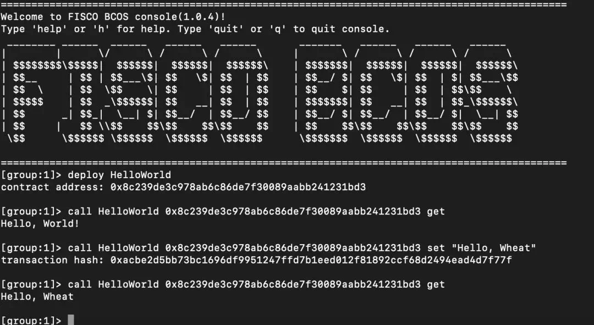
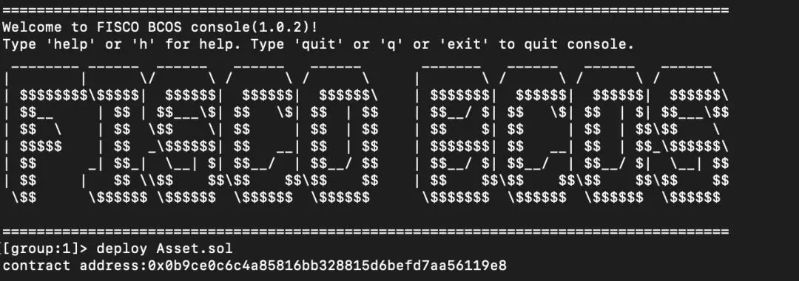

# FISCO BCOS零基础入门，五步轻松构建应用

作者：李辉忠｜FISCO BCOS 高级架构师

本文面向零区块链基础入门 FISCO BCOS的开发者，以高纯度、超浓缩的极简方式，分享如何快速基于 FISCO BCOS 构建你的第一个DAPP应用。

社区经常有人会问：FISCO BCOS项目有10W+行源代码，10W+字说明文档，几十个子项目，我该如何下手，怎样入门 ？
莫慌，五步入门宝典已备好！！！

## 第一步：构建一条FISCO BCOS的链

安装文档里给了一箩筐事无巨细的介绍，但此文就是要简明扼要地告诉你：**三步就能召唤FISCO BCOS !**

(请先在home目录创建fisco目录，接下来都在这个目录操作）

```bash
$ curl -LO https://github.com/FISCO-BCOS/FISCO-BCOS/releases/download/`curl -s https://api.github.com/repos/FISCO-BCOS/FISCO-BCOS/releases | grep "\"v2\.[0-9]\.[0-9]\"" | sort -u | tail -n 1 | cut -d \" -f 4`/build_chain.sh && chmod u+x build_chain.sh
```

```eval_rst
.. note::
    - 如果因为网络问题导致长时间无法下载build_chain.sh脚本，请尝试 `curl -#LO https://gitee.com/FISCO-BCOS/FISCO-BCOS/raw/master/tools/build_chain.sh && chmod u+x build_chain.sh`
```

执行`build_chain.sh`脚本，启动四个节点：

```bash
$ bash build_chain.sh -l 127.0.0.1:4 -p 30300,20200,8545
$ bash nodes/127.0.0.1/start_all.sh
```

你可以通过执行`*ps -ef | grep -v grep | grep fisco-bcos*`查看到四个节点已经在运行。


当然，如果你还是需要阅读详细文档，请参考【安装】：https://fisco-bcos-documentation.readthedocs.io/zh_CN/latest/docs/installation.html#fisco-bcos

## 第二步：安装一个交互式控制台

控制台是一个可以交互式访问区块链，进行区块链数据读写请求的工具。无需太多解释，**四步完成控制台安装：**

下载控制台：

```bash
$ curl -#LO https://github.com/FISCO-BCOS/console/releases/download/v2.7.1/download_console.sh && bash download_console.sh -c 1.2.0
```

```eval_rst
.. note::
    - 如果因为网络问题导致长时间无法下载控制台，请尝试命令 `curl -#LO https://gitee.com/FISCO-BCOS/console/raw/master/tools/download_console.sh && bash download_console.sh -c 1.2.0`
```

配置并启动控制台：

```bash
$ cp -n console/conf/applicationContext-sample.xml console/conf/applicationContext.xml
$ cp nodes/127.0.0.1/sdk/* console/conf/
$ cd console && ./start.sh
```

此时，你已经进入控制台界面，可以通过help查看命令列表，通过getPeers获取节点连接列表，通过exit或quit命令退出控制台。

同时，控制台内置了一个HelloWorld合约，可以直接调用deploy HelloWorld进行部署，然后调用call HelloWorld进行访问。



## 第三步：编写一个Solidity合约

教程文档依然是循序渐进地指导，但其实！遵循业务合约编写**三部曲：****存储设计->接口设计->逻辑实现，**就足以顺利完成业务合约。

如果你还是习惯阅读详细文档，请参考【教程】：https://fisco-bcos-documentation.readthedocs.io/zh_CN/latest/docs/tutorial/sdk_application.html

以文档中的资产转移应用为例，支持链上用户的资产登记、查询、转移功能：

- **存储设计：基于分布式存储，设计存储表结构**

| account | asset_value |
| ------- | ----------- |
| alice   | 10000       |
| bob     | 20000       |

- **接口设计：基于业务需求，设计合约接口**

```
// 查询资产金额
function select(string account) public constant returns(int256, uint256)

// 资产注册
function register(string account, uint256 amount) public returns(int256)

// 资产转移
function transfer(string from_asset_account, string to_asset_account, uint256 amount) public returns(int256)
```

- **逻辑实现：基于CRUD接口，实现业务逻辑**

asset.sol合约：https://fisco-bcos-documentation.readthedocs.io/zh_CN/latest/docs/tutorial/sdk_application.html


## 第四步：合约编译与部署

Solidity合约需要通过编译器转换成机器（虚拟机）可执行的二进制，这些二进制是一系列OpCode的组合，虚拟机将解析执行这些OpCode实现合约业务逻辑。

编译之后的合约需要通过工具部署到区块链（写入区块链账本），之后才可以根据合约接口描述文件（ABI）进行调用访问。

额，老毛病犯了，又唠唠叨叨讲原理，还是讲讲**如何无脑一键完成合约编译与部署吧：**

参考说明文档【控制台】的deploy命令：https://fisco-bcos-documentation.readthedocs.io/zh_CN/latest/docs/console/console.html

将Assert.sol放置在console/solidity/contract目录，在控制台执行deploy Assert.sol即可完成合约的编译以及部署。



## 第五步：开发业务

继续假设采用Java开发业务，当然也假设你熟悉eclipse、gradle、spring等常用工具。

1、建立一个Gradle Java工程asset-client，通过IntelliJ IDEA或者Eclipse；

2、编译build.gradle，增加maven库依赖；

**repositories增加**：maven {url "http：//maven.aliyun.com/nexus/content/groups/public/"}maven{url "https：//dl.bintray.com/ethereum/maven/" }

**dependencies增加**：compile ('org.fisco-bcos:web3sdk:2.0.4'){exclude group: 'org.ethereum'}

3、将第二步中控制台配置目录（console/conf/）的相关配置文件（applicationContext.xml，log.properties，ca.crt，node.crt，node.key）拷贝到asset-client项目的main/resource目录；

4、将第四步中一键编译生成的java文件（console/solidity/java/*)拷贝到asset-client项目的main/java目录；

5、在main/java目录新建AssetClient类，Asset.java已经实现了有deploy，load，select，register，transfer接口，通过调用这些接口实现业务相关逻辑。

具体代码可参考示例工程：https://github.com/FISCO-BCOS/LargeFiles/raw/master/tools/asset-app.tar.gz

[示例工程gitee下载地址]https://gitee.com/FISCO-BCOS/LargeFiles/raw/master/tools/asset-app.tar.gz

到这里，你已经完成第一个基于FISCO BCOS的应用开发！如你对开发流程有疑问或优化建议，可以通过公众号进入技术交流群和我们一起探讨。
