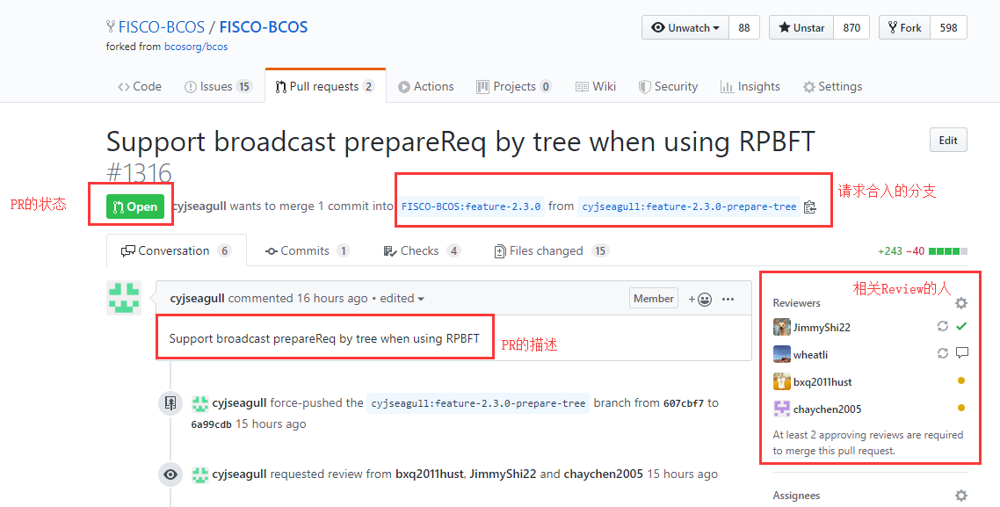
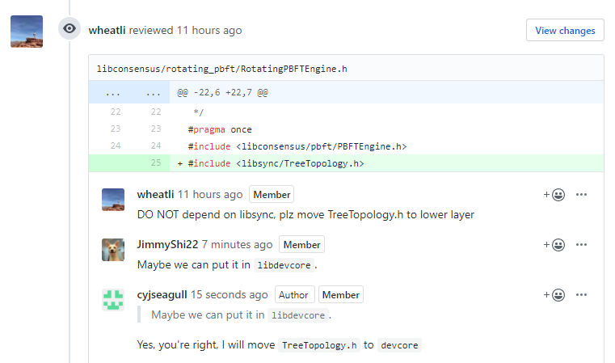
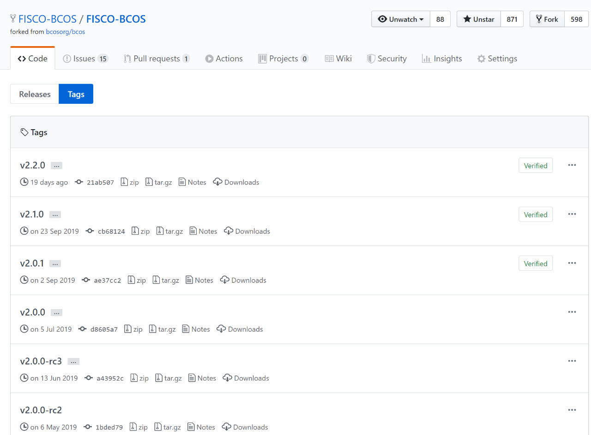

# 揭秘FISCO BCOS开源项目开发协作

作者：石翔｜FISCO BCOS 核心开发者

**作者语**

从FISCO BCOS 2.0的第一个版本开发至今，在各位程序猿（媛）的猛烈输出下，FISCO BCOS的节点代码已经达到了11万多行，并且代码仍在快速迭代着。

如此大的代码输入量，对于开发流程来说，是一个巨大的考验。如何保证代码质量？如何做到井然有序呢？

本文将为大家揭秘提交PR的流程，看看在这个过程中，程序猿（媛）是如何进行开发协作的。

## PR是什么？

每个人各自在本地开发自己的代码，当代码准备好后，会向FISCO BCOS主仓库提交一个“请求单”，请求主仓库拉取开发好的代码进行合入，此“请求单”就是PR（Pull Request，拉取代码请求）。

在PR中，其它开发者会Review代码，CI（持续集成工具）会对代码的规范和正确性进行初步的检查。当PR达到要求后，就可合入了。

当我们打开FISCO BCOS的PR列表，我们可以看到很多大家的PR记录。有经验老道的老司机（wheatli）在掌控全局，有曾经都想为他生猴子的廖老师（fqliao）在精益求精，有程序媛小姐姐（cyjseagull）在救死扶伤，还有初来乍到的爱猫人士（vita-dounai）在小试牛刀。

下面我们来看看程序媛小姐姐cyjseagull提的一个PR。这个PR处在Open的状态，表示正在审核中。她请求将开发好的代码合入到feature-2.3.0分支。JimmyShi22、wheatli等小哥哥正在Review，同意了，后面会打钩。

我们向下继续看这个PR，cyjseagull小姐姐的代码遭受到了小哥哥们的挑战，给出了一些Review的意见。共识模块和同步模块彼此独立，不会有依赖。她开发的节点树状拓扑逻辑TreeTopology.h应该放到更底层的模块中去。小姐姐愉快答应了。 

通常来说，一个PR需要根据Review反复的修改后才能合入。

此外，PR还会被各种CI（集成测试）检查，cyjseagull小姐姐很稳，通过了所有的检查。但是，一个PR需要至少两个Review的人同意才能合入。

这个PR还缺一个人的同意，合入的按钮是灰的，不能点击。正常情况下，如果同意的人数足够，就可以点击合入按钮，代码合入到相关的分支上。

## FISCO BCOS分支策略

在明白了PR的概念之后，我们有两个问题需要解决：

- 多人同时开发，如何做到互不影响的情况下进行代码整合呢？
- 合入的代码，还需要进一步的人工测试才能发布，测试在什么阶段介入，能够更有效地进行测试，同时不影响其它人的开发呢？

FISCO BCOS采用了经典的分支策略Gitflow去管理整个开发、测试和发布的流程，下面我们来看看Gitflow。

在Gitflow中，有5种类型的分支：master、develop、feature、release、hotfix。不同分支具有不同的功能。

FISCO BCOS代码的开发、测试和发布的阶段，则对应了上述的分支。

### feature分支

FISCO BCOS的代码开发，是基于一个个特性（feature）的。

多个人同时进行开发，是基于自己的feature-xxx分支进行。在FISCO BCOS的主仓库上，我们可以看到有很多这些特性分支，每个特性分支归属于一个（或多个）程序猿（媛）。

他们平时在自己本地的仓库写代码，写好后以PR的形式提交到各自的feature-xxx分支上。上节中cyjseagull小姐姐提交的PR正是处在这个状态。

当feature-xxx分支开发好后，测试介入，进行“特性测试”。测试期间修的bug同样以PR的方式提交到此feature分支。特性测试的目的，是为了保证此特性的功能正确。

### develop分支

develop分支（在FISCO BCOS中为dev），是用来合并多个feature分支的分支。

当“特性测试”测试通过后，feature-xxx分支就可合入dev分支了。

合并过程同样以PR的方式进行。多个feature同时合入dev分支时，需按照顺序依次合入。先合入dev的feature分支会给后合入的feature分支带来冲突。后合入的feature分支需要解决冲突后再合入dev。

### release分支

当我们积累了一些开发好的特性后，需要将代码发布出去。此时从dev分支拉取出release-xxx分支，进行“发布测试”。

在feature分支合并入dev分支时，只能保证特性的完整，但不能保证特性与特性间的影响。当多个特性合并入dev分支后，需要在发布前做最后的总体测试。此时发现的bug直接以PR的方式合入release分支。

通过此种方式，release分支在进行测试时，不会影响到其它开发者在feature分支上的开发，也不影响feature往dev分支的合入。

### master分支

master是主分支，向外提供可用的代码。

当“发布测试”完成后，即可将releaes分支合入master分支。

release分支同样以PR的方式合入master分支。同时，release分支也会合入dev分支。当合入master分支后，根据新的master分支打tag。发布完成！最终发布的版本以tag为准，代码可直接从tag上下载。

### hotfix分支

当代码发布后，若出现改动较小的bug或进行小的优化，从master分支上拉出一个hotfix-xxx分支，在其上快速修复。

修复并测试完成后，同时合入master和dev分支。master打小版本的tag。若出现改动范围较大的bug，根据目前项目的发布状态，在feature或release分支上进行修复。

## FISCO BCOS分支策略

了解了PR与分支策略，接下来就到提PR的阶段。

- 如果你只是想修改小bug，进行小优化，那么可以直接PR到master分支。
- 如果你是要针对某一特性进行开发，可以与社区沟通方案后，从dev上拉取出自己的feature-xxx分支，就可以开始撸了！然后用PR来提交代码。为了避免Review时大改，需尽量多的提PR来表明自己的思路。PR不要求功能完全可用，只需要最后开发完成时feature分支可用即可。

提PR的具体步骤也可参考[《如何为FISCO BCOS做贡献》](https://mp.weixin.qq.com/s/_w_auH8X4SQQWO3lhfNrbQ)

欢迎大家积极提PR，一起让FISCO BCOS变得更好。

------

#### 参考资料

**FISCO BCOS仓库**：https://github.com/FISCO-BCOS/FISCO-BCOS

**cyjseagull小姐姐的PR**：https://github.com/FISCO-BCOS/FISCO-BCOS/pull/1316

**git-flow**：https://nvie.com/posts/a-successful-git-branching-model/