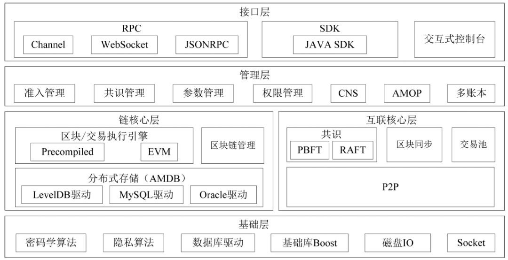
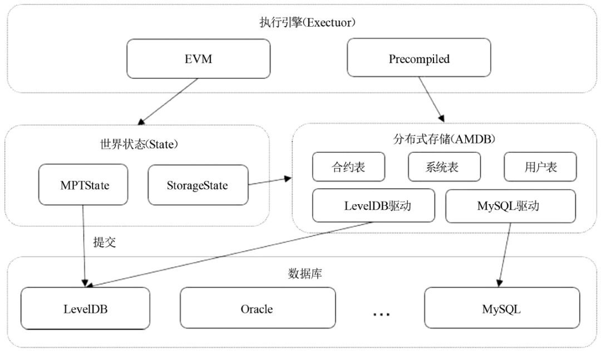
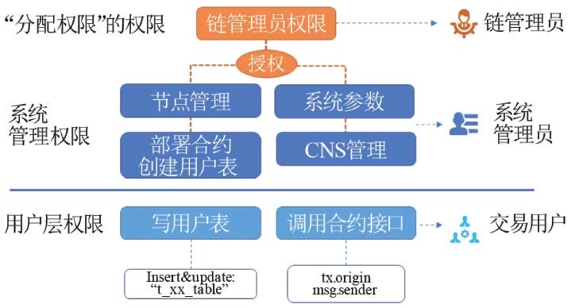
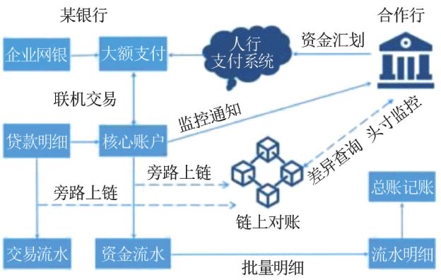
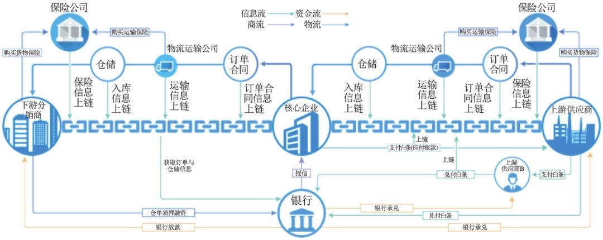

# FISCO BCOS 技术应用实践 | 《信息通信技术与政策》刊文选摘

> **编者荐语**：
>
> 《信息通信技术与政策》2020年第1期刊登了《FISCO BCOS技术应用实践》一文，介绍了FISCO BCOS的技术架构与特征，为社区开发者更深入了解与研究FISCO BCOS提供了学术参考，论文选摘如下。
>
> 文章来源于信息通信技术与政策，作者李辉忠,李陈希 等

## FISCO BCOS技术应用实践

李辉忠　李陈希　李昊轩　白兴强　石翔

**摘要**：介绍了FISCO BCOS架构及特征，阐述了FISCO BCOS的共识机制、并行交易处理模型、分布式存储、安全控制等关键技术，探讨了基于FISCO BCOS平台的业界应用案例，总结了FISCO BCOS在技术、应用及生态建设上的布局及实践，旨在对联盟链技术的相关研究提供帮助。

**关键词**：区块链；联盟链；FISCO BCOS；共识机制；智能合约；分布式存储；安全控制

## 1 引 言

区块链是一种使用链式数据结构来验证与存储数据、使用密码学保证数据传输和访问安全的技术。作为区块链最原始的应用，比特币系统将区块链作为其在复杂网络环境中建立信任与协作机制的基础技术。

在比特币协议中，用户通过特定的脚本语言构建交易行为，由组成P2P网络的节点负责将多个用户的交易行为封装为区块并通过算力竞争记账权；随后，获取到记账权的节点产出的区块会在整个网络中传播及记录，这个过程中的所有环节均会使用密码学技术以确保信息安全。

由于每个区块都会记录上一个区块的哈希值以构成链式结构，因此比特币系统中的数据记录在各个节点间能够保持一致且不可被篡改，同时任何交易行为都可被追溯，从而实现了可多方共同参与维护的分布式账本。

兼具低成本、去中心化、可回溯、不可篡改等优良特性，以区块链为基础的计算范式的应用场景并不局限于价值转移。Vitalik等人于2013年启动了以太坊项目，尝试进一步扩展区块链技术的应用领域。

以太坊是一个构建于区块链技术之上的去中心化应用平台，通过引入智能合约及去中心化的虚拟机，允许任何人在该平台上建立去中心化的应用。

相较于通过道德或法律等手段推动履行的传统合约，智能合约最大的不同点在于当合约执行的条件被触发后，计算机程序会保证合约一定会被及时地执行。由于区块链的去中心化特性，智能合约的执行是一个无法逆转的单向过程，因而具有客观性。从以太坊开始，区块链逐渐从加密数字货币的代名词演变为一种可信服务的基础组件。

除比特币、以太坊这类所有节点都可以自由进入和退出的公有链平台外，只对经过授权的组织团体开放的联盟链平台近年也成为关注的热点。

相比传统中心化技术架构，联盟链吸收了公有链的技术特点，融汇了分布式架构、分布式存储、点对点网络协议、加密算法、共识算法、智能合约等多类技术，能够很好地解决企业间的效率和信任等合作问题；相比于公有链技术架构，联盟链拥有更好的安全性及性能，同时对监管友好，能够支持穿透式或集中式的监管。

因此，联盟链是目前区块链落地实践的热点，是更具潜力的区块链部署形态。当前，联盟链应用已经渗透进版权、政务、物联网、防伪溯源、供应链、司法存证等各个领域。

FISCO BCOS是由金链盟开源工作组自主研发并完全开源的区块链底层平台。本文将介绍FISCO BCOS架构及特征，并对FISCO BCOS的共识机制、并行交易处理模型、分布式存储、权限控制等关键技术进行阐述；结合实际的业界落地案例，进一步探讨基于FISCO BCOS的应用形态；对FISCO BCOS在技术、应用及生态建设上的布局及实践进行总结。

## 2  FISCO BCOS概述

### 2.1 平台介绍

为加快研发符合中国自主可控战略的金融联盟链底层技术，促进区块链在金融行业的应用及落地，凝聚力量并提升中国在区块链技术领域的话语权，深圳市金融科技协会等20 多家金融机构和金融科技企业，共同发起成立了金融区块链合作联盟（深圳）（简称“金链盟”），随后，金链盟内多家成员机构组建开源工作组。

FISCO BCOS是金链盟开源工作组共同研发的金融级联盟链底层技术平台。

### 2.2 架构设计

如图1 所示，按照自底向上的顺序，FISCO BCOS整体上可以划分为基础层、核心层、管理层、接口层4个层次。

基础层负责提供区块链的基础数据结构和算法库，如密码学算法库及隐私算法库等。

核心层实现区块链的核心逻辑，按照功能分为两大部分，其中链核心层实现区块链的链式数据结构、交易执行引擎和存储驱动，互联核心层实现区块链的基础P2P网络通信、共识机制和区块同步机制。

管理层提供区块链管理功能，包括参数配置、账本管理、链上信使协议（AMOP）等。

接口层面向区块链用户，提供多种协议的RPC 接口、SDK 和交互式控制台，允许用户基于区块链编程以及自定义发起和执行合约。

<!--图1　FISCO BCOS架构图-->

### 2.3 平台特征

作为企业级金融联盟链底层平台，FISCO BCOS具有以下特征。

#### （1）高性能

FISCO BCOS引入了交易并行执行模型及预编译合约框架。基于交易并行执行模型，用户可在合约方法中自定义交易互斥变量。

在区块执行过程中，系统会根据交易互斥变量及交易间顺序自动构建交易依赖关系有向无环图（DAG），随后利用交易DAG尽可能地并行执行独立的交易，从而提升区块的处理速度。

在预编译合约框架中，FISCO BCOS支持采用C++编写合约，从而利用C++语言的响应更快、运行速度更高、消耗资源更少及易于并行计算等特性，极大地提升了整个系统的效率。

在中国信息通信研究院于2019 年组织的可信区块链性能评测中，FISCO BCOS单链TPS高达2 万，能够覆盖金融级高频交易场景需求。

除单链维度优化外，FISCO BCOS还支持多群组架构。不同群组代表不同的账本，群组之间彼此独立、数据隔离，区块链中的节点可以根据自身业务的需求，选择一个或多个不同的群组加入，并参与到对应账本的数据共享和共识过程中。借助群组架构，业务规模和系统吞吐量可以进一步扩大。

#### （2）高安全

FISCO BCOS为了保证通信数据的机密性，节点间统一使用SSL 连接进行通信。为了保障节点数据访问的安全性，FISCO BCOS引入了节点准入、CA 黑名单和分布式权限控制3 种机制，在网络和存储层面进行严格的安全控制。

通过节点准入及CA 黑名单机制，可以及时断开与恶意节点之间的网络连接并将恶意节点从节点列表中删除，保障系统安全；通过分布式存储权限控制，可以灵活、细粒度地控制外部账户部署合约并创建、插入、删除和更新用户表的权限，从而严密控制用户对敏感数据的访问。

FISCO BCOS支持节点在所在内网环境中对本地硬盘数据进行加密，当节点所在机器的硬盘被带离内网环境，硬盘数据将无法解密，节点无法启动，从而无法盗取联盟链上的数据；还支持同态加密、零知识证明、环签名、群签名等密码学技术以进一步保障链上数据的私密性。

#### （3）高可用

FISCO BCOS设计为7×24h运行，通过简化建链过程、适应多种环境的部署方式、全局配置更新达到金融级高可用性。目前，已有超过60个基于FISCO BCOS的落地项目在生产环境中稳定运行。

#### （4）易用性

FISCO BCOS提供了多种编程语言（如Java、Node. js、Go、Python等）的SDK工具。在SDK的基础上，开发者可开发面向最终用户的客户端程序，调用链上节点的功能接口，在客户端即可访问链上部分或全部数据，向区块链发起交易。

在设计上，SDK 提供业务级别的接口，开发者只需关注业务数据的字段以及调用返回结果，不需了解区块链节点的具体部署情况，不需处理异步通信的细节，即可实现业务合约的管理、执行、交易查询功能。FISCO BCOS同时提供对应的说明文档和使用范例，大幅度降低开发门槛和成本，帮助开发者快速开发各种业务场景的应用。

除了面向业务，SDK还可以直接调用区块链底层功能。开发者需要熟悉区块链节点所提供的底层功能接口、基本数据结构以及节点的部署情况，SDK则为开发者屏蔽协议编解码以及异步通信、容错等技术细节，减少繁琐的重复工作，提供极大程度的易用性。

## 3  FISCO BCOS关键技术

### 3.1 共识算法

FISCO BCOS实现了一套可扩展的共识框架，可插件化扩展不同的共识算法。目前，FISCO BCOS支持PBFT和 Raft共识算法，前者适用于安全性要求较高的场景，后者适用于对节点可信度较为乐观的场景。

PBFT共识算法可以在少数节点作恶场景（如伪造消息）中达成共识，采用签名、签名验证、哈希等密码学算法确保消息传递过程中的防篡改性、防伪造性、不可抵赖性，具有3f +1 的容错能力，即只要2/3 的节点正常则整个系统就能正常工作。

FISCO BCOS的PBFT共识机制针对联盟链进行了定制，实现秒级出块，具备高一致性、高可用性，抗欺诈能力较强。PBFT算法的过程是一次提案，几步投票直到最终确认，在这个过程中有复杂的状态机维护过程，投票往返步骤较多。

在FISCO BCOS中，会尽量让所有节点在每个阶段的计算并行进行，无论是议长节点还是投票节点，一个节点在运算验证一批交易的过程中，其他所有节点也在同步运算和给出投票，不需要互相等待。

同时，FISCO BCOS还对PBFT算法的关键路径进行了优化，通过优化空块逻辑、缓存重复计算结果等手段，减少了共识过程中的时间及计算资源消耗。

FISCO BCOS中的Raft共识算法实现借鉴了Raft协议的思想，各个节点采用标准的通过竞争时间窗口的方式获取出块的权利，具有2f+1 的容错能力。相比标准的Raft 协议，FISCO BCOS还针对网络抖动、网络延迟以及网络分区孤岛异常情况进行一系列优化，使Raft共识算法能够满足更极端的网络环境。

为了使联盟链网络具有更高的扩展性，FISCO BCOS中的Raft共识算法能够结合智能合约支持节点动态增加和退出网络。

### 3.2 并行交易处理

FISCO BCOS的并行交易处理模型，可以让区块内的交易被并行地执行，极大地提升交易执行性能。FISCO BCOS的交易并行处理设计分为两部分：可并行合约开发框架及并行交易执行引擎。可并行合约开发框架为用户提供了编写并行合约的接口，并行交易执行引擎提供了并行交易的执行环境。

可并行合约开发框架面向合约开发者，为开发者提供了定义互斥参数的接口。开发者根据自身业务形态，按照框架的编程规则，定义合约中每一个接口的互斥参数。在合约被部署后，接口对应的互斥参数定义一同被写入区块链上。当一笔交易调用到相应接口时，框架能够根据事先定义好的互斥参数，从交易中提取出互斥变量。随后互斥变量会被提供给并行交易执行引擎，执行引擎在执行此交易时，会依据互斥变量的信息来判断是否与其他交易冲突。

并行交易执行引擎以区块为单位，尽可能地并行执行区块内的交易。并行交易执行引擎执行区块分为3 步：
(1) 调用并行合约开发框架，按照接口中定义的互斥参数，将区块中每一笔交易的互斥变量取出。

(2) 根据交易的互斥变量,使用拓扑排序算法构建交易依赖关系DAG，交易依赖关系DAG定义了存在互斥的交易的执行先后顺序，进而保证了并行执行结果与串行执行结果一致。

(3) 根据交易依赖关系DAG的结构，尽可能地并行执行无相互依赖关系的交易 。

### 3.3 分布式存储

#### 3.3.1  MPT 存储

MPT（Merkle Patricia Trie，梅克尔-帕特里夏树）是一种用于存储键值对数据的数据结构。MPT融合了前缀树及梅克尔树的特点，树中的每个分支节点最多允许16个叶子/ 扩展节点，树中每个节点有一个哈希字段，由该节点的所有子节点的哈希值运算得出。

MPT的树根有唯一的哈希值，被称为StateRoot。以太坊的全局状态数据保存在MPT树中，状态数据由账户组成。账户在MPT中是一个叶子节点，账户数据包括账户的余额、交易序列号、合约的哈希值和存储内容组成Merkle树后求得的根哈希值。

当账户的任意数据发生变化时，会导致该账户所在的叶子节点的哈希值发生变化，进而从该叶子节点直到顶部的所有叶子节点的哈希值都会发生变化，最后导致顶部的StateRoot变化。

由此可见，任何账户的任意数据的变化，都会导致StateRoot的变化，因而StateRoot能唯一标识以太坊的全局状态。

MPT可以实现轻客户端和数据追溯，通过State-Root可以查询到区块的状态，但MPT带来了大量的哈希计算，打散了底层数据存储的连续性。在性能方面，MPT State存在着天然的劣势，可以说MPT State 追求极致的可证明性和可追溯性，也牺牲了一定的性能和可扩展性。

#### 3.3.2  分布式存储

为缓解MPT 存储所带来的性能瓶颈，FISCO BCOS引入了高扩展性、高吞吐量、高可用、高性能的分布式存储（Advanced Mass Database，AMDB）。AMDB重新抽象了区块链的底层存储模型，实现了类SQL的抽象存储接口，支持多种后端数据库，包括KV数据库和关系型数据库。

如图2 所示，AMDB 架构分为3 层，分别为状态层、分布式存储层及驱动层。状态层抽象了智能合约的存储访问接口，由EVM 虚拟机调用。状态层分为StorageState和MPTState，其中StorageState为分布式存储的适配层，MPTState为MPT适配层。

分布式存储层抽象了分布式存储的类SQL 接口，由状态层和预编译合约调用。分布式存储层抽象了存储的增删改查接口，把区块链的核心数据分类存储到不同的表中。驱动层用于实现具体的数据库访问逻辑，如RocksDB 或MySQL等，是后端数据存储的适配器。

<!--图2　AMDB 架构图-->

分布式存储支持MySQL等关系型数据库，支持MySQL集群、分库分表等平行扩展方式，理论上存储容量无限。引入了分布式存储后，数据读写请求不经过MPT，直接访问存储，结合缓存机制，存储性能相比基于MPT的存储有大幅提升。

### 3.4　安全机制

#### 3.4.1 节点准入

区块链技术是一种去中心化、公开透明的分布式数据存储技术，能够降低信任成本，实现安全可靠的数据交互，然而区块链的交易数据面临着隐私泄露威胁。

（1）对于公有链，一节点可任意加入网络，从全局账本中获得所有数据。

（2）对于联盟链，虽有网络准入机制，但节点加入区块链后即可获取全局账本的数据。

作为联盟链的FISCO BCOS，对链上隐私这一问题，提出了单链多账本的解决方案。FISCO BCOS通过引入群组概念，使联盟链从原有一链一账本的存储/执行机制扩展为一链多账本的存储/执行机制，基于群组维度实现同一条链上的数据隔离和保密。

客户端将交易发到节点所属的某个群组上，该群组内部对交易及数据进行共识并存储，其他群组对该交易无感知不可见。基于群组概念的引入，节点准入管理在网络准入基础上增加了群组准入机制。

同一条链上的节点的证书均由所有节点都信任的第三方证书颁发机构颁发。在网络准入阶段，节点间需要进行双向SSL认证以确认节点是否许可加入某条链。节点在握手的过程中，从对方节点提供的证书中获取对方节点的节点ID，并检查该节点ID是否在自身的CA黑名单中，如果存在，则关闭该连接，否则与该节点建立会话。

通过网络准入后，由于节点尚未通过群组准入，此时称该节点为游离节点，游离节点不参与共识和同步，因此无法获得链上数据。节点可以由系统管理员授权以通过节点准入，进而成为群组中的节点。群组节点只能是共识节点和观察节点两者之一，其中共识节点参与共识出块和交易/区块同步，观察节点只参与区块同步。

#### 3.4.2 权限控制

与可自由加入/退出、自由交易、自由检索的公有链相比，联盟链有准入许可、交易多样化、基于商业上隐私及安全考虑、高稳定性等要求。因此，联盟链在实践过程中需强调权限及控制的理念。

为体现权限及控制理念，FISCO BCOS平台基于分布式存储，提出分布式存储权限控制的机制，可以灵活、细粒度的方式进行有效的权限控制，为联盟链的治理提供重要的技术手段。

分布式权限控制基于外部账户的访问机制，对包括合约部署、表的创建、表的写操作（插入、更新和删除）进行权限控制，表的读操作不受权限控制。

在实际操作中，每个账户使用独立且唯一的公私钥对，发起交易时使用其私钥进行签名，接收方可通过公钥验签知道交易具体是由哪个账户发出，实现交易的可控及后续监管的追溯。

针对联盟链中的权限管理角色，在FISCO BCOS中可以按照图3 进行设计，不同的角色各司其职，分工协作。

<!--图3　FISCO BCOS权限管理角色示意-->

（1）链管理员：通常是参与链的多方共同选出一个委员会，一个或多个机构可获得管理员权限，以进行人员管理和权限分配。链管理员拥有即“分配权限”的权限，如定义账户A 作为链管理员，A 可以为账户B、C 分配权限；设置多个管理员，如果不设置管理员，任何账户都可以无差别修改各种权限。

（2）系统管理员：指业务运营人员或系统运维人员，负责日常的链上管理，包括节点增删、系统参数修改等。链管理员根据所有参与方约定的治理规则来分配系统管理权限，比如只允许指定的账户部署合约，则给他们设定合约部署权限，这样其他账户则无法随意部署合约。系统管理权限目前包括节点管理权限（增删共识节点或观察节点）、系统参数修改权限、修改合约命名权限、部署合约和建表权限4 种。

（3）用户：用户向区块链发送业务交易请求，业务交易主要是调用合约和读写用户表。可以根据业务逻辑，结合用户表权限和合约接口权限来进行灵活的控制。以用户表为粒度,控制某些账户能否改写某个用户表，以避免用户表被他人意外修改。另外，读用户表不受权限控制，因此如果要进行数据的隐私控制，则可使用FISCO BCOS提供的数据加密、零知识等技术。

（4）合约：一个合约可以包括多个接口，由于合约里的逻辑和业务密切相关，接口粒度的权限控制由开发者实现，开发者可对交易发送方进行判断，决定是否允许本次调用继续处理。

客户端发起交易请求后，节点获取交易数据，从而确定外部账户和待操作的表以及操作表的方式。如果判断操作方式为写操作，则检查该外部账户针对操作的表的权限信息（权限信息从权限表中查询获取）。若检查权限，则执行写操作，交易正常执行；若检查无权限，则拒绝写操作，返回无权限信息。如果判断操作方式为读操作，则不检查权限信息，正常执行读操作,返回查询数据。

## 4 应用案例

### 4.1  人民版权——一站式版权保护管理平台

移动互联网时代的浪潮对创作内容的传播手段及方式进行了根本性的改革，内容传播媒介这一角色的担当者逐渐由纸媒等传统媒体转变为在线媒体。内容数字化衍生出的知识服务、内容付费等新兴商业模式给原创作者带来收入的同时，也为内容版权的保护造成了诸多困难。不仅数字内容作品易复制、易传播且难溯源，由于获取的便捷性，也造成了用户及企业的版权意识不足，对优质内容随意取而用之。由于牵涉的参与方众多、耗时较长，传统版权执法流程的成本居高不下，从而使得成本相对较低的版权侵犯更为猖獗，形成恶性循环，进一步恶化版权生态环境。

为解决版权管理中的痛点，人民网联合在区块链应用方面有丰富经验的微众银行，共同推出基于FISCO BCOS的版权保护联盟链平台——人民版权。人民版权的参与方包括国家监管机构、权威媒体机构、出版集团、版权中心、仲裁机构、公证机构、互联网法院等核心节点，依托区块链与密码学技术带来的数据私密性、完整性及不可篡改性的保障，版权认证、取证、维权、诉讼均可线上完成，版权执法过程中取证与保全的成本大为降低。

在版权登记环节，平台将作者姓名、登记时间、作品名称、作品核心摘要信息等生成唯一对应的数字指纹存在于区块链上，实现链上信息可追溯且无法篡改；在版权验证环节，使用基于区块链的实体身份标识与可信数据交换解决方案WeIdentity，对作者身份进行唯一标识及存证相关数据，并在链外进行全网数据监测，通过算法自动识别原创新闻和判断新闻是否涉及抄袭，如果发现侵权行为可自动取证上链。同时，平台将版权交易环节引入线上，可以有效提升版权授权工作效率，快速实现版权的多种授权方式，有助于打造全内容版权生态，让版权价值最大化，激励更多优质内容的产出。

### 4.2  机构间对账

传统对账是指在每日凌晨批量文件对账，整个流程需要在T+1或T+2日才能完成，而且存在文件受损和丢失的可能。通过借助区块链技术实现对账，在区块中包含多笔交易的流水明细记录，可以做到秒级确认一批交易，每批交易都能送达合作机构且保持一致性。

2016年8月，微众银行联合合作行推出国内首个在生产环境投产运行的多金融机构间的区块链应用，零故障运行至今。目前，该应用已接入3家合作行，在生产环境中运行的交易记录笔数超过7000万笔。机构间对账系统架构如图4所示。

<!--图4　机构间对账系统架构图-->

### 4.3  司法存证

将区块链技术应用在司法存证领域，借助区块链不可篡改的特性，为后续的证据核实、纠纷解决、裁决送达提供了可信、可追溯、可证明的技术保障。该应用场景有助于仲裁机构快速完成证据的核实、纠纷的解决，降低仲裁过程中人力物力和时间成本，提升司法效率，降低仲裁成本。相比现有存证方案具有如下优势：

（1）完善的防篡改机制：使用区块链技术保全证据,进一步加强了证据的不可篡改性。

（2）证据效力得到机构认可：司法机构作为链上节点，对上链数据参与认可和签名，事后可从链上确认数据的真实有效性。

（3）服务持续有效：数据被多方共识上链后，即使有部分共识方退出也不会造成数据的丢失或失效。

截至2019 年10 月，已有十余家存证机构和仲裁机构加入司法存证与仲裁平台生态，累计存证超过10亿条。

### 4.4  澳门智慧城市之证书电子化

2019 年2 月27 日，微众银行与澳门政府设立澳门科学技术发展基金签署合作协议，以区块链等创新技术作为主要支点，推进澳门特区的智慧城市建设与未来新型城市发展，提升粤港澳大湾区的科创能力

首个项目基于微众银行开源的WeIdentity实体身份认证及可信数据交换解决方案展开，实现安全高效的跨机构身份认证和数据合作。项目使用FISCO BCOS区块链底层平台，核心流程如图5所示，该项目主要有以下优势。

<!--图5　证书电子化项目核心流程-->

（1）电子化证书管理：支持多终端、多场景使用，降低机构管理成本，提升用户使用体验。

（2）信息跨机构交互：机构使用数据需得到用户授权且授权凭证链上存储，基于区块链的数据传输实现了安全的信息跨机构交互，同时保护用户隐私。

（3）通过链上ID及摘要信息的验真、增信，确保用户身份及证书数据真实有效，解决机构间信任问题。

### 4.5  供应链金融

微众银行基于FISCO BCOS区块链技术，提出一种新型的纯线上供应链金融服务模式，以核心企业为中心，以实际贸易背景为基础，为核心企业上下游提供融资金融服务。

平台依托区块链、大数据、云计算、人工智能等一系列新兴金融科技技术与产业经济的深度融合，通过核心企业汇聚1~N 级供应商，引入合作银行等外部金融机构，共同构建及维护完整的线上供应链金融生态圈（见图6）。

<!--图6　供应链金融生态示意图-->

通过将区块链技术应用到供应链金融场景，可以帮助中小微企业实现有效的信用评估和风险控制机制，助力其完成企业融资。不同参与者使用一致的数据来源，保证了供应链信息的可追溯性，实现了供应链透明化，降低了行业风险和风控成本，极大地简化了多方认证和核实的流程，节省了大量的时间和人力物力成本。

## 5 结束语

区块链作为一种整体技术解决方案，融汇吸收了分布式架构、分布式存储、点对点网络协议、加密算法、共识算法、智能合约等多类技术；联盟链作为支持分布式商业的基础组件，更能满足分布式商业中的多方对等合作与合规有序发展要求，这是FISCO BCOS技术选型的基本出发点。

在已有技术基础上，FISCO BCOS通过引入高效共识算法、多群组架构、交易并行处理模型及预编译合约框架等技术极大提升了系统性能及吞吐规模，并提供了一系列准入及密码学技术全方位保障链安全及数据隐私。FISCO BCOS 对开发者友好，平台的稳定性已经过多个机构多个应用在生产环境上长时间实践的检验。

截止到2019 年10 月31日，FISCO BCOS开源生态圈已汇集上万名社区成员、超过500 家企业参与共建共治共享，数百个应用基于FISCO BCOS 研发，已经上生产环境的落地应用案例超过60 个，已然发展成为最大、最活跃的国产联盟链开源生态圈。

#### 参考文献

[1] Nakamoto S. Bitcoin: A peer-to-peer electronic cash system[EB / OL]. 2008[2019-12-06]. https:/ / bitcoin. org / en / bitcoin-paper.

[2] ZHANG Liang, LIU Baixiang, ZHANG Ruyi, JIANG Binxin, LIU Yijiang. Overview of blockchain technology [J]. Computer Engineering, 2019, 45(5): 1-12.

[3] Buterin V. A next-generation smart contract and decentralized application platform[J]. White Paper, 2014(3): 37.

[4] Androulaki E, Barger A, Bortnikov V, et al. Hyperledger fabric:A distributed operating system for permissioned blockchains[C] / / Proceedings of the Thirteenth EuroSys Conference. ACM, 2018: 30.

[5] Castro M, Liskov B. Practical Byzantine fault tolerance [C] / / OSDI, 1999, 99(1999): 173-186.

[6] Ongaro D, Ousterhout J. In search of an understandable consensus algorithm[C] / / 2014 {USENIX} Annual Technical Conference ({ USENIX } { ATC } 14, 2014:305-319.

[7] Cormen T H, Leiserson C E, Rivest R L, et al. Introduction toalgorithms, third edition [ M]. The MIT Press, Cambridge, 2009.

[8] Saifullah A, Ferry D, Li J, et al. Parallel real-time scheduling of DAGs [J]. IEEE Transactions on Parallel and Distributed Systems, 2014, 25(12): 3242-3252.

#### 作者简介

李辉忠：FISCO BCOS 高级架构师

李陈希：FISCO BCOS 核心开发者

李昊轩：FISCO BCOS 核心开发者

白兴强：FISCO BCOS 核心开发者

石翔：FISCO BCOS 核心开发者

#### 论文引用格式：

李辉忠，李陈希，李昊轩，等. FISCO BCOS 技术应用实践[J]. 信息通信技术与政策, 2020(1):52-60.

本文刊于《**信息通信技术与政策**》2020年第1期

《**信息通信技术与政策**》是工业和信息化部主管、中国信息通信研究院主办的专业学术期刊。本刊定位于“信息通信技术前沿的风向标，信息社会政策探究的思想库”，聚焦信息通信领域技术趋势、公共政策、 国家/产业/企业战略，发布前沿研究成果、焦点问题分析、热点政策解读等，推动5G、工业互联网、数字经济、人工智能、区块链、大数据、云计算等技术产业的创新与发展，引导国家技术战略选择与产业政策制定，搭建产、学、研、用 的高端学术交流平台。