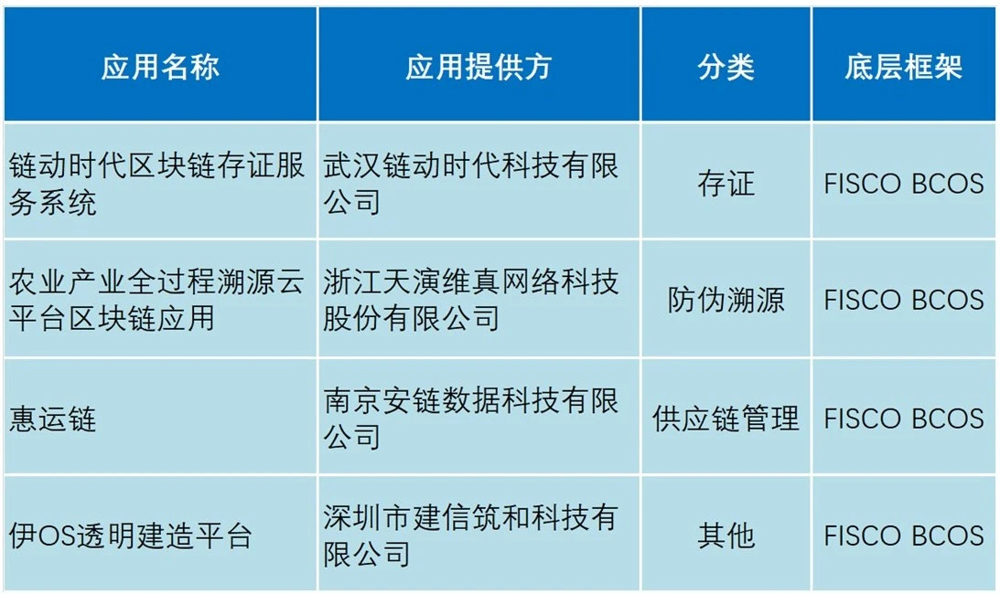
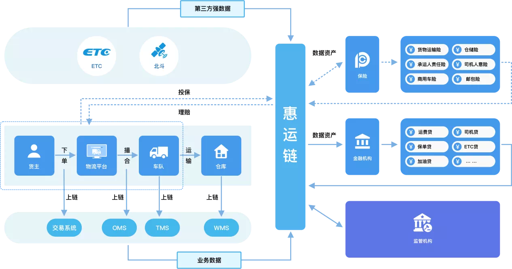

# BSN首批“官方指定区块链应用”出炉，FISCO BCOS社区四个应用入选

历经一个多月的征集，BSN于近日公布了首批“官方指定区块链应用”名单，其中4个应用基于FISCO BCOS区块链底层研发，覆盖存证、防伪溯源、供应链管理等领域。本着“把最合适的区块链应用，展示给最需要的用户”的目的，BSN发展联盟开发者委员会根据应用准入机制对提交作品进行了审核及综合考量，本次优先选出9种分类的12个区块链应用，作为首批入选BSN的指定应用。

基于FISCO BCOS区块链底层研发的4个应用分别是：链动时代区块链存证服务系统、农业产业全过程溯源云平台区块链应用、惠运链、伊OS透明建造平台。

## 链动时代：区块链存证服务系统

链动时代区块链存证服务系统（以下简称“inBC存证系统”）基于BSN上的FISCO BCOS联盟链构建。inBC存证系统帮助用户基于API接口扩展已有业务系统，实现电子证据的存证保全、调用核验。可广泛应用到电子合同、版权保护、证件证书、防伪溯源、公益捐赠等场景和领域。

## 天演维真：农业产业全过程溯源云平台区块链应用

该平台充分结合物联网、区块链、云计算、大数据和地理信息等技术，在图形界面的软件环境下，实现信息采集、审核处理、控制执行、科学决策的“集成化、可视化、网络化和桌面化”。平台通过连接生产、加工、仓储、物流和消费各个环节，梳理统一的产品标准和管控流程，规范企业生产经营行为，提升企业质量管控能力，切实保障产品品质。同时，将这些信息同步开放给消费者，增强消费者认知，打造消费信任。

目前，苏州市阳澄湖大闸蟹行业协会集体商标防伪追溯体系、赣南脐橙质量安全追溯示范项目等应用均使用该平台。

## 安链数据：惠运链

惠运链是安链科技在为物流无车承运平台、保险、银行等企业提供的物流保险供应链金融解决方案。在货运交易和运输物流管理业务场景下，提炼多方协同的单据和信息，通过区块链技术的应用，将物流公司、保险机构、金融机构等生态链节点接入联盟链中，优化资源利用率，提高物流行业整体协作效率，利用可信数据推动保险和金融机构与物流行业融合。

目前惠运链合作用户包括南京融贸通智慧物流科技有限公司、江苏新宁现代物流股份有限公司、太平洋保险、招商银行等。

## 建信筑和：伊OS透明建造平台

伊OS透明建造平台是深圳市建信筑和科技有限公司研发的一款基于区块链技术应用的建造行业全生命周期管理系统。该平台着力为工程项目构建完整的信用生态系统，运用区块链、大数据等前沿科技技术，协助甲方执行项目全生命周期的管理，让项目责任可追溯，项目管理透明化，让过程变得公平公正。目前平台已为中国雄安集团、深圳建科院未来大厦项目提供服务。

## 什么是“BSN官方指定应用”？

BSN发展联盟开发者委员会根据客户需求和业界产品的分布，划分了14个相对通用的区块链应用分类以及“其它”分类，共计15个应用分类。分类覆盖供应链管理、供应链金融、司法存证、电子合同、防伪溯源等方面。每个区块链应用分类下只引入3个有代表性的产品解决方案。方案经开发者委员会审核通过后，将作为BSN官方指定推荐的区块链应用，在BSN的各个渠道进行广泛推荐。第二批指定应用也在紧锣密鼓的上线准备中，如您也想加入BSN官方指定应用，欢迎与社区小助手联系。