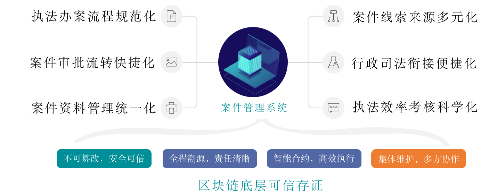
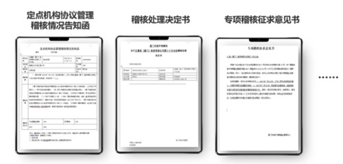
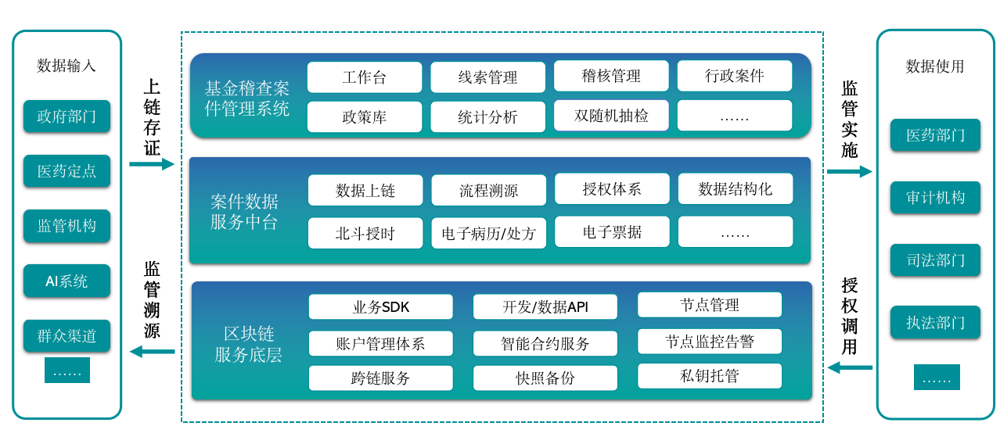

# 创新“区块链+”案件管理系统，打造行政执法一体化服务

作者：梁兴通｜易联众新技术应用中心 CTO

易联众基于区块链技术打造的医保基金稽查案件管理系统，在福建省厦门市正式上线。该系统基于FISCO BCOS技术，实现了医保基金稽查线索汇聚、案件办理、处罚执行、结案归档一体化管理，解决机关内部稽查案件流转中存在的信息滞后、管理被动、职能交叉等问题，有效提高执法案件的处置效率，促进执法办案规范透明。

## 实现案件管理的“七大成效”

近年来，易联众助力厦门市医保局推动基金监管信息化建设，有效打击欺诈骗保行为，织牢扎密基金监管笼子。

随着参保用户的增多和定点机构的增加，大量的案件公文、数据、信息和资料在机关内部各科室之间流转，使案件管理任务不断加重，不能满足提高工作效率的需要。案件流程规范的不足，让业务需求的快速增长与案件管理信息化建设相对滞后的矛盾越来越突出。

数据共享参与单位的数量增多，使业务协同场景愈加复杂，证据归集部门对证据合法性、有效性、调用过程、数据安全等方面承担最大责任，但缺乏有效可信的手段进行技术保障。

为了打破这一现状，易联众在厦门市医保局的指导下，全面梳理案件办理流程，利用区块链“数据互联互通、不可篡改、全流程追溯、公开透明”等价值，在技术选型上采用了 FISCO BCOS 底层，针对医保基金稽查业务开发了多项业务中间件，创新医保基金稽查案件管理系统，取得了“七大成效”，获得客户的肯定。

## 办案流程规范化

在案件办理流程设计过程中，易联众技术团队结合国家《医疗保障行政处罚程序暂行规定》、《中华人民共和国行政处罚法》等相关法规，打造出一套规范化的稽核管理与行政案件办案流程，实现线索管理、案源登记、人员指派、领导审批、调查报告登记、行政处罚决定书登记、行政处罚决定书公示、行政处罚结案报告等办案流程全程留痕，提高医保基金稽核信息化水平和效率。

通过分布式账本实现证据数据在不同体系机构之间流转的一致性，同时只有获得授权私钥的部门才有权利进行数据增查，保障机构内外部均无法在非授权的情况下入侵替换更改、伪造数据，把握数据上传源头的可信。

## 行刑衔接无缝化

在政府部门、定点医药机构、司法执法部门之间，建立互联互通的数据共享生态，将医保服务过程数据主动地、实时地、可控地、有信地推送给医保链上各参与方，使案件信息在部门上下级之间、不同部门之间交互流转，实现行政执法与刑事司法无缝衔接，打造执法办案流程一体化管理的新模式。

## 联动稽核强效化

实现案件数据全流程上链存证，行政司法部门开通相应权限后，可在案件办理的不同阶段，调用相关线索进行监管溯源，同时通过密码学算法对所有区块的操作记录进行叠加式 HASH 摘要处理，以此对任何一个线索来源的历史记录进行溯源。

案件线索来源包括群众投诉举报、稽查系统智能分析报警、线上疑点登记、日常巡检登记、双随机抽查登记、专项检查登记、上级交办、其他部门移送等渠道，有效发现、排除和预防参保人和定点医药机构的欺诈骗保行为。

可与“雪亮医保”视频监控系统、药品耗材进销存系统、基金稽查系统联动办案，打造实时动态智能监控、证据保留、智能分析报警、监管溯源的基金监管闭环，在办案过程中可借助医保画像系统获取当事人/机构的画像分析，实现“同当事人案例分析、同源举报对接提醒、线索关联”等功能。

## 审批流转快捷化

提供线上审批方式，在技术上利用智能合约实现业务流程的自动执行，即按照部门职级自动流转到下一节点审批人，减少人为操作可能带来的效率与信任问题，大大提升案件流转效率。

在执法办案过程中，为审批人提供完整的案件信息，并通过消息推送的人性化方式，提醒审批人及时进行流程审批，实现医保稽核管理及行政案件任务全流程跟踪和任务进度实时反馈，有效提升案件审批效率。

## 资料管理统一化

实现在线立案登记、调查报告、处罚决定、结案归档等环节的信息录入、流程审批；支持政策法规条款的录入和各类文件模板的导出，可在各类办案文书中直接引用，例如：《处罚通知书》、《处罚决定书》等。

通过对执法文书、政策库、条款依据进行统一管理，确保执法办案流程的规范化、标准化；确保执法过程有法可依、有法必依，实现医保稽核管理与行政执法办案的精确、敏捷及高效，提高案件处置效率。

## 数据安全可信化

在办案过程中，对于办案各个环节数据、审批数据、附件资料实时存证至区块链系统，采用国密 SM 算法（SM2/SM3/SM4），满足加密算法国产化监管要求，每次查询案件数据时均会对案件各项数据与区块链存证结果进行校验比对，并严格限制数据访问权限，切实保障链上存证信息安全、可靠、防篡改，提升稽核安全的内控能力。采取3级分层架构保证数据安全的同时，实现了业务解耦以及逻辑隔离。

## 执法考核科学化

记录整个案件稽核过程的始末，从办案梳理、办案时长、案件校准率、案件地区分布等多个维度对执法效率进行考核。管理人员可灵活定义执法效率考核方式、设置权重及分数细则，保证科学、客观、完整落实考核制度；可依照考核维度，自动统计考核指标，全面掌握人员和部门的工作状态，建立绩效挂钩的奖惩机制，提升执法人员的规范性和工作积极性。

## 关于易联众

易联众自 2018 年开始布局区块链应用服务业务，截至目前已具备充足的技术储备和运维能力，成为 FISCO BCOS 解决方案合作伙伴、区块链服务网络（BSN）合格开发者、金链盟会员单位，团队曾获 2020 年福建省区块链高成长企业、2020 年厦门市最具价值区块链创新企业等多项殊荣。

区块链业务落地方面，在建与已建项目包括省级居民健康档案流转平台、医保基金稽核、链上处方流转、疫苗溯源等多项民生、政务领域业务场景，其中基于区块链的个人影像云应用获第五届智慧医疗创新大赛优胜奖，并入围全国总决赛。

基于FISCO BCOS区块链技术的“医保基金稽查案件方案”,通过分布式账本实现证据数据在不同体系机构之间流转的一致性和多方协作办案，同时只有获得授权私钥的部门才有权利进行数据增查，保障机构内外部均无法在非授权的情况下入侵替换更改、伪造数据，把握数据上传源头的可信；通过区块链底层可信存证，实现医保监管全流程留痕上链，从技术上确保线索与办案流程公正可信，全面提高医保监管智能化水平，实现基金稽查案件受理、核实、立案、审查于一体的行政执法案件管理体系。

------

**社区长期征集基于FISCO BCOS研发的区块链应用，如果您有正在研发或已经上线的应用，欢迎点击“阅读原文”告诉我们，您的应用值得被更多人看见。**