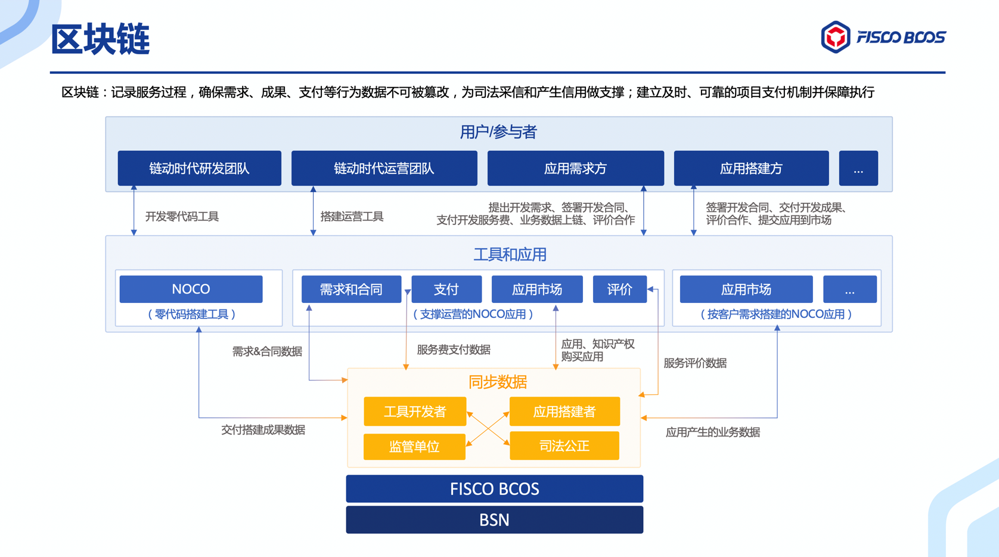
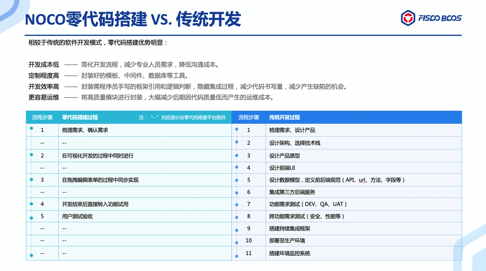

# 链动时代：零代码+区块链为企业数字化提速 | FISCO BCOS应用案例

作者：链动时代 | 创始合伙人 樊奇

**公众号对话框回复【数字化】获取演讲材料**

数字化转型是国内经济增长与产业发展的核心驱动力之一。根据中国信通院发布的《2020年中国数字经济发展白皮书》，2019 年我国产业数字化增加值约为 28.8 万亿元，占 GDP 比重29.0%。

然而，在企业数字化过程中，依然存在不少痛点，下面我将为大家分析不同阶段数字化转型过程遇到的问题，以及如何通过区块链技术解决这些问题。

### 企业数字化痛点

在那些摸着石头过河的企业中，一些企业把数字化看作简单的技术工程，停留在生产控制的信息化上；一些把数字化简单看作建立线上渠道、开设电子商城。过分简单的开场，以远低于预期的回报结束，这对企业在数字领域持续投资的积极性造成打击。

企业在数字化转型过程中，依然面对着如下痛点：
+ 第一阶段痛点：数据管理方式传统，例如，用 Excel文档对生产数据、管理数据、产品数据进行管理，该方式，不易使用、难分享，让数据管理变得很难。
+ 第二阶段痛点：通过MIS管理信息系统。

这个阶段有两种模式，第一种是自研模式：由企业自研团队为企业开发MIS管理信息系统，这也存在一些问题，由于业务变化很快，开发速度很慢，合适的技术总监寻觅难度巨大，使开发成本变高。

第二种是外包模式：甲方存在的问题是沟通难，不太信任乙方，开发慢，上线问题多。乙方存在的问题是需求多且变化快，付款难。

### 零代码+区块链方案助力企业数字化

面对企业数字化过程中遇到的问题，我们该如何解决？

为了解决企业数字化过程中遇到的“软件开发成本高、定制化开发效率低、开发上线周期长”等诸多痛点，链动时代研发了基于FISCO BCOS底层架构的NOCO零代码系统。NOCO系统为开发者提供了可视化的应用搭建平台，消除了对原生代码编写的要求，实现应用程序的快速搭建。

NOCO系统适用于各种MIS系统的开发，如：客户管理系统（CRM）、企业资源计划（ERP）、制造执行系统（MES）、物流仓储管控系统（TMS/WMS）、海关报关系统、人力资源管理系统（OKR）、会员管理系统（MMS）、企业资产管理系统（EAM）等，企业任何信息的增、删、改、查，都可以用零代码生成。

相较于传统的软件开发模式，NOCO零代码搭建具有如下优势：
+ 开发成本低，NOCO系统简化开发流程，减少专业人员需求，降低沟通成本。
+ 定制程度高，通过高度集成封装的方式，如封装好的模板、中间件、数据库等工具，减少了传统开发中的步骤。
+ 开发效率高，封装框架和逻辑判断，隐藏集成过程，减少代码书写量，减少产生缺陷的机会。
+ 更容易运维，大量的封装和模块隔离，大幅减少后期因代码质量低而产生的运维成本。NOCO系统非常简单易用，企业管理人员或者业务人员均可轻易上手实操。

NOCO系统借助图形化的表单编辑器，用户不需要编写程序代码，通过拖拉拽的方式用控件来搭建系统的数据库。

系统搭建的应用可运行在桌面端和移动端应用。应用的默认运行环境是桌面端，可在搭建应用时选择适配到移动端，即时生成适用于移动平台的应用。生成的移动端应用和用传统模式开发出的手机应用的使用体验没有差别。

NOCO系统和区块链是原生连接的，区块链能无缝地整合在 NOCO系统工具里；用NOCO系统所搭建的应用能记录服务过程，保障需求成果支付等行为数据不可篡改，为司法采信和产生信用做支撑，建立及时、可靠的项目支付机制并保障执行。

链动时代是数据资产化公司，我们会将一些数据放到联盟链上。我们主要考虑如何去保护企业的业务秘密，在业务扩张的时候如何能够流畅的去扩容或跨链，保持商业柔性。

在考虑数据隔离时，我们使用了FISCO BCOS架构，FISCO BCOS引入多群组架构，支持区块链节点启动多个群组，群组间交易处理、数据存储、区块共识相互隔离，保障区块链系统隐私性的同时，降低了系统的运维复杂度。

作为国产联盟链底层平台，FISCO BCOS从底层到SDK全面适配国密算法：国密版FISCO BCOS使用国密算法对交易进行签名、验签和哈希计算，节点间采用符合国密SSL标准的通信协议，落盘加密等特性也全面适配了国密算法；国密版本SDK一方面支持国密算法生成国密交易，另一方面与节点间采用国密SSL连接，构建了全套监管解决方案。

同时，我们也在和BSN网络合作，使用他们的服务网络。BSN是跨云服务、跨门户、跨底层框架/提供多种底层框架的区块链服务商，为开发者提供公共区块链资源环境，极大降低了区块链应用的开发、部署、运维成本。

### 社区化运营展望

NOCO系统目前还处在工具化运营状态，后续我们希望能够进行社区化的运营。

在运营过程中，我们发现高效的工具有助于解决开发部署中的问题，同时高效的工具还可以吸引专业人才，有助于解决沟通合作的问题，参与全流程信息化的建设。

但受限于服务的企业，不能有效的将此方法进行大规模的复制，扩散到不同的行业里。因此，我们在畅想，可否通过运营一个社区的做法去解决这个问题，并把社区运营和区块链的分布式特质进行结合，以求形成一个DAO。

搭建者为甲方搭建出来的系统，甲方日常使用它操作业务，在这个系统中留存了很多业务数据，这些业务数据中的某些或者全部被写入区块链保存，在未来可能因为这些数据而获得回报，这就是区块链相比于传统运营方式更有吸引力的地方。这就是我们构想的一种社区化的运营模式。

企业数字化转型不能一蹴而就，需要系统长远的规划和切实有效的执行。企业需对数字化转型目标进行系统规划和清晰定义，在企业内部提升对数字化转型的认同感、打造数字化思维、培育数字化能力，从而建立起可持续的数字化商业模式和运营模式。

数字化转型已成为企业的当务之急。借力数字化打造和提升竞争力，中国企业将在数字时代迸发出更大的活力。

