# 如何把FISCO BOCS 2.6.0底层链部署在无网络的服务器中

作者：向彪｜区块链应用架构师

# 前言

<font color=#999AAA >最近经常有小伙伴问到：生产环境没有网络怎么部署FISCO BCOS以及各种中间件呢？在网上目前也找不到相关的资料，所以这里就抽空闲时间来做一下相关的教程，方便小伙伴们快速入坑。**这里以centos7.5为例、其他操作系统类似**</font>

# 一、思路？

<font color=#999AAA >

 安装一台和无网络环境一样的虚拟机，在有网的情况下在线安装，然后上传至无网络的系统之中完成部署。
 
  
# 二、正式开始
## 1.环境介绍
本地虚拟机环境（有网络）：
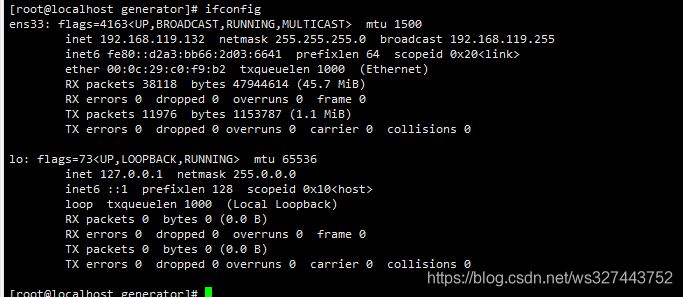
服务器：
10.21.36.165-10.21.36.168 （无网络）
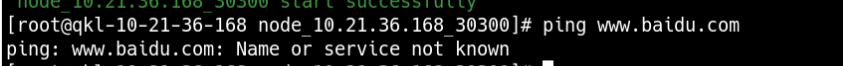


我们准备安装**1群组1机构4节点**的链架构来举例，如下表(无网络)：

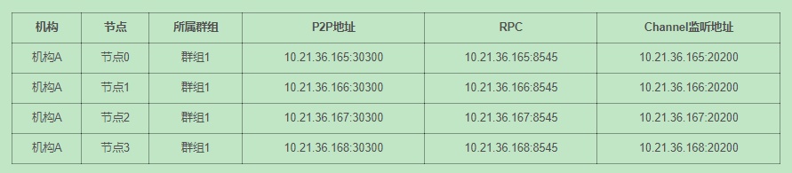


## 2.在虚拟机(有网络)上开始安装generator

**下载**

```bash
cd ~/ && git clone https://github.com/FISCO-BCOS/generator.git
```
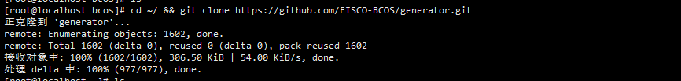


**安装**

此操作要求用户具有sudo权限。

```bash
cd ~/generator && bash ./scripts/install.sh
```
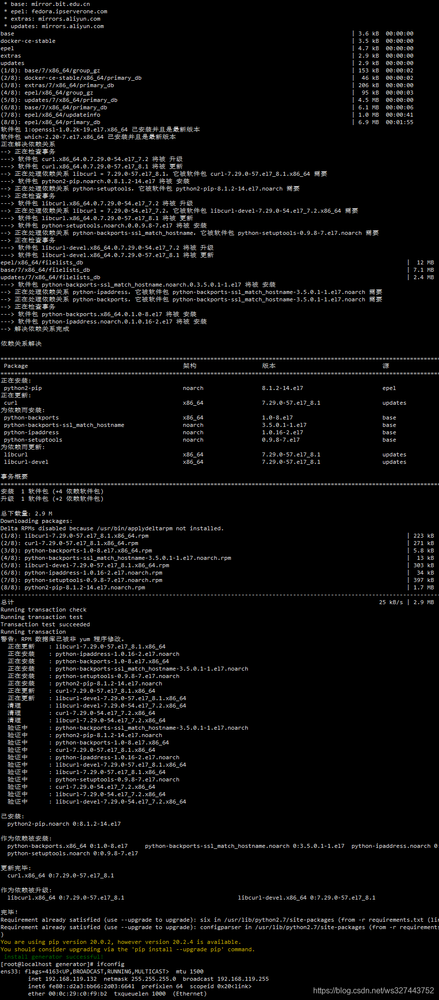


检查是否安装成功，若成功，输出 usage: generator xxx

```bash
./generator -h
```
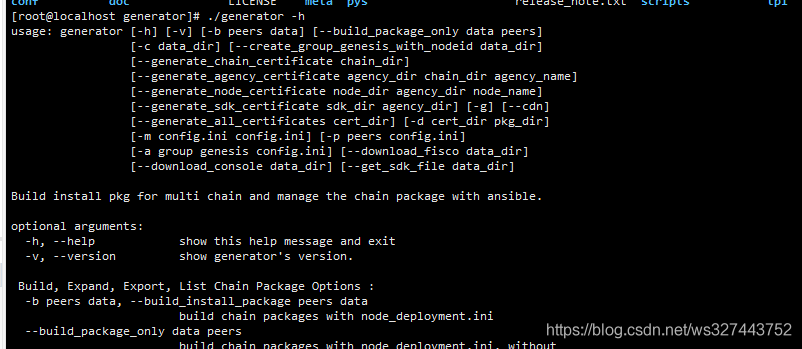

**获取节点二进制**

拉取最新fisco-bcos二进制文件到meta中，如果网络较差，可以尝试通过其他方式下载`fisco-bcos`，或使用`--cdn`选项，并将下载好的二进制放置于`meta`文件夹下

```bash
./generator --download_fisco ./meta --cdn
```
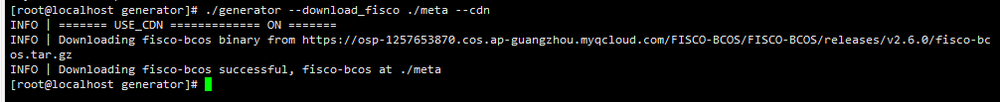
**检查二进制版本**

若成功，输出 FISCO-BCOS Version : x.x.x-x

```bash
./meta/fisco-bcos -v
```
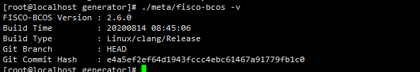

**PS**：[源码编译]节点二进制的用户，只需要用编译出来的二进制替换掉`meta`文件夹下的二进制即可。

## 3.在虚拟机(有网络)上使用一键生成工具生成链
**在如下图所示的路径中删除agencyB文件夹**
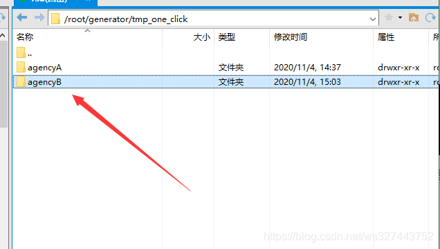

**进入agencyA文件夹，编辑node_deployment.ini文件**
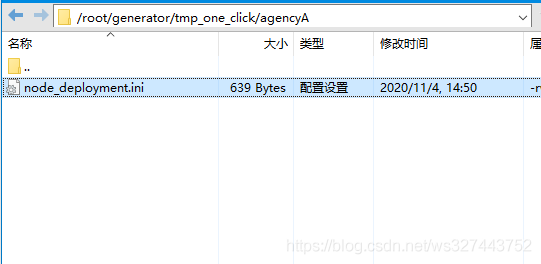

**编辑后的node_deployment.ini文件内容如下：**
```xml
[group]
group_id=1

[node0]
p2p_ip=10.21.36.165
rpc_ip=10.21.36.165
channel_ip=10.21.36.165
p2p_listen_port=30300
channel_listen_port=20200
jsonrpc_listen_port=8545

[node1]
p2p_ip=10.21.36.166
rpc_ip=10.21.36.166
channel_ip=10.21.36.166
p2p_listen_port=30300
channel_listen_port=20200
jsonrpc_listen_port=8545


[node2]
p2p_ip=10.21.36.167
rpc_ip=10.21.36.167
channel_ip=10.21.36.167
p2p_listen_port=30300
channel_listen_port=20200
jsonrpc_listen_port=8545


[node3]
p2p_ip=10.21.36.168
rpc_ip=10.21.36.168
channel_ip=10.21.36.168
p2p_listen_port=30300
channel_listen_port=20200
jsonrpc_listen_port=8545
```
**生成节点**


```bash
bash ./one_click_generator.sh -b ./tmp_one_click
```
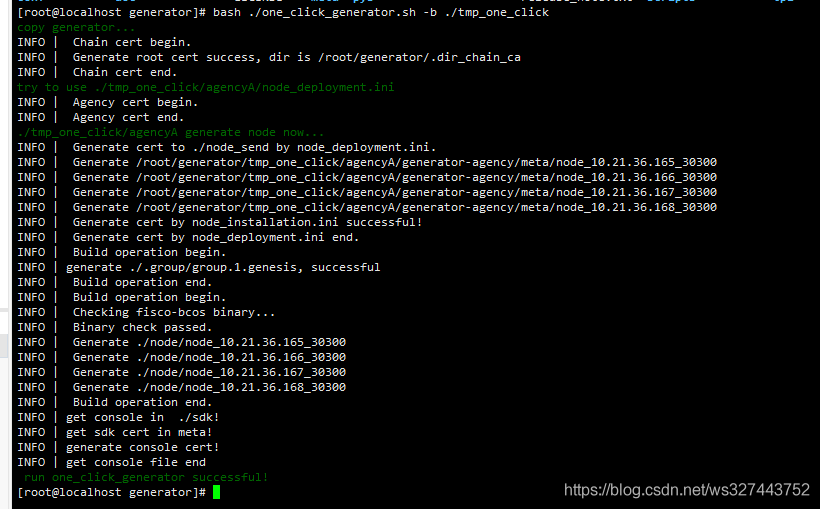

## 4.把在虚拟机(有网络)上使用一键生成工具生成的链节点文件上传到服务器
**进入/root/generator/tmp_one_click/agencyA/node 目录下**
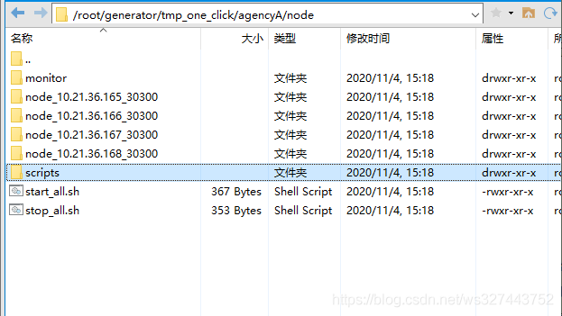
**把/root/generator/tmp_one_click/agencyA/node 目录下node_10.21.36.165-168_30300的文件夹下载下来**
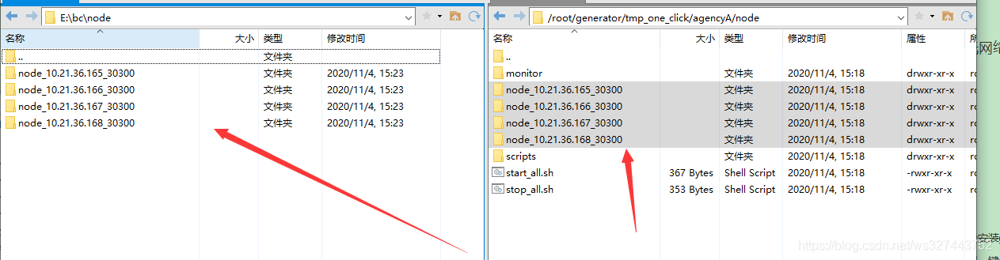


**分别上传到对应ip的服务器(无网络)上**
PS:这步如果是有的环境中没有上传的入口，可以使用U盘拷贝至相关的服务器中。

**给相关的运行权限**
10.21.36.167(无网络):
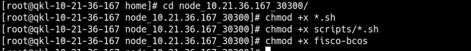
10.21.36.168(无网络):
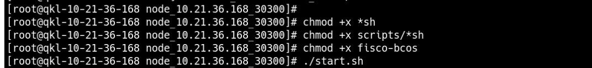
10.21.36.165(无网络):

10.21.36.166(无网络):


**运行**

10.21.36.167(无网络):

10.21.36.168(无网络):
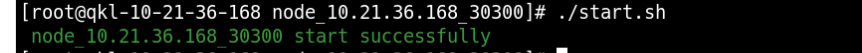
10.21.36.165(无网络):

10.21.36.166(无网络):
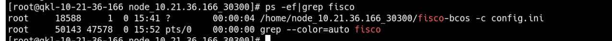


**检查节点运行状态**
```bash
tail -f  log/log*  | grep +++
```
如下图所示表示节点运行正常：
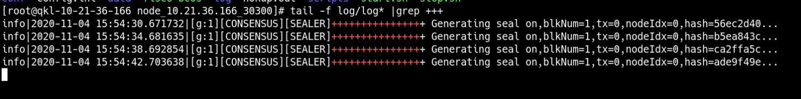


# 总结
<font color=#999AAA > 无网络离线安装部署FISCO BCOS也很简单，总结来说就是在有网络的系统中生产相关的节点文件，然后上传到相关的无网络的服务器中运行即可。希望本文可以帮助有需要的刚入坑小伙伴，大神自动忽略跳过。

---

你可以从以下方式联系到我：
🥉**CSDN:** [https://xiangbiao.blog.csdn.net/](https://xiangbiao.blog.csdn.net/)

