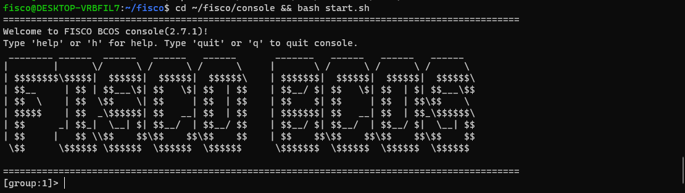
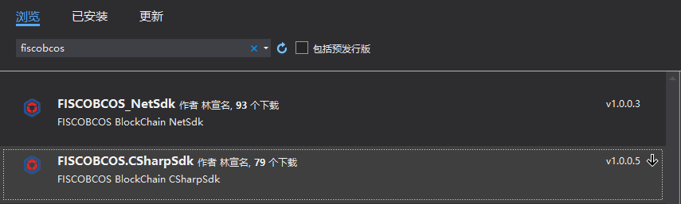
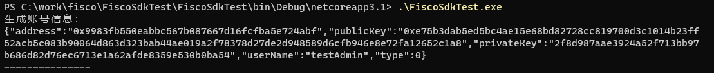

# 基于wsl/wsl2的Windows-10搭建Fisco-Bcos区块链心得

作者：黄一（四川万物数创科技有限公司）｜FISCO BCOS 开发者

## 一：概述

最近有一些朋友在FISCO的社区提到，因为某些限制，只能使用Windows平台进行开发，希望有一个基于Windows的Fisco-Bcos部署教程。正好@power林宣名老师 的C# SDK也趋于成熟，因此写下了这篇文章，希望能让Windows部署Fisco开发环境变得更加简单。

本文介绍了采用**适用于Windows的Linux子系统(wsl/wsl2)**，在Windows-10平台上无双系统/虚拟机负担搭建Fisco-Bcos的流程和心得，届时可以将Visual Studio和Fisco的开发结合起来，搭建一个较为舒适的Windows开发环境。

wsl与wsl2在底层实现上完全不同，区别请参看https://docs.microsoft.com/zh-cn/windows/wsl/compare-versions。

基于wsl第一代使用linux中间件翻译的性能和兼容性考虑，推荐使用基于轻量级hyper-v的wsl2，对于不想使用hyper-v的朋友，可以只使用wsl，至少在当前阶段尚未发现有兼容性问题。

由于二者在搭建fisco的步骤上完全一致，本文会先在wsl上搭建fisco单机4节点区块链，再切换到wsl2安装控制台以展示二者可随时切换的性质。


## 二：配置要求

硬件：
```
家用机级别的CPU即可，内存达到8GB以上，推荐16GB+，考虑到wsl只能安装在系统盘上，尽量拥有50G+的空闲系统盘空间。
```

软件:
```
操作系统：Windows 10 Professional/Enterprise（版本1903+），或Windows Server 2019（版本1709+）。
其他工具：如要使用.Net Sdk，推荐免费且支持.Net5的Visual Studio 2019 Community及Visual Studio Code。
```

## 三：在Windows10上安装wsl/wsl2及linux分发子系统（以Ubuntu 20.04 LTS为例）

以管理员方式打开PowerShell


键入如下命令，打开wsl/wsl2支持

```powershell
dism.exe /online /enable-feature /featurename:Microsoft-Windows-Subsystem-Linux /all /norestart
dism.exe /online /enable-feature /featurename:VirtualMachinePlatform /all /norestart
```


成功启用后，重启计算机，下载并安装wsl2内核更新包

链接：<https://wslstorestorage.blob.core.windows.net/wslblob/wsl_update_x64.msi>

打开Microsoft Store，下载并安装Ubuntu 20.04 LTS子系统

链接：<https://www.microsoft.com/store/apps/9n6svws3rx71>


安装后，至少启动一次Ubuntu 20.04，此时会要求设置初始用户的账户密码


设置完成，在Powershell中键入如下命令查看linux分发包情况

```powershell
wsl --list --verbose
```


可以看到现在ubuntu使用的是wsl版本1，接下来将在这个系统上安装配置fisco，并演示如何切换到wsl2。

## 四：基于wsl在ubuntu20.04子系统上搭建fisco单机4节点

官方推荐使用Windows Termintal进行操作，也可以使用windows自带的shell或powershell，下载链接：<https://aka.ms/terminal>

打开终端，直接键入

```powershell
wsl
```

进入ubuntu子系统，如下图所示


这里可以看到wsl的特性之一：可以直接访问NTFS文件系统中的文件(起始位置位于c:\Users)，并可以调用以.exe为后缀的windows应用程序。

在开发期，出于管理方便，可以把fisco放到NTFS文件系统下，如“我的文档”，但切勿在生产环境中如此配置，linux子系统访问跨文件系统会降低性能。

因为是本机子系统，无需进行任何网络配置，参考[搭建第一个区块链网络](../../installation.md)，快速部署fisco单机4节点区块链

```bash
cd ~
sudo apt install -y openssl curl
cd ~ && mkdir -p fisco && cd fisco
curl -#LO https://github.com/FISCO-BCOS/FISCO-BCOS/releases/download/v2.7.2/build_chain.sh && chmod u+x build_chain.sh
bash build_chain.sh -l 127.0.0.1:4 -p 30300,20200,8545
```

最终输出All Completed


接下来启动fisco节点，并观察日志输出

```bash
bash nodes/127.0.0.1/start_all.sh
tail -f nodes/127.0.0.1/node0/log/log*  | grep +++
```


同时，由于我们使用的是wsl-1，可以在任务管理器中查看到4个节点的linux进程fisco-bcos及其资源占用


通过右键点击进程，可以快速定位到Ubuntu子系统的Home目录，**不要在Windows中修改这个目录里的任何文件**，要访问wsl的Home，在资源管理器的地址栏中输入：\wsl$

## 五：wsl与wsl2之间的切换

本部分介绍如何在wsl和wsl2之间切换，本书中所有教程同时适用于wsl及wsl2，可以在任意一步切换wsl版本并继续教程

首先停止刚才启动的fisco节点，并退出Ubuntu子系统

```bash
bash nodes/127.0.0.1/stop_all.sh
exit
```

接下来，将Ubuntu系统的启动方式切换为wsl2

```powershell
wsl --set-version Ubuntu-20.04 2
```

等待系统转换


再次启动刚才安装的fisco节点，观察输出

```bash
wsl
cd ~/fisco && bash nodes/127.0.0.1/start_all.sh
tail -f nodes/127.0.0.1/node0/log/log*  | grep +++
```


同理，在停止fisco之后，可使用如下代码切换回wsl

```powershell
wsl --set-version Ubuntu-20.04 1
```

## 六：安装fisco控制台

安装教程请参照[搭建第一个区块链网络](../../installation.md)中安装控制台部分，本文尽量简短的做一个整合介绍

由于Ubuntu子系统自带的源在国外，对国内的用户来说，jdk下载速度会很慢，在此更换为国内阿里的镜像

```bash
sudo chmod 777 /etc/apt/sources.list
notepad.exe /etc/apt/sources.list
```

若记事本显示无法找到源文件目录，则使用如下代码
```bash
sudo chmod 777 /etc/apt/sources.list
sudo vim /etc/apt/sources.list
```

在记事本/vim中将文件整个替换为

```
deb http://mirrors.aliyun.com/ubuntu/ focal main restricted universe multiverse
deb-src http://mirrors.aliyun.com/ubuntu/ focal main restricted universe multiverse
deb http://mirrors.aliyun.com/ubuntu/ focal-security main restricted universe multiverse
deb-src http://mirrors.aliyun.com/ubuntu/ focal-security main restricted universe multiverse
deb http://mirrors.aliyun.com/ubuntu/ focal-updates main restricted universe multiverse
deb-src http://mirrors.aliyun.com/ubuntu/ focal-updates main restricted universe multiverse
deb http://mirrors.aliyun.com/ubuntu/ focal-proposed main restricted universe multiverse
deb-src http://mirrors.aliyun.com/ubuntu/ focal-proposed main restricted universe multiverse
deb http://mirrors.aliyun.com/ubuntu/ focal-backports main restricted universe multiverse
deb-src http://mirrors.aliyun.com/ubuntu/ focal-backports main restricted universe multiverse
```

保存并关闭，依次执行

```bash
sudo apt update && sudo apt install -y default-jdk
cd ~/fisco && curl -LO https://github.com/FISCO-BCOS/console/releases/download/v2.7.2/download_console.sh && bash download_console.sh
cp -n console/conf/config-example.toml console/conf/config.toml
cp -r nodes/127.0.0.1/sdk/* console/conf/
cd ~/fisco/console && bash start.sh
```

启动后，看到如下画面，控制台部署成功



## 七：使用csharp-sdk进行Visual Studio开发示例

本篇使用了@power老师的csharp-sdk及其教程，感谢power老师的辛勤工作。

git地址：<https://github.com/FISCO-BCOS/csharp-sdk>

教程地址：<https://www.bilibili.com/video/BV1av41147Lo>

### 1. 建立新工程，引入C#-SDK

打开vs2019，建立一个基于.net core 3.1的控制台工程，打开nuget程序包控制器，搜索“fiscobcos”



选择FISCOBCOS.CSharpSdk包，安装到工程


### 2. 编译示例合约HelloWorld

编译工程，在工程输出目录下，建立一个contracts文件夹


切换到Terminal，将刚才下载的console中带有的HellowWorld.sol合约复制到刚才建立的contracts文件夹下

```bash
cp ~/fisco/console/contracts/solidity/HellowWorld.sol [你的contracts目录]
```

使用vscode打开HelloWorld.sol，安装solidity插件并切换到0.4.25版本


按F5，编译合约，会在contracts下生成bin文件夹，并生成编译好的的HelloWorld.bin和HelloWorld.abi

### 3. 和fisco交互

修改Program.cs如下

```C#
using System;
using FISCOBCOS.CSharpSdk;
using FISCOBCOS.CSharpSdk.Dto;
using FISCOBCOS.CSharpSdk.Utis;

namespace FiscoSdkTest
{
    class Program
    {
        static void MakeAccount()
        {
            var account = AccountUtils.GeneratorAccount("testAdmin");
            var accountString = account.ToJson();
            Console.WriteLine($"生成账号信息：\n{accountString}\n---------------");
        }

        static void Main(string[] args)
        {
            MakeAccount();
        }
    }
}
```

编译执行，观察输出



使用账号的私钥，尝试部署刚才的HelloWorld合约，修改代码如下

```C#
using System;
using FISCOBCOS.CSharpSdk;
using FISCOBCOS.CSharpSdk.Dto;
using FISCOBCOS.CSharpSdk.Utils;
using FISCOBCOS.CSharpSdk.Utis;

namespace FiscoSdkTest
{
    class Program
    {
        static void MakeAccount()
        {
            var account = AccountUtils.GeneratorAccount("testAdmin");
            var accountString = account.ToJson();
            Console.WriteLine($"生成账号信息：\n{accountString}\n---------------");
        }

        static void DeployContract(string privateKey)
        {

            var contractService = new ContractService("http://127.0.0.1:8545", BaseConfig.DefaultRpcId, BaseConfig.DefaultChainId, BaseConfig.DefaultGroupId, privateKey);
            string binCode = "";
            string abi = ";";
            FileUtils.ReadFile(Environment.CurrentDirectory + "\\contracts\\bin\\" + "HelloWorld.bin", out binCode);
            FileUtils.ReadFile(Environment.CurrentDirectory + "\\contracts\\bin\\" + "HelloWorld.abi", out abi);
            var result = contractService.DeployContract(binCode, abi);
            Console.WriteLine($"部署合约结果：\n{result}");
        }

        static void Main(string[] args)
        {
            string privateKey = args[0];
            DeployContract(privateKey);
        }


    }
}
```

编译执行，观察输出


接下来我们查看刚才部署合约这个交易的结果，修改代码如下

```C#
using System;
using FISCOBCOS.CSharpSdk;
using FISCOBCOS.CSharpSdk.Utis;

namespace FiscoSdkTest
{
    class Program
    {
        static void TestGetTranscationResult(string txHash,string privateKey)
        {
            var contractService = new ContractService("http://127.0.0.1:8545", BaseConfig.DefaultRpcId, BaseConfig.DefaultChainId, BaseConfig.DefaultGroupId, privateKey);
            var result = contractService.GetTranscationReceipt(txHash);
            Console.WriteLine($"查询交易结果：\n{result.ToJson()}");
        }

        static void Main(string[] args)
        {
            string txHash = args[0];
            string privateKey = args[1];
            TestGetTranscationResult(txHash,privateKey);
        }
    }
}
```

可以看到本次交易的回执，返回码为0x0，部署的合约地址为0x1fc600d62388602620bb52c1fe6eea579b65d498


切换到上一节中的控制台，尝试调用一下HelloWorld的get

```bash
call HelloWorld 0x1fc600d62388602620bb52c1fe6eea579b65d498 get
```

结果如下


至此，在Windows上使用Visual Studio联合csharp-sdk进行fisco本地开发告一段落，关于charp-sdk的其他功能，请参见本节开始的链接

