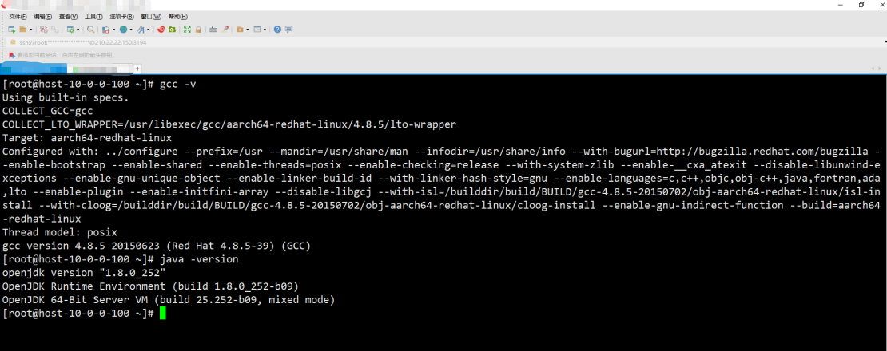
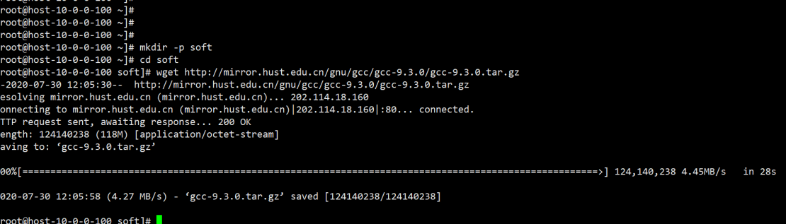
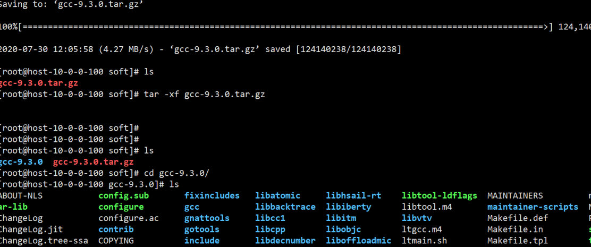
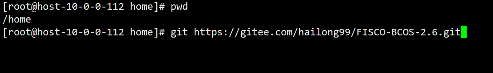
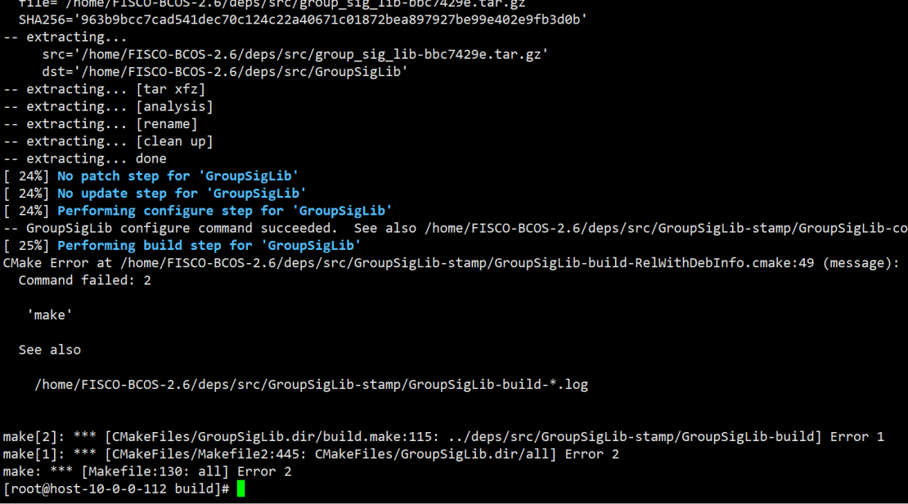
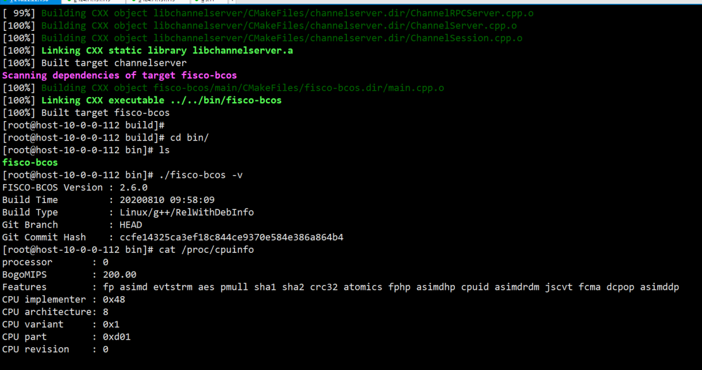
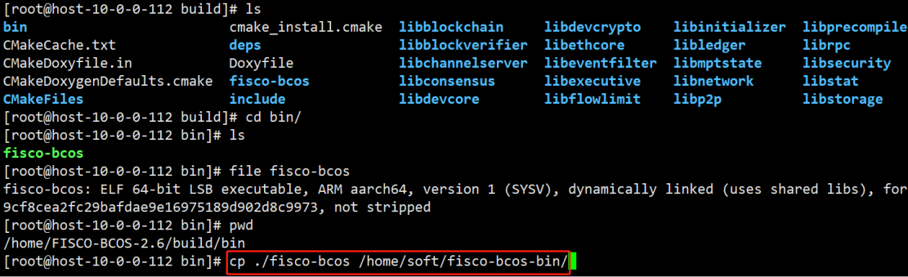
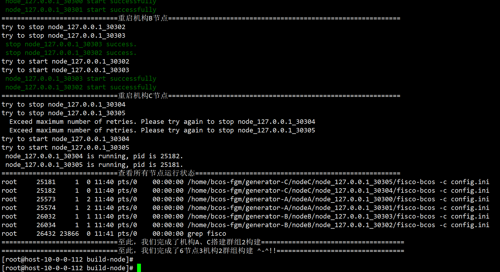
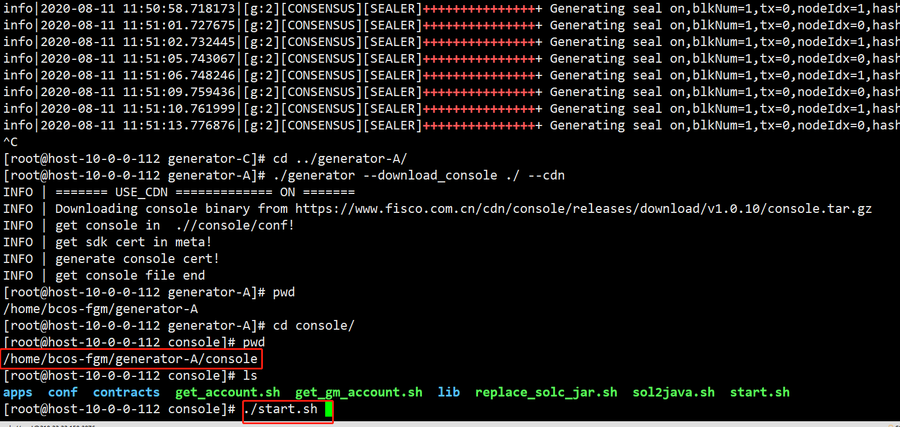
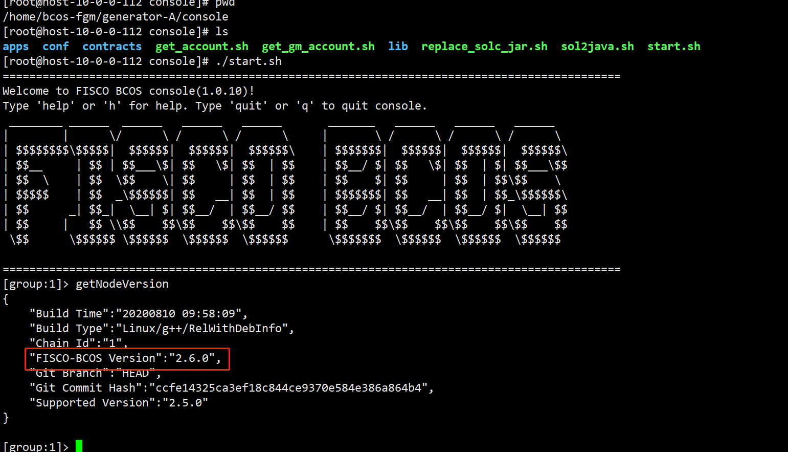

# 鲲鹏平台编译并运行FISCO-BCOS 2.6.0
一：申请鲲鹏服务器（已经有鲲鹏服务器略过此步）
1.1：打开https://dw.pcl.ac.cn/#/home/index鹏城实验室官网进行账户注册，注册过程中需要填写真实名称、工作单位、邮箱，收到激活邮件后需要手动点击激活连接地址激活账户。

1.2 登录注册的账户以后点击“开发者云”按钮

1.3 在打开的页面中自己填写“需求申请”订单，按照自己实际项目需求规划硬件配置、系统版本、使用多长时间。

1.4 需求订单填写无误提交以后，等待官方批准，批准完成以后会收到批准结果邮件通知。

1.5 登录鲲鹏服务器查看服务器信息，

至此，鲲鹏服务器准备完成。

二：在鲲鹏服务器安装基础软件
2.1 更新软件
yum update （此过程会下载更新包，请保持网络畅通并耐心等待）

2.2 查看基础工具版本

2.3 安装基础依赖
yum install flex patch bison gmp-static

2.4 升级gcc 到9.3
2.4.1下载gcc-9.3.0.tar.gz

wget http://mirror.hust.edu.cn/gnu/gcc/gcc-9.3.0/gcc-9.3.0.tar.gz

2.4.2 解压文件
tar -xf gcc-9.3.0.tar.gz

2.4.5 安装gcc 依赖
./contrib/download_prerequisites

2.4.6加--noverify选项禁止边下边验证
./contrib/download_prerequisites --no-verify

2.4.7 创建预编译目录
mkdir build && cd build

2.4.8 设置编译选项并编译
../configure --prefix=/usr/local/gcc-9.3.0 --enable-bootstrap --enable-checking=release --enable-languages=c,c++ --disable-multilib 

2.4.9编译并安装
#编译生成makefile文件
 Make && make install

 2.5.0安装GCC 
sudo 6)安装后的设置
#设置环境变量 touch /etc/profile.d/gcc.sh sudo chmod 777 /etc/profile.d/gcc.sh 
sudo echo -e '\nexport PATH=/usr/local/gcc-9.3.0/bin:$PATH\n' >> /etc/profile.d/gcc.sh && source /etc/profile.d/gcc.sh
 #设置头文件 sudo ln -sv /usr/local/gcc/include/ /usr/include/gcc 
#设置库文件 touch /etc/ld.so.conf.d/gcc.conf sudo chmod 777 /etc/ld.so.conf.d/gcc.conf sudo echo -e "/usr/local/gcc/lib64" >> /etc/ld.so.conf.d/gcc.conf 
#加载动态连接库 sudo ldconfig -v ldconfig -p |grep gcc 

2.5.1测试版本号
#测试 gcc -v

2.5 安装鲲鹏版本jdk-1.8
2.5.1 下载鲲鹏版本jdk-1.8
打开地址：
https://www.oracle.com/technetwork/java/javase/downloads/jdk8-downloads-2133151.html

2.5.2 解压文件到/usr/local中
# tar -xf jdk-8u261-linux-arm64-vfp-hflt.tar.gz  -C /usr/local/

2.5.3 设置环境变量
# vim /etc/profile
在文件最后添加：
export JAVA_HOME=/usr/local/jdk1.8.0_261
export PATH=$JAVA_HOME/bin:$PATH
执行：source /etc/profile

三：编译FISCO-BCOS 2.6.0源码
本文中用码云仓库映射到GitHub 仓库来同步代码，加快下载速度
3.1 下载源码
# cd /home 
# git clone https://gitee.com/hailong99/FISCO-BCOS-2.6.git

3.2  切换到2.6.0 分支
# git branch -a
# git checkout remotes/origin/release-2.6.0

3.3 源码编译前配置
# cd FISCO-BCOS-2.6
# mkdir -p build && cd build
# source /opt/rh/devtoolset-7/enable  # CentOS请执行此命令，其他系统不需要
# cmake3 .. -DARCH_NATIVE=on

3.4 FISCO-BCOS 2.6.0 源码编译
# make
3.5  解决编译GroupSigLib 报错

解决：
#cp/usr/share/automake-1.13/config.guess /home/FISCO-BCOS-2.6/deps/src/GroupSigLib/deps/src/pbc_sig/config.guess

3.6 查看编译结果
3.6.1 编译完成效果

3.6.2 查看编译结果的版本号

3.6.3 查看二进制可执行文件类型

四 鲲鹏平台运行2群组3机构6节点底层FISCO-BCOS联盟链服务
4.1 创建联盟链底层二进制可执行文件存放目录
# mkdir -p /home/soft/fisco-bcos-bin/

4.2 复制编译的fisco-bcos 文件到创建的目录中
# cp ./fisco-bcos /home/soft/fisco-bcos-bin/

4.3 运行一键搭建2群组3机构6节点底层FISCO-BCOS联盟链服务脚本

build-Bcos_fgmnode.sh

4.4 脚本运行完成效果

4.5 查看节点状态
# ps -aux |grep bcos

4.6  查看共识状态

五 鲲鹏平台安装FISCO-BCOS 控制台
说明：控制台程序依赖 java-1.8 需要提前安装好鲲鹏版本（arrch64）的java-1.8

5.1 下载控制台程序
#  cd ../generator-A/
# ./generator --download_console ./ --cdn

5.2 启动控制台
# cd console/
# ./start.sh

六 鲲鹏平台通过控制台查看FISCO-BCOS 2.6.0 版本

