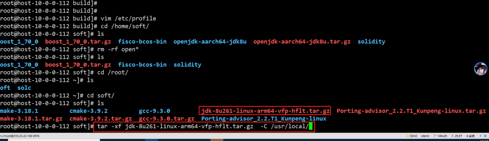

# 鲲鹏平台编译并运行FISCO-BCOS 2.6.0

## 一：申请鲲鹏服务器（已经有鲲鹏服务器略过此步）

### 1. 注册

打开 [鹏城实验室官网](https://dw.pcl.ac.cn/#/home/index) 进行账户注册，注册过程中需要填写真实名称、工作单位、邮箱，收到激活邮件后需要手动点击激活连接地址激活账户


### 2. 登录

登陆注册的账户以后点击 "开发者云" 按钮


### 3. 填写申请订单

在打开的页面中自己填写 "需求申请" 订单，按照自己实际项目需求规划硬件配置、系统版本、使用多长时间


### 4. 等待通知

需求订单填写无误提交以后，等待官方批准，批准完成以后会收到批准结果邮件通知


### 5. 通过申请

登录鲲鹏服务器查看服务器信息，至此鲲鹏服务器准备完成


## 二：在鲲鹏服务器安装基础软件

### 1. 更新软件

以 Centos 为例，使用 yum 进行更新（此过程会下载更新包，请保持网络畅通并耐心等待）
```.
yum update
```


### 2. 安装基础依赖

```
sudo yum install -y epel-release centos-release-scl
sudo yum install -y openssl-devel openssl cmake3 gcc-c++ git flex patch bison gmp-static devtoolset-7
```

### 3. 安装鲲鹏版本jdk-1.8
 * 安装 jdk
 从 [oracle官网](https://www.oracle.com/technetwork/java/javase/downloads/jdk8-downloads-2133151.html) 下载 jdk-1.8


 * 解压文件到/usr/local中
```
tar -xf jdk-8u261-linux-arm64-vfp-hflt.tar.gz  -C /usr/local/
```


 * 设置环境变量
```
vim /etc/profile

// 在文件最后添加：
export JAVA_HOME=/usr/local/jdk1.8.0_261
export PATH=$JAVA_HOME/bin:$PATH

//使变量生效
source /etc/profile
```


## 三：编译 FISCO-BCOS 源码

### 1. 下载编译依赖

 * FISCO 编译依赖许多的文件，直接从 git 上下载的话会很慢，所以这里先从 gitee 下载相应的依赖，后面编译时，直接进行 copy
```
cd
git clone https://gitee.com/FISCO-BCOS/LargeFiles.git
```

### 2. 下载源码

 * 克隆 FISCO BCOS 代码
```
git clone https://gitee.com/FISCO-BCOS/FISCO-BCOS.git
```

### 3. 执行预编译

```
cd FISCO-BCOS
git checkout master
mkdir -p build && cd build

// CentOS请执行此命令，其他系统不需要
source /opt/rh/devtoolset-7/enable

cmake3 .. -DARCH_NATIVE=on
```

### 4. 执行编译

 * 执行 make, 执行到下载文件这里会出现卡顿，这里直接 ctrl + c 取消
```
# make
Scanning dependencies of target jsoncpp
[  0%] Creating directories for 'jsoncpp'
[  0%] Performing download step (download, verify and extract) for 'jsoncpp'
-- Downloading...
   dst='/root/FISCO-BCOS/deps/src/jsoncpp-1.7.7.tar.gz'
   timeout='none'
-- Using src='https://github.com/open-source-parsers/jsoncpp/archive/1.7.7.tar.gz'
-- verifying file...
       file='/root/FISCO-BCOS/deps/src/jsoncpp-1.7.7.tar.gz'
-- Downloading... done
-- extracting...
     src='/root/FISCO-BCOS/deps/src/jsoncpp-1.7.7.tar.gz'
     dst='/root/FISCO-BCOS/deps/src/jsoncpp'
```

### 5. 复制依赖包到相应目录

```
//如果提示是否覆盖，输入 y
cp ${HOME}/LargeFiles/libs/* ${HOME}/FISCO-BCOS/deps/src
```

### 6. 继续执行编译

 * 首次编译速度比较慢，需要耐心等待
```
cd ${HOME}/FISCO-BCOS/build
make
```

### 7 解决编译GroupSigLib 报错

 * 编译过程中，如果出现编译 GroupSigLib 失败的问题，会出现一下报错
```
[ 24%] Performing configure step for 'GroupSigLib'
-- GroupSigLib configure command succeeded.  See also /root/FISCO-BCOS/deps/src/GroupSigLib-stamp/GroupSigLib-configure-*.log
[ 25%] Performing build step for 'GroupSigLib'
CMake Error at /root/FISCO-BCOS/deps/src/GroupSigLib-stamp/GroupSigLib-build-RelWithDebInfo.cmake:49 (message):
  Command failed: 2

   'make'

  See also

    /root/FISCO-BCOS/deps/src/GroupSigLib-stamp/GroupSigLib-build-*.log


make[2]: *** [CMakeFiles/GroupSigLib.dir/build.make:115：../deps/src/GroupSigLib-stamp/GroupSigLib-build] 错误 1
```

 * 解决方法：
```
cp /usr/share/automake-1.13/config.guess ${HOME}/FISCO-BCOS/deps/src/GroupSigLib/deps/src/pbc_sig/config.guess
```

### 8. 查看编译结果

 * 编译完成效果


 * 查看编译结果的版本号
```
# cd bin
# ./fisco-bcos -v
FISCO-BCOS Version : 2.6.0
Build Time         : 20200810 09:17:18
Build Type         : Linux/g++/RelWithDebInfo
Git Branch         : master
Git Commit Hash    : a2c2cd3f504a101fbc5e97833ea0f4443b68098e
```

## 四 : 鲲鹏平台运行2群组3机构6节点底层FISCO-BCOS联盟链服务

### 1. 创建联盟链底层二进制可执行文件存放目录

```
cd
mkdir bin
```

### 2. 复制编译的fisco-bcos 文件到创建的目录中

```
cp ${HOME}/FISCO-BCOS/build/bin/fisco-bcos bin
```

### 3. 下载 build_chain.sh 脚本

```
curl -LO https://github.com/FISCO-BCOS/FISCO-BCOS/releases/download/`curl -s https://api.github.com/repos/FISCO-BCOS/FISCO-BCOS/releases | grep "\"v2\.[0-9]\.[0-9]\"" | sort -u | tail -n 1 | cut -d \" -f 4`/build_chain.sh && chmod u+x build_chain.sh
```

### 4. 运行一键搭建2群组3机构6节点底层FISCO-BCOS联盟链服务脚本

```
#  ./build_chain.sh -l 127.0.0.1:4 -p 30300,20200,8545 -e bin/fisco-bcos
```

### 5. 脚本运行完成效果

```
# ./build_chain.sh -l 127.0.0.1:4 -p 30300,20200,8545 -e bin/fisco-bcos
Checking fisco-bcos binary...
Binary check passed.
==============================================================
Generating CA key...
==============================================================
Generating keys and certificates ...
Processing IP=127.0.0.1 Total=4 Agency=agency Groups=1
==============================================================
Generating configuration files ...
Processing IP=127.0.0.1 Total=4 Agency=agency Groups=1
==============================================================
[INFO] FISCO-BCOS Path : bin/fisco-bcos
[INFO] Start Port      : 30300 20200 8545
[INFO] Server IP       : 127.0.0.1:4
[INFO] Output Dir      : /root/nodes
[INFO] CA Path         : /root/nodes/cert/
==============================================================
[INFO] Execute the download_console.sh script in directory named by IP to get FISCO-BCOS console.
e.g.  bash /root/nodes/127.0.0.1/download_console.sh -f
==============================================================
[INFO] All completed. Files in /root/nodes
```

### 6. 启动节点

```
cd nodes/127.0.0.1/
./start_all.sh
```

### 7. 查看节点状态

```
# ps -aux |grep fisco
root     17241  1.1  0.7 729792 31168 pts/1    Sl   17:32   0:00 /root/nodes/127.0.0.1/node2/../fisco-bcos -c config.ini
root     17242  1.0  0.7 729792 31360 pts/1    Sl   17:32   0:00 /root/nodes/127.0.0.1/node0/../fisco-bcos -c config.ini
root     17243  1.0  0.7 729792 31168 pts/1    Sl   17:32   0:00 /root/nodes/127.0.0.1/node3/../fisco-bcos -c config.ini
root     17244  1.1  0.7 729408 31296 pts/1    Sl   17:32   0:00 /root/nodes/127.0.0.1/node1/../fisco-bcos -c config.ini
```

### 8. 查看共识状态

```
# tail -f node*/log/*|grep ++
info|2020-09-04 17:34:19.452001|[g:1][CONSENSUS][SEALER]++++++++++++++++ Generating seal on,blkNum=1,tx=0,nodeIdx=2,hash=40f8c3c5...
info|2020-09-04 17:34:18.449782|[g:1][CONSENSUS][SEALER]++++++++++++++++ Generating seal on,blkNum=1,tx=0,nodeIdx=1,hash=85ab01ec...
info|2020-09-04 17:34:17.446976|[g:1][CONSENSUS][SEALER]++++++++++++++++ Generating seal on,blkNum=1,tx=0,nodeIdx=0,hash=d7d2cfa2...
info|2020-09-04 17:34:20.454172|[g:1][CONSENSUS][SEALER]++++++++++++++++ Generating seal on,blkNum=1,tx=0,nodeIdx=3,hash=87efbeb5...
info|2020-09-04 17:34:21.456586|[g:1][CONSENSUS][SEALER]++++++++++++++++ Generating seal on,blkNum=1,tx=0,nodeIdx=0,hash=4a9c4f2d...
info|2020-09-04 17:34:22.459794|[g:1][CONSENSUS][SEALER]++++++++++++++++ Generating seal on,blkNum=1,tx=0,nodeIdx=1,hash=d1dd4738...
```

## 五 : 鲲鹏平台安装FISCO-BCOS 控制台

说明：控制台程序依赖 java-1.8 需要提前安装好鲲鹏版本（arrch64）的java-1.8

```bash
# 下载控制台
$ curl -#LO https://github.com/FISCO-BCOS/console/releases/download/v2.7.2/download_console.sh && bash download_console.sh
$ cd console

# 拷贝证书
cp ~/nodes/127.0.0.1/sdk/* conf

# 修改配置文件
# 如果端口没有冲突，直接复制配置文件即可，否则复制之后，修改 config.toml中的network.peers配置项为相应的 channel 端口
$ cp conf/config-example.toml conf/config.toml
```

**启动控制台**

```
# cd ~/console/ && bash start.sh
=============================================================================================
Welcome to FISCO BCOS console(2.6.1)!
Type 'help' or 'h' for help. Type 'quit' or 'q' to quit console.
 ________ ______  ______   ______   ______       _______   ______   ______   ______
|        |      \/      \ /      \ /      \     |       \ /      \ /      \ /      \
| $$$$$$$$\$$$$$|  $$$$$$|  $$$$$$|  $$$$$$\    | $$$$$$$|  $$$$$$|  $$$$$$|  $$$$$$\
| $$__     | $$ | $$___\$| $$   \$| $$  | $$    | $$__/ $| $$   \$| $$  | $| $$___\$$
| $$  \    | $$  \$$    \| $$     | $$  | $$    | $$    $| $$     | $$  | $$\$$    \
| $$$$$    | $$  _\$$$$$$| $$   __| $$  | $$    | $$$$$$$| $$   __| $$  | $$_\$$$$$$\
| $$      _| $$_|  \__| $| $$__/  | $$__/ $$    | $$__/ $| $$__/  | $$__/ $|  \__| $$
| $$     |   $$ \\$$    $$\$$    $$\$$    $$    | $$    $$\$$    $$\$$    $$\$$    $$
 \$$      \$$$$$$ \$$$$$$  \$$$$$$  \$$$$$$      \$$$$$$$  \$$$$$$  \$$$$$$  \$$$$$$

=============================================================================================
[group:1]>
```

## 六 : 鲲鹏平台通过控制台发送交易

 * 查看 FISCO 版本
```
[group:1]> getNodeVersion
{
    "Build Time":"20200904 14:43:15",
    "Build Type":"Linux/g++/RelWithDebInfo",
    "Chain Id":"1",
    "FISCO-BCOS Version":"2.6.0",
    "Git Branch":"master",
    "Git Commit Hash":"a2c2cd3f504a101fbc5e97833ea0f4443b68098e",
    "Supported Version":"2.6.0"
}
```


 * 部署并调用合约
```
[group:1]> deploy HelloWorld
transaction hash: 0xa71f136107389348d5a092a345aa6bc72770d98805a7dbab0dbf8fe569ff3f37
contract address: 0xd22aa109bc0708ad016391fa5188e18d35b16434

[group:1]> call HelloWorld 0xd22aa109bc0708ad016391fa5188e18d35b16434 set "asfdas"
transaction hash: 0x72f4f8c980fd0d63d57bdbcc89d6b82dda79e301f25a65f0f49726105184b596

[group:1]> call HelloWorld 0xd22aa109bc0708ad016391fa5188e18d35b16434 get
asfdas
```
