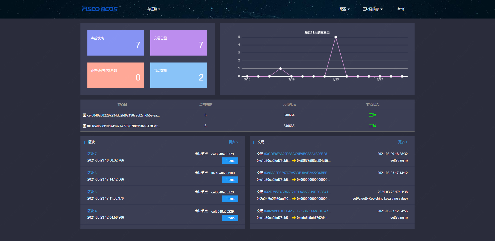
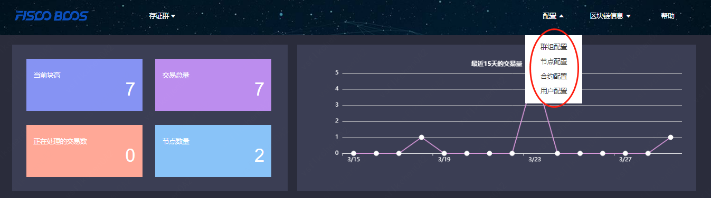
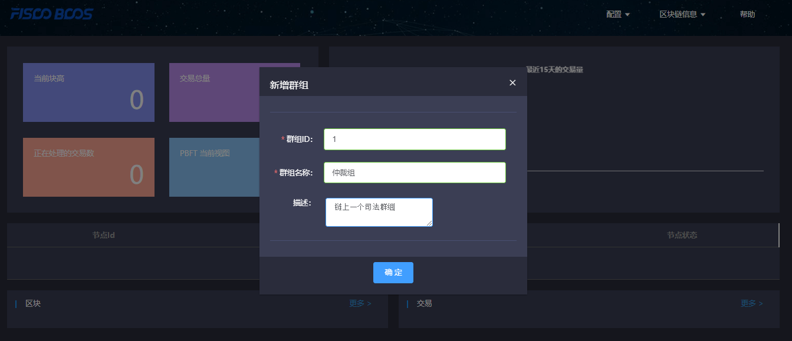
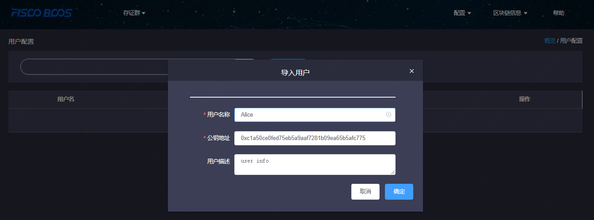
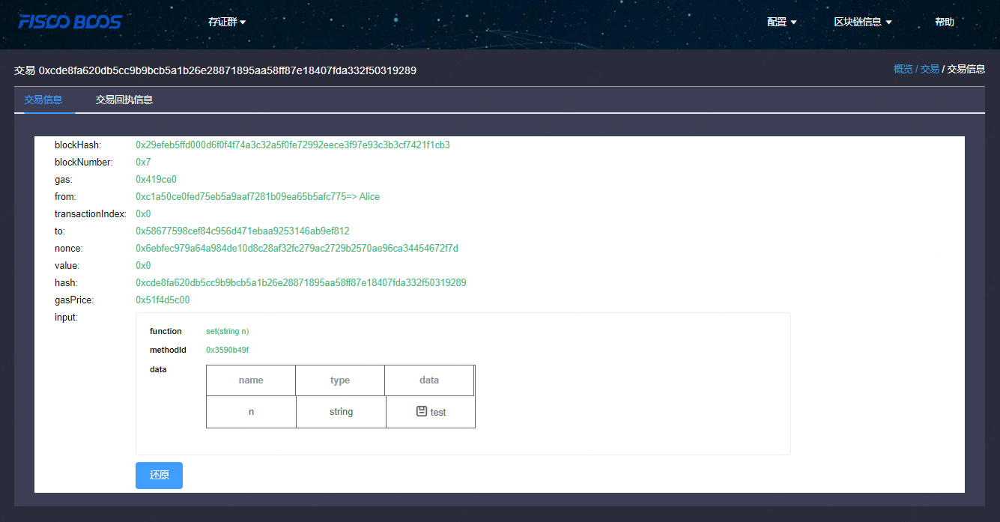
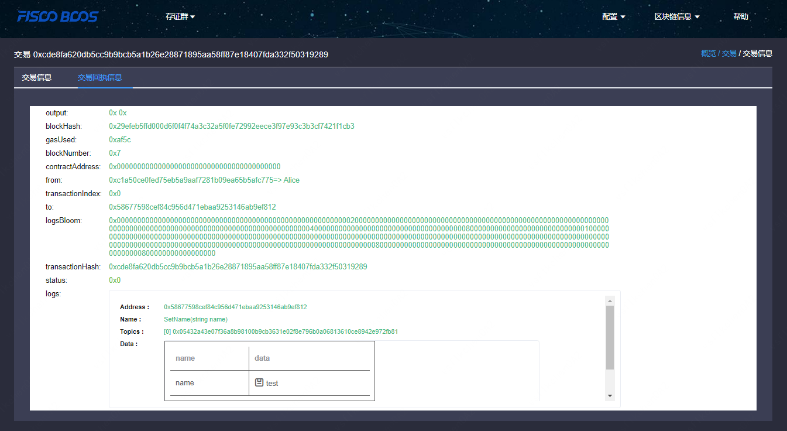

# 使用介绍

标签：``区块链浏览器`` ``图形化`` 

----

## 1. 浏览器主要用途

### 1.1 基本介绍
**全新适配FISCO BCOS 2.0+版本，如果使用FISCO BCOS 1.2或1.3版本请用[v1.2.1版本](https://github.com/FISCO-BCOS/fisco-bcos-browser/releases/tag/v1.2.1)。**

区块链浏览器将区块链中的数据可视化，并进行实时展示。方便用户以Web页面的方式，获取当前区块链中的信息。本浏览器版本适配[FISCO BCOS 2.0+](https://github.com/FISCO-BCOS/FISCO-BCOS)，关于2.0+版本的特性可以参考此[链接](../introduction.md)。在使用本浏览器之前需要先理解2.0+版本的群组特性，详情可以参考此[链接](../faq/what_is_new.html#id2)。

### 1.2 主要功能模块

本小节概要介绍浏览器的各个模块，方便大家对浏览器有一个整体的认识。区块链浏览器主要的功能模块有：群组切换模块，配置模块，区块链信息展示模块。

#### 1.2.1. 群组切换模块

群组切换主要用于在多群组场景中切换到不同群组，进行区块链信息浏览。

#### 1.2.2. 配置模块

主要包括群组配置，节点配置，合约配置，用户配置。

#### 1.2.3. 区块链信息展示模块

区块链浏览器主要展示了链上群组的具体信息，这些信息包括：概览信息，区块信息，交易信息。

## 2. 使用前提

### 2.1. 群组搭建

区块链浏览器展示的数据是从区块链上同步下来的。为了同步数据需要初始化配置（添加群组信息和节点信息），故在同步数据展示前需要用户先搭建好区块链群组。[FISCO BCOS 2.0+](https://github.com/FISCO-BCOS/FISCO-BCOS)提供了多种便捷的群组搭建方式。

1. 如果是开发者进行开发调试，建议使用[开发部署工具 build_chain](../installation.md)。
2. 如果是开发企业级应用，建议使用企业部署工具[运维部署工具 FISCO BCOS generator](../enterprise_tools/tutorial_one_click.md)。

两者的主要区别在于build_chain为了使体验更好，搭建速度更快，辅助生成了群组内各个节点的私钥；但企业部署工具出于安全的考虑不辅助生成私钥，需要用户自己生成并设置。

## 3. 区块链浏览器搭建

区块链浏览器分为两个部分：后台服务fisco-bcos-browser、前端web页面fisco-bcos-browser-front。

当前版本我们提供了两种搭建方式：[**一键搭建**](./deploy.md)和手动搭建。

### 3.1. 一键搭建

适合前后端同机部署，快速体验的情况使用。具体搭建流程参见[**安装文档**](./deploy.md)。

### 3.1. 手动搭建

#### 后台服务搭建

区块链浏览器后台服务使用Spring Boot的JAVA后台服务，具体搭建流程参见[**安装文档**](./server.md)。

#### 前端web页面服务搭建

区块链浏览器前端web页面使用框架`vue-cli`，具体搭建流程参见[**安装文档**](./web.md)。

## 4. 初始化环境

### 4.1. 添加群组

服务搭建成功后，可使用网页浏览器访问nginx配置的前端IP和前端端口，进入到浏览器页面。未初始化群组的浏览器页面会引导大家到新建群组配置页面，新建群组需要配置群组ID，群组名称，描述。

**群组ID需要和区块链群组ID保持一致。** 群组ID有多种查看方式:
- [rpc接口获取](../api.html#getgrouplist)
- 控制台命令: 2.6及其以上版本控制台使用手册请参考[这里](../console/console_of_java_sdk.md), 1.x版本控制台使用手册请参考[这里](../console/console.md)。

群组名称是为群组ID取的一个有意义，便于理解的名字。

描述字段是对名称的进一步说明。

### 4.2. 添加节点

添加群组所在的节点信息，用于区块链浏览器连接拉取相关展示信息。节点IP输入实际IP（同机节点时支持`127.0.0.1`，不支持`0.0.0.0`），节点的rpc端口信息和p2p端口信息可以从节点的 **config.ini**配置文件中获取。

为了使用方便，新添加的群组会自动同步添加其他群组已经配置的共用节点信息。

### 4.3. 添加合约

本浏览器版本提供合约解析的功能。此功能需要用户把本群组使用的所有合约进行导入。本版本支持用zip包上传一级目录，用于解决同名合约的问题。解析效果请查看[交易浏览](#view_trans)。

导入步骤：

#### 4.3.1 上传合约

1. 合约上传支持sol文件上传和将sol文件打包成zip包上传。
2. zip包最多支持一级目录，如果没有目录默认上传到根目录。zip包中只能有sol文件。

#### 4.3.2 编译合约

### 4.4. 添加用户

支持导入链上用户，关联交易用户。此功能需要用户把本群组使用的所有链上用户导入。未导入的用户则不能关联。

用户导入：

用户导入后，交易列表和详情就可以查看关联用户，否则不会显示关联用户：

## 5. 界面展示

### 5.1. 概览

#### 5.1.1 概览信息

主要包括当前群组的块高，交易总量，正在处理的交易数，群组下节点个数。

#### 5.1.2 最近15天的交易量

用折线图的形式展示了当前群组15内的交易情况。

#### 5.1.3 节点概览

节点概览展示了当前群组内各个节点的ID，当前快高，pbftView，和节点状态。

#### 5.1.4  区块概览

区块概览展示了最近4个区块的信息，包括每个区块的块高，出块者，块产生的时间及块上的交易总量。

#### 5.1.5  交易概览

交易概览展示了最近四个交易，包括交易hash，交易时间，交易的发送者、交易的接收者，如果是正确导入了交易相关的合约还能展出交易调用的接口信息。

### 5.2、区块信息浏览

区块信息浏览主要包括区块列表页面和区块详情页面。

### 5.3、交易浏览

交易信息浏览主要包括交易列表页面和交易详情页面。

#### 5.3.1、交易解析

合约成功上传并编译后，区块链浏览器能够解析出此合约相关交易的方法名和参数。浏览器的解析建立在合约的准确导入的基础上，故提醒用户在使用java和js等语言调用合约时，请**注意保存合约的正确版本。**

#### 5.3.2、事件解析

合约成功上传并编译后，区块链浏览器能够解析出此合约相关交易回执中的事件方法名和参数。

