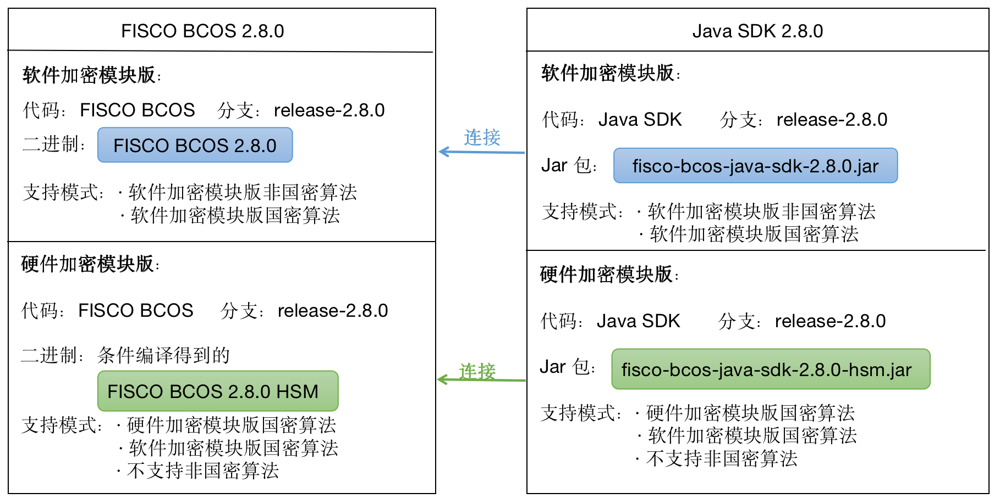

# [v2.8.0](https://github.com/FISCO-BCOS/FISCO-BCOS/releases/tag/v2.8.0)
## 变更描述
**新增**
- 节点新增硬件密码模块，支持使用符合国密办的《GMT0018-2012密码设备应用接口规范》标准的密码机/密码卡，进行国密算法SM2、SM3、SM4运算。
- 节点新增使用密码卡/密码机的国密算法进行节点间TLS建连。
- 2.8.0将呈现两个形态，2.8.0和2.8.0-hsm形态。2.8.0是通用版，使用密钥文件保存密钥，能与2.7.0等以前的版本兼容。2.8.0-hsm是硬件加密特别版，支持使用密码机。由于升级了OpenSSL协议，2.8.0-hsm节点无法与2.7.0等以前的版本兼容，且2.8.0-hsm节点需要与Java SDK 2.8.0-hsm配套使用。

**兼容性**
**2.8.0向前兼容**
旧版本可以直接替换程序升级

|            | 推荐版本                | 最低版本  | 说明                   |
| ---------- | ----------------------- | --------- | ---------------------- |
| 控制台     | 2.8.0                  | 1.0.4     |                        |
| Java SDK        | 2.8.0                   | 2.6.1     |     |
| Web3SDK        | 2.6.0                   | 2.0.4     |      |                  
| generator  | 1.7.0                   | 1.1.0     | 搭建新链需要使用该版本 |
| 浏览器     | 2.0.2                   | 2.0.0-rc2 |                        |
| Solidity   | 最高支持 solidity 0.6.10 | 0.4.11    |                        |
| amdb-proxy | 2.3.0                   | 2.0.2     |                        |

**2.8.0-hsm不与以前的版本兼容**
2.8.0-hsm无法与2.8，2.7.0及以前版本兼容。

|            | 推荐版本                | 最低版本  | 说明                   |
| ---------- | ----------------------- | --------- | ---------------------- |
| 控制台     | 2.8.0-hsm                  | 1.0.4     |                        |
| Java SDK        | 2.8.0-hsm                   | 2.6.1     |     |
| 浏览器     | 2.0.2                   | 2.0.0-rc2 |                        |
| Solidity   | 最高支持 solidity 0.6.10 | 0.4.11    |                        |
| amdb-proxy | 2.3.0                   | 2.0.2     |                        |
