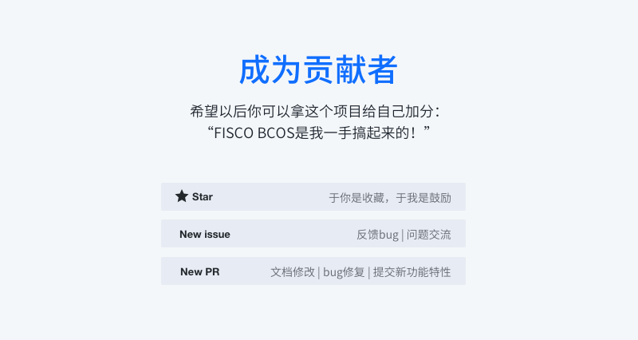

# 社区

**附：**

[代码贡献流程](https://github.com/FISCO-BCOS/FISCO-BCOS/blob/master/docs/CONTRIBUTING_CN%2Emd)  

[编码规范](https://github.com/FISCO-BCOS/FISCO-BCOS/blob/master/CODING_STYLE.md)

[提问题](https://github.com/FISCO-BCOS/FISCO-BCOS/issues)

*********************************************

**资源获取：**

[FISCO BCOS案例集](https://mp.weixin.qq.com/s/vUSq80LkhF8yCfUF7AILgQ)

**联系我们：**

- Gitter：

- e-mail：
