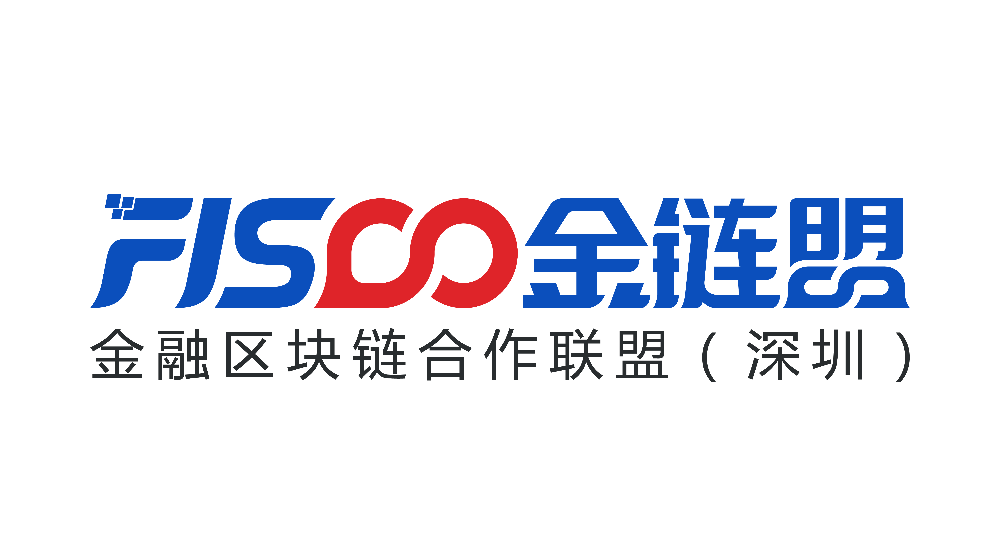

# 社区

[**金链盟**](https://www.fisco.com.cn/)，全称金融区块链合作联盟（深圳），成立于2015年，现有110多家机构成员。金链盟开源工作组，获得金链盟成员机构的广泛认可，并由专注于区块链底层技术研发的成员机构及开发者牵头开展工作。其中首批成员包括以下单位（排名不分先后）：博彦科技、华为、深证通、神州数码、四方精创、腾讯、微众银行、越秀金科。

- 微信群： 

- Gitter： 

- Twitter：

- e-mail：

## 贡献代码

欢迎参与开源贡献，您可以：

- 点亮我们的[小星星](https://github.com/FISCO-BCOS/FISCO-BCOS)！ 

- 提交代码（Pull requests），我们有<a href="https://github.com/FISCO-BCOS/FISCO-BCOS/blob/master/docs/CONTRIBUTING_CN.md">代码贡献流程</a>和<a href="https://github.com/FISCO-BCOS/FISCO-BCOS/blob/master/CODING_STYLE.md">编码规范</a>。

- 也可以[提问和提交BUG](https://github.com/FISCO-BCOS/FISCO-BCOS/issues)。

- 或者可以在[微信群](https://github.com/FISCO-BCOS/LargeFiles/blob/master/images/FISCO-BCOS.jpeg) 和 [Gitter](https://gitter.im/fisco-bcos/Lobby)里讨论。
