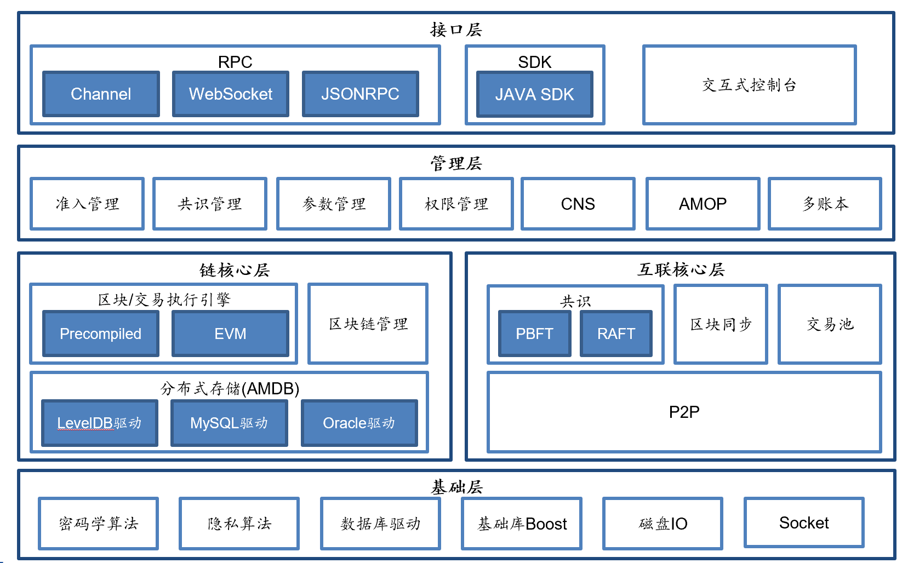
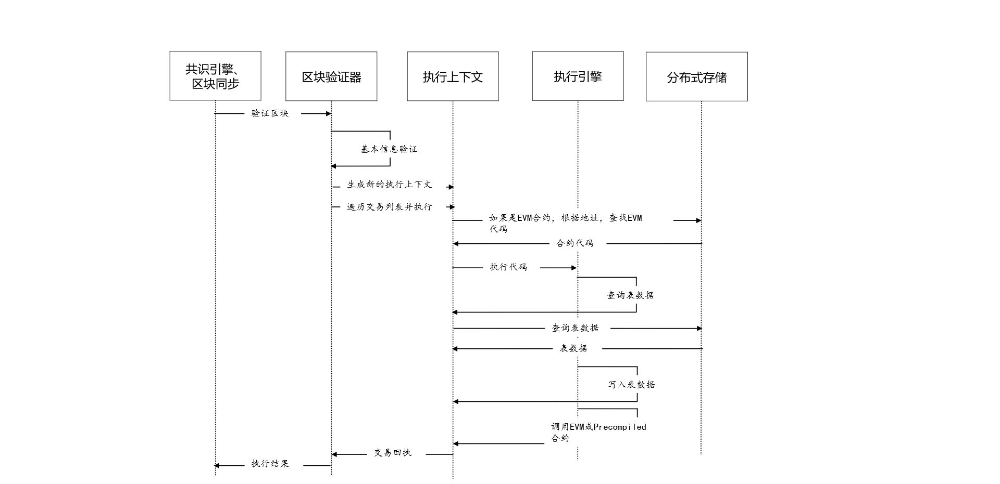
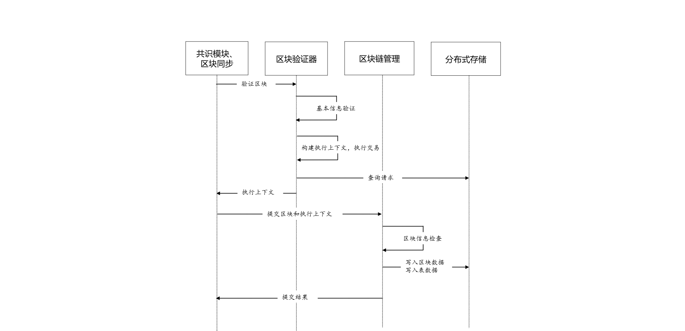

# 整体架构

- 基础层:提供区块链的基础数据结构和算法库

- 核心层: 实现了区块链的核心逻辑，核心层分为两大部分：

(1)链核心层: 实现区块链的链式数据结构、交易执行引擎和存储驱动

(2) 互联核心层: 实现区块链的基础P2P网络通信、共识机制和区块同步机制

- 管理层: 实现区块链的管理功能，包括参数配置、账本管理和AMOP

- 接口层: 面向区块链用户，提供多种协议的RPC接口、SDK和交互式控制台

## 交易流

### 总体方案

用户通过SDK或Curl命令向节点发起RPC请求以发起交易，节点收到交易后将交易附加到交易池中，打包器不断从交易池中取出交易并通过一定条件触发将取出交易打包为区块。生成区块后，由共识引擎进行验证及共识，验证区块无误且节点间达成共识后，将区块上链。当节点通过同步模块从其他节点处下载缺失的区块时，会同样对区块进行执行及验证。

### 整体架构
整体架构如下图所示：

**Node**：区块节点

**TxPool**：交易池，节点自身维护的、用于暂存收到的交易的内存区域

**Sealer**：打包器

**Consensus Engine**：共识引擎

**BlockVerifier**：区块验证器，用于验证一个区块的正确性

**Executor**：执行引擎，执行单个交易

**BlockChain**：区块链管理模块，是唯一有写权限的模块，提交区块接口需要同时传入区块数据和执行上下文数据，区块链管理将两种数据整合成一个事务提交到底层分布式存储

**Storage**：底层分布式存储

主要关系如下：

 1. 用户通过操作SDK或直接编写Curl命令向所连接的节点发起交易。
 2. 节点收到交易后，若当前交易池未满则将交易附加至TxPool中并向自己所连的节点广播该交易；否则丢弃交易并输出告警。
 3. Sealer会不断从交易池中取出交易，当满足下列任意一个条件——(1) 取出的交易数量已经达到区块允许的最大交易数量；（2) 距离上次的出块时间已经达到最大出块时间间隔——时，Sealer将收集到的交易打包为区块并发送至共识引擎。
 4. 共识引擎调用BlockVerifier对区块进行验证并在网络中进行共识，BlockVerifier调用Executor执行区块中的每笔交易。当区块验证无误且网络中节点达成一致后，共识引擎将区块发送至BlockChain。
 5. BlockChain收到区块，对区块信息（如块高等）进行检查，并将区块数据与表数据写入底层分布式存储中，完成区块上链。

### 方案流程

#### 合约执行流程

执行引擎基于执行上下文（Executive Context）执行单个交易，其中执行上下文由区块验证器创建用于缓存暂存区块执行过程中执行引擎产生的所有数据，执行引擎同时支持EVM合约与Precompiled合约，其中EVM合约可以通过交易创建合约、合约创建合约两种方式来创建，其执行流程如下：

EVM合约创建后，保存到执行上下文的_sys_contracts_表中，EVM合约的地址在区块链全局状态内自增，从0x1000001开始（可定制），EVM合约执行过程中，Storage变量保存到执行上下文的_contract_data_(合约地址)_表中。

Precompiled合约分永久和临时两种：(1) 永久Precompiled合约，整合在底层或插件中，合约地址固定；(2) 临时Precompiled合约，EVM合约或Precompiled合约执行时动态创建，合约地址在执行上下文内自增，从0x1000开始，至0x1000000截止，临时Precompiled合约仅在执行上下文内有效Precompiled合约没有Storage变量，只能操作表，其执行流程如下：

####  区块验证到提交的过程

 
## 群组架构

如下图，FISCO BCOS支持多群组架构，群组间共享网络，通过网络准入模块实现各账本间网络消息隔离。

群组间数据隔离，每个群组独立运行各自的共识算法，不同群组可使用不同的共识算法。每个账本模块自底向上主要包括三层，即：核心层、接口层和调度层，通过这三层相互协作，FISCO BCOS可保证单个群组独立健壮地运行。

### 核心层

核心层负责将群组的[区块](../../key_concepts.html#id3)数据、区块信息、系统表以及区块执行结果写入底层数据库。
如下图，按照功能，存储可以分为两部分，即：state和storage。state负责存储state信息，用于追踪交易历史状态；storage则负责将区块数据、区块信息、系统参数等写入系统表中。

storage向外暴露简单的查询(select)、提交(commit)和更新(update)接口，具有可插拔特性，后端可支持多种数据库类型，目前仅支持[LevelDB数据库](https://github.com/google/leveldb)，后期会把基于mysql的[AMDB](../storage/storage.html)集成到系统中。

### 接口层

接口层主要包括交易池(TxPool)、区块链(BlockChain)和区块执行器(BlockVerifier)三个模块。

- **交易池(TxPool)**: 与网络层以及调度层层交互，负责缓存客户端或者其他节点广播的交易，上层应用(主要是同步模块和共识模块)会从交易池中取出交易进行广播或者区块打包。

- **区块链(BlockChain)**: 与核心层和调度层交互，是调度层访问底层存储的唯一入口，上层应用(同步、共识模块)可通过区块链接口查询块高、获取指定区块、提交区块。

- **区块执行器(BlockVerifier)**: 与调度层交互，负责执行从调度层传入的区块，并将执行结果写入传入的区块中返回给调度层。

### 调度层

调度层包括共识模块(Consensus)和同步模块(Sync)。

- **共识模块**：主要负责从交易池(TxPool)取交易，并基于数据库最新区块将交易打包在新区块中进行共识，共识过程中会执行区块，共识成功后，将区块以及区块执行结果提交到区块链(BlockChain)，区块链统一将这些信息写入底层存储，并触发交易池删除上链区块中包含的所有交易、将交易执行结果以回调的形式通知客户端。目前FISCO BCOS主要支持[PBFT](../consensus/pbft.html)和[RAFT](../consensus/raft.html)共识算法。

- **同步模块**：主要负责广播交易和获取最新区块。由于共识过程中，[Leader](../consensus/pbft.html#id1)负责打包区块，而Leader随时有可能切换，因此必须保证客户端的交易尽可能发送到每个区块链节点，节点收到新交易后，同步模块会将这些新交易广播给所有其他节点。考虑到区块链网络中机器性能不一致或者新节点加入都会导致部分节点区块高度落后于其他节点，因此同步模块还提供了区块同步的功能，该模块会向其他节点发送自己节点的最新块高，其他节点发现块高落后于其他节点后，会主动下载最新区块。

