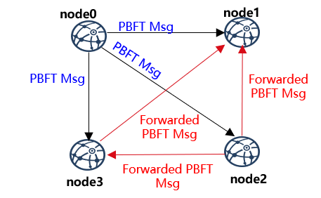
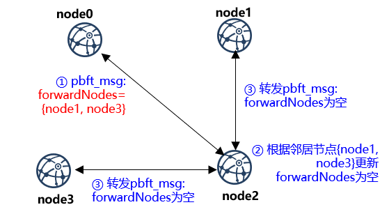
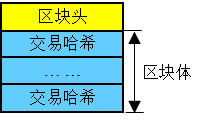

# PBFT网络优化

标签：``PBFT`` ``共识算法`` ``网络优化`` ``设计方案``

----

FISCO BCOS v2.2.0优化了PBFT消息转发机制和Prepare包的结构，尽量减少网络中冗余的数据包，提升网络效率。


## PBFT消息转发优化

为了保证节点断连情况下共识消息包能到达所有节点，FISCO BCOS PBFT共识模块采用了消息转发机制，优化前的消息转发机制如下：

```eval_rst
.. mermaid::

    sequenceDiagram
        participant consensusNodeA
        participant consensusNodeB
        
        consensusNodeA->>consensusNodeB: 发送PBFT消息msg{id, ttl}
        consensusNodeB->>consensusNodeB: 缓存{id, consensusNodeB nodeID}到广播过滤列表filter
        consensusNodeB->>consensusNodeB: 转发pbft msg{id, ttl-1}
        Note right of ConsensusNodeB: ttl > 1, 向未缓存于filter<br/>节点转发PBFT消息<br/>msg{id, ttl-1}
```

对于全连四节点区块链系统，系统TTL设置为2时，每个共识消息包均会被转发三次，且节点规模越大、TTL值越大冗余的共识消息包越多。且Leader广播的Prepare包内含有整个区块，多次转发同样的Prepare包会带来巨大的网络开销。



为了在网络全连的情况下，避免冗余的共识消息包；在网络断连情况下，共识消息包能尽量到达每个共识节点，FISCO BCOS v2.2.0对PBFT消息转发机制进行了优化，优化后的PBFT消息转发流程如下：

```eval_rst
.. mermaid::

    sequenceDiagram
        participant ConsensusNodeA
        participant ConsensusNodeB
        participant Neighbors Of ConsensusNodeB
        
        ConsensusNodeA->>ConsensusNodeA: 获取断连共识节点列表forwardNodes
        ConsensusNodeA->>ConsensusNodeB: 发送PBFT消息msg{id, ttl, forwardNodes}
        ConsensusNodeB->>ConsensusNodeB: 更新forwardNodes
        Note right of ConsensusNodeB: forwardNodes不为空，<br/>将forwardNodes中<br/>非邻居节点过滤出来，<br/>记为forwardNodes2<br/>若forwardNodes为空，<br/>不转发PBFT消息
        ConsensusNodeB->>Neighbors Of ConsensusNodeB: 转发msg{id, ttl, forwardNodes2}
```


下图展示了四节点区块链系统在节点断连情况下，PBFT消息包转发流程：



- `node0`向`{node1, node2, node3}`发送PBFT消息，发现`{node1, node3}`不在连接列表内，则将PBFT消息msg的`forwardNodes`字段设置为`{node1, node3}`，并将其转发给`node2`；
- `node2`收到`node1`的PBFT消息后，判断`forwardNodes`字段不为空，则遍历邻居节点列表`{node1, node3}`，并将邻居节点从`forwardNodes`中移除；
- `node2`向`node1`和`node3`转发更新后的PBFT消息msg；
- `node1`和`node3`收到msg后，判断`forwardNodes`字段为空，认为该消息已经到达了所有节点，不继续转发PBFT消息。

优化后的PBFT消息转发策略，源节点在PBFT消息包中加入了`forwardNodes`字段记录断连节点信息，其他节点收到PBFT消息包后，将消息转发给`forwardNodes`记录的可达节点，保障PBFT消息包尽量能到达所有节点的同时，减少了网络中冗余的PBFT消息，提升网络效率。


## Prepare包结构优化

PBFT共识算法中，Leader向所有节点广播Prepare包，Prepare包内包含Leader节点从交易池打包的整个区块，由于同步模块会将交易同步到所有共识节点，因此Prepare包内区块的交易有很大概率在其他共识节点的交易池命中。基于这点，FISCO BCOS 2.2.0优化了Prepare包结构，Prepare消息包内的区块仅包含交易哈希，其他节点收到Prepare包后，优先从本地交易池内获取命中交易，缺失的交易向Leader请求。

优化后的Prepare消息包内的区块结构如下：



Prepare包处理流程如下：

```eval_rst
.. mermaid::

    sequenceDiagram
        participant Leader
        participant ConsensusNodes

        Leader->>ConsensusNodes: 广播Prepare包
        ConsensusNodes->>ConsensusNodes: 从交易池获取命中交易
        Note right of ConsensusNodes: 解码Prepare包，<br/>获取交易哈希列表 <br/> 从本地交易池<br/>获取命中交易
        ConsensusNodes->>Leader: 请求缺失交易
        Note right of ConsensusNodes: 若有交易缺失 <br/> 向Leader节点发送交<br/>易请求txs_request <br/> 包括{block_hash, txs_hash_list}
        Leader->>ConsensusNodes: 回复交易
        Note left of Leader: 缓存的Prepare包哈希<br/>与txs_request的<br/>block_hash一致<br/>返回请求的交易列表，<br/>记为txs_response
        ConsensusNodes->>ConsensusNodes: 填充Prepare包内区块
        Note right of ConsensusNodes: 解码txs_response<br/>将其填充到Prepare包<br/>内的区块中
```

优化Prepare结构后，充分利用了交易池缓存的交易，进一步降低了Prepare消息包的大小，节省了网络流量。
