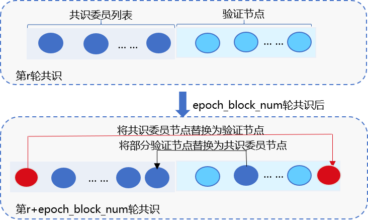
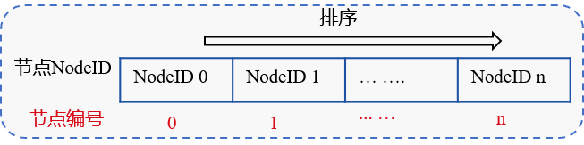
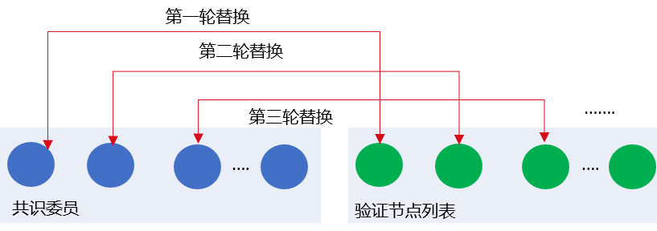
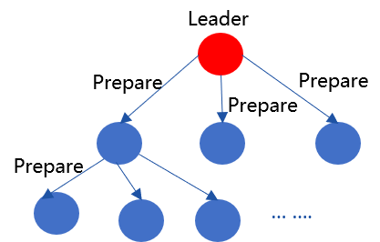

# rPBFT

标签：``rPBFT`` ``共识算法``

----
## 区块链共识困境

### POW类算法

POW算法因如下特点，不适用于交易吞吐量大、交易时延要求低的联盟链场景：
- 性能低：10分钟出一个区块，交易确认时延一个小时，耗电多
- 无最终一致性保证
- 吞吐量低

### 基于分布式一致性原理的共识算法

基于分布式一致性原理的共识算法，如BFT类和CFT类共识算法具有秒级交易确认时延、最终一致性、吞吐量高、不耗电等优势，尤其是BFT类共识算法还可应对节点作恶的场景，在性能、安全性等方面均可达到联盟链需求。

但这类算法复杂度均与节点规模有关，可支撑的网络规模有限，极大限制了联盟链节点规模。

综上所述，FISCO BCOS v2.3.0提出了rPBFT共识算法，旨在保留BFT类共识算法高性能、高吞吐量、高一致性、安全性的同时，尽量减少节点规模对共识算法的影响。

## rPBFT共识算法

### 节点类型

- 共识委员：执行PBFT共识流程的节点，有轮流出块权限
- 验证节点：不执行共识流程，验证共识节点是否合法、区块验证，经过若干轮共识后，会切换为共识节点

### 核心思想



rPBFT算法每轮共识流程仅选取若干个共识节点出块，并根据区块高度周期性地替换共识节点，保障系统安全，主要包括2个系统参数：

- `epoch_sealer_num`：每轮共识过程中参与共识的节点数目，可通过控制台发交易方式动态配置该参数
- `epoch_block_num`: 共识节点替换周期，为防止选取的共识节点联合作恶，rPBFT每出epoch_block_num个区块，会替换一个共识节点，可通过控制台发交易的方式动态配置该参数

这两个配置项记录在系统配置表中，配置表主要包括配置关键字、配置对应的值、生效块高三个字段，其中生效块高记录了配置最新值最新生效块高，例：在100块发交易将`epoch_sealer_num`和`epoch_block_num`分别设置为4和10000，此时系统配置表如下：

key | value | _enable_num_ |
:-: | :-: | :-: |
epoch_sealer_num | 4 | 101 |
epoch_block_num | 10000| 101 |


### 算法流程

#### **确定各共识节点编号IDX**

对所有共识节点的NodeID进行排序，如下图，节点排序后的NodeID索引即为该共识节点编号：



#### **链初始化**

链初始化时，rPBFT需要选取`epoch_sealer_num`个共识节点到共识委员中参与共识，目前初步实现是选取索引为0到`epoch_sealer_num-1`的节点参与前`epoch_block_num`个区块共识。


#### **共识委员节点运行PBFT共识算法**

选取的`epoch_sealer_num`个共识委员节点运行PBFT共识算法，验证节点同步并验证这些共识委员节点共识产生的区块，验证节点的验证步骤包括：

- 校验区块签名列表：每个区块必须至少包含三分之二共识委员的签名
- 校验区块执行结果：本地区块执行结果须与共识委员在区块头记录的执行结果一致

#### **动态替换共识委员列表**

为保障系统安全性，rPBFT算法每出`epoch_block_num`个区块后，会从共识委员列表中剔除一个节点作为验证节点，并加入一个验证节点到共识委员列表中，如下图所示：



rPBFT算法目前实现中，轮流将共识委员列表节点替换为验证节点，设当前有序的共识委员会节点列表为`CommitteeSealersList`，共识节点总数为`N`，则共识`epoch_block_num`个区块后，会将`CommitteeSealersList[0]`剔除共识委员列表，并加入索引为`(CommitteeSealersList[0].IDX + epoch_sealer_num) % N`的验证节点到共识委员列表中。第`i`轮替换周期，将`CommitteeSealersList[i % epoch_sealer_num]`剔除共识委员列表，加入索引为`(CommitteeSealersList[i%epoch_sealer_num].IDX + epoch_sealer_num) % N`的验证节点到共识委员列表中。


#### **节点重启**

节点重启后，rPBFT算法需要快速确定共识委员列表，由于`epoch_block_num`可通过控制台动态更新，需要结合`epoch_block_num`最新配置生效块高获取共识委员列表，主要步骤如下：

**计算共识周期rotatingRound**
  
  设当前块高为`blockNum`，`epoch_block_num`生效块高为`enableNum`，则共识周期为:
  `rotatingRound = (blockNumber - enableNum) / epoch_block_num`

**确定共识委员起始节点索引**: `N`为共识节点总数，索引从`(rotatingRound * epoch_block_num) % N`到`(rotatingRound * epoch_block_num + epoch_sealer_num) % N`之间的节点均属于共识委员节点

### rPBFT算法分析

- 网络复杂度：O(epoch_sealer_num * epoch_sealer_num)，与节点规模无关，可扩展性强于PBFT共识算法
- 性能：可秒级确认，且由于算法复杂度与节点数无关，性能衰减远小于PBFT
- 一致性、可用性要求：需要至少三分之二的共识委员节点正常工作，系统才可正常共识
- 安全性：未来将引入VRF算法，随机、私密地替换共识委员，增强共识算法安全性


## rPBFT网络优化

### Prepare包广播优化

为进一步提升Prepare包在带宽有限场景下广播效率，FISCO BCOS v2.3.0在rPBFT的基础上实现了Prepare包树状广播，如下图所示：




- 根据共识节点索引，构成完全n叉树(默认是3)
- Leader产生Prepare包后，沿着树状拓扑将Prepare包转发给其所有下属子节点

**优势**： 
- 传播速度比gossip快，无冗余消息包
- 分而治之，每个节点出带宽为O(1)，可扩展性强

**劣势**: 中间节点是单点，需要额外的容错策略


### 基于状态包的容错方案

```eval_rst
.. note::

    基于状态包的容错策略仅在开启Prepare包树状广播时生效
```

为保证节点断连情况下，开启树状广播时，Prepare包能到达每个节点，rPBFT引入了基于状态包的容错机制，如下图所示：


主要流程包括：

(1) 节点A收到Prepare后，随机选取33%节点广播Prepare包状态，记为prepareStatus，包括{blockNumber, blockHash, view, idx}

(2) 节点B收到节点A随机广播过来的prepareStatus后，判断节点A的Prepare包状态是否比节点B当前Prepare包localPrepare状态新，主要判断包括：

- prepareStatus.blockNumber是否大于当前块高
- prepareStatus.blockNumber是否大于localPrepare.blockNumber
- prepareStatus.blockNumber等于localPrepare.blockNumber情况下，prepareStatus.view是否大于localPrepare.view

以上任意一个条件成立，都说明节点A的Prepare包状态比节点B的状态新

(3) 若节点B的状态落后于节点A，且节点B与其父节点断连，则节点B向节点A发出prepareRequest请求，请求相应的Prepare包

(4) 若节点B的状态落后于节点A，但节点B与其父节点相连，若节点B最多等待[100ms(可配)](../../manual/configuration.html#rpbft)后，状态仍然落后于节点A，则节点B向节点A发出prepareRequest请求，请求相应的Prepare包

(5) 节点B收到节点A的prepareRequest请求后，向其回复相应的Prepare消息包

(6) 节点A收到节点B的Prepare消息包后，执行handlePrepare流程处理收到的Prepare包。


### 流量负载均衡策略

```eval_rst
.. note::
    流量负载均衡策略仅在开启Prepare包树状广播时生效
```

rPBFT开启Prepare包结构优化后，其他共识节点交易缺失后，向leader请求交易，导致leader出带宽成为瓶颈，FISCO BCOS v2.3.0结合Prepare包状态，设计并实现了负载均衡策略，该策略时序图如下：

```eval_rst
.. mermaid::

  sequenceDiagram
  participant leader
  participant sealerA(父节点)
  participant sealerB(子节点)
  
  leader->>sealerA(父节点): 发送Prepare
  leader->>sealerA(父节点): 发送PrepareStatus
  sealerA(父节点)->>sealerA(父节点): 更新Prepare状态缓存{leader, PrepareStatus}
  sealerA(父节点)->>sealerB(子节点): 转发Prepare
  sealerA(父节点)->>sealerA(父节点): 向leader请求并获取缺失交易，Prepare包加入缓存
  sealerA(父节点)->>sealerB(子节点): 发送PrepareStatus
  sealerB(子节点)->>sealerB(子节点): 更新Prepare状态缓存{sealerA, PrepareStatus}
  sealerB(子节点)->>sealerB(子节点): 向sealerA请求缺失并获取
  sealerB(子节点)->>leader: 发送PrepareStatus

 ```

**Leader的子节点sealerA的主要处理流程如下：**

(1) leader产生新区块后，将仅包含交易哈希列表的Prepare包发送给三个子节点

(2) 子节点sealerA收到Prepare包后，将其沿树状拓扑转发给三个子节点

(3) 子节点sealerA开始处理Prepare包：
  
  - 从交易池中获取命中的交易，填充到Prepare包内的区块中
  - 向父节点Leader请求缺失的交易

(4) sealerA收到Leader的回包后，将回包内的交易填充到Prepare包内，并随机选取33%的节点广播Prepare包的状态，主要包括{blockNumber, blockHash, view, idx}，其他节点收到该状态包后，将sealerA最新状态包更新到缓存中

**sealerA的子节点sealerB的主要处理流程如下**

(1) sealerB收到SealerA转发过来的Prepare包后，同样继续将该Prepare包转发给sealerB的子节点

(2) sealerB开始处理Prepare包，首先从交易池中获取命中的交易，填充到Prepare包的区块中，并选取节点获取缺失的交易：
  - 若sealerB缓存来自节点sealerA的prepareStatus.blockHash等于Prepare.blockHash，则直接向父节点sealerA请求缺失交易
  - 若sealerB缓存的sealerA状态包哈希不等于Prepare.blockHash，但存在来自其他节点C的prepareStatus.blockHash等于prepare.blockHash，则向C请求缺失交易
  - 若sealerB缓存的任何节点prepareStatus的哈希均不但等于prepare.blockHash，最多等待[100ms(可配)](../../manual/configuration.html#rpbft)后，向Leader请求缺失的交易

(3) sealerB收到被请求节点回复的交易后，填充Prepare包内区块，并随机选取[33%(可配)](../../manual/configuration.html#rpbft)节点广播Prepare包状态

(4) 其他节点收到sealerB的状态包后，将其sealerB的最新状态包更新到缓存中