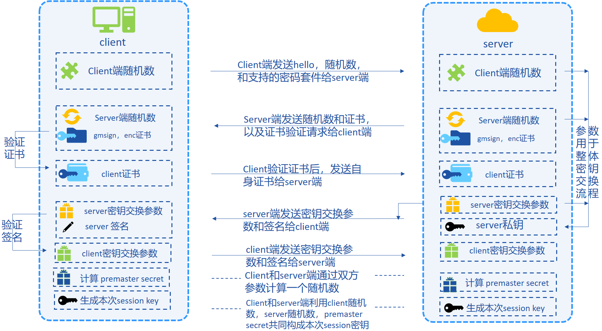

# 国密支持方案

## 设计目标

  为了充分支持国产密码学算法，金链盟基于[国产密码学标准](http://www.gmbz.org.cn/main/bzlb.html)，实现了国密加解密、签名、验签、哈希算法、国密SSL通信协议，并将其集成到FISCO BCOS平台中，实现了对**国家密码局认定的商用密码**的完全支持。

国密版fisco bcos与标准版在数据结构上的差异如下：

* 交易长度：国密版fisco bcos的签名长度为1024bits(128字节，其中公钥512bits,签名长度512bits)，标准版长度为520bits(其中标识符8bits,签名长度512bits)

* 国密双证书模式：国密fisco bcos在进行p2p链接时拥有两条证书，分别为签名证书gmnode.crt和加密证书gmennode.crt。同时对应两套私钥gmnode.key和gmennode.key。

* 国密solidity编译器：在编译智能合约时，solidity编译器使用国密SM4消息摘要算法

## 系统框架

系统整体框架如下图所示：


  下表以签名、验签、哈希算法等为出发点，对比了**国密版FISCO-BCOS**和**普通版FISCO-BCOS:**

  (注：国密算法SM2, SM3, SM4均基于[国产密码学标准](http://www.gmbz.org.cn/main/bzlb.html)开发)

```eval_rst
+---------------+-------------------------------------+----------------------------------------+
| 算法类型      | 国密版FISCO BCOS                    | 标准版FISCO BCOS                       |
+===============+=====================================+========================================+
| 签名算法      | SM2 (公私钥长度：512 bits, 256 bits)|  ECDSA (公私钥长度: 512 bits, 256 bits)|
+---------------+-------------------------------------+----------------------------------------+
| 哈希算法      | SM3 (哈希串长度: 256 bits)          |  SHA3 (哈希串长度: 256 bits)           |
+---------------+-------------------------------------+----------------------------------------+
| 对称加解密算法| SM4 (对称密钥长度: 128 bits)        |  AES (加密秘钥长度: 256 bits)          |
+---------------+-------------------------------------+----------------------------------------+

```

### 国密SSL 1.1 握手建立流程。

国密版FISCO-BCOS节点之间的认证选用国密SSL 1.1的ECDHE_SM4_SM3密码套件进行SSL链接的建立，整体流程如下图所示：



## 特性说明

为了彻底支持国密，**国密版FISCO BCOS将交易签名验签、p2p网络连接、节点连接、数据落盘加密等底层模块的密码学算法均替换为国密算法**，国密版FISCO-BCOS与标准版主要特性对比如下：

 | | 标准版FISCO-BCOS | 国密版FISCO BCOS 
 :-: | :-: | :-:
SSL链接 | Openssl TLSv1.2协议 | 国密TLSv1.1协议
签名验证 | ECDSA签名算法 | SM2签名算法
消息摘要算法 | SHA-256 SHA-3 | SM3消息摘要算法
落盘加密算法 | AES-256加密算法 | SM4加密算法