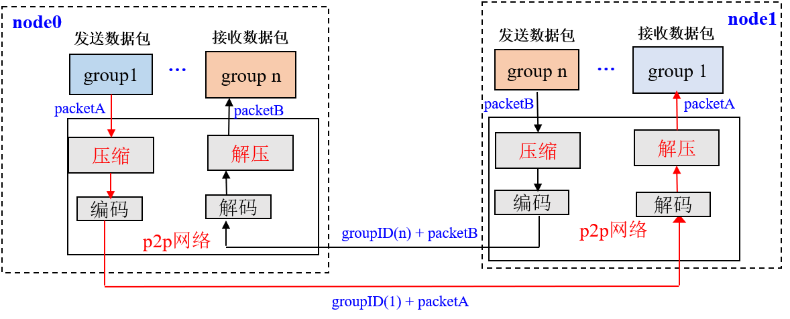
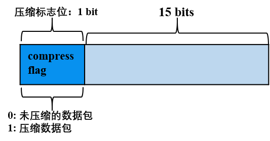

# 网络压缩

标签：``网络压缩`` ``数据压缩``

----

外网环境下，区块链系统性能受限于网络带宽，为了尽量减少网络带宽对系统性能的影响，FISCO BCOS从`relase-2.0.0-rc2`开始支持网络压缩功能，该功能主要在发送端进行网络数据包压缩，在接收端将解包数据，并将解包后的数据传递给上层模块。

## 系统框架

网络压缩主要在P2P网络层实现，系统框架如下：

网络压缩主要包括两个过程：

- **发送端压缩数据包**：群组层通过P2P层发送数据时，若数据包大小超过1KB，则压缩数据包后，将其发送到目标节点；

- **接收端解压数据包**：节点收到数据包后，首判断收到的数据包是否被压缩，若数据包是压缩后的数据包，则将其解压后传递给指定群组，否则直接将数据传递给对应群组。

## 核心实现

综合考虑性能、压缩效率等，我们选取了[Snappy](https://github.com/google/snappy)来实现数据包压缩和解压功能。本节主要介绍网络压缩的实现。

### 数据压缩标记位

FISCO BCOS的网络数据包结构如下图：

网络数据包主要包括包头和数据两部分，包头占了16个字节，各个字段含义如下：

- Length: 数据包长度
- Version: 扩展位，用于扩展网络模块功能
- ProtocolID: 存储了数据包目的群组ID和模块ID，用于多群组数据包路由，目前最多支持32767个群组
- PaketType: 标记了数据包类型
- Seq: 数据包序列号

**网络压缩模块仅压缩网络数据，不压缩数据包头。**

考虑到压缩、解压小数据包无法节省数据空间，而且浪费性能，在数据压缩过程中，不压缩过小的数据包，仅压缩数据包大于`c_compressThreshold`的数据包.`c_compressThreshold`默认是1024(1KB)。我们扩展了Version的最高位，作为数据包压缩标志：

- Version最高位为0，表明数据包对应的数据Data是未压缩的数据；
- Version最高位为1，表明数据包对应的数据Data是压缩后的数据。

### 处理流程

下面以群组1的一个节点向群组内其他节点发送网络消息包packetA为例（比如发送交易、区块、共识消息包等），详细说明网络压缩模块的关键处理流程。

**发送端处理流程**

- 群组1的群组模块将packetA传入到P2P层;
- P2P判断packetA的数据包大于`c_compressThreshold`，则调用压缩接口，对packetA进行压缩，否则直接将packetA传递给编码模块；
- 编码模块给packetA加上包头，附带上数据压缩信息，即：若packetA是压缩后的数据包，将包头Version的最高位置为1，否则置为0；
- P2P将编码后的数据包传送到目的节点。

**接收端处理流程：**

- 目标机器收到数据包后，解码模块分离出包头，通过包头Version字段的最高位是否为1，判断网络数据是否被压缩；
- 若网络数据包被压缩过，则调用解压接口，对Data部分数据进行解压，并根据数据包头附带的GID和PID，将解压后的数据传递给指定群组的指定模块；否则直接将数据包传递给上层模块。

## 兼容性说明

- **数据兼容**：不涉及存储数据的变更；
- **网络兼容rc1**：向前兼容，仅有relase-2.0.0-rc2及以上节点具有网络压缩功能。