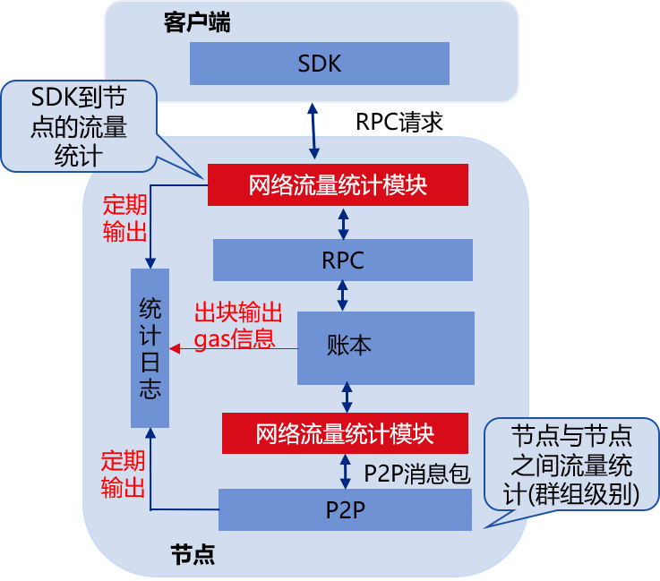

# 网络流量和Gas统计

标签：``网络流量`` ``Gas统计``

----

FISCO BCOS 2.0引入了多群组架构，允许一个节点启动若干个群组，这种架构可快速平行扩展、简化了运维复杂度、降低了管理成本，但由于一个节点进程运行了多个群组，增加了群组监控复杂度。考虑到实时监控系统资源使用情况在实际生产系统中非常重要，FISCO BCOS v2.4.0引入了统计日志，并实现了群组级别的网络流量统计以及交易级别的Gas消耗统计功能。

## 模块架构

下图网络流量和Gas统计的模块图，FISCO BCOS节点实时统计群组内网络、Gas消耗信息，并将其输出到统计日志中：



网络流量统计信息定期输出到统计日志中，目前统计的网络流量主要包括：

- SDK到节点的网络流量：统计每个群组RPC流量、交易推送流量以及事件推送流量

- P2P网络流量：统计群组间因同步、共识等模块进行P2P网络交互产生的网络流量

- 网络总流量：每个群组网络消耗总流量，包括SDK到节点的网络流量和P2P网络流量


Gas统计输出通过区块落盘触发，每落盘一个区块会将对应的Gas消耗信息输出到统计日志中，目前统计的信息包括：

- 每个区块Gas消耗信息

- 每笔交易Gas消耗信息


## 统计日志详细说明

```eval_rst
.. note::
    - 统计日志的级别是info
    - 统计日志每一小时分割一次
```

### 网络流量统计日志

为了方便开发者根据网络流量统计日志对系统进行诊断，FISCO BCOS v2.4.0统计网络流量时，根据流量的相关模块做了细分。这里详细介绍网络流量统计日志的格式和关键字含义。

```eval_rst
.. note::
    - 输出到日志里的网络流量单位是字节Byte
    - 网络统计功能仅统计某个时间段的网络消耗总流量，统计信息输出到日志后，计数器会清零，重新开始下一轮统计
```

#### SDK到节点的网络流量

SDK到节点的网络流量统计日志记录的模块关键字是`SDK`，不仅统计了每个群组与SDK之间的总的出流量和入流量，还细分了RPC请求产生的流量、事件推送流量以及交易推送流量。日志示例如下：

```bash
info|2020-04-24 12:58:41.173045|SDK|,g=1,SDK_RPCIn=10023,SDK_EventLogIn=500,SDK_totalIn=10523,SDK_RPC_Out=0,SDK_Txs_Out=0,SDK_EventLog_Out=0,SDK_total_Out=0
```
**关键字说明**

日志关键字 | 说明
-|-
g | 群组ID
SDK_RPCIn | RPC请求入流量 |
SDK_EventLogIn | 事件推送相关的入流量 |
SDK_totalIn | 群组的总的入流量 |
SDK_RPC_Out | RPC请求出流量 |
SDK_Txs_Out | 交易推送产生的出流量 |
SDK_EventLog_Out | 事件推送产生的出流量 |
SDK_total_Out |群组的总出流量 |

#### P2P网络流量

群组间P2P流量统计日志记录的模块关键字是`P2P`，不仅统计了每个群组总的P2P出流量和入流量，还细分了共识流量、同步流量，日志示例如下：

```bash
info|2020-04-24 12:58:41.173077|P2P|,g=2,P2P_CONSIn=80505,P2P_SYNCIn=19008,P2P_totalIn=99513,P2P_CONS_Out=211377,P2P_SYNC_Out=19008,P2P_total_Out=230385  
```

**关键字说明**

日志关键字 | 说明
-|-
g | 群组ID
P2P_CONSIn | 因共识模块调度产生的入流量 |
P2P_SYNCIn | 因同步模块调度产生的入流量 |
P2P_totalIn | 群组总的P2P入流量 |
P2P_CONS_Out | 因共识模块调度产生的出流量 |
P2P_SYNC_Out | 因同步模块调度产生的出流量 |
P2P_total_Out | 群组总的P2P出流量 |


#### 群组总流量

为方便业务方对区块链系统的整体带宽消耗有所了解，网络流量统计模块还统计了每个群组的总出流量和入流量，模块关键字是`Total`，日志示例如下：

```bash
info|2020-04-24 12:58:41.173052|Total|,g=1,Total_In=74524,Total_Out=115434 
```

**关键字说明**

日志关键字 | 说明
-|-
g | 群组ID
Total_In | 群组总的入流量 |
Total_Out | 群组总的出流量 |


### Gas消耗统计日志

交易的Gas消耗衡量了交易消耗的物理资源，为了方便业务方监测交易资源消耗情况，FISCO BCOS v2.4.0统计了每个区块、每笔交易的Gas消耗情况。

#### 每个区块Gas消耗信息

区块Gas消耗的统计日志记录模块关键字是`BlockGasUsed`，统计信息包括：区块高度、区块所属群组、区块内交易数目、区块gas消耗等，日志示例如下：

```bash
info|2020-04-24 12:46:31.974147|BlockGasUsed|,g=2,txNum=193,gasUsed=3860579,blockNumber=1419,sealerIdx=2,blockHash=b10bdcc5da9c9cd5399ca5821bed9ae6f3fecbe1ddf8ec723b44e6fa30c4bd05,nodeID=0e23d6e237cfc5041d1754fa6682d71bef842b29ddfe3412b284aeac4b8b4794a51df409b667829750c2b4e91bdf95f51742e001e44dc9f97123a5002e49b8ca
```

**关键字说明**

日志关键字 | 说明
-|-
g | 群组ID
txNum | 区块内交易数目 |
gasUsed | 区块内所有交易Gas消耗的总和 |
blockNumber | 区块高度 |
sealerIdx | 产生该区块的共识节点索引 |
blockHash | 区块哈希 |
nodeID | 节点Node ID|

#### 每笔交易Gas消耗信息

每笔交易Gas消耗的统计日志记录模块关键字是`TxsGasUsed`，主要统计了每笔交易的Gas消耗，日志示例如下：

```bash
info|2020-04-24 12:46:31.976080|TxsGasUsed|,g=2,txHash=a81ae1f60289cf7e8f6987b20c68ba9580a1c34d9252c5b4b9c097113309b9d7,gasUsed=20003
```

**关键字说明**

日志关键字 | 说明
-|-
g | 群组ID
txHash | 交易哈希 |
gasUsed | 交易消耗的Gas |


## 配置选项

```eval_rst
.. note::
    统计日志配置选项位于 ``config.ini`` 中，详细可参考 `这里 <../../manual/configuration.html#id8>`_ 
```


