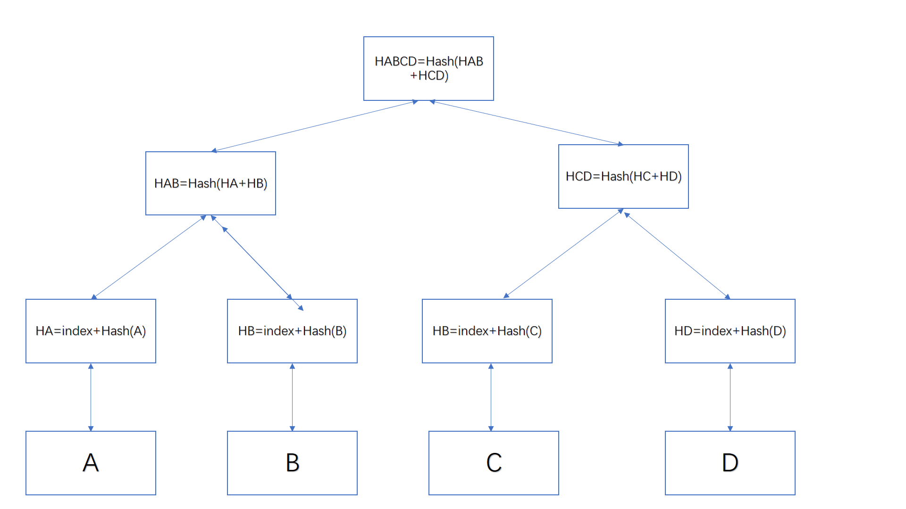

# Merkle Proof的作用
FISCO BCOS 2.2.0版本使用Merkle Tree去计算交易哈希和回执哈希；旨在解决跨链事务流程中交易存在性证明的问题。
在区块链系统中，轻节点为了完成对某一笔交易的验证，即在不下载所有区块的情况下检查某个区块是否包含了某笔交易，需要借助一种特殊的数据结构，叫作默克尔树（Merkle Tree），也叫哈希树。

# Merkle树根计算过程
假定一个区块包括A,B,C,D四个交易，下标分别是0,1,2,3;计算根哈希的方式如图:



计算步骤如下：
1，将交易的下标做rlp编码拼接上交易的哈希，作为叶子节点。
2，将节点元素n（上图n为2）个一组，拼接起来计算哈希值，作为上一层元素。
3，重复步骤2，直到当前元素只有一个，计算过程结束。
上面的例子中，使用的n为2，在FISCO BCOS计算根哈希过程中，n为16。

# 基于Merkle树交易存在性证明
如前面所述，Merkle Tree为大型的数据结构提供了高效安全的验证手段，Merkle Tree被用来保存交易的数字指纹，实现对区块内所有交易的归纳，最后达到快速验证某区块是否包含指定交易的目的。假设上图是区块X的Merkle Tree结构，如果要验证交易D是否在区块X中，无需返回区块X，只需要提供交易D，H_AB，H_C以及Merkle Root则可。计算方法如下：
根据交易D的下标和交易D计算出哈希，得到H_D；根据H_C和H_D计算哈希，得到H_CD；根据H_AB和H_CD计算哈希，得到H_ABCD；对比H_ABCD和Merkle Root，如果相同，则证明区块X存在交易D，否则说明不存在。
在FISCO BCOS 2.2.0中，新增rpc接口```getTransactionByHashWithProof```和```getTransactionReceiptByHashWithProof```,分别是根据交易哈希获取带证明的交易信息和根据交易哈希获取带证明的回执信息。以```getTransactionByHashWithProof```接口为例，说明交易存在性证明过程:
首先使用```getTransactionByHashWithProof```接口获取交易信息和merkle证明。
```
curl -X POST --data '{"jsonrpc":"2.0","method":"getTransactionByHashWithProof","params":[1,"0x8ab2b200320671cab4862312d834dcfa8b7d74e18a647e9fd4324076542a6357"],"id":1}' http://127.0.0.1:8585 |jq    
{
  "id": 1,
  "jsonrpc": "2.0",
  "result": {
    "transaction": {
      "blockHash": "0xc77c955602c1d969452289da740497d580b88a422f4441a8caa78437df781008",
      "blockNumber": "0x1b",
      "from": "0x148947262ec5e21739fe3a931c29e8b84ee34a0f",
      "gas": "0x1c9c380",
      "gasPrice": "0x1c9c380",
      "hash": "0x8ab2b200320671cab4862312d834dcfa8b7d74e18a647e9fd4324076542a6357",
      "input": "0x8a42ebe90000000000000000000000000000000000000000000000000000000000000040000000000000000000000000000000000000000000000000000000003b9aca00000000000000000000000000000000000000000000000000000000000000000c3564663665373237316664620000000000000000000000000000000000000000",
      "nonce": "0x1a5a03c64cf2d056e16f2daea94faf6fed5ccaca54f093ec0e3154d0b1bdc14",
      "to": "0xd6c8a04b8826b0a37c6d4aa0eaa8644d8e35b79f",
      "transactionIndex": "0x8c",
      "value": "0x0"
    },
    "txProof": [
      {
        "left": [
          "81800be7f26ba151d7a4706808edad0ba42fe83b58531e9ee75011fef30d4e566118",
          "818105c837280e25ed26e3c185fe2c909f2aa021df122772b36af70ee5a9b3e45df0",
          "8182649e6b2420ef2ab08358931000ef0b5b4a58c7df898d49249cc25a1f8afef63a",
          "8183af3f8b5d63b3c98ea02ac0013a160dde06ffc1a4d0c3f7b16124d8e4e81cbabd",
          "81848355dfbb711717d4173e54d17f9ba23fe4f18558eee9806ae7a9b4cb3b28af79",
          "81858c894d870cdb930917006b6f11de907fd89cf1c825efc01e816f7c988792cce6",
          "8186d851bc330fa5e5122cce8a1b2315989baf78736f2a48115a303ed3b569421e32",
          "81875ac50f93440900a145119d9cd8aeab4dfbc5eff5fa2d5a826394fc244c822bfa",
          "81889912e677ebc796aead4bcdbd15f0fc70c1adfedf67ca8d147d3a7e1322d1b410",
          "8189138e33fb4e18bfd6a47940e8613cad120d34f7c8ca2901c02649290f092e6757",
          "818a6f9dfc50e3053c3858b2ffa26085cce5ff78480209a8cb84b38f28a4cc953732",
          "818b1f65fc5db96d74bbe2726b2ed94c074b6abd0e8cbd0b31d46d5f6b6b8a809a05"
        ],
        "right": [
          "818de3a4d26bc038bc364bdebf4aaf80a21709d1fa2ac21d2da527fa7a70b8d6c89a",
          "818ee380f8ea824a989f5354ee3d169100c23baab390471183c0c28f9090373b64f6",
          "818f30d2fb70f7a2240403ac563b884aec7e7a4b9d0f35eeaadb790d5c28ba1667c4"
        ]
      },
      {
        "left": [
          "54d76311eb6d04ef5050dc6b4d7123c19d480254697b1d4a3f4f1b40340e0211",
          "d2324309fab418afcd1464422b6f52fa9fb914d97c7723e7f2ff94bcfc2ccf6f",
          "48ce4d23e17cdda81df5a356419bd6ad96c621bb1bf23b80e46aeeee49d55264",
          "3c84f5bab45be8a8d0067c6000eede4e44d646b1148612d55264faf9aa4983ff",
          "4c8e80c9ca7e104325b8c31ca6644ccf075a4c950cae767c979284218b51807f",
          "25873a13a821be1d99d3d7dea1fe575f827a42641527d515ad69c39eb36dae72",
          "8ab68393bd9b08a631ecc124dc7b4ee6541e0599debf92506750d3846c071bcf",
          "d498097ddd1404b6f80e88cd4e84c13ec1d39b6482ffc7014d4b9b84d149b99a"
        ],
        "right": [
          "63cd6c8c4f7c3e34711b23866aa1f1a25c121757804d1534d1f4ae2845a1f00b",
          "a1025cdf4b0fb375621a486929a5d63a7dd98a70c2c1455a38b75bada8c06d7b",
          "2d7322ebf4fe8c5088945888151825860f0f90b1e68bef2f8f2d7b8f60896574",
          "cda5f95b02c2fa12de2aa459f932a01095b41d3dbdad618d18ade4f5750c2f37",
          "8ec46dd6ef3d8784d598529df711a7e18ab4cdebbdc959220806afa779033761",
          "bb3379a814efb11f6f1c6472fd67e66725ac038e8563f019c7035a8097622ff9",
          "9311fb5c9ae432243c5096b29e3551781fe801e82035e2e350c2850246de70c0"
        ]
      },
      {
        "left": [],
        "right": [
          "1d462e3d09fb445e26408a525cda37660667001e4404ae187ff9a6b0960955a4",
          "19d97826e27d99129ccd3ab39cd4b6e6c508b568e9007761c13dc27ef4bc032c",
          "60e5b1c331d963a19b175a5d69cba14b792bbc5e089d06333c78fce738fcc7d4"
        ]
      },
      {
        "left": [],
        "right": []
      }
    ]
  }
}

```
计算过程和验证过程如下：
1，将交易下标```0x8c```做rlp编码得到数值为```818c```拼接交易哈希```818c```,组成字符串```818c8ab2b200320671cab4862312d834dcfa8b7d74e18a647e9fd4324076542a6357```。
2，txProof的第一个元素的left值拼接当前值拼接右边，得到数值为```81800be7f26ba151d7a4706808edad0ba42fe83b58531e9ee75011fef30d4e566118818105c837280e25ed26e3c185fe2c909f2aa021df122772b36af70ee5a9b3e45df08182649e6b2420ef2ab08358931000ef0b5b4a58c7df898d49249cc25a1f8afef63a8183af3f8b5d63b3c98ea02ac0013a160dde06ffc1a4d0c3f7b16124d8e4e81cbabd81848355dfbb711717d4173e54d17f9ba23fe4f18558eee9806ae7a9b4cb3b28af7981858c894d870cdb930917006b6f11de907fd89cf1c825efc01e816f7c988792cce68186d851bc330fa5e5122cce8a1b2315989baf78736f2a48115a303ed3b569421e3281875ac50f93440900a145119d9cd8aeab4dfbc5eff5fa2d5a826394fc244c822bfa81889912e677ebc796aead4bcdbd15f0fc70c1adfedf67ca8d147d3a7e1322d1b4108189138e33fb4e18bfd6a47940e8613cad120d34f7c8ca2901c02649290f092e6757818a6f9dfc50e3053c3858b2ffa26085cce5ff78480209a8cb84b38f28a4cc953732818b1f65fc5db96d74bbe2726b2ed94c074b6abd0e8cbd0b31d46d5f6b6b8a809a05818c8ab2b200320671cab4862312d834dcfa8b7d74e18a647e9fd4324076542a6357818de3a4d26bc038bc364bdebf4aaf80a21709d1fa2ac21d2da527fa7a70b8d6c89a818ee380f8ea824a989f5354ee3d169100c23baab390471183c0c28f9090373b64f6818f30d2fb70f7a2240403ac563b884aec7e7a4b9d0f35eeaadb790d5c28ba1667c4```,对应哈希值```0xcd9a95abaf830b3aed4c9d5f6dc71d7802baf03c42bc55bcb647d93e614e4592```。
2，第二层的元素左边拼接上上一步计算出来的哈希值拼接右边，得到数据为```0x54d76311eb6d04ef5050dc6b4d7123c19d480254697b1d4a3f4f1b40340e0211d2324309fab418afcd1464422b6f52fa9fb914d97c7723e7f2ff94bcfc2ccf6f48ce4d23e17cdda81df5a356419bd6ad96c621bb1bf23b80e46aeeee49d552643c84f5bab45be8a8d0067c6000eede4e44d646b1148612d55264faf9aa4983ff4c8e80c9ca7e104325b8c31ca6644ccf075a4c950cae767c979284218b51807f25873a13a821be1d99d3d7dea1fe575f827a42641527d515ad69c39eb36dae728ab68393bd9b08a631ecc124dc7b4ee6541e0599debf92506750d3846c071bcfd498097ddd1404b6f80e88cd4e84c13ec1d39b6482ffc7014d4b9b84d149b99acd9a95abaf830b3aed4c9d5f6dc71d7802baf03c42bc55bcb647d93e614e459263cd6c8c4f7c3e34711b23866aa1f1a25c121757804d1534d1f4ae2845a1f00ba1025cdf4b0fb375621a486929a5d63a7dd98a70c2c1455a38b75bada8c06d7b2d7322ebf4fe8c5088945888151825860f0f90b1e68bef2f8f2d7b8f60896574cda5f95b02c2fa12de2aa459f932a01095b41d3dbdad618d18ade4f5750c2f378ec46dd6ef3d8784d598529df711a7e18ab4cdebbdc959220806afa779033761bb3379a814efb11f6f1c6472fd67e66725ac038e8563f019c7035a8097622ff99311fb5c9ae432243c5096b29e3551781fe801e82035e2e350c2850246de70c0```,对应哈希值```0x1d77e6364520ebc619b3d9c7782428a0d45695f48baabad134b46dd65fcf1d39```。
3，重复上述步骤，算出上一层的哈希值为```0xecbc0529c1961c18a0ea4381a235542c968af53ab682cd610b5a0bfedc22feef```。
4，重复上述步骤，计算出根哈希为```0xedf6863d1e53598e4d276854ce979155b299016bd61ef83160ab93a79a7b614```。

从块头中获取到这个交易的根哈希为```0xedf6863d1e53598e4d276854ce979155b299016bd61ef83160ab93a79a7b614```，对比发现是一样的，说明交易在这个块中是存在的。

Merkle证明主要用于跨链交易过程中的交易存在性证明，根据跨链交易所涉及的交易/回执去请求各个链的Proof；根据交易/回执，Transaction/Receipt Root，以及Proof完成Merkle证明；如果验证不通过，交易终止，否则执行跨链交易；各个链上各自执行跨链交易，返回交易回执以及proof；验证交易回执，不通过则回滚，否则完成跨链交易。跨链交易借助Merkle证明实现了一种可信消息验证机制，能够有效地验证交易的真实性，为跨链交易的正确执行提供了安全保障。

