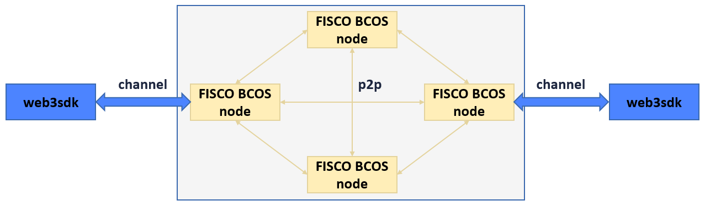

# 数据结构与编码协议

标签：``数据结构`` ``RLP`` ``区块结构`` ``消息包`` ``交易结构``

----

## 交易结构及其RLP编码描述

FISCO BCOS的交易结构在原以太坊的交易结构的基础上，有所增减字段。FISCO BCOS 2.0+的交易结构字段如下：

| name           | type            | description                                                  | RLP index RC1 | RLP index RC2 |
| :------------- | :-------------- | :----------------------------------------------------------- | ------------- | ------------- |
| type           | enum            | 交易类型，表明该交易是创建合约还是调用合约交易，初始为空合约 | -             | -             |
| nonce          | u256            | 消息发送方提供的随机数，用于唯一标识交易                     | 0             | 0             |
| value          | u256            | 转账数额，目前去币化的FISCO BCOS不使用该字段                 | 5             | 5             |
| receiveAddress | h160            | 交易接收方地址，type为创建合约时该地址为0x0                  | 4             | 4             |
| gasPrice       | u256            | 本次交易的gas的单价，FISCO BCOS中为固定值300000000           | 1             | 1             |
| gas            | u256            | 本次交易允许最多消耗的gas数量，FISCO BCOS可配置该值          | 2             | 2             |
| data           | vector< byte >  | 与交易相关的数据，或者是创建合约时的初始化参数               | 6             | 6             |
| chainId        | u256            | 记录本次交易所属的链信息/业务信息                            | -             | 7             |
| groupId        | u256            | 记录本次交易所属的群组                                       | -             | 8             |
| extraData      | vector< byte >  | 预留字段，记录交易信息，内部使用“#”分割信息                | -             | 9             |
| vrs            | SignatureStruct | 交易发送方对交易7字段RLP编码后的哈希值签名生成的数据         | 7,8,9         | 10,11,12      |
| hashWith       | h256            | 交易结构所有字段（含签名信息）RLP编码后的哈希值              | -             | -             |
| sender         | h160            | 交易发送方地址，基于vrs生成                                  | -             | -             |
| blockLimit     | u256            | 交易生命周期，该交易最晚被处理的块高，FISCO BCOS新增字段     | 3             | 3             |
| importTime     | u256            | 交易进入交易池的unix时间戳，FISCO BCOS新增字段               | -             | -             |
| rpcCallback    | function        | 交易出块后RPC回调，FISCO BCOS新增字段                        | -             | -             |

RC1的hashWith字段（也称交易hash/交易唯一标识）的生成流程如下：

RC2的生成流程也类似，只是在第一步`rlp+hash`的transaction结构体中增加chainId、groupId和extraData三个字段。

## 区块结构及其RLP编码描述

FISCO BCOS的区块由以下五部分组成

**rc1版本**

| name                | description                                      | RLP index |
| :------------------ | :----------------------------------------------- | --------- |
| blockHeader         | 区块头RLP编码                                    | 0         |
| transactions        | 交易列表RLP编码                                  | 1         |
| transactionReceipts | 交易回执列表RLP编码                              | 2         |
| hash                | 区块头RLP编码后的哈希值                          | 3         |
| sigList             | PBFT共识落盘阶段收集到的节点签名信息，Raft不使用 | 4         |

**rc2、rc3、2.0及以上版本**

| name                | description                                      | RLP index |
| :------------------ | :----------------------------------------------- | --------- |
| blockHeader         | 区块头RLP编码                                    | 0         |
| transactions        | 交易列表RLP编码                                  | 1         |
| hash                | 区块头RLP编码后的哈希值                          | 2         |
| sigList             | PBFT共识落盘阶段收集到的节点签名信息，Raft不使用 | 3         |
| transactionReceipts | 交易回执列表RLP编码                              | 4         |

FISCO BCOS的区块头中每个字段意义如下：

| name             | type          | description                                                          | RLP index |
| :--------------- | :------------ | :------------------------------------------------------------------- | --------- |
| parentHash       | h256          | 父区块的哈希值                                                       | 0         |
| stateRoot        | h256          | 状态树的根哈希值                                                     | 1         |
| transactionsRoot | h256          | 交易树的根哈希值                                                     | 2         |
| receiptsRoot     | h256          | 收据树的根哈希值                                                     | 3         |
| dbHash           | h256          | 分布式存储通过计算哈希值来记录一区块中写入的数据，FISCO BCOS新增字段 | 4         |
| logBloom         | LogBloom      | 交易收据日志组成的Bloom过滤器，FISCO BCOS目前尚未使用                | 5         |
| number           | int64_t       | 本区块的块号，块号从0号开始计算                                      | 6         |
| gasLimit         | u256          | 本区块中所有交易消耗的Gas上限                                        | 7         |
| gasUsed          | u256          | 本区块中所有交易使用的Gas之和                                        | 8         |
| timestamp        | int64_t       | 打包区块的unix时间戳                                                 | 9         |
| extraData        | vector<bytes> | 区块的附加数据，FISCO BCOS目前只用于在第0块中记录群组genesis文件信息 | 10        |
| sealer           | u256          | 打包区块的节点在共识节点列表中的索引，FISCO BCOS新增字段             | 11        |
| sealerList       | vector<h512>  | 区块的共识节点列表（不含观察节点），FISCO BCOS新增字段               | 12        |
| hash             | h256          | 区块头前13个字段RLP编码后的哈希值，FISCO BCOS新增字段                | -         |

## 交易收据

| name            | type          | description                    | RLP index |
| :---------------| :------------ | :------------------------------| --------- |
| stateRoot       | h256          | 区块状态根                       | 0         |
| gasUsed         | u256          | 交易消耗的gas                    | 1         |
| contractAddress | Address       | 部署合约的地址                    | 2         |
| bloom           | h2048         | 布隆滤波器                       | 3         |
| status          | h256          | 交易执行结果的状态码               | 4         |
| output          | LogBloom      | 交易返回值                      | 5         |
| logs            | LogEntry[]    | event logs                    | 6         |

## 网络传输协议

FISCO BCOS 目前有两类数据包格式，节点与节点间通信的数据包为P2PMessage格式，节点与SDK间通信的数据包为ChannelMessage格式。

### P2PMessage

v2.0.0-rc2扩展了**群组ID和模块ID**范围，**最多支持32767个群组**，且新增了**Version**字段来支持其他特性(如网络压缩)，包头大小为16字节，v2.0.0-rc2的网络数据包结构如下：

| name       | type         | description                          |
| :--------- | :----------- | :----------------------------------- |
| Length     | uint32_t     | 数据包长度，含包头和数据             |
| Version    | uint16_t     | 记录数据包版本和特性信息，目前最高位0x8000用于记录数据包是否压缩|
| groupID (GID)    | int16_t  | 群组ID，范围1-32767   |
| ModuleID (MID)   | uint16_t | 模块ID，范围1-65535   |
| PacketType | uint16_t     | 数据包类型，同一模块ID下的子协议标识  |
| Seq        | uint32_t     | 数据包序列号，每个数据包自增         |
| Data       | vector<byte> | 数据本身，长度为lenght-12           |

**补充**

1. P2PMessage不限制包大小，由上层调用模块（共识/同步/AMOP等)进行包大小管理；
2. 群组ID和模块ID可唯一标识协议ID（protocolID），三者关系为`protocolID = (groupID << sizeof(groupID)*8) | ModuleID`；
3. 数据包通过protocolID所在的16位二进制数值来区分请求包和响应包，大于0为请求包，小于0为相应包。
4. 目前AMOP使用的packetType有`SendTopicSeq = 1，RequestTopics = 2，SendTopics = 3`。

### ChannelMessage v2

| 字段   | 类型         |长度(Byte)| 描述 |
| :----- | :----------- |:---| :-------------------|
| length | uint32_t     |4| 数据包长度，含包头和数据，大端 |
| type   | uint16_t     |2| 数据包类型，大端          |
| seq    | string       |32| 数据包序列号，32字节uuid|
| result | int32_t      |4| 错误码，大端                |
| data   | bytes |length-42| 数据包体，字节流           |

#### AMOP消息包

AMOP消息包继承ChannelMessage包结构，在data字段添加了自定义内容。包括`0x30,0x31,0x35,0x1001`

||长度Byte|说明|
|:--|:--|:--|
|length|1|Topic的长度|
|topic|length|topic名|

#### 消息包类型

数据包类型枚举值及其对应的含义如下：  

| 类型    |包体| 描述       | 解释 |
| :------ |:----| :------------ | :-------- |
| 0x12    |JSONRPC 2.0格式| RPC接口消息包  | SDK->节点 |
| 0x13    |json格式心跳包`{"heartbeat":"0"}`| 心跳包        |  0:SDK->节点，1:节点->SDK|
| 0x14    |SDK->节点的包体`{"minimumSupport":version,"maximumSupport":version,"clientType":"client type"}`,节点->SDK的包体`{"protocol":version,"nodeVersion":"fisco-bcos version"`| 握手包，json格式的协议版本协商    |  SDK<->节点，双向 |
| 0x30    |AMOP消息包包体| AMOP请求包    | SDK<->节点，双向 |
| 0x31    |失败的AMOP消息的包体| AMOP失败响应包    | 节点->SDK或节点->节点 |
| 0x32    |json数组，存储SDK监听的Topics| 上报Topic信息 | SDK->节点 |
| 0x35    |AMOP消息包包体| AMOP多播消息  | 节点->节点 |
| 0x1000  |json格式的交易上链通知| 交易上链回调  | 节点->SDK |
| 0x1001  |json格式的区块上链通知`{"groupID":"groupID","blockNumber":"blockNumber"}`| 区块高度通知  | 节点->SDK |

#### 错误码

| code | message   |
| :--- | :---------|
| 0    | 成功       |
| 100  | 节点不可达 |
| 101  | SDK不可达  |
| 102  | 超时       |
