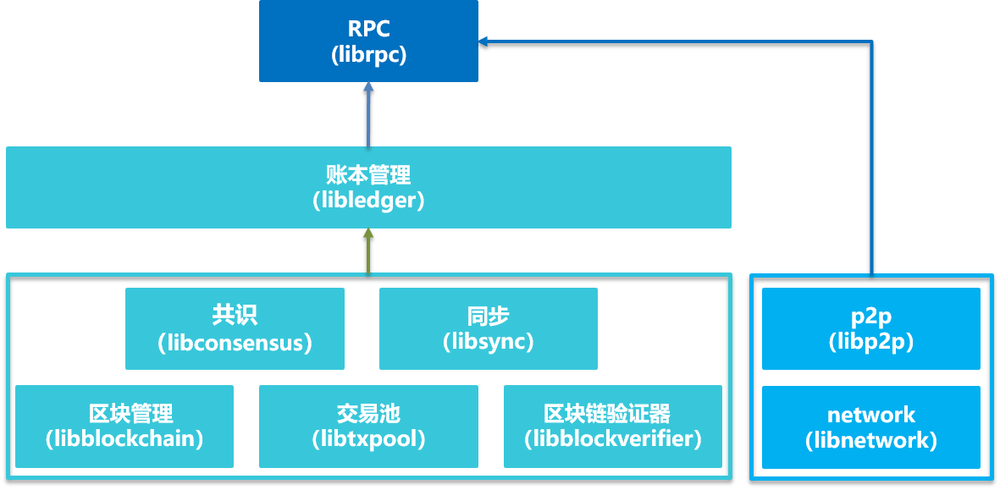

# RPC
## 1 名词解释
**JSON**(JavaScript Object Notation)：一种轻量级的数据交换格式。它可以表示数字、字符串、有序序列和键值对。    
**JSON RPC**：一种无状态、轻量级的远程过程调用(Remote Procedure Call， RPC)协议。 该规范主要定义了几个数据结构及其处理规则。它允许运行在基于socket，http等诸多不同消息传输环境的同一进程中。它使用JSON ([RFC 4627](http://www.ietf.org/rfc/rfc4627.txt))作为数据格式。FISCO BCOS采用JSON RPC2.0协议。

## 2 模块架构
 
 
 RPC模块负责提供FISCO BCOS的外部接口，客户端通过RPC发送请求，RPC通过调用账本管理模块和p2p模块获取相关响应，并将响应返回给客户端。其中账本管理模块通过多账本机制管理区块链底层的相关模块，具体包括共识模块，同步模块，区块管理模块，交易池模块以及区块验证模块。

## 3 数据定义
### 3.1 请求对象
发送一个请求至区块链节点代表一个RPC调用，一个请求对象包含下列数据成员：   
- jsonrpc: 指定JSON-RPC协议版本的字符串，必须准确写为“2.0”。         
- method: 调用方法的名称。          
- params: 调用方法所需要的参数，方法参数可选。             
- id: 已建立客户端的唯一标识id，id必须是一个字符串、数值或NULL空值。如果不包含该成员则被认定为是一个通知。该值一般不为NULL[[1](#id1)]，若为数值则不应该包含小数[[2](#id2)]。     

RPC请求包格式示例:
```
{"jsonrpc": "2.0", "method": "getBlockNumber", "params": [1], "id": 1}
```
**注：**       
<span id="id1">[1] 在请求对象中不建议使用NULL作为id值，因为该规范将使用空值认定为未知id的请求。另外，由于JSON RPC 1.0 的通知使用了空值，这可能引起处理上的混淆。</span>  
<span id="id2"> [2] 使用小数具有不确定性，因为许多十进制小数不能精准的表达为二进制小数。 </span>

### 3.2 响应对象
当发起一个RPC调用时，除通知之外，区块链节点都必须回复响应。响应表示为一个JSON对象，使用以下成员：
- jsonrpc: 指定JSON RPC协议版本的字符串，必须准确写为“2.0”。       
- result: 该成员在响应处理成功时必须包含，当调用方法引起错误时必须不包含该成员。       
- error: 该成员在失败是必须包含，当没有引起错误的时必须不包含该成员。该成员参数值必须为[3.3](#33-错误对象)节中定义的对象。     
- id: 该成员必须包含，该成员值必须于请求对象中的id成员值一致，若在检查请求对象id时错误（例如参数错误或无效请求），则该值必须为空值。     

RPC响应包格式示例:
```
{"jsonrpc": "2.0", "result": "0x1", "id": 1}
```
**注：**
响应对象必须包含result或error成员，但两个成员不能同时包含。

### 3.3 错误对象
当一个RPC调用遇到错误时，返回的响应对象必须包含错误成员参数，并且为带有下列成员参数的对象：

- code: 使用数值表示该异常的错误类型，必须为整数。          
- message: 对该错误的简单描述字符串。   
- data: 包含关于错误附加信息的基本类型或结构化类型，该成员可选。        

错误对象分两类，分别是JSON RPC标准错误响应和FISCO BCOS自定义错误响应。
#### 3.3.1 JSON RPC标准错误响应    
    
标准错误列表如下：  
      
|  code  |  message   |  含义 |
|---  |-----------------------|----|
|-32600  |INVALID_JSON_REQUEST |发送的json是无效的请求对象 |
|-32601  |METHOD_NOT_FOUND |该方法不存在或无效 |
|-32602  |INVALID_PARAMS |无效的方法参数 |
|-32603  |INTERNAL ERROR |JSON RPC内部调用错误 |
|-32604  |PROCEDURE_IS_METHOD |JSON RPC请求未提供id字段 |
|-32700  |JSON_PARSE_ERROR |服务端接收到的json无法解析 |

#### 3.3.2 FISCO BCOS自定义错误响应     
自定义错误列表如下：

| code  |  message   |  含义 |
| ------ | ------ | ------ |
|  1  | GroupID does not exist |GroupID不存在 |
|  2  | Response json parse error |JSON RPC获取的json数据解析错误 |
|  3  | BlockHash does not exist |区块哈希不存在 |
|  4  | BlockNumber does not exist |区块高度不存在 |
|  5  | TransactionIndex is out of range |交易索引越界 |
|  6  | Call needs a 'from' field |call接口需要提供from字段 |
|  7  | Only pbft consensus supports the view property |getPbftView接口，只有pbft共识机制有view属性 |
|  8  | Invalid System Config |getSystemConfigByKey接口，查询无效的key |
|  9  | An invalid request was made by a non-consensus node |非共识节点发起无效的请求|


## 4 RPC接口的设计
FISCO BCOS提供丰富的RPC接口供客户端调用。其中分为两大类，分别是以get开头命名的查询接口（例如getBlockNumber接口）和两个与合约执行相关的接口，分别是call接口和sendRawTransaction接口。其中call接口执行一个请求将不会创建一笔交易，等待区块链共识，而是获取响应立刻返回，例如合约中的查询方法发出的请求将调用call接口。sendRawTransaction接口执行一笔签名的交易，将等待区块链共识才返回响应。RPC具体的接口描述见API文档。
